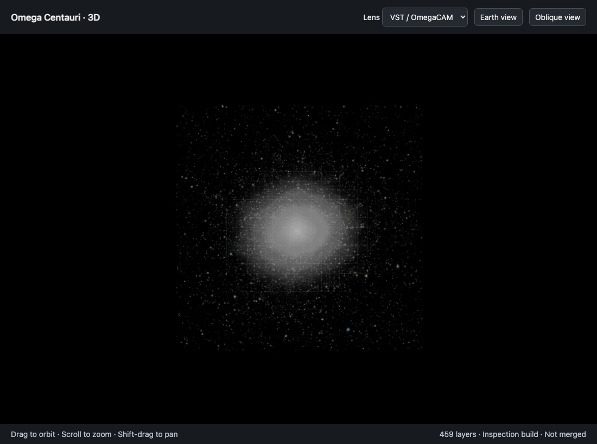
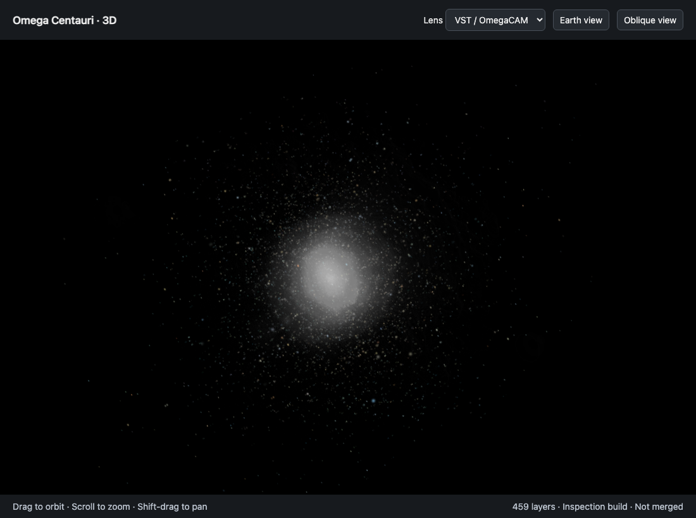
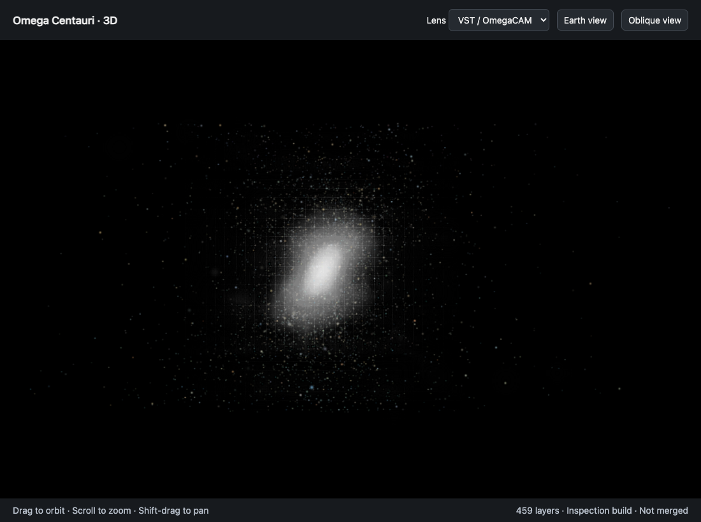
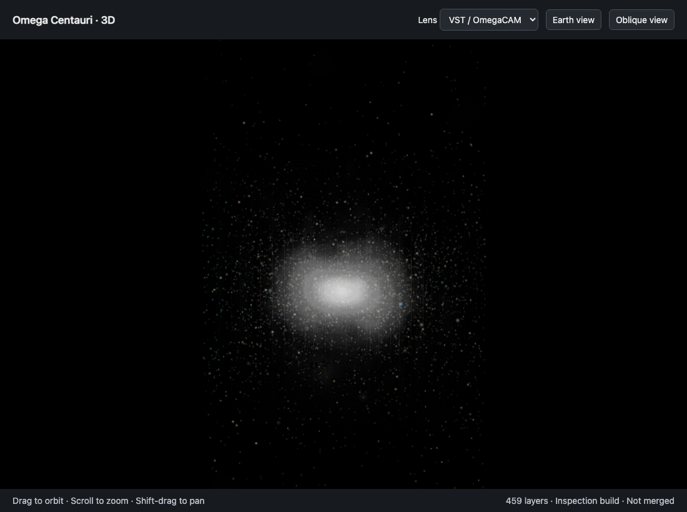

# Omega Centauri: 459-layer inspection

These are four browser captures of the same retained 3D field, using the actual
compiler viewer and PolyCSS renderer in a local inspection wrapper. They are not
source photographs, main-page captures, or evidence of an accepted delivery.
The [capture record](captures.json) pins the result, served inputs, images, camera,
browser version, viewport (1100 × 820) and DPR (1). No image processing was applied.

| Earth view: yaw 0°, pitch 0° | Oblique: yaw 35°, pitch 25° |
| --- | --- |
|  |  |

| X side: yaw 90°, pitch 0° | Near Y side: yaw 0°, pitch 89° |
| --- | --- |
|  |  |

All views use VST/OmegaCAM colors, zoom 1 and zero pan. The interactive pitch limit
is 89°, so the final view is one degree short of the exact side. The visible field
represents integrated starlight with modeled depth: 4,085 fitted light features,
459 retained logical slabs, and no separate measured-star overlay.

Color source: **ESO/INAF-VST/OmegaCAM. Acknowledgement: A. Grado and
L. Limatola/INAF-Capodimonte Observatory.** See the
[native observation and credit](../../observations.json) and
[ESO image-use terms](https://www.eso.org/public/outreach/copyright/).
The second available WFI lens is credited to ESO; it is not pictured here.

These views illustrate different orientations, not a matched visual comparison.
No Pixelmatch result is claimed. The unchanged quantitative handoff gates remain
failed: [original browser measurements](layer-handoffs.json),
[bounded numerical alignment](numerical-alignment.json), and
[retained-input bake receipt](layer-bake.json). The grid and angle-dependent
appearance still need resolution. The images do not certify rotation stability.

The [validation record](validation.json) identifies the tested source hashes,
reused checks, five full-suite failures and omitted app/R2 qualification. Its source
hashes describe the implementation captured here; publishing documentation and
evidence does not change that implementation. Historical receipts preserve their
original local paths and result identities; those paths are not public downloads.

The four PNGs total 849,034 bytes and support the four-view inspection claim.
The 198,200-byte [bake-3 identity report](bake3-identity.json) retains all 1,040
neutral texture comparisons needed to reuse the earlier failed handoff verdict.
No runtime slice bank or native observation bytes are committed with these images.
