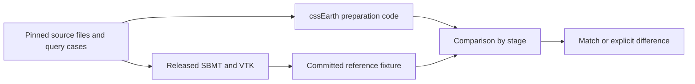

# SBMT preparation oracle

This is an optional native backend for the [shared oracle framework](../../../../../../../core/src/node/oracle/README.md).
It runs the released Small Body Mapping Tool's readers, mesh intersection and
texture-coordinate code, then compares saved results with cssEarth preparation
code. It supplies test evidence; it never supplies production source data,
camera solutions, atlases or runtime assets.



## Sources and identity

- [SBMT 0.9.2.1, macOS ARM release dated 2026-09-10](https://sbmt.jhuapl.edu/publicRelease/releases/sbmt-0.9.2.1-2026.09.10_OSX_ARM.pkg).
  [runtime.lock.json](runtime.lock.json) pins the package, bundled Java 17.0.2,
  classpath, native libraries and the JNI bridge bytes. SBMT is extracted
  locally; nothing is installed in Applications or run with a GUI.
- [java-bridge 2.8.1](https://github.com/MarkusJx/node-java-bridge) is only a JNI
  transport, locked in [package-lock.json](package-lock.json). All orchestration
  and comparison code is strict TypeScript. No patched SBMT code stands in for the oracle.
- [Eros sources](../../../../../../../../src/objects/eros/README.md): Gaskell ver128q and the
  archived NEAR MSI exposure M0146235607, with corrected SUM and SPICE INFO
  pointing tested separately. These two pointing solutions are not identical.
- [Itokawa sources](../../../../../../../../src/objects/itokawa/README.md): Gaskell ver128q,
  AMICA ST_2402987304 and its archived SUM file.
- [The synthetic concave prism](inputs/concave.tab) is labelled test geometry,
  not a celestial-body approximation or asset.

The official binary release is the executed reference. The public
[SBMT source repositories](https://github.com/NASA-Planetary-Science/sbmt-overview)
explain the software, but their default branches must not be assumed to match
the binary. Each fixture pins this harness's generator code and the exact inputs
it read, and comparisons recheck source bytes before decoding them.

## Tracked truth fixture

[projection.json](projection.json) is the 69,858-line saved reference result from
SBMT's released Java/VTK readers, intersections and texture-coordinate queries.
It records the cases, pinned inputs, stage outputs and numeric probes generated
by [projection.mts](projection.mts); it is test evidence, not a prepared asset.
[projection.test.mts](projection.test.mts) reads it through `readOracleFixture`,
and [compare.mts](compare.mts) compares the candidate results stage by stage.
It is tracked so ordinary CI can test the independent reference without
installing SBMT, Java or VTK. Regeneration is explicit, with the tolerances and
non-bit-reproducibility limits below; it does not replace the accepted reference
on an ordinary test run.

## Run it

Ordinary regression checks need neither Java nor SBMT:

```sh
node packages/bake/cli/test-sbmt.mts --unit     # checked-in synthetic case, identity and rejection tests; also runs in CI
node packages/bake/cli/test-sbmt.mts --restore  # restore only missing selected archive inputs, then test every case
node packages/bake/cli/test-sbmt.mts           # every case, offline after restoration
node --max-old-space-size=512 packages/bake/src/objects/layers/terrestrial/fixtures/sbmt/check.mts
```

The last command writes `output/oracles/sbmt/comparison.json` and exits nonzero
if any compared stage differs. Regression tests verify that known discrepancies
are reported; a green test suite does **not** mean every scientific comparison
matched.

Native regeneration is opt-in and qualified on **macOS ARM** only:

```sh
node packages/core/src/node/oracle/setup.mts sbmt
node packages/core/src/node/oracle/run.mts sbmt/projection
```

Setup reuses `.local/oracles/sbmt`, restores only missing body inputs through
their acquisition plans, and refuses changed bytes. It does not fetch the bodies'
mosaic archives. The first setup downloads a 203.7 MB package. Generation runs one
child process with a 192 MiB Node heap, 512 MiB Java heap and a four-minute
timeout. The default `run.mts` runs the Python fixture oracles and never launches
SBMT. Other operating systems need their own verified release lock; the committed
fixtures are portable.

## Coverage and limits

[cases.json](inputs/cases.json) is the case inventory. Every case uses the same
native reader, locator, UV probes and comparison path, with no body-specific
algorithm. Missing cases, duplicated probes, changed inputs, wrong software bytes
and incomplete stages fail explicitly.

| Case family | Executable evidence | Meaning |
| --- | --- | --- |
| SUM and INFO | Native `SumFileReader` / `InfoFileReader`, independently decoded in `candidate.mts` | Origin, corner order, normalization, km units and camera basis |
| Rectangular and square images | NEAR 537×244; AMICA 1024×1024; synthetic 2×2 | Raw detector dimensions and unequal pixel scales are explicit |
| Source geometry and visibility | Native `loadPDSShapeModel`, `vtkOBBTree`, cssEarth `parsePdsVertexFacetShape` and `mesh.intersect` | 121 rays per case; nearest hits, off-limb misses, multiple intersections and concavity |
| Footprints | Native `SmallBodyModel.computeFrustumIntersection` | Diagnostics only; they do not prove a cssEarth footprint implementation |
| Image coordinates and UVs | Native `PolyDataUtil.generateTextureCoordinates` versus cssEarth `project` | Flips, quarter turns, crop, boundary, off-image and behind-camera cases |
| FITS image values | SBMT's bundled nom-tam-fits versus `readFitsImage` | Raw axes, encoding and up to 65 samples per image; no photometric claim |
| FITS encodings and extensions | Existing [FITS oracle](../../../../../../../core/src/node/oracle/README.md) and `packages/bake/src/objects/cameras/core.oracle.test.mts` | Not reimplemented here |
| PDS3/PDS4 image and geometry planes | Existing [PDS oracle comparisons](../../../../../../../core/src/node/oracle/README.md) | This backend consumes SUM/INFO, not SPICE kernels or geometry cubes |
| Released OBJ UV islands and raster sampling | `packages/bake/src/objects/raster/obj-uv-fits.test.mts` | Existing unit checks, **not native SBMT qualification** |
| Bad or unsupported inputs | `projection.test.mts` | Missing fields, unsafe paths, hash drift, degenerate cameras, unsupported SUM distortion |

This covers the named cases, not every SBMT feature or asteroid. Other shape
layouts, DSK/OBJ/STL import, arbitrary rotation, distorted cameras, photometric
mosaics and registration to a different shape version need their own case and
adapter. Unsupported options are rejected, never approximated.

### Differences the oracle exposes

The fixed limits are 5 cm for mesh coordinates and intercepts, 1e-10 for
normalized camera directions, exact sampled FITS values and **0.25 pixel for
in-image UV projection**. Native VTK reads vertices at float precision, so mesh
comparison uses a physical-distance tolerance.

| Reference case | Maximum in-image UV difference | Quarter-pixel comparison |
| --- | ---: | --- |
| Eros SUM | 0.0817 px | Match |
| Eros INFO | 0.0817 px | Match |
| Itokawa SUM | 1.0021 px | **Different** |
| Synthetic concave prism | 0.0541 px | Match |

SBMT's angular UV approximation and cssEarth's projective camera are not
identical. The Itokawa difference stays visible and makes `check.mts` exit 1.
Do not fit a camera to the native UV fixture, loosen the limit or adopt SBMT's
approximation to manufacture agreement.

SBMT clamps or mirrors off-image queries into its texture domain. Those UVs stay
in the fixture for inspection, but unsupported pixels and points behind the camera
must be withheld. Loading an image, pointing file and shape together does not
establish their physical registration.

### Known problem: native regeneration is not bit-reproducible

Two runs of `node packages/core/src/node/oracle/run.mts sbmt/projection` on the
same pinned inputs and locked bytes differ in 1,643 of 34,777 numeric leaves of
`projection.json`, by at most about 1.6e-4 absolute and 3.1e-4 relative. That is
far under the comparison limits and has not flipped a result, but the output
depends on floating-point order inside Java/VTK (`OMP_NUM_THREADS=1` and
`VTK_SMP_MAX_THREADS=1` do not remove it). Compare each run only against the
committed fixture, at its documented tolerance, never byte for byte against a
second live run.

## Add a case

1. Pin the native inputs in the body's source manifest and acquisition plan, with
   source catalogue bindings, and update its investigation ledger. A synthetic
   case belongs in `packages/bake/src/objects/layers/terrestrial/fixtures/sbmt/inputs` and must say so.
2. Add the file identities and dimensions to `cases.json`. Reuse the generic
   path; add a new format adapter only when its scientific convention is known.
3. Run the native generator twice into separate scratch files and check the new
   case stays within the comparison tolerances on both runs. Preserve the
   committed fixture and run the comparing tests.
4. Inspect each stage's result. A case is not qualified because another body
   passed, the fixture exists, or tests correctly report its discrepancy.
   Document new limitations here and the scientific outcome in the body ledger.
