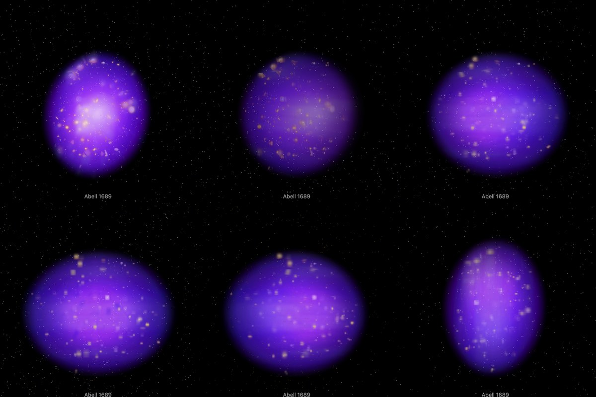

# Abell 1689: gas, mass and galaxies

The Chandra X-ray Center's 2008 picture of Abell 1689 in its layers, with ESA/Hubble's lensing mass map. The hot gas
(violet) and the mass (blue) are each spread along the sight line through ellipsoidal shells whose shape is published:
ellipses on the sky, and **1.22 (gas) and 1.19 (mass) times as long along the sight line** as their long axis on the sky, from a fit
of lensing, X-ray and Sunyaev-Zel'dovich measurements together. That length is measured for the cluster as a whole. Where
a pixel's light lies within the shells is not measured. The galaxies of the Hubble picture each stand at a depth
**drawn** from the mass's shells: no measurement places a galaxy along the sight line. The page's other dataset is
[Hubble's picture](../abell-1689-layers/README.md), flat.

## Sources

| Selected source | Input and meaning |
| --- | --- |
| [Chandra X-ray Center, Abell 1689 (2008)](https://chandra.harvard.edu/photo/2008/a1689/more.html) | [Record](../../sources/chandra-2008-abell-1689-layers.json). The Hubble image alone (`a1689_opt.tif`, 3853 × 4000 px, the bank's photograph) and the composite of the Chandra X-ray gas over it (`a1689.tif`, 3846 × 3996 px, from which `source/gas.png` is lifted); and an 864 px rendition of the composite (`composite.jpg`, the dataset's preview). Restored from their origin; not tracked. No copyright is asserted on Chandra content and credit is requested: X-ray: NASA/CXC/MIT/E.-H Peng et al; Optical: NASA/STScI. Display pictures, not calibrated maps. |
| [ESA/Hubble heic1014a](https://esahubble.org/images/heic1014a/) | [Record](../../sources/esahubble-heic1014a.json). The mass distribution of the lens laid over a Hubble picture, 3853 × 3902 px (`heic1014a.tif`, [CC BY 4.0](https://esahubble.org/copyright/), credit: NASA, ESA, E. Jullo (JPL/LAM), P. Natarajan (Yale) and J-P. Kneib (LAM)). Released with [Jullo et al. (2010)](https://arxiv.org/abs/1008.4802) ([record](../../sources/publication-jullo-2010-strong-lensing-cosmology.json)). No release has the map alone: `source/mass.png` is lifted from this composite. |
| [Umetsu et al. (2015)](https://arxiv.org/abs/1503.01482) | [Record](../../sources/publication-umetsu-2015-abell-1689-triaxial.json). The shells: the centres, the ellipses on the sky and the length along the sight line, in the table below. |
| [MCXC-II, Sadibekova et al. (2024)](https://cdsarc.cds.unistra.fr/viz-bin/cat/J/A+A/688/A187) | [Record](../../sources/mcxc-ii-2024.json). Row MCXC J1311.5-0120: position 197.875°, -1.3354° and redshift 0.1832. |
| [Planck Collaboration (2020)](https://arxiv.org/abs/1807.06209) | [Record](../../sources/planck-2018-cosmology.json). The redshift's comoving distance, 776 Mpc. |
| [Gaia DR3](https://doi.org/10.1051/0004-6361/202243940) | [Record](../../sources/gaia-2023-dr3.json). Two uses. The 71 sources in the frame (CDS `I/355/gaiadr3`) measure where the frame lies on the sky. The 18 sources within 0.04° whose parallax or proper motion is three of its errors or more from none (`gaia-dr3-stars.csv`, a query of the ESA Gaia archive; its URL is the table's origin in the [manifest](source/manifest.json)) are the Milky Way's stars, which the bake removes. |

## The published shape

Umetsu et al. (2015) fit weak and strong lensing, the X-ray image and the Sunyaev-Zel'dovich signal together, with the
gas and the mass each on ellipsoidal shells. What the recipe takes from the paper:

| | Gas | Mass |
| --- | --- | --- |
| Centre (J2000) | 13:11:29.50, -01:20:29.92, the X-ray centre (Table 1) | 1.9″ south of the brightest galaxy at 13:11:29.52, -01:20:27.59 (Table 5: 0.0 ± 1.3″, -1.9 ± 1.4″) |
| Ellipticity on the sky | 0.15 ± 0.03 (Sect. VII.2, from Sereno et al. 2012) | 0.29 ± 0.05 (Table 5, weak and strong lensing) |
| Short axis over long, as drawn | 0.85 | 0.71 |
| Long axis, east of north | 12 ± 3° | 11.4 ± 4.9° |
| Length along the sight line over the long axis on the sky | 1.22 ± 0.24 (Sect. VIII.2) | 1.19 ± 0.37 (Sect. VIII.2) |

- **What the length is:** a shell's half length along the sight line through the centre, over its long half axis on the
  sky (their Eq. 35). The X-ray brightness of the gas goes as its density squared and its Sunyaev-Zel'dovich signal as its
  pressure, so the two together give how deep the gas is; lensing gives the mass in projection, and the fit ties the two.
- **How sure it is:** a round cluster has 1. The gas's value is 0.9 of its error from that, the mass's 0.5. X-ray and
  Sunyaev-Zel'dovich data alone, without lensing, give the gas 1.70 ± 0.29 (Sect. VII.2); the joint fit's value is drawn
  for both, so that the two bodies come from one fit.
- **The long axis** is drawn on the sight line. The fit puts it 22 ± 10° from it (Table 7), but all three kinds of
  measurement are the same for a cluster and its mirror image along the sight line: nothing tells the near end from the far.

## The gas picture and the mass picture

`node packages/bake/authoring/abell-1689/layers.mts` writes `source/gas.png` and `source/mass.png`.

- **Gas, from the 2008 composite.** The album's X-ray picture alone is another rendering, far brighter than the gas in
  the composite, and drawn with it the gas washed the galaxies out. The composite is the Hubble layer's frame less 7
  columns and 4 rows, 1 px from its corner (82.0% of its white light on that layer's). It is that layer and the gas
  added by a screen: undone, the gas under the galaxies is 1.8, 6.1, 0.8 of 255 (red, green, blue) from the gas beside
  them. 5.1% of the pixels are too bright in the Hubble layer to read; they take the gas around them.
- **Mass, from ESA/Hubble's composite.** It is the 2008 frame less 45 rows at the top and 53 at the bottom, 1 px to the
  side (85.8% of its bright compact light on the Hubble layer's). It renders the Hubble light differently from the
  2008 layer and shows it only from about 48 of 255 up; that rendering is read in the frame's corners, where there is no
  map. The map is blue and the galaxies are yellow, so it is read in the blue channel, the screen undone against the
  rendered Hubble blue where that is under 30 of 255 (93.0% of the pixels), by cells of 4 px (96.2% of the
  cells; the rest take the mean of the cells around them). Its red and green are the map's own at each blue.
- **Compact light in the mass map:** blue light narrower than 8″ stands at the bright galaxies: the map's own small
  halos, or galaxy light the rendering leaves over. The map is opened by a disc of 4″ and 9.1% of its blue comes
  down to the mass around it.
- **Check of the mass:** the rendered Hubble light and the lifted map, screened back together, are 6.6 of 255
  from ESA/Hubble's composite on average.

## The photograph

- **Registration:** the TIFFs' embedded scale is half the true one. Every pair of Gaia stars was laid on every pair of
  the Hubble layer's compact sources that one scale could join; the placement with the most stars on sources, refitted by
  least squares, puts 67 of the 71 Gaia DR3 sources in the frame on a source, 0.18″ rms (worst 0.46″). It gives
  0.05000″ per pixel, north 115.22° right of vertical, centre 197.875322°, -1.338501°, a field of 3.21 × 3.33 arcmin.
  Read back through the bake's own projection, 71 of 71 stars lie within 0.3″ of a bright source.
- **Stars:** the bake removes the Milky Way's stars from the Gaia table: 7 of the 11 in the picture show as stars
  and are replaced by the light around them; 4 are left, their light read as an extended object's, and are drawn among the
  galaxies. NOX was tried first and is not used: it took the bright middles of the galaxies with the stars.
- **Sky:** at the bake's size the Hubble layer's sky stands at 24 of 255 in the frame's corners (the median of its
  brightest channel). Light below 48 of 255 is taken as sky, which leaves 30.8% of the picture.
- **Plane:** the picture's own tangent plane through the cluster's place, so it faces the Sun. Nothing of the photograph
  is left on it: its light is the galaxies' and the diffuse light, below.
- **Size:** 0.72 × 0.75 Mpc at the cluster's comoving distance.

## The galaxies

`geometry.ellipsoid.galaxies` in the recipe; the bake is `packages/bake/src/image-layers/galaxies.ts`.

- **Why drawn:** a galaxy's redshift gives its speed, not how far along the sight line it lies within the cluster.
  Umetsu et al. (2015) find the mass aligned with the distribution of the cluster's galaxies, so the galaxies are placed
  where the mass's shells put matter.
- **A galaxy's light:** what stands 16 of 255 or more over the light around it and is narrower than 10″: 40.7% of the
  photograph's light. A galaxy is a nucleus, a bright middle, with the compact light nearer to it than to another
  nucleus. 168 galaxies were placed, and 5,113 small patches of compact light with no nucleus, each a source of its own.
- **Its depth:** one draw, fixed by its place in the picture, from how the mass's shells spread matter along its sight
  line. The galaxy nearest the shells' centre is put at their middle.
- **From the Sun** a galaxy is its own cut-out of the photograph, as sharp as the photograph, on the nearest of 16 sheets
  among the slabs. The slabs in front of a sheet hide part of it, so its light is raised by what they take away, up to
  three times: seen from the Sun a galaxy shows its own light.
- **From the side** a galaxy is a blob at its depth, as deep as it is wide, in the curtains.
- **The diffuse light**, the rest of the photograph, is spread through the mass's shells.
- **Outside the shells:** the photograph fades out toward the largest shell the frame holds whole, as the gas and the
  mass do. Galaxies beyond it are in the page's other dataset.

## The gas and the mass

`geometry.ellipsoid` in the recipe; the bake is `packages/bake/src/image-layers/collision.ts`.

- **Shells:** each body's picture is read on its ellipses, in steps of 0.59″ of the long half axis. The shells' mean
  light is taken apart from the outside in, which gives how much each shell emits. Each pixel keeps its own light; the
  shells only say where along the sight line it lies.
- **Where the body ends:** the frame cuts the gas and the mass off, so each picture fades out toward the largest shell
  the frame holds whole: 75″ along the long axis for the gas (282 kpc) and 76″ for the mass. The fade takes the outer quarter of that
  shell. The cluster goes on far beyond it.
- **Point sources:** 3 compact sources in the gas picture, narrower than 3″, were taken down to the gas around them.
- **How well the shells hold:** 5.0% of the gas's light differs from its shell's mean, and 0.00% asked for
  less than no gas and was set to none. For the mass, 14.3% differs and 0.00% was set to none: the mass map has a second
  clump north-east of the middle that no ellipse holds.
- **Reach:** 92″ (gas) and 91″ (mass) either side of the plane along the sight line, 346 kpc at the comoving distance.
- **Leaves:** one grid of 256 × 220 cells. Face-on, 32 slabs parallel to the photograph and 16 sheets of galaxies; from the
  sides, 40 and 40 curtains of 220 × 315 and 256 × 315 texels. A browser lays each leaf over those behind it, where
  light of two colors needs a screen. The slabs are built from the back, each texel holding its own light and what it
  hides; a curtain's texel is as much whiter than its own light as all the light on its sight line through the curtains is.
- **Bytes:** 129 images, 1.51 MB: slabs 0.29 MB, galaxy sheets 0.31 MB, curtains 0.91 MB (WebP quality 70).

## Evidence

The Abell 1689 page with this dataset selected, in headless Chromium at 1440 × 900, device pixel ratio 2, on this branch
on 2026-10-06: the dataset's arrival and the camera turned in steps toward the side.

`packages/bake/src/image-layers/collision.test.ts` builds a picture from an ellipsoid of even gas and checks that the
shells found from it are that ellipsoid, as long along the sight line as stated, that the slabs seen from the Sun are the
picture to within 3 of 255, that the curtains seen from either side add up as a screen does, and that a photograph's
galaxies leave its plane, each on one sheet at a drawn depth inside the shells, the middle one at the middle.

## Measured, chosen and inferred

| Value | Kind |
| --- | --- |
| Position 197.875°, -1.3354° and redshift 0.1832 | Measured: MCXC-II row MCXC J1311.5-0120 |
| Distance 776 Mpc | Derived: the redshift's comoving distance in the Planck 2018 cosmology |
| Field, scale and rotation of the picture | Measured: fitted to Gaia DR3 positions |
| Centres, ellipses on the sky, length along the sight line | Published: Umetsu et al. (2015), with the errors above |
| Ellipsoidal shells | Assumed, as the paper assumes them; how far the pictures depart from them is measured above |
| Long axis on the sight line | Chosen: the fit's 22 ± 10° has no measurable direction |
| The lifted gas and mass pictures | Measured on the publishers' files |
| Depth of any one pixel's light | Inferred from the shells. Nothing measures it |
| Depth of each galaxy | Drawn from the mass's shells. Nothing measures it |
| Sky floor, edge fade, the shell the body ends on, grid, slab and sheet counts | Presentation |

## Known problems

- The measured length has wide errors, and the mass's is within one error of a round cluster's.
- The body is symmetric front to back. The real cluster's long axis leans 22 ± 10° from the sight line, to a side no
  measurement gives.
- A galaxy's depth is a draw, not a measurement: the drawing shows where the cluster's galaxies are likely to be, not
  where each one is. Another draw would move every galaxy but the middle one. Arcs of galaxies far behind the cluster,
  and galaxies in front of it, are drawn in the cluster with the rest.
- 4 of the Milky Way's stars in the picture were read as extended objects and are drawn among the galaxies, with
  any star Gaia gives no parallax or proper motion for.
- Seen from the Sun the galaxies stand on 16 sheets, so galaxies of one sheet are at one depth; and a sheet's light is
  raised for the slabs in front of it as seen from the Sun, so from an angle a far galaxy shows brighter than it should.
- From the side a galaxy is drawn on the leaves' cells of 0.59″ and is soft; touching galaxies share out their light by
  which nucleus is nearer.
- The body ends at the largest shell the 3.2 arcmin frame holds whole. The album's wide-field X-ray picture shows the gas
  going on beyond it; no mass map covers that field.
- The pictures are the publishers' display renderings: brightness is not calibrated X-ray emission or mass.
- The mass picture is lifted from a composite, not released alone. Under the bright galaxies it is filled from around
  them, and its compact light is taken down.
- A slab can only hide what is behind it, so where bright gas and mass share a sight line the slabs in front carry some
  of the light of those behind. From the Sun the sum is right; seen from an angle that light is a little out of place.
- From straight beside, the curtains add up as a screen does. Between the views from the Sun and from beside, the browser
  changes from slabs to curtains and the picture changes with it.
- The page opens with ecliptic north up, as every page does, so the picture arrives turned from the publisher's orientation.
- The size is a comoving size. The cluster is bound and does not expand with the universe; its proper size at its
  redshift is smaller by 1 + z.
