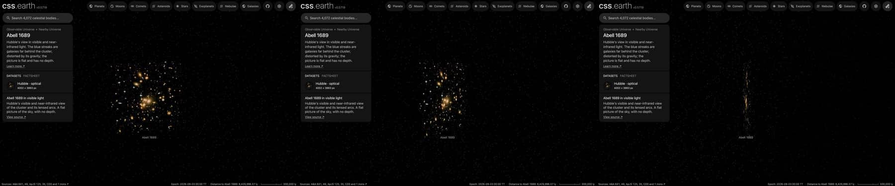

# Abell 1689 picture

A published picture of Abell 1689 stands at the cluster's place and distance as one flat image facing the Sun. It is a picture
of the sky: nothing in it has depth, and seen from the side it is a line.

## Sources

| Selected source | Input and meaning |
| --- | --- |
| [ESA/Hubble heic1317a](https://esahubble.org/images/heic1317a/) | [Record](../../sources/esahubble-heic1317a.json). Visible and near-infrared light: Hubble ACS at 475, 625, 775, 814 and 850 nm. The publisher's Large JPEG, 4002 × 3863 px (`source/source.jpg`, restored from its origin; not tracked). [CC BY 4.0](https://esahubble.org/copyright/), credit: NASA, ESA, the Hubble Heritage Team (STScI/AURA), J. Blakeslee (NRC Herzberg Astrophysics Program, Dominion Astrophysical Observatory), and H. Ford (JHU) A display composite, not calibrated photometry. |
| [MCXC-II, Sadibekova et al. (2024)](https://cdsarc.cds.unistra.fr/viz-bin/cat/J/A+A/688/A187) | [Record](../../sources/mcxc-ii-2024.json). Row MCXC J1311.5-0120: position 197.875°, -1.3354° and redshift 0.1832, from [1999ApJS..125...35S](https://ui.adsabs.harvard.edu/abs/1999ApJS..125...35S). |
| [Planck Collaboration (2020)](https://arxiv.org/abs/1807.06209) | [Record](../../sources/planck-2018-cosmology.json). The redshift's comoving distance in the Planck 2018 cosmology, 776 Mpc (Astropy 8.0.1, `Planck18`): the distance the picture stands at. |
| [Gaia DR3](https://doi.org/10.1051/0004-6361/202243940) | [Record](../../sources/gaia-2023-dr3.json). The 71 sources in the frame (CDS `I/355/gaiadr3`, a cone query on the picture's centre), used only to measure where the picture lies on the sky. |

## The picture

- **Registration:** measured, not taken from the page. Starting from the file's embedded tags, 66 of the 71 Gaia DR3
  sources in the frame have a peak at their place; a least-squares fit of centre, scale and rotation to them leaves
  0.07″ rms (worst 0.18″). It gives 0.0500″ per pixel, north 25.03° right of vertical, centre
  197.875359°, -1.338610°, a field of 3.33 × 3.22 arcmin. The tags say 0.0500″ per pixel and
  25.039°; the fitted centre is 0.12″ from theirs. Gaia positions are at epoch 2016 and no proper motion is applied.
- **Plane:** the picture's own tangent plane, perpendicular to the sight line through the picture's centre and passing through
  the cluster's place, so it faces the Sun. The picture's centre is 11.6″ from the catalogue position, which is the
  recipe's whole inclination (0.0032°). This is where a sky picture lies, not a measured orientation of the cluster.
- **Size:** 0.75 × 0.73 Mpc at the cluster's comoving distance (the angle times the distance). The page
  frames 363 kpc, half the picture's short side.
- **Sky:** light below 20 of 255 is taken as sky and left transparent, so the universe's own dots show through it. At 8 of 255 the image noise between the galaxies cost 1,002 KB; at 20 it is 470 KB and the lensed arcs remain.
- **Edges:** the outer 4% of the frame fades out, so the picture has no hard rectangular edge.
- **Bytes:** one image, 1022 × 986 px, 470 KB (WebP quality 70, alpha quality 80), 1,024 px on its long side as the
  Milky Way's backing image is. Alpha quality 60 saved a further 25 to 40% but drew contour bands in the galaxies' halos.

## Evidence

The Abell 1689 page in headless Chromium at 1440 × 900, device pixel ratio 2, on this branch on 2026-10-02: the default
arrival, the camera turned part of the way round, and the picture seen from the side, where it is a line.

## Measured, chosen and inferred

| Value | Kind |
| --- | --- |
| Position 197.875°, -1.3354° and redshift 0.1832 | Measured: MCXC-II row MCXC J1311.5-0120 |
| Distance 776 Mpc | Derived: the redshift's comoving distance in the Planck 2018 cosmology |
| Field, scale and rotation of the picture | Measured: fitted to Gaia DR3 positions |
| Flat plane facing the Sun | The geometry of a sky picture; no depth is measured or drawn |
| Sky floor, edge fade, 1,024 px, framing radius | Presentation |

## Known problems

- The picture is flat: seen from the side it is a line, and from behind it is mirrored.
- Everything in the frame stands on the cluster's plane, whatever its own distance: Milky Way stars in front of the cluster and the
  far galaxies behind it are part of the picture.
- The frame covers the cluster's core only, 0.75 Mpc across.
- The page opens with ecliptic north up, as every page does, so the picture arrives turned from the publisher's orientation.
- The size is a comoving size. The cluster is bound and does not expand with the universe; its proper size at its redshift is
  smaller by 1 + z.
