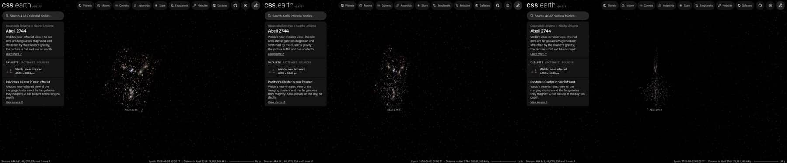

# Abell 2744 picture

A published picture of Abell 2744 stands at the cluster's place and distance as one flat image facing the Sun. It is a picture
of the sky: nothing in it has depth, and seen from the side it is a line.

## Sources

| Selected source | Input and meaning |
| --- | --- |
| [ESA/Webb weic2305a](https://esawebb.org/images/weic2305a/) | [Record](../../sources/esawebb-weic2305a.json). Near-infrared light shown as colour (Webb NIRCam): 1.15 and 1.5 µm blue, 2.0 and 2.77 µm green, 3.56 and 4.44 µm red. The publisher's Publication JPEG, 4000 × 3043 px (`source/source.jpg`, restored from its origin; not tracked), of the 17,644 × 13,422 px original. [CC BY 4.0](https://esawebb.org/copyright/), credit: NASA, ESA, CSA, I. Labbe (Swinburne University of Technology), R. Bezanson (University of Pittsburgh), A. Pagan (STScI). A display composite, not calibrated photometry. |
| [MCXC-II, Sadibekova et al. (2024)](https://cdsarc.cds.unistra.fr/viz-bin/cat/J/A+A/688/A187) | [Record](../../sources/mcxc-ii-2024.json). Row MCXC J0014.3-3023: position 3.5783°, -30.3834° and redshift 0.3066, from [2004A&A...425..367B](https://ui.adsabs.harvard.edu/abs/2004A&A...425..367B). |
| [Planck Collaboration (2020)](https://arxiv.org/abs/1807.06209) | [Record](../../sources/planck-2018-cosmology.json). The redshift's comoving distance in the Planck 2018 cosmology, 1,258 Mpc (Astropy 8.0.1, `Planck18`): the distance the picture stands at. |
| [Gaia DR3](https://doi.org/10.1051/0004-6361/202243940) | [Record](../../sources/gaia-2023-dr3.json). The 36 sources in the frame (CDS `I/355/gaiadr3`, a cone query on the picture's centre), used only to measure where the picture lies on the sky. |

## The picture

- **Registration:** measured, not taken from the page. Starting from the file's embedded tags, 36 of the 36 Gaia DR3
  sources in the frame have a peak at their place; a least-squares fit of centre, scale and rotation to them leaves
  0.06″ rms (worst 0.21″). It gives 0.0882″ per pixel, north 42.39° right of vertical, centre
  3.576180°, -30.378995°, a field of 5.88 × 4.47 arcmin. The tags say 0.0882″ per pixel and
  42.36°; the fitted centre is 0.12″ from theirs. Gaia positions are at epoch 2016 and no proper motion is applied.
- **Plane:** the picture's own tangent plane, perpendicular to the sight line through the picture's centre and passing through
  the cluster's place, so it faces the Sun. The picture's centre is 17.2″ from the catalogue position, which is the
  recipe's whole inclination (0.0048°). This is where a sky picture lies, not a measured orientation of the cluster.
- **Size:** 2.15 × 1.64 Mpc at the cluster's comoving distance (the angle times the distance). The page
  frames 818 kpc, half the picture's short side.
- **Sky:** light below 20 of 255 is taken as sky and left transparent, so the universe's own dots show through it. At 20 of 255 the image noise between the galaxies costs less (378 KB against 460 KB at 8) and the red lensed arcs remain.
- **Edges:** the outer 4% of the frame fades out, so the picture has no hard rectangular edge.
- **Bytes:** one image, 1022 × 779 px, 378 KB (WebP quality 70, alpha quality 80), 1,024 px on its long side as the
  Milky Way's backing image is. Alpha quality 60 saved a further 25 to 40% but drew contour bands in the galaxies' halos.

## Evidence

The Abell 2744 page in headless Chromium at 1440 × 900, device pixel ratio 2, on this branch on 2026-10-02: the default
arrival, the camera turned part of the way round, and the picture seen from the side, where it is a line. The white dots are the [member galaxies](../abell-2744-members/README.md), which have an assumed depth and so stand off the picture.

## Measured, chosen and inferred

| Value | Kind |
| --- | --- |
| Position 3.5783°, -30.3834° and redshift 0.3066 | Measured: MCXC-II row MCXC J0014.3-3023 |
| Distance 1,258 Mpc | Derived: the redshift's comoving distance in the Planck 2018 cosmology |
| Field, scale and rotation of the picture | Measured: fitted to Gaia DR3 positions |
| Flat plane facing the Sun | The geometry of a sky picture; no depth is measured or drawn |
| Sky floor, edge fade, 1,024 px, framing radius | Presentation |

## Known problems

- The picture is flat: seen from the side it is a line, and from behind it is mirrored.
- Everything in the frame stands on the cluster's plane, whatever its own distance: Milky Way stars in front of the cluster and the
  far galaxies behind it are part of the picture.
- The colours are near-infrared light shown as colour. The input is the publisher's 4,000 px Publication JPEG, not the 17,644 px original.
- The page opens with ecliptic north up, as every page does, so the picture arrives turned from the publisher's orientation.
- A flight from another page keeps the travelling camera's angle, so it can arrive seeing the picture from an oblique angle or
  nearly from the side. Opening the page directly faces the picture.
- The size is a comoving size. The cluster is bound and does not expand with the universe; its proper size at its redshift is
  smaller by 1 + z.
