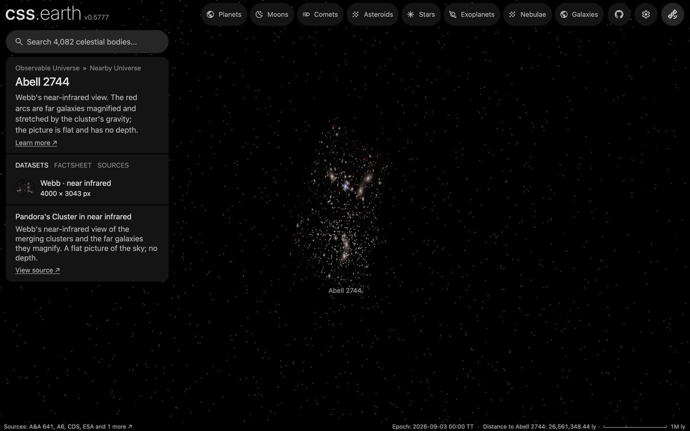

# Abell 2744 members

The spectroscopically confirmed member galaxies of Abell 2744 (Pandora's Cluster), one dot each, drawn while the cluster is selected, with its [picture](../abell-2744-layers/README.md). The cluster's place, distance and card are the [Abell 2744](../abell-2744/README.md) package's.

## Sources

| Source | Measurement used |
| --- | --- |
| [Bergamini et al. (2023), A&A 670, A60](https://cdsarc.cds.unistra.fr/viz-bin/cat/J/A+A/670/A60) | [Record](../../sources/bergamini-2023-a2744-members.json). Table B1, the 225 cluster members of the paper's strong-lensing model: J2000 positions, F160W magnitudes and a Type column. The 202 rows with Type = s (spectroscopic cluster member) are drawn; the 23 photometric members are not. |
| [Planck Collaboration (2020)](https://arxiv.org/abs/1807.06209) | [Record](../../sources/planck-2018-cosmology.json). The comoving distance of the cluster's MCXC-II redshift 0.3066, 1,258 Mpc: the distance every member is placed at. |

## Processing

1. The table is a CDS TAP query (`source/dots/points.json`, `table.origin`; not tracked): it keeps the rows with Type = s and writes the cluster's distance into each row.
2. `node packages/bake/cli/prepare-catalogue-points.mts src/objects/abell-2744-members dots` places every member at the cluster's distance, spread in depth as widely as the members spread across the sky, and tones it by its F160W magnitude ([recipe](source/dots/points.json)): 202 dots.

## Evidence

A headless browser capture of this version at 1440 × 900, device pixel ratio 2, on the Abell 2744 page with the camera turned part of the way round the picture.

## Measured, chosen and assumed

| Value | Kind |
| --- | --- |
| Sky positions, membership and F160W magnitudes | Measured: Bergamini et al. (2023), table B1 |
| Distance 1,258 Mpc | Derived: the redshift's comoving distance in the Planck 2018 cosmology |
| Depth of each member within the cluster | Assumed: as deep as the members are wide on the sky; not measured |
| Tone scale, dot size, white color | Presentation |

## Known problems

- A member's depth is assumed, not measured, so seen from the side the dots form a ball around the flat picture.
- The catalogue covers the cluster's core only, the field of the strong-lensing model, about 4 arcmin across. The wider redshift catalogue of Owers et al. (2011, CDS J/ApJ/728/27) carries no membership column, and its 343 members come from an iterative procedure, so it is not used.
- Each member is also a galaxy in the picture, so from the Sun's side a dot lies over its own galaxy.
- The tone scale subtracts the distance modulus of the comoving distance from the observed F160W magnitude. It is a display scale, not a rest-frame luminosity.
- No types or colors are in the table, so every dot is white.
