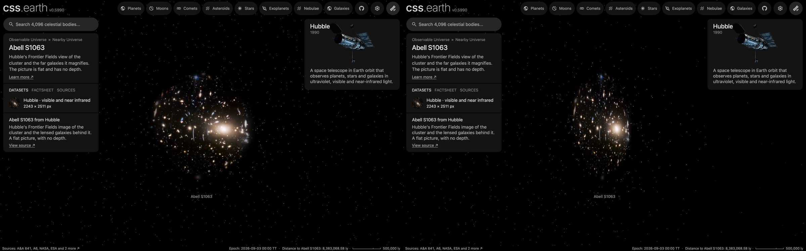

# Abell S1063 picture

A published picture of Abell S1063 stands at its place and distance as one flat image facing the Sun. It is a picture
of the sky: nothing in it has depth, and seen from the side it is a line.

## Sources

| Selected source | Input and meaning |
| --- | --- |
| [ESA/Hubble heic1615a](https://esahubble.org/images/heic1615a/) | [Record](../../sources/esahubble-heic1615a.json). Hubble ACS and WFC3, from 435 nm to 1.6 µm, the shortest wavelengths blue and the longest red. The publisher's JPEG, 2243 × 2511 px (`source/source.jpg`, restored from its origin; not tracked). [CC BY 4.0](https://esahubble.org/copyright/), credit: NASA, ESA, and J. Lotz (STScI). A display composite, not calibrated photometry. |
| [NED, Abell S1063](https://ned.ipac.caltech.edu/byname?objname=Abell%20S1063) | [Record](../../sources/ned-abell-s1063.json). Position 342.1907°, -44.5269° (2015ApJS..216...27B) and redshift 0.3517 ± 0.0049 (2024MNRAS.531.3973K), NED's preferred values. |
| [Planck Collaboration (2020)](https://arxiv.org/abs/1807.06209) | [Record](../../sources/planck-2018-cosmology.json). The cosmology that turns the redshift into a distance: comoving distance 1,425 Mpc, light travel time 4.00 billion years (Astropy 8.0.1, `Planck18`). |

## The picture

- **Placement:** The file's embedded sky tags, used as they are: 0.05549 arcsec per pixel, north 7.3° right of vertical, the frame's centre at 342.185158802°, -44.5300561316°. Not measured against Gaia here; the same publishers' tags were within 0.4 arcsec on four cluster pictures and 1.5 arcsec off on one deep field.
- **Plane:** the picture's own tangent plane, perpendicular to the sight line through the picture's centre, so it faces the Sun. The picture's centre is 18.2″ from the published position, which is the recipe's whole inclination (0.005056°). This is where a sky picture lies, not a measured orientation.
- **Size:** 860.0 kpc × 962.8 kpc at the comoving distance (the angle times the distance). The page frames 430.0 kpc, half the picture's short side.
- **Rim:** the picture is drawn inside a circle and fades out between 70% and 98% of half its short side. Its corners are not drawn, so no straight edge or corner shows from any angle. A presentation choice.
- **Sky:** light below 8 of 255 is taken as sky and left transparent, so the universe's own dots show through it.
- **Bytes:** one image, 1,024 px on its long side (WebP quality 70, alpha quality 80), as the Milky Way's backing image is.

## Evidence

The Abell S1063 page in headless Chromium at 1440 × 900, device pixel ratio 2, on this branch on 2026-10-02: the default
arrival and the camera turned part of the way round.

## Measured, chosen and inferred

| Value | Kind |
| --- | --- |
| Position 342.1907°, -44.5269° and redshift 0.3517 ± 0.0049 | Measured: NED's preferred values (2015ApJS..216...27B, 2024MNRAS.531.3973K) |
| Distance 1,425 Mpc | Derived: the redshift's comoving distance in the Planck 2018 cosmology |
| Field, scale and rotation of the picture | The publisher's embedded tags; not measured here |
| Flat plane facing the Sun | The geometry of a sky picture; no depth is measured or drawn |
| Round rim, sky floor, 1,024 px, framing radius | Presentation |

## Known problems

- The picture is flat: seen from the side it is a line, and from behind it is mirrored.
- Everything in the frame stands on one plane, whatever its own distance. The lensed galaxies are far behind the cluster; all stand on the cluster's plane here.
- The round rim leaves the frame's corners out.
- The page opens with ecliptic north up, as every page does, so the picture arrives turned from the publisher's orientation.
- A flight from another page keeps the travelling camera's angle, so it can arrive seeing the picture from an oblique angle or
  nearly from the side. Opening the page directly faces the picture.
- The size is a comoving size. A bound cluster does not expand with the universe; its proper size at its redshift is smaller by 1 + z.
