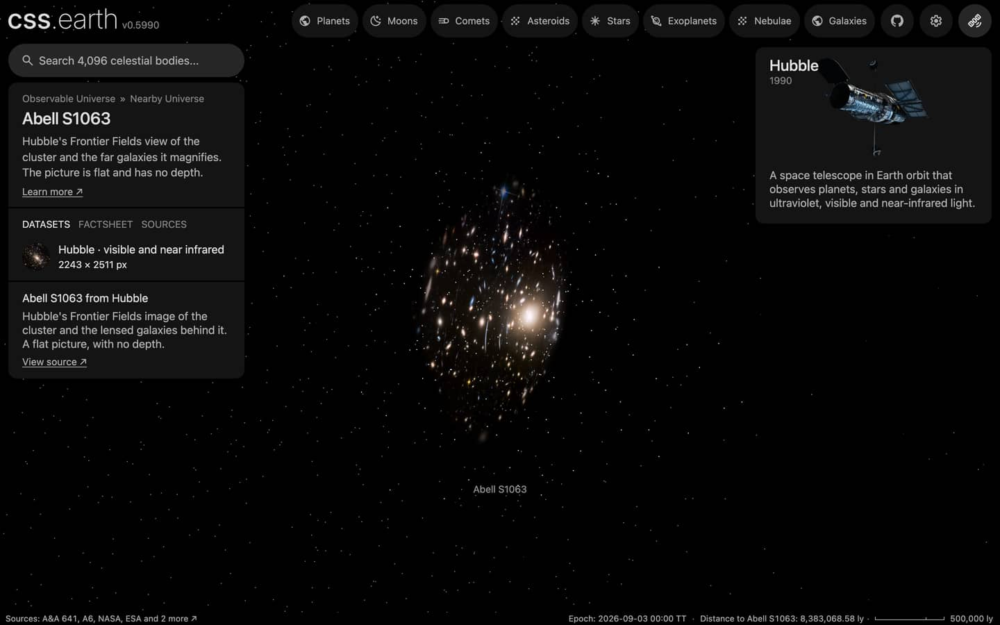

# Abell S1063 members

The member galaxies of Abell S1063 that a published catalogue flags, one dot each, drawn while the cluster is selected, with its [picture](../abell-s1063-layers/README.md). The cluster's place, distance and card are the [Abell S1063](../abell-s1063/README.md) package's.

## Sources

| Source | Measurement used |
| --- | --- |
| [Raney, Keeton & Brennan (2020), MNRAS 492, 503](https://cdsarc.cds.unistra.fr/viz-bin/cat/J/MNRAS/492/503) | [Record](../../sources/raney-2020-frontier-fields-galaxies.json). Table `tablea5`, 340 galaxies in the cluster's field: J2000 positions, a magnitude and a membership flag. The 153 rows with Status = member-spec (spectroscopic cluster member) are drawn; its 119 photometric members and 68 line-of-sight galaxies are left out. |
| [Planck Collaboration (2020)](https://arxiv.org/abs/1807.06209) | [Record](../../sources/planck-2018-cosmology.json). The comoving distance of the cluster's redshift 0.35166, 1,425 Mpc: the distance every member is placed at. |

## Processing

1. The table is a CDS TAP query (`source/dots/points.json`, `table.origin`; not tracked): it keeps the flagged rows and writes the cluster's distance into each row.
2. `node packages/bake/cli/prepare-catalogue-points.mts src/objects/abell-s1063-members dots` places every member at the cluster's distance, spread in depth as widely as the members spread across the sky, and tones it by its magnitude ([recipe](source/dots/points.json)): 153 dots.

## Evidence

A headless browser capture of this version at 1440 × 900, device pixel ratio 2, on the Abell S1063 page with the camera turned part of the way round the picture.

## Measured, chosen and assumed

| Value | Kind |
| --- | --- |
| Sky positions, membership and magnitudes | Measured: Raney, Keeton & Brennan (2020), MNRAS 492, 503 |
| Distance 1,425 Mpc | Derived: the redshift's comoving distance in the Planck 2018 cosmology |
| Depth of each member within the cluster | Assumed: as deep as the members are wide on the sky; not measured |
| Tone scale, dot size, white color | Presentation |

## Known problems

- A member's depth is assumed, not measured, so seen from the side the dots form a ball around the flat picture.
- The table covers the Hubble Frontier Fields core, a few arcmin across.
- A member inside the picture's frame is also a galaxy in the picture, so from the Sun's side its dot lies over its own galaxy.
- The tone scale subtracts the distance modulus of the comoving distance from the observed magnitude. It is a display scale, not a rest-frame luminosity.
- No types or colors are in the table, so every dot is white.
