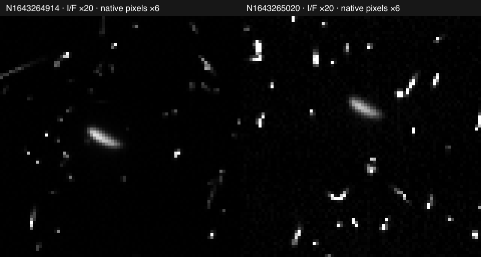

# Aegaeon

## Sources

- [Hedman et al. (2020), Table 1](https://arxiv.org/abs/1912.09192) supplies semiaxes 0.7 × 0.25 × 0.2 km with uncertainties 0.05 × 0.06 × 0.08 km.

## Evidence

The [14 September native-frame review](evidence/registration/review.json)
examines two consecutive calibrated clear-filter images, N1643264914 and
N1643265020. Hedman et al. identify the latter in Figure 18. The same detector
window contains a diffuse disc candidate in both frames. This locates a useful
source candidate; it does not establish a registered surface.

The [historical-kernel comparison](evidence/registration/native-geometry.json)
gives N1643265020 a viewing longitude of 158.04–158.09° west, near the paper's
158.3°. OPUS reports 291.756° in its own current geometry. These values must not
be used interchangeably. The earlier 135° disagreement is therefore not evidence
that the paper lacks a usable longitude convention. Camera placement and
interior registration are still unqualified.

- [Cassini ISS/PDS](https://pds-rings.seti.org/cassini/iss/): actual OPUS source products were downloaded and inspected at native resolution. The query and candidate evidence are in [source/survey](source/survey).

## Known problems

- The mesh is an analytic ellipsoid approximating those axes, not a copy of the detailed irregular shape solution. The Shape model lens uses the normal shared grid throughout: there are no mapped surface texels.

- The 2010 pair remains unqualified for texture mapping: the producer's star-based image navigation has not been recovered or independently reproduced. The previously sampled 2015 frame still has no securely identified, registered disc. No photograph was promoted.

- Frozen historical Aegaeon pole from the mission BPC at 2015-12-19T12:32:14.886 UTC, arbitrary display meridian; not a current spin prediction. This is distinct from the orbital position, which uses JPL Horizons samples over 2020–2032 and the shared fitted ellipse plus prepared slow-longitude libration terms. Independent fractional-day reference epochs measure fit residuals, not a universal accuracy bound; extrapolation outside the fitted interval is not qualified.

[Inputs](source/manifest.json) · Provenance (`prepared/provenance.json`) · [Delivered files](runtime-assets.json) · [Credits](NOTICE.md) · [Investigation ledger](investigations.json)

## Methods and source notes

Reproduce the 2010 source inspection

Run `node tools/objects/source-authoring/cassini-small-moons/review-aegaeon.mts --acquire`
from the repository root. The command restores only the four pinned image/label
files, one at a time, and writes the comparison and JSON report under
`output/aegaeon-source-review/`. Optional first and second arguments choose the
input and output directories. [Input identities](evidence/registration/inputs.json)
record the original product URLs, hashes, crop and display policy.

The shared VICAR decoder honors the attached header's binary telemetry record:
the image begins at byte 8192, despite the detached label's record-2 pointer.
The 80 × 80 crops retain all detector pixels, including particle events and
negative calibrated samples. Display clipping is counted in the report; it is
not a scientific validity mask. No denoising, resampling into a body frame,
camera fit or surface preparation runs.

The separate native CSPICE comparison records its kernel load order, byte pins,
API calls and environment. `aegaeon_mst2013.bpc` explicitly restricts use to its
associated historical kernels. Its comparison with Table 27 narrows the frame
question; it does not supply Hedman's per-image navigation correction. Figure
18, Table 27, the page-4 navigation method and Appendix C's west-longitude
definition were inspected. The paper is a reference input, not a redistributed
texture or a complete camera solution.

Detailed source survey, assumptions and preparation

## Included presentation

The table attributes the source shapes to Cassini measurements, including Thomas et al. and Thomas & Helfenstein.

Physical scale uses the volume-equivalent radius 0.327106631018859 km. The 5° radius table and formula are checked in. Meshoptimizer prepares 480 native triangle leaves; its 8.177665775471475 m error allowance is a simplifier parameter, not a physical measurement uncertainty.

The UI says Measured shape; this does not imply mapped terrain.

## Investigation record

Source selections, recorded trials and open questions are in the [investigation ledger](investigations.json), including what would reopen each decision.

## Orientation, position and delivery

Pole RA 40.57815780620991°, Dec 83.53745027635604°.

Both shared Flood and Shadows remain available. Prepared context, minimap, thumbnail and lighting derive from this same shape and material. Source inputs and authored documents are pinned in source/manifest.json; external files are restorable through preparation/acquisition.json. NASA/PDS source attribution and the separate font terms are retained.

