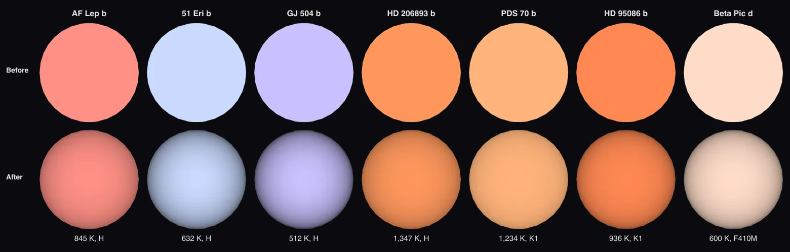

# AF Lep b

The [navigation marker](source/preparation/navigation.json) adds a prepared curvature cue to the existing neutral gray placeholder. It remains a schematic identifier without resolved surface imagery; the shading is a display convention, not measured limb darkening or surface detail.

AF Lep b is the lowest-mass imaged planet whose mass was weighed through its orbit. It circles its star at about 8 au, in line with the star's spin. Its star is [AF Lep](../af-lep/README.md).

## Sources

**Orbit.** Balmer et al. ([2025](https://arxiv.org/abs/2411.05917)) fit three VLTI/GRAVITY positions (their Table 2), the earlier SPHERE, NIRC2 and NaCo astrometry and the Hipparcos-Gaia accelerations with orvara, and distribute their posterior through whereistheplanet 1.0.1 (Wang et al. 2021). No refit is needed: [`posterior-pick.py`](../../../packages/telescope-cli/src/new-object/hosted-orbits/posterior-pick.py) keeps one of those samples ([pick.json](source/orbits/pick.json)), but that posterior stores no likelihoods, so the sample kept is the one closest to the three GRAVITY positions, scored with their errors and correlations ([orbit.json](source/orbits/orbit.json) lists the model at each measured position). It misses them by 0.32, 0.05 and 0.07 mas (χ² 20.6 over six numbers), the best of 1,000 samples. The recorded orbit: a = 8.9 au, e = 0.015, i = 57.8°, period about 23 years. The path drawn is this orbit. Every element and its derivation is in [`af-lep-b.json`](../../../packages/astronomy/data/bodies/af-lep-b.json).

**Radius, temperature and mass.** Radius 1.30 Jupiter radii and 770 K from the evolutionary-model row of Balmer et al. ([2025](https://arxiv.org/abs/2411.05917)), Table 4 (Saumon & Marley 2008 hybrid clouds at 24 million years). Their atmosphere fits give radii from 0.5 to 1.8 Jupiter radii, which they discuss as a radius problem in section 5, so the evolutionary values are used. Mass 3.75 ± 0.5 Jupiter masses, measured dynamically from the orbit and the star's acceleration. A sphere: no oblateness is measured.

**Its own light.** The planet is drawn self-luminous, as the other imaged planets are: its glow is its own heat.

**Infrared color dataset.** The default dataset paints the sphere one false color from its measured flux in three infrared bands: red 2MASS Ks 2.159 µm (133 ± 8.6 µJy), green MKO H 1.614 µm (37.23 ± 12 µJy), blue MKO J 1.2417 µm (31.67 ± 9.6 µJy) (De Rosa et al. (2023); Mesa et al. (2023), as compiled in Best, Liu, Magnier & Dupuy (2024), The UltracoolSheet v2.1 (Zenodo); zero points from the SVO Filter Profile Service; [record](source/photometry/band-color.json)). Display range: this planet alone, from zero to its brightest band (2MASS Ks), so the color shows its band ratios; brightness is not compared across planets at different distances. Not a natural color; nobody has resolved its disc.

**Limb.** The disc is dimmed toward the limb by the quadratic law fitted to the MKO H intensity PICASO 4.1 (Batalha et al. 2019, ApJ 878, 70) computes from Exo-REM cloudy (Charnay et al. 2018, ApJ 854, 172; 3.16 times solar metallicity, C/O 0.55) model atmospheres at 845 K and log g 3.89, read between the models YGP_800K_logg3.5, YGP_800K_logg4.0, YGP_850K_logg3.5, YGP_850K_logg4.0 (u1 0.703, u2 0.015; the law fits each model's eight angles within 0.18% of the centre): a cloudy model, the one Balmer et al. (2025), arXiv:2411.05917 fit to this planet, because no table reaches a planet this cold and nobody has resolved its disc ([nodes](source/photometry/picaso-exo-rem-h-quadratic.tsv)). The temperature and gravity are that fit's (Table 4, all data, Exo-REM with a uniform prior on the radius: Teff 845 +/- 3 K, log g 3.89 +/- 0.05, radius 1.13 +/- 0.01, [Fe/H] 0.69 +/- 0.02, C/O 0.57 +/- 0.01, the lowest chi-squared of the two Exo-REM rows (2.45); with the gravity fixed at the dynamical mass the same grid gives 783 +/- 5 K at log g 3.7; [record](source/photometry/atmosphere-fit.json)), not the 770 K of its measurements record.

**Rotation.** No rotation period or spin axis of AF Lep b is measured; the papers cited in the README were checked. The display axis is the orbit normal ([rotation.json](source/preparation/rotation.json)).

## Evidence

Run of 2026-09-23 (this version):

- [`hostedOrbits.test.ts`](../../../packages/astronomy/src/hostedOrbits.test.ts) places the planet, at its star's Gaia distance, against the measured positions (see the test for each miss).

Run of 2026-10-04, when the limb law was added. The test above still applies: the orbit did not change.

- The app's arrival pictures of the seven imaged planets whose papers fitted Exo-REM models, before and after the law computed from each one's fitted model:

- [`imaged-limb.test.mts`](../../../packages/telescope-cli/src/new-object/imaged/imaged-limb.test.mts) checks that every node file of an Exo-REM law records, for each model, how much of the band flux of the release's own spectrum PICASO finds, and that none is below 80%. The check is what told PICASO's two solvers apart: through the thick clouds of the 850 K, log g 4.0 model its two-stream solver found 78% of the release's H-band flux and four-term spherical harmonics 95%.

## Known problems

- The posterior stores no likelihoods, so the orbit kept is the sample nearest the GRAVITY positions; it misses the first by 0.3 mas, several times that measurement's error.
- The radius is a model value, and the paper's own atmosphere fits disagree with it.
- No spin axis is measured.
- **Model limb.** The limb darkening is computed from the cloudy model a paper fitted to the planet, in the middle band of its color, not a measurement of this planet; another model grid would give another law. Among the 4 models it is read between, the disc near its edge (the lowest of the eight angles) is 25% to 45% as bright as the centre. PICASO finds 92% to 95% of the band flux the release states for those models.

[Investigation ledger](investigations.json) · [Inputs](source/manifest.json) · [Preparation](source/preparation) · [Delivered files](inventory.json) · [Credits](NOTICE.md)
