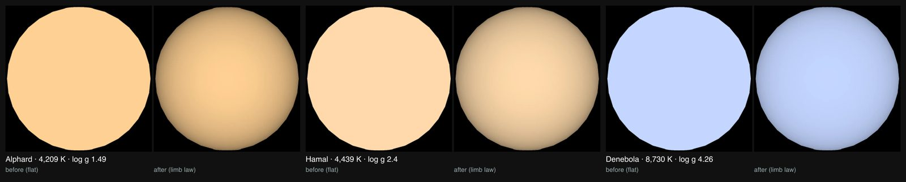

# Alphard

## Sources

Its brightness, measured band by band, gives 780 times the Sun's luminosity at 4,209 K, so 52.599 solar radii. It is also HD 81797, HR 3748, HIP 46390. The introduction is generated from McDonald, Zijlstra & Watson (2017), MNRAS 471, 770's published values; the sections below are the data's own.

**Star.** Placement: Anderson & Francis (2012), Astronomy Letters 38, 331 (XHIP), Hipparcos astrometry, VizieR V/137D/XHIP row HIP = 46390 (SIMBAD HIP 46390); placed by that row, not by a Gaia source, distance 55.28 pc from McDonald, Zijlstra & Watson (2017), MNRAS 471, 770, table 2, HIP 46390: distance 55.279 pc, the paper's parallax inverted (Gaia DR1's where it revised the star's, else the Hipparcos reduction of van Leeuwen 2007; section 2.3; fractional uncertainty 0.01), at which the luminosity and radius hold. Radius 52.599 solar radii from McDonald, Zijlstra & Watson (2017), MNRAS 471, 770, table 2, HIP 46390: radius 52.599 solar radii, implied by the fitted luminosity 780.11 solar luminosities (fractional uncertainty 0.06) and temperature (https://doi.org/10.1093/mnras/stx1433). No mass is measured, so GM is 0, the records' unpublished value. Temperature 4,209 K from McDonald, Zijlstra & Watson (2017), MNRAS 471, 770, table 2, HIP 46390: effective temperature 4209 +/- 125 K, from the fit of a model atmosphere to the star's spectral energy distribution (goodness of fit Q 0.094). log g 1.49 from 2024A&A...690A..97C ("The AMBRE Project: Lead abundance in Galactic stars.").

**Color.** Pulkovo spectrophotometric catalogue, table 5 (320-1080 nm, 2.5 nm steps, 10 nm resolution, absolute flux in W m^-2 m^-1): Alekseeva et al. (1996, 1997), Baltic Astronomy 5, 603 and 6, 481; VizieR III/201. Alphard is HR 3748., cross-checked against Kiehling (1987), spectrophotometry of 60 bright F, G, K and M stars, 320-880 nm in 1 nm steps as normalised magnitudes: Kiehling (1987), A&AS 69, 465; VizieR III/124. * alf Hya is HR 3748. (5 levels apart at most, the threshold is 12), through the CIE 1931 2° observer: #ffd093. Routes tried in order: stis-ngsl: the library marks HD 81797's spectrum DATAQUAL suspect; gaia-xp: the star is placed by a catalogue row, so no Gaia DR3 source is read for it; kharitonov: found, not needed after the color and its cross-check; burnashev: found, not needed after the color and its cross-check; pulkovo: used.

**Limb.** The disc is dimmed toward the limb by the quadratic law Claret & Bloemen (2011), A&A 529, A75 compute from ATLAS model atmospheres for the Johnson V band at 4,209 K and log g 1.49 (u1 0.866, u2 -0.036): a model, because no fit of this star's limb is used. Gravity: log g 1.49 from 2024A&A...690A..97C; the 25 published values span log g 1.13 to 4.59, across which the limb law changes by at most 5.1% of the centre brightness.

## Evidence

Generated 2026-10-03 by [new-object-cli.mts](../../../packages/telescope-cli/src/new-object/new-object-cli.mts) from VizieR V/137D/XHIP and the archives named above; each choice was read with the dataset's own reader.

- The color's cross-check differs by 5 levels at most in any channel (threshold 12); [object-package-consistency.test.mts](../../../src/objects/object-package-consistency.test.mts) recomputes it after preparation.

## Known problems

- **Assumptions of the frame.** The axis's position angle and the rotation phase are conventions.
- **Quoted text.** The introduction quotes sentences of the Wikipedia article "Alphard" (revision 1374616122) verbatim, CC BY-SA 4.0.
- **Model limb.** The limb darkening is a model atmosphere at the star's temperature and gravity, not a measurement of this star.

[Investigation ledger](investigations.json) · [Inputs](source/manifest.json) · [Preparation](source/preparation) · [Delivered files](inventory.json) · [Credits](NOTICE.md)
