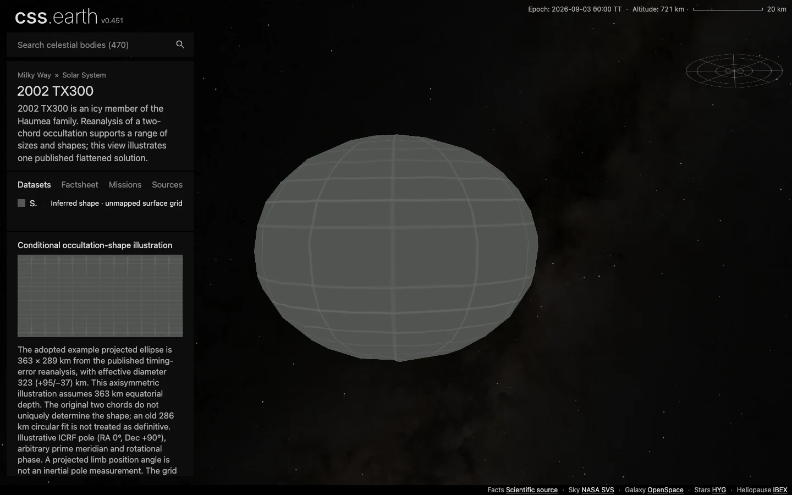

# 2002 TX300

2002 TX300 is an icy member of the Haumea family. Reanalysis of a two-chord occultation supports a range of sizes and shapes; this view illustrates one published flattened solution.

Source selections, recorded trials and open questions are in the [investigation ledger](investigations.json).

## Sources

| Source | Display interpretation |
| --- | --- |
| [Vilenius et al. (2018), A&A 618, A136, §3.3 and Table 6.](https://doi.org/10.1051/0004-6361/201732564) | Conditional occultation-shape illustration |
| [JPL Horizons elements](source/reference/horizons-elements.txt) and [independent vectors](source/reference/horizons-vectors.txt) | Heliocentric geometric position at the fixed 2026-09-03 epoch. |

The adopted example projected ellipse is 363 × 289 km from the published timing-error reanalysis, with effective diameter 323 (+95/−37) km. This axisymmetric illustration assumes 363 km equatorial depth. The original two chords do not uniquely determine the shape; an old 286 km circular fit is not treated as definitive.

Illustrative ICRF pole (RA 0°, Dec +90°), arbitrary prime meridian and rotational phase. A projected limb position angle is not an inertial pole measurement.

The normal grid marks unmapped terrain. Shadows defaults off. The radius used for display scale is the volume-equivalent radius of the adopted model, not a new independent physical measurement. [Measurements](source/measurements.json), [source manifest](source/manifest.json), and [credits](NOTICE.md) retain the numerical extraction, original byte pins and terms.

## Evidence

The [shared browser record](../../../tools/audits/distant-worlds/evidence/outer-worlds/browser-validation.json) checks this body at DPR 1 and 2: one scene, 480 native raster triangles, retained leaves during drag, Shadows and Orbit off by default, and working opt-in controls. The captures use the development server at `fc0c05a80`; [run context and byte pins](../../../tools/audits/distant-worlds/evidence/outer-worlds/run-context.json) identify the served data and omitted production/reproduction checks. Inspect [DPR 2](evidence/default-dpr2.webp) and [Shadows on after rotation](evidence/shadows-on.webp).

[Source and runtime closures](../../../tools/audits/distant-worlds/evidence/outer-worlds/qualification.json) passed, including a fresh installation of all 186 scene files across the six added bodies. The closed, connected mesh has Euler characteristic 2. Its maximum [sampled radial deviation](../../../tools/audits/distant-worlds/evidence/outer-worlds/surface-fit.json) is 3.29% of the adopted model radius; finite samples are neither a Hausdorff bound nor measurement uncertainty. See the [shared checks and limits](../../../tools/audits/distant-worlds/README.md#six-outer-worlds).

## Known problems

The fixed-epoch two-body orbit does not simulate long-term perturbations. A smooth numerical shape with an unmapped grid is not a resolved surface observation.

Source survey and preparation

- Selected: Vilenius (2018) reanalysis and its conditional a/c≈1.3 ellipsoidal example.
- The old 2010 circular fit was affected by a timing offset; the selected publication retains broad size uncertainty.
- Water-ice spectral evidence and high albedo describe unresolved surface composition, not a spatially resolved ice map. The standard grid remains.

[Shared extraction and preparation](../../../tools/objects/source-authoring/distant-worlds/README.md) use the existing 5° ellipsoid radius table, meshoptimizer reduction and native PolyCSS `u` raster triangles. The selected dataset is fixed at mount; no geometry or imagery is generated by the runtime. Prepared provenance (`prepared/provenance.json`) traces source inputs to delivered assets.

