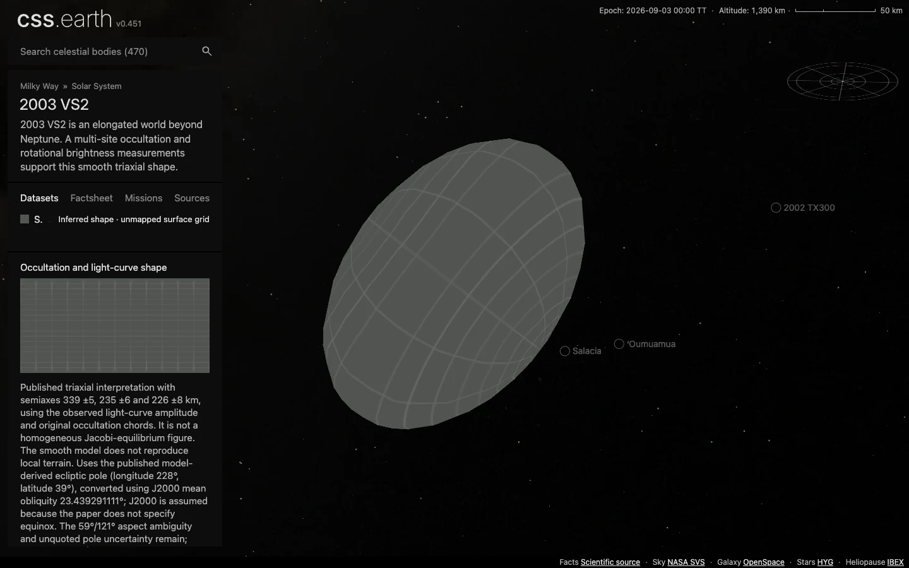

# 2003 VS2

2003 VS2 is an elongated world beyond Neptune. A multi-site occultation and rotational brightness measurements support this smooth triaxial shape.

Source selections, recorded trials and open questions are in the [investigation ledger](investigations.json).

## Sources

| Source | Display interpretation |
| --- | --- |
| [Vara-Lubiano et al. (2022), A&A, Table 7 and §4.3 (2019 occultation).](https://doi.org/10.1051/0004-6361/202141842) | Occultation and light-curve shape |
| [JPL Horizons elements](source/reference/horizons-elements.txt) and [independent vectors](source/reference/horizons-vectors.txt) | Heliocentric geometric position at the fixed 2026-09-03 epoch. |

Published triaxial interpretation with semiaxes 339 ±5, 235 ±6 and 226 ±8 km, using the observed light-curve amplitude and original occultation chords. It is not a homogeneous Jacobi-equilibrium figure. The smooth model does not reproduce local terrain.

Uses the published model-derived ecliptic pole (longitude 228°, latitude 39°), converted using J2000 mean obliquity 23.439291111°; J2000 is assumed because the paper does not specify equinox. The 59°/121° aspect ambiguity and unquoted pole uncertainty remain; prime meridian and rotational phase are arbitrary.

The normal grid marks unmapped terrain. Shadows defaults off. The radius used for display scale is the volume-equivalent radius of the adopted model, not a new independent physical measurement. [Measurements](source/measurements.json), [source manifest](source/manifest.json), and [credits](NOTICE.md) retain the numerical extraction, original byte pins and terms.

## Evidence

The [shared browser record](../../../tools/audits/distant-worlds/evidence/outer-worlds/browser-validation.json) checks this body at DPR 1 and 2: one scene, 480 native raster triangles, retained leaves during drag, Shadows and Orbit off by default, and working opt-in controls. The captures use the development server at `fc0c05a80`; [run context and byte pins](../../../tools/audits/distant-worlds/evidence/outer-worlds/run-context.json) identify the served data and omitted production/reproduction checks. Inspect [DPR 2](evidence/default-dpr2.webp) and [Shadows on after rotation](evidence/shadows-on.webp).

[Source and runtime closures](../../../tools/audits/distant-worlds/evidence/outer-worlds/qualification.json) passed, including a fresh installation of all 186 scene files across the six added bodies. The closed, connected mesh has Euler characteristic 2. Its maximum [sampled radial deviation](../../../tools/audits/distant-worlds/evidence/outer-worlds/surface-fit.json) is 2.75% of the adopted model radius; finite samples are neither a Hausdorff bound nor measurement uncertainty. See the [shared checks and limits](../../../tools/audits/distant-worlds/README.md#six-outer-worlds).

## Known problems

The fixed-epoch two-body orbit does not simulate long-term perturbations. A smooth numerical shape with an unmapped grid is not a resolved surface observation.

Source survey and preparation

- Selected: the 2022 observed-amplitude/original-chords solution, not the alternative aligned-chord scenarios.
- The older 2019 shape fit used a lower light-curve amplitude; the 2022 work explains why it is superseded.
- The 2026 combined thermal/occultation preprint does not require a sizable satellite for this body. No resolved global imagery is available in these source products.

[Shared extraction and preparation](../../../tools/objects/source-authoring/distant-worlds/README.md) use the existing 5° ellipsoid radius table, meshoptimizer reduction and native PolyCSS `u` raster triangles. The selected dataset is fixed at mount; no geometry or imagery is generated by the runtime. Prepared provenance (`prepared/provenance.json`) traces source inputs to delivered assets.

