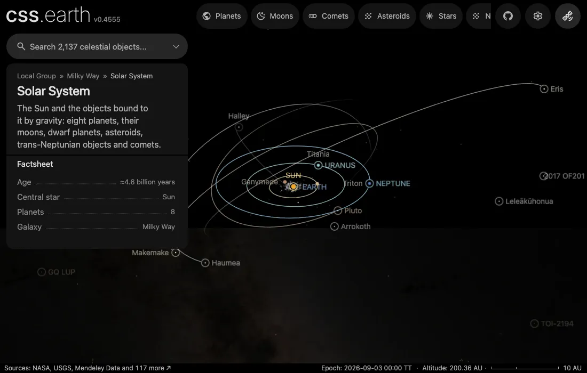

# 2012 VP113

2012 VP113 never comes closer to the Sun than about 80 au, and at the far end of its orbit it is about 450 au away. Its discoverers reported it in 2014 as a second Sedna-like body.

Source selections and open questions are in the [investigation ledger](investigations.json).

## Sources

| Source | Display interpretation |
| --- | --- |
| [Sheppard & Trujillo (2016), The Astronomical Journal 152, 221, Table 2: diameter 550 km for an assumed albedo of 0.10](https://arxiv.org/abs/1608.08772) | Sphere at the estimated diameter |
| [JPL Horizons elements](source/reference/horizons-elements.txt) and [independent vectors](source/reference/horizons-vectors.txt) | Heliocentric geometric position and orbit at the fixed 2026-09-03 epoch. |

Illustrative sphere 550 km across, the diameter Sheppard & Trujillo (2016, Table 2) estimate from its brightness for an assumed moderate albedo of 0.10. The size is not measured.

Illustrative ICRF north pole, arbitrary prime meridian and phase; no spin pole is published.

The normal grid marks unmapped terrain. Shadows default off. [Measurements](source/measurements.json), [source manifest](source/manifest.json) and [credits](NOTICE.md) keep the numbers and terms.

## On the map

It is an extreme trans-Neptunian object: semimajor axis over 150 au and perihelion beyond 30 au, the definition [de la Fuente Marcos & de la Fuente Marcos (2018)](https://arxiv.org/abs/1809.02571) state. The Solar System map shows these objects as named dots by default, whatever their page shows; their orbits stay hidden like other trans-Neptunian orbits and appear on hover.

Captured headless from the development server on 2026-09-28 with this package prepared.

## Known problems

The orbit is JPL Horizons' Sun-centred osculating orbit at 2026-09-03. Papers quote barycentric orbits for these distant objects; for them the far end of the orbit can differ by several per cent (Leleākūhonua: semimajor axis 1322 au Sun-centred, 1213 au barycentric, both from Horizons at 2026-09-03), while the direction of the orbit changes by less than 0.2°. The fixed-epoch two-body orbit does not simulate long-term perturbations. A sphere with an unmapped grid is not a resolved surface observation.
