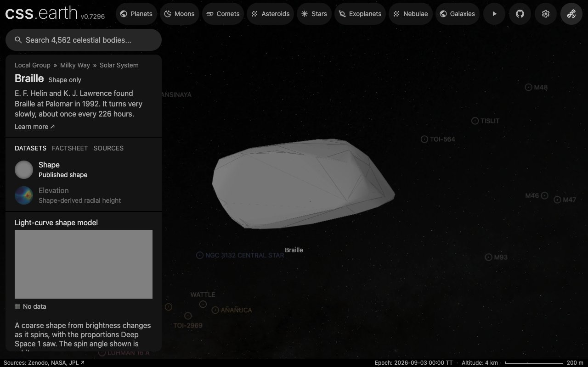

# (9969) Braille

Deep Space 1 visited Braille in 1999.

Shape-only views use the shared neutral gray (#808080 sRGB). This is a display convention, not a measurement of surface color or albedo; gaps within photographic and scientific datasets retain the missing-data grid.

## Sources

| Input | Selected source |
| --- | --- |
| Shape and spin | [Ďurech & Hanuš (2026), model 1 of (9969) Braille](https://doi.org/10.5281/zenodo.22812438) |
| Physical scale | [Oberst et al. (2001), Icarus 153, 16–23](https://doi.org/10.1006/icar.2001.6648) ([record](source/reference/calibration.json)) |

The shape is `shape_models/model_9969_1.tri` from `shape_models.tar.gz` of the [Zenodo deposit](https://doi.org/10.5281/zenodo.22812438) (version 2026-09-17, CC BY 4.0) of [Ďurech & Hanuš (2026)](https://arxiv.org/abs/2610.06082). It is a convex mesh fitted to sparse brightness measurements from sky surveys (Catalina, Mt. Lemmon, Pan-STARRS, ZTF, USNO, ATLAS, ASAS-SN, TESS and Gaia). The original 574 vertices and 1144 triangular faces are the source input. Its large-scale shape is inferred from how the asteroid's total brightness changes as it spins; concavities, craters, surface texture and the current rotation phase are not resolved.

The deposit's spin table gives the J2000 ecliptic pole λ = 315.8°, β = -15.7° and the sidereal period 227.854386 h. The table also lists solution 2 with pole λ = 10.9°, β = -75.8° and the same period. Survey photometry does not tell the two poles apart. Solution 1 is selected because its mesh has the proportions Deep Space 1 and ground-based photometry gave (2.1 × 1 × 1 km, Oberst et al. 2001). No unique-pole claim.

Adopted diameter: **1.19 ± 0.04 km**, meaning volume-equivalent diameter of this mesh with its three extents fitted to the published 2.1 × 1 × 1 km, from [Oberst et al. (2001), Icarus 153, 16–23](https://doi.org/10.1006/icar.2001.6648). The reference-sphere radius is 0.595 km. The mesh's longest extent across the spin axis, the extent at right angles to it and the extent along the spin axis are 2.1533, 1.1070, 1.0620 source units. One scale fitted to 2.1, 1, 1 km by least squares is 0.9572 km per unit; each extent alone gives 0.975, 0.903, 0.942 km per unit, and half that range is the quoted uncertainty. The published dimensions carry no error bars.

[Model fields, mesh measurements and comparison](source/reference/survey-model.json).

## Evidence

Checked 2026-10-06 against the deposit's files.

- Mesh: positive signed volume (1.000000023 source units cubed), every edge used once in each direction, Euler characteristic 2.
- Proportions about the spin axis: solution 1 has 2.028 × 1.042 × 1, solution 2 has 2.317 × 1.423 × 1; Oberst et al. (2001) give 2.1 × 1 × 1 km from two Deep Space 1 images and ground-based photometry. Solution 1 is shown.
- Period: the model's sidereal 227.854386 h against the published synodic estimate of 226.4 ± 1.3 h.
- Size: at the adopted scale the mesh measures 2.07 × 1.06 × 1.02 km.
- Display shape: the fewest faces the error allowance permits, 244 of at most 800, from the source's 1144. The farthest sampled point of the source lies 9.3 m from it, inside the 11.9 m allowance (2% of the radius).
- Browser: the default view below, in headless Chrome 1280 × 800 from the local site after the bake, with every image loaded and no page error.

## Known problems

- Two pole solutions fit the survey photometry equally; the choice between them rests on the proportions alone, and the pole is not independently measured.
- A period this long is in the range where the paper finds larger fit residuals and suspects tumbling for many bodies; the model assumes rotation about one fixed axis.
- The published dimensions are a coarse estimate without error bars; the scale fitted to them inherits that.
- Deep Space 1 images and integrated spectra exist, but no registered global surface mosaic is qualified for this shape. Integrated spectra are not surface maps.
- No registered surface imagery exists for this shape; it shows the shared neutral gray. Convex inversion leaves concavities and fine relief unresolved.
- Elevation is false color for model radius minus a reference sphere, not gravitational height or independent terrain.
- The displayed rotation phase is arbitrary and not propagated from the model epoch. Orbit context is fixed at 2026-09-03 TT.

[Investigation ledger](investigations.json) · [Inputs](source/manifest.json) · [Preparation](source/preparation) · [Delivered files](inventory.json) · [Credits](NOTICE.md)

## Methods and source notes

Physical scale

The source's signed tetrahedral volume integral gives a volume-equivalent diameter of 1.2407009913 source units. The preparation conversion is:

`metersPerUnit = D_km × 1000 / (2 × cbrt(3 × V_source / (4 × pi)))`

For this input, `metersPerUnit = 959.135205293847`. The raw mesh coordinates and connectivity are unchanged.

Orientation and time

Converted with obliquity 23.439291111°, the equatorial pole is α = 323.64°, δ = -31.01°. Model longitude zero is an inversion convention, not an observed landmark. JPL Horizons command "9969;" supplies the osculating elements and vector fixtures at 2026-09-03 TT; this is a fixed-date context, not a real-time trajectory or surface attitude.

