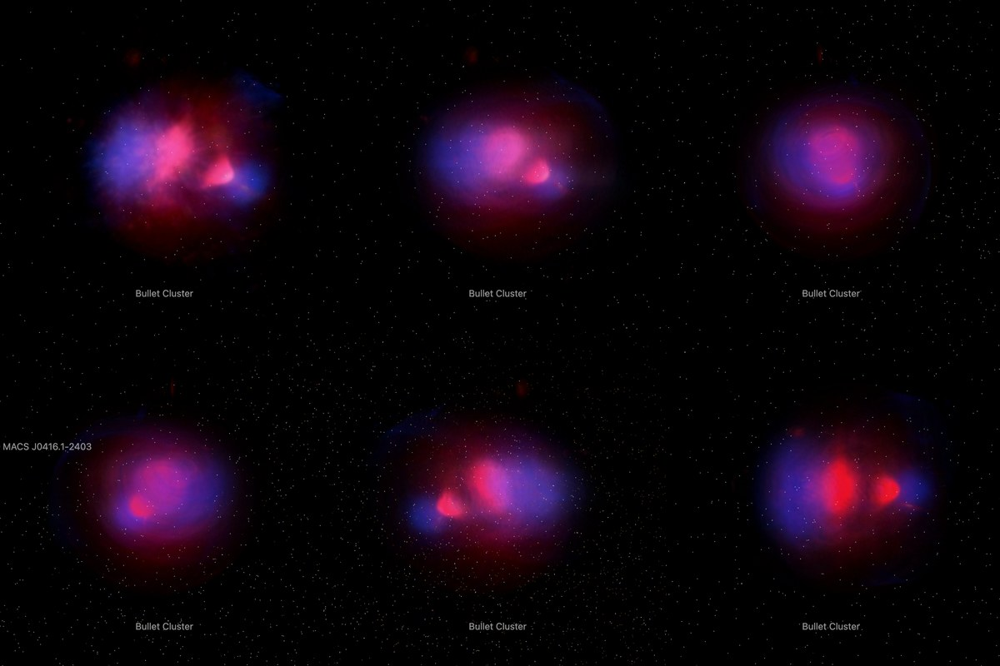

# Bullet Cluster picture

The 2006 composite of the Bullet Cluster, in its three layers. The visible-light picture, with its stars removed, stands
at the cluster's place and distance as one flat image facing the Sun. The hot gas (pink) and the mass (blue) are each spread along the sight line
through a body turned about a published line. **No depth is measured**: the bodies are a symmetry the papers assume, drawn
from the pictures themselves.

## Sources

| Selected source | Input and meaning |
| --- | --- |
| [Chandra X-ray Center, 1E 0657-56 (2006)](https://chandra.harvard.edu/photo/2006/1e0657/more.html) | [Record](../../sources/chandra-2006-1e0657-layers.json). The composite in layers on one frame of 3000 × 2168 px: visible light alone (`1e0657_opt.tif`, from which the bank's photograph is made), visible light with the X-ray gas (`1e0657_xray_opt.tif`) and visible light with the lensing mass map (`1e0657_opt_lens.tif`). Restored from their origin; not tracked. No copyright is asserted on Chandra content and credit is requested; credit: X-ray: NASA/CXC/CfA/M.Markevitch et al. Optical: NASA/STScI; Magellan/U.Arizona/D.Clowe et al. Lensing Map: NASA/STScI; ESO WFI; Magellan/U.Arizona/D.Clowe et al. Display pictures, not calibrated maps. |
| [ESA/Hubble opo0639a](https://esahubble.org/images/opo0639a/) | [Record](../../sources/esahubble-opo0639a.json). The same composite, all three layers together, on the same frame (`source/source.jpg`, [CC BY 4.0](https://esahubble.org/copyright/)). The frame's place on the sky was measured on it, the layers are checked against it, and it is the dataset's preview. |
| [Clowe et al. (2006)](https://arxiv.org/abs/astro-ph/0608407) | [Record](../../sources/publication-clowe-2006-bullet-cluster-dark-matter.json). The places of the two gas clouds (Table 2) and of the two mass peaks (Sect. III): the two lines the bodies are turned about. |
| [Markevitch et al. (2002)](https://arxiv.org/abs/astro-ph/0110468), [Springel & Farrar (2007)](https://arxiv.org/abs/astro-ph/0703232) | [Record](../../sources/publication-markevitch-2002-bullet-cluster-bow-shock.json), [record](../../sources/publication-springel-farrar-2007-bullet-cluster-speed.json). The symmetry: the gas about the bullet is fitted as round about the line it moves along, the cones of its bow shock and cold front are round about that line, and the mass is fitted with two round halos. |
| [Barrena et al. (2002)](https://arxiv.org/abs/astro-ph/0202323), [Lage & Farrar (2014)](https://arxiv.org/abs/1312.0959) | [Record](../../sources/publication-barrena-2002-bullet-cluster-dynamics.json), [record](../../sources/publication-lage-farrar-2014-bullet-cluster-simulation.json). The tilt: the collision line is 5 to 15° from the plane of the sky (the subcluster's galaxies recede at 616 km/s); a simulation fitted to the maps gives about 10°, the subcluster receding. The recipe uses 10°. |
| [MCXC-II, Sadibekova et al. (2024)](https://cdsarc.cds.unistra.fr/viz-bin/cat/J/A+A/688/A187) | [Record](../../sources/mcxc-ii-2024.json). Row MCXC J0658.5-5556: position 104.6296°, -55.9469° and redshift 0.2965, from [2004A&A...425..367B](https://ui.adsabs.harvard.edu/abs/2004A&A...425..367B). |
| [Planck Collaboration (2020)](https://arxiv.org/abs/1807.06209) | [Record](../../sources/planck-2018-cosmology.json). The redshift's comoving distance in the Planck 2018 cosmology, 1,219 Mpc (Astropy 8.0.1, `Planck18`): the distance the picture stands at. |
| [Gaia DR3](https://doi.org/10.1051/0004-6361/202243940) | [Record](../../sources/gaia-2023-dr3.json). The 172 sources in the frame (CDS `I/355/gaiadr3`, a cone query on the picture's centre), used only to measure where the picture lies on the sky. |

## The layers

`packages/bake/authoring/bullet-cluster/layers.mts` writes `source/gas.png` and `source/mass.png` from the publisher's three files.

- **How the publisher added them:** measured on ESA's composite against the visible-light layer. A screen (per channel,
  one minus the product of what each layer leaves dark) fits to 3.8, 2.8 and 3.6 of 255 in red, green and blue; adding
  fits to 32.1, 20.5 and 32.2. So a layer alone is `1 - (1 - layer over visible) / (1 - visible)`.
- **Check:** the visible-light layer and the two lifted layers, screened back together, differ from ESA's composite (a
  JPEG) by 2.7 of 255 on average; 95% of values are within 8.
- **Bright places:** where the visible-light layer is brighter than 140 of 255 the division has nothing to work with:
  243,343 of 6,504,000 pixels (3.7%). They take the mean of the valid pixels around them, over 3, 8, 20 or 50 px, the
  first width at which enough are in reach. So the gas and mass pictures hold no stars or galaxies.
- **Background:** away from the cluster nine pixels in ten of either layer are at 2 of 255 or under. Light under 4 is taken
  as none.

## The photograph

- **Registration:** measured on ESA's composite, not taken from the page. Starting from the file's embedded tags, 127 of
  the 172 Gaia DR3 sources in the frame have a peak at their place; a least-squares fit of centre, scale and rotation to
  them leaves 0.16″ rms (worst 0.31″). It gives 0.1489″ per pixel, north 0.02° left of vertical, centre 104.617027°,
  -55.944059°, a field of 7.45 × 5.38 arcmin. Gaia positions are at epoch 2016 and no proper motion is applied.
- **Plane:** the picture's own tangent plane through the cluster's place, so it faces the Sun. This is where a sky picture
  lies, not a measured orientation of the cluster.
- **Size:** 2.64 × 1.91 Mpc at the cluster's comoving distance.
- **Stars:** removed with NOX (`node labs/nebula/run.mts remove-stars src/objects/bullet-cluster-layers --from=1e0657_opt.tif --coarse=4`),
  which writes `source/starless.jpg`. NOX takes compact light whatever it is: of the 4,188 sources that stand 30 of 255
  over their surroundings it took more than half the contrast of 3,996 (95%), the cluster's galaxies with the Milky Way's
  stars. The second pass, over a copy a quarter of the size, replaced 10.74% of the picture, the saturated stars and
  their glare. What is left is the widest galaxies' faint light: 6.2% of the picture is above the sky floor.
- **Sky:** light below 8 of 255 is taken as sky and left transparent. The outer 4% of the frame fades out.

## The gas and the mass

`geometry.collision` in the recipe; the bake is `packages/bake/src/image-layers/collision.ts`.

- **Lines:** the gas's runs from the main cluster's cloud to the subcluster's (position angle 274.5°, 75.8″ apart); the
  mass's from the main peak to the subcluster's (274.3°, 134″ apart). Each is tipped 10° from the plane of the sky about
  its main end, which lies on the photograph's plane; the subcluster's end is the farther.
- **Body:** at each station along its line, the two sides' mean light by distance from the line is taken apart ring by
  ring from the outside in, in steps of 1.74″. Where a picture fades out at the frame, that side is left out. That gives how much the body emits at each distance from the line. Each
  pixel then keeps its own light; the body only says where along the sight line it lies.
- **Point sources:** 7 compact sources in the gas picture, narrower than 3″, were taken down to the gas around them.
  They are active galaxies and stars, not gas, and a body of revolution would turn each into a ring.
- **How well the symmetry holds:** for the gas, 19.2% of the light differs between the two sides of its line, and 0.30% of
  it asked for less than no gas and was set to none. The gas picture's own most symmetric line, found by a scan of ±14°
  and ±36″, is 2° and 2.4″ from the published one. For the mass, 43.5% differs between the sides and 1.05% was set to
  none: the mass map is far less round about its line than the gas, and its depth is the weaker of the two.
- **Reach:** 164″ (gas) and 162″ (mass) either side of the plane along the sight line, 968 kpc at the comoving distance.
- **Leaves:** one grid of 256 × 185 cells. Face-on, 32 slabs parallel to the photograph; from the sides, 37 and 40
  curtains of 185 × 188 and 256 × 188 texels. A browser lays each slab over those behind it, where light of two colors
  needs a screen, so the slabs are built from the back: each texel holds its own light and what it hides.
- **Bytes:** 110 images, 0.97 MB: the photograph 0.07 MB (WebP quality 70), slabs 0.28 MB, curtains 0.61 MB.

## Evidence

The Bullet Cluster page in headless Chromium at 1440 × 900, device pixel ratio 2, on this branch on 2026-10-05: the default
arrival and the camera turned in steps toward the side.

`packages/bake/src/image-layers/collision.test.ts` builds a picture from balls of even gas on a line and checks that the
body found from it is those balls, that a tipped line puts the far ball behind the plane, and that the slabs seen from
the Sun are the pictures screened, to within 3 of 255.

## Measured, chosen and inferred

| Value | Kind |
| --- | --- |
| Position 104.6296°, -55.9469° and redshift 0.2965 | Measured: MCXC-II row MCXC J0658.5-5556 |
| Distance 1,219 Mpc | Derived: the redshift's comoving distance in the Planck 2018 cosmology |
| Field, scale and rotation of the picture | Measured: fitted to Gaia DR3 positions |
| Places of the gas clouds and mass peaks | Published: Clowe et al. (2006) |
| Screen blend of the layers; the lifted gas and mass pictures | Measured on the publisher's files |
| Round about the collision line | Assumed, as the X-ray and lensing papers assume it; how far the pictures depart from it is measured above |
| Tilt of 10° | Published range of 5 to 15°; 10° is one fitted simulation's value |
| Depth of any pixel | Inferred from the symmetry. Nothing measures it |
| Sky floor, edge fade, grid and slab counts, framing radius | Presentation |

## Known problems

- The depth is a symmetry, not a measurement. A body of revolution draws every patch as far in front of its line as
  behind it; one picture cannot tell the two apart.
- The pictures are the publisher's display renderings: brightness is not calibrated X-ray emission or mass, and the pink
  is clipped in the two brightest places.
- The cluster's galaxies are gone with the stars: NOX cannot tell one from the other in this picture. What is left of
  the visible light stays on one plane.
- A slab can only hide what is behind it, so where bright gas and mass share a sight line the slabs in front carry some
  of the light of those behind. From the Sun the sum is right; seen from an angle that light is a little out of place.
- From the sides the curtains are separate layers and each hides what is behind it: where pink and blue overlap, the
  side views are dimmer than a true sum of light would be.
- The page opens with ecliptic north up, as every page does, so the picture arrives turned from the publisher's orientation.
- The size is a comoving size. The cluster is bound and does not expand with the universe; its proper size at its redshift is
  smaller by 1 + z.
