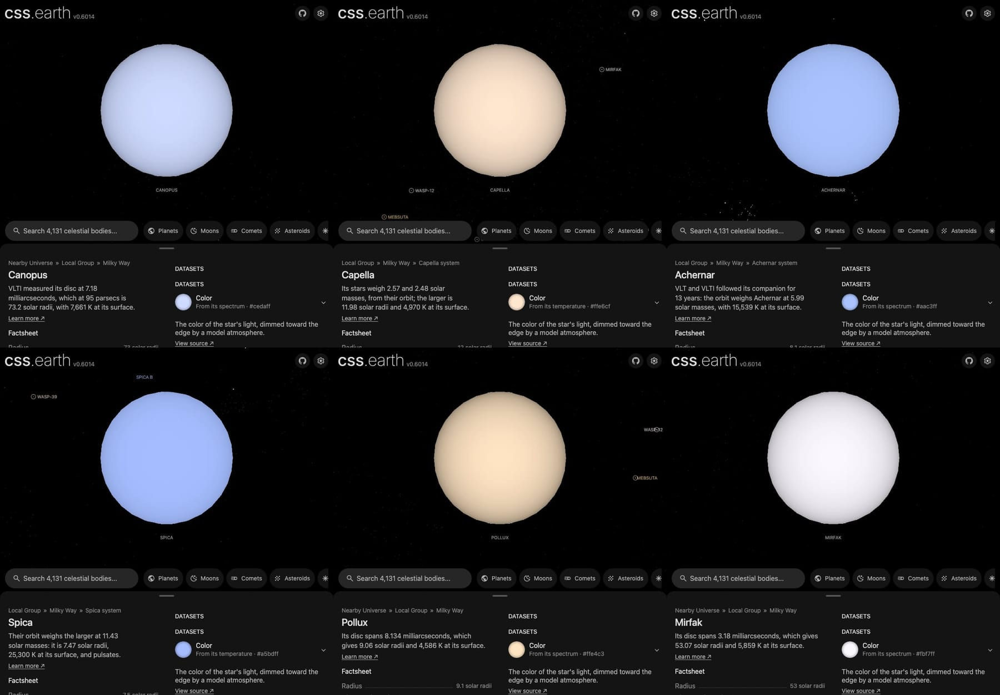

# Canopus

## Sources

VLTI measured its disc at 7.18 milliarcseconds, which at 95 parsecs is 73.2 solar radii, with 7,661 K at its surface. It is also HD 45348, HR 2326, HIP 30438. The introduction is generated from Domiciano de Souza et al. (2021), A&A 654, A19's published values; the sections below are the data's own.

**Star.** Placement: Anderson & Francis (2012), Astronomy Letters 38, 331 (XHIP), Hipparcos astrometry, VizieR V/137D/XHIP row HIP = 30438 (SIMBAD HD 45348); placed by that row, not by a Gaia source, distance 94.80 pc from Domiciano de Souza et al. (2021), A&A 654, A19, Sect. 1: d = 94.8 +/- 5.0 pc, the Hipparcos parallax 10.55 +/- 0.56 mas (van Leeuwen 2007) the paper adopts. Radius 73.2 +/- 3.9 solar radii from Domiciano de Souza et al. (2021), A&A 654, A19, Table 3 note and Sect. 5.3: R = 73.2 +/- 3.9 solar radii from the power-law limb-darkened PIONIER diameter 7.184 +/- 0.0017 +/- 0.029 mas and the Hipparcos distance (https://doi.org/10.1051/0004-6361/202140478). Mass 9.81 +/- 1.83 solar masses from Domiciano de Souza et al. (2021), A&A 654, A19, Table 4: (M/Msun)_Ross = 9.81 +/- 1.83, from the SED fit's log g (1.70 +/- 0.05) and the radius (https://doi.org/10.1051/0004-6361/202140478). Temperature 7,661 K from Domiciano de Souza et al. (2021), A&A 654, A19, Sect. 5.3: Teff 7661 +/- 81 K from the bolometric flux of the SED fit and the PIONIER diameter. log g 1.7 from the mass and radius.

**Color.** Pulkovo spectrophotometric catalogue, table 5 (320-1080 nm, 2.5 nm steps, 10 nm resolution, absolute flux in W m^-2 m^-1): Alekseeva et al. (1996, 1997), Baltic Astronomy 5, 603 and 6, 481; VizieR III/201. Canopus is HR 2326., cross-checked against Kiehling (1987), spectrophotometry of 60 bright F, G, K and M stars, 320-880 nm in 1 nm steps as normalised magnitudes: Kiehling (1987), A&AS 69, 465; VizieR III/124. * alf Car is HR 2326. (5 levels apart at most, the threshold is 12), through the CIE 1931 2° observer: #cedaff. Routes tried in order: stis-ngsl: HD 45348 is not in the library; gaia-xp: the star is placed by a catalogue row, so no Gaia DR3 source is read for it; kharitonov: HR 2326 is not in the catalogue; burnashev: found, not needed after the color and its cross-check; pulkovo: used.

**Limb.** The disc is dimmed toward the limb by the quadratic law Claret & Bloemen (2011), A&A 529, A75 compute from ATLAS model atmospheres for the Johnson V band at 7,661 K and log g 1.7 (u1 0.402, u2 0.269): a model, because no fit of this star's limb is used.

## Evidence

Generated 2026-10-03 by [new-object-cli.mts](../../../packages/telescope-cli/src/new-object/new-object-cli.mts) from VizieR V/137D/XHIP and the archives named above; each choice was read with the dataset's own reader.

- The color's cross-check differs by 5 levels at most in any channel (threshold 12); [object-package-consistency.test.mts](../../../src/objects/object-package-consistency.test.mts) recomputes it after preparation.

## Known problems

- **Assumptions of the frame.** The axis's position angle and the rotation phase are conventions.
- **Model limb.** The limb darkening is a model atmosphere at the catalogued temperature and gravity, not a measurement of this star.

[Investigation ledger](investigations.json) · [Inputs](source/manifest.json) · [Preparation](source/preparation) · [Delivered files](inventory.json) · [Credits](NOTICE.md)
