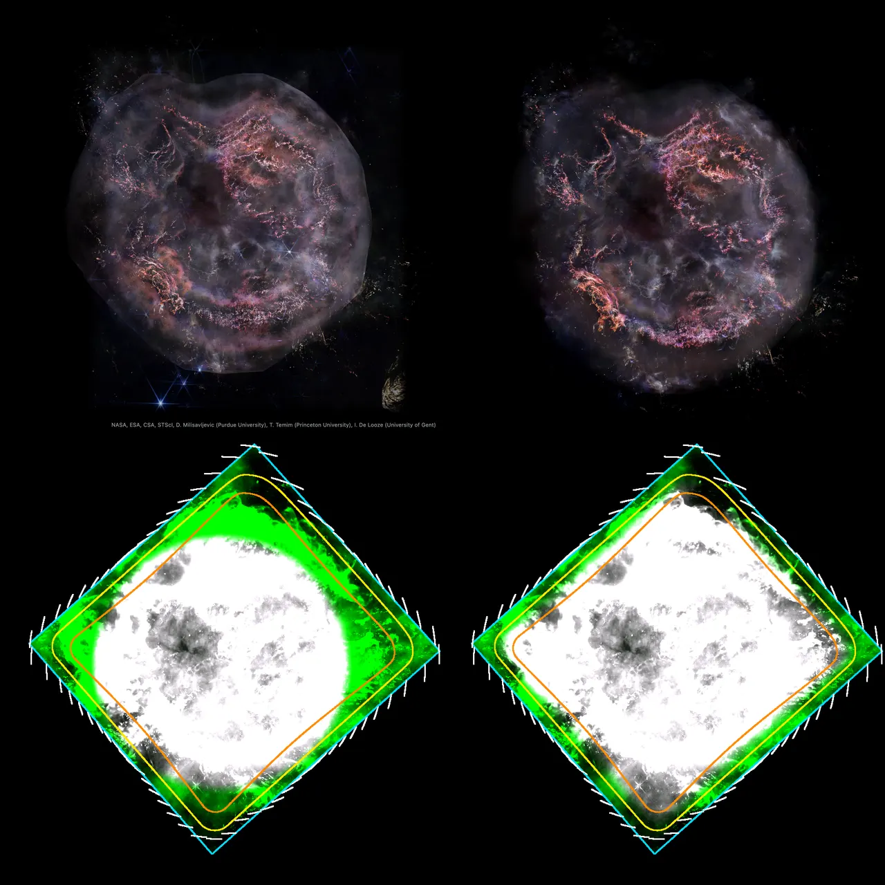

# Cassiopeia A

ESA/Webb's NIRCam picture of the supernova remnant Cassiopeia A, drawn as the shell it is. The remnant's ejecta expand freely, so their speed along the sight line is how far in front of the picture or behind it they lie. **The ejecta's depths are the Doppler speeds of the [Ar II] line from DeLaney et al. (2010), as the Chandra X-ray Center publishes that paper's model. The smooth light has no measured depth: it lies on the forward shock's sphere. How the model's files lie on the sky is not published: it is measured here.**

## Sources

| Selected source | Input and meaning |
| --- | --- |
| [ESA/Webb weic2330a](https://esawebb.org/images/weic2330a/) | [Record](../../sources/esawebb-weic2330a.json). Cas A (NIRCam image): 1.62, 3.56 and 4.44 µm as blue, green and red; 11694 × 13392 px over 6.09 × 6.97 arcmin, released 11 December 2023. The bank draws the publication JPEG, 3493 × 4000 px, with its stars removed (`source/starless.jpg`, restored from the source cache). Credit: NASA, ESA, CSA, STScI, D. Milisavljevic (Purdue University), T. Temim (Princeton University), I. De Looze (University of Gent). A display composite, not calibrated photometry. |
| [DeLaney et al. (2010)](https://arxiv.org/abs/1011.3858) | [Record](../../sources/publication-delaney-2010-cassiopeia-a-3d.json). A Gaussian fitted to the [Ar II] 6.99 µm line at every place of a Spitzer IRS map. Sect. IV.1: the [Ar II] ejecta lie on one spherical shell in free expansion, so a Doppler speed is a distance along the sight line: 0.022 ± 0.002″ per km/s. The shell's centre recedes at 859 ± 100 km/s and its near side approaches at 4077 ± 200 km/s. The forward shock is a thin ring of X-ray filaments about 300″ across (Sect. I, from Gotthelf et al. 2001), at a radius of 153″ (Sect. IV.1). |
| [Chandra X-ray Center, Cassiopeia A in 3D](https://chandra.harvard.edu/resources/illustrations/3d_files.html) | [Record](../../sources/chandra-cassiopeia-a-3d-model.json). The paper's model as ASCII VTK files, credit NASA/CXC/SAO. Its [Ar II] surface gives `source/ejecta-speeds.dat` (built by the generator, restored from the source cache): 10,632 places with their speeds, 6,078 approaching and 4,554 receding. |
| [Thorstensen, Fesen & van den Bergh (2001)](https://arxiv.org/abs/astro-ph/0104188) | [Record](../../sources/publication-thorstensen-2001-cassiopeia-a-expansion-centre.json). The expansion centre, 23h 23m 27.77s, +58° 48′ 49.4″ (ICRS), which the remnant is placed at, and the 3.4 kpc the paper works at. |

## The picture

- **Registration:** the file's embedded sky tags: 0.1045″ per pixel of the file drawn, north 27.16° right of vertical.
- **Stars:** the picture's stars are not the remnant's. [NOX](../../../labs/nebula/docs/star-removal.md) removes them before the bake (`node labs/nebula/run.mts remove-stars src/objects/cassiopeia-a-layers --star-red-over-blue=0.8`). NOX also takes compact bright gas, and this remnant's ejecta are compact bright knots. In this picture a star is blue and the ejecta red, so the picture keeps its own pixels where the light NOX took is redder than 0.8 of its blue ([star-color.ts](../../../labs/nebula/packages/reconstruction/src/star-removal/star-color.ts)). The ratio is a presentation choice: the light NOX took, by its patches' red over blue, peaks between 0.25 and 0.5, is lowest near 0.8 and tails off above 1. NOX leaves the brightest stars with their six diffraction spikes, so `--spike-lines=4` then takes those out ([spikes.ts](../../../labs/nebula/packages/reconstruction/src/star-removal/spikes.ts)): a star is a saturated place of the original picture whose light runs out along the spikes' lines, measured on the picture at 59°, 89°, 119° and 179°; each spike loses the running median of its own height above its flanks, so a filament it crosses keeps its light, and the core and glow lose the light that stands round them alike in every direction. It found 70 such stars; of the 29 whose spikes stood more than 8 levels above the light between them, none does after. A presentation choice; every constant is in the file.
- **Sky:** the picture's sky is 13 of 255 levels in its brightest channel, the median of the emptiest 5% of its 64-px tiles, and 16 at their 90th percentile; the recipe's floor, 0.063, takes it and its noise away, so empty sky carries no light. Inside 150″ of the expansion centre 0.04% of the pixels are that dark, single pixels: the remnant's dark lanes stand at 29 levels and more (its 1st percentile inside 120″), so they keep their light.
- **The ejecta's depths:** [ejecta-speeds.mts](../../../packages/bake/authoring/cassiopeia-a/ejecta-speeds.mts) reads the model's [Ar II] surface and writes each cell of one model unit as a place from the expansion centre (arcsec east and north) and a speed relative to the shell's centre. A depth is that speed times 0.022″ per km/s: up to 128″ in front of the picture's plane and 126″ behind it.
- **The model's frame, measured here:** nothing published states the files' axes or unit. `ejecta-speeds.mts --frame` lays the [Ar II] surface on this picture each way round: east along +x and north along +z puts the most of the picture's light under it, at 3.60″ a unit; with the origin free, 3.62″ and an origin 2″ south of the expansion centre. Two checks against the paper's printed numbers: the sphere nearest the surface is 30.47 units and the paper's shell 108.6″, which is 3.56″ a unit; the neutron-star marker stands 5.47 units in front of the origin and the paper puts it at zero velocity, 18.9″ in front of the shell's centre, which is 3.45″ a unit. The table uses 3.6″.
- **The ejecta:** where the model has ejecta within about 9″, the picture's fine detail lies on two surfaces of its own: one in front of the plane, at the depth of the approaching ejecta there, and one behind it, at the depth of the receding ones. Each takes the share of the detail that the measurements on its side hold ([shape.ts](../../../packages/bake/src/image-layers/shape.ts), [shape-walls.ts](../../../packages/bake/src/image-layers/shape-walls.ts)). The 9″ is a presentation choice: the paper's map resolves 3.7″ and its model is smoothed to about 6″. The fine detail is what stands above the picture blurred over 30 px, 4.6″, also a presentation choice.
- **Beyond the forward shock:** the table's rows past 153″ (the outer optical knots, the jets and 22 sparse [Ar II] cells) name their surface, and the bake keeps them on two surfaces of their own, in front and behind ([shape.ts](../../../packages/bake/src/image-layers/shape.ts), `OUTER_PRESENCE`, `OUTER_DEPTH_REACHES`). The north-east knots stand about 150″ in front of the plane a few arcseconds from [Ar II] ejecta 10″ to 20″ in front; one surface through both was a cliff, and its patches stretched across it. Their share of a place needs one of their rows within about 9″, so a lone knot does not set the depth of detail 18″ from it, and their depth is the mean of their rows within about 13.5″, a presentation value: over 9″ it rose more than 3″ in depth an arcsecond across on 1.9% of the places they hold, over 13.5″ on 0.2%.
- **The smooth light:** no spectrum places it. It is the coarse scales of the picture's starlet (à trous) decomposition, to about 32 px; where the measurements place ejecta, the pixels standing above those scales are the filaments', and the coarse scales are taken again without them, so the glow under a filament is estimated from the smooth light around it and the filaments lie on the measured surfaces alone ([shape.ts](../../../packages/bake/src/image-layers/shape.ts) `filamentGlow`). It lies on the forward shock, a sphere of 153″ about the expansion centre. One picture cannot tell the sphere's two halves apart, and the [Ring Nebula's](../m57-layers/README.md) light lies half on each wall of its shell. Here two copies of the smoke came apart from the page's camera, which opens 75 light-years from a sphere 16 across, and the picture smeared. So the halves share only the light's broad part, the picture blurred over 37″, half each; the half behind the plane holds the rest, drawn once. A presentation choice.
- **What stays on the plane:** the fine detail no measurement is near. The plane faces the Sun through the centre of the paper's [Ar II] shell.
- **Drawing:** the surfaces are meshes of flat patches, each a rectangle of the picture on a plane through the surface there ([shape-patches.ts](../../../packages/bake/src/image-layers/shape-patches.ts)). Neighbouring patches meet along their edges and share the light near them. The sphere's patches are drawn at half the picture's resolution: they hold blurred light alone. The stack paints the plane, the sphere's far half, its near half, then the ejecta behind the plane and those in front, and each surface carries the light it hides of those under it, so from the Sun they are the photograph. The mesh is the same from every side, so the bank has one stack; the other image-layer banks of nebulae draw their walls as slices, which show a fine feature as copies side by side when turned.
- **Size:** the remnant is drawn 1,996 px across, in the forward shock's outline: 153″, 5.04 pc at 3,400 pc.
- **Edge of the picture:** the picture is drawn to a boundary about the expansion centre (`geometry.fadeAt: "outline"`, [`fade-outline.ts`](../../../packages/bake/src/image-layers/fade-outline.ts)): in each direction the measured rim pushed out by 1.25, or as far as the outer knots and jets reach, rounded over 10° either side; where the Webb frame is nearer, the frame 12″ inside its border, its straight sides kept and its corners cut by 20″ arcs; faded over its inner 20″. The light echo in the frame's lower-right corner, interstellar dust far behind the remnant, lies outside it. To the east and north-east (the top left of the Earth view) the cloud runs off the frame: the photo holds nothing past it, so there the picture ends 12″ inside the frame's straight edge (2026-10-08: of the photo's light above the sky between 40° and 95°, 92% is drawn, 66% before the frame left the angular rounding).
- **Far view:** from afar, while another body is selected, the bank is one image on a plane fixed in its frame, drawn as the Milky Way's backing is. [`prepare-galaxy-backing.mts`](../../../packages/bake/cli/prepare-galaxy-backing.mts) reads the [backing recipe](source/backing/recipe.json) and composites the bank's flat source-facing slices as seen from the Sun, the picture its camera-facing billboard drew, onto the slices' own plane through the frame's centre. The plane therefore lies where the layered model's picture plane does, and turns and foreshortens as the model does. After a rebake of the bank, run `node packages/bake/cli/prepare-galaxy-backing.mts src/objects/cassiopeia-a-layers backing` again. From afar Cassiopeia A is drawn by one of its banks at a time: the bank of its selected dataset, or this bank while none is selected. The others draw nothing there, so two far images of the same nebula never overlap.

## Evidence

The page as it opens, in each Webb dataset: left, `main`'s banks (a circle, the stars and their spikes kept); right, this rebake (the rounded boundary, the outer knots beyond the shock, the stars removed with their spikes). The same Earth view and crop for all four, the site in headless Chromium at 1440 × 900, device pixel ratio 2, on 2026-10-09. No page errors. Refreshed turned and nearest views of this version follow.

The bake's tests ([shape-speed.test.ts](../../../packages/bake/src/image-layers/shape-speed.test.ts), [shape-patches.test.ts](../../../packages/bake/src/image-layers/shape-patches.test.ts)) put a knot measured approaching at 12 km/s 6″ in front of the plane and one receding at 16 km/s 8″ behind it under a law of 2 km/s per arcsecond, keep an unmeasured knot on the plane, find the glow on two walls as far in front of the plane as behind it, the far one holding no less than the near one, composite the leaves in the order the stack paints them against the flat bake of the same picture, and check that two patches that share a pixel stand at the same depth there. The Ring Nebula's and NGC 2392's banks, baked again with this code, are the same as published, file for file.

## Known problems

- The far picture holds only the flat slices' light, and this bank's light is almost all on its walls, which are left out, as they were from the billboard it replaced: from afar the plane draws almost nothing. Edge-on it vanishes.
- The smooth light's depth is not measured. A sphere is the remnant's published outline, not where each wisp is: the smoke lies between the reverse shock and the forward shock, and the glow of the Bright Ring belongs with its ejecta. Its structure is all on the far half; the near half holds a featureless glow.
- The sphere's centre along the sight line is not measured; it is drawn about the picture's plane.
- Seen from the side, the band where the two halves meet is dim and stretched: it is the picture's own faint edge.
- The ejecta's depths are coarse. The speeds are line centres from spectra that resolve 2,500 to 3,000 km/s, mapped at 3.7″ and smoothed in the model to about 6″; the picture resolves 0.1″. A knot lies with everything within about 9″ of it, at their mean depth.
- The model's unit on the sky is measured here, not published. The three measurements span 3.45″ to 3.62″; the paper's own scale has an error of 9%.
- Only the [Ar II] ejecta have a measured depth: the Bright Ring. The interior and the outer knots do not.
- Where ejecta approach and recede on one sight line, the detail is shared between the two surfaces by the measurements' weight, not told apart.
- Measured patches that rise more than 3″ in depth an arcsecond across, at least 8 px wide (2026-10-08, the checkout's bake against this one): near the rim, 81 of 268 before, up to 41.8, and 3 of 191 after, up to 4.1; beyond it 13 of 216, up to 5.0, and 2 of 179, up to 3.9. Inside, where no outer row is within three reaches and the depths are as before, 108 and 68, up to 22.5 and 13.9: the [Ar II] surface's own steep places, in a patch layout the outer surfaces' leaving moved. The sphere's patches near its outline are steep by its shape, 117 of 449, as before.
- The surfaces are painted in one order from every side. From behind, the half of the sphere nearest the camera is painted under the other, and the ejecta over both.
- Turned 45° and more, a patch seen nearly edge on stretches its detail into short streaks, and the sphere's outline shows its patches' corners.
- NOX predicts the light under a star; it does not measure it. The brightest stars stay, with their spikes, and some leave a dim six-armed ghost with a dark middle. Ejecta bluer than the star limit, the violet ones, can go with the stars.
- The north-east jet, beyond the forward shock's outline, is not drawn.
- Colors are the publisher's display composite, not a measurement. All three channels take the [Ar II] depths: the filters hold no single line.
- The bank is 4.9 MB of images and 2.4 MB of leaf records (0.3 MB compressed), in 1,396 patches. Headless Chrome draws a frame of it in 8.3 ms on an M3 Max; frames in Safari are not measured yet.
