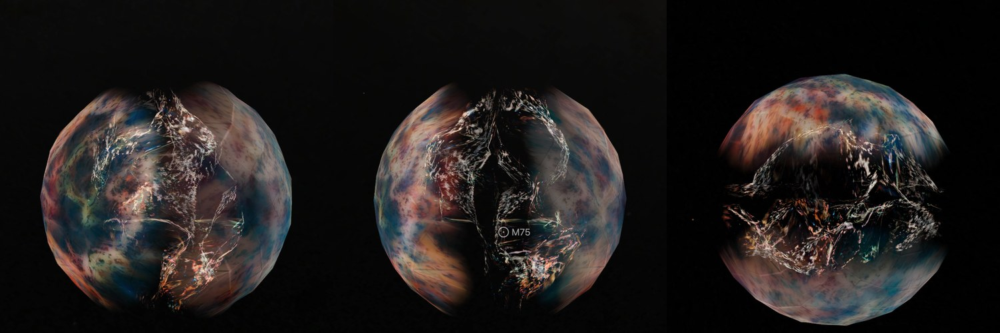
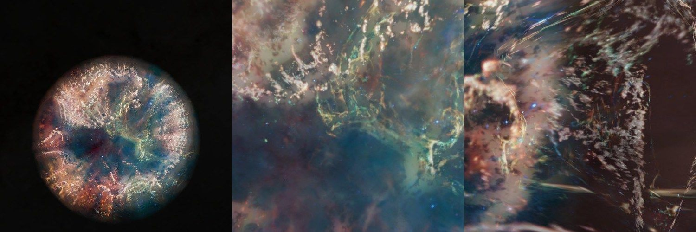

# Cassiopeia A, mid infrared

ESA/Webb's mid-infrared picture of the supernova remnant Cassiopeia A, as a shell. It is the Cassiopeia A page's second dataset, beside [Webb's near-infrared picture](../cassiopeia-a-layers/README.md), and it was written and baked by `telescope new-object` from one spec entry ([guide](../../../packages/telescope-cli/README.md)). **The depths are the near-infrared dataset's: the forward shock's sphere for the smooth light, and the ejecta where Spitzer's [Ar II] spectra measured them. The Green Monster, which two papers place in front of the remnant, is not laid there: no paper gives its outline as numbers.**

## Sources

| Selected source | Input and meaning |
| --- | --- |
| [ESA/Webb weic2311a](https://esawebb.org/images/weic2311a/) | [Record](../../sources/esawebb-weic2311a.json). Cassiopeia A (MIRI Image): MIRI at 5.6, 7.7, 10, 11, 12, 18, 21 and 25 µm by the page's table (its text gives 11.3, 12.8 and 25.5); 4008 × 4009 px over 7.41 × 7.41 arcmin (`source/source.jpg`, the publisher's JPEG, restored from its origin). Credit: NASA, ESA, CSA, D. Milisavljevic (Purdue University), T. Temim (Princeton University), I. De Looze (UGent), J. DePasquale (STScI). A display composite, not calibrated photometry. |
| [DeLaney et al. (2010)](https://arxiv.org/abs/1011.3858) | [Record](../../sources/publication-delaney-2010-cassiopeia-a-3d.json). Sect. IV.1: the [Ar II] ejecta lie on one shell in free expansion, so a Doppler speed is a distance along the sight line, 0.022″ per km/s; the forward shock is a sphere of 153″. |
| [Chandra X-ray Center, Cassiopeia A in 3D](https://chandra.harvard.edu/resources/illustrations/3d_files.html) | [Record](../../sources/chandra-cassiopeia-a-3d-model.json). The model's [Ar II] surface as places and speeds (`source/ejecta-speeds.dat`, built by [ejecta-speeds.mts](../../../packages/bake/authoring/cassiopeia-a/ejecta-speeds.mts); a copy of the near-infrared bank's, not tracked). |
| [Milisavljevic et al. (2024)](https://arxiv.org/abs/2401.02477) | [Record](../../sources/publication-milisavljevic-2024-cassiopeia-a-jwst-survey.json). The paper of these observations. Table 1 names each filter's sources of strong emission; the 7.7 µm filter holds [Ar II] 6.99 µm, the line the depth model was measured in. |
| [De Looze et al. (2024)](https://arxiv.org/abs/2410.05402) | [Record](../../sources/publication-de-looze-2024-cassiopeia-a-green-monster.json). The Green Monster is circumstellar material on the near side, in front of the remnant. |
| [Vink et al. (2024)](https://arxiv.org/abs/2401.02491) | [Record](../../sources/publication-vink-2024-cassiopeia-a-green-monster-x-rays.json). Every X-ray spectrum of the Green Monster is blueshifted by about 2,300 km/s. |

## The picture

- **Registration:** the file's embedded sky tags, used as they are: 0.1109″ per pixel and north 0.5° left of vertical. The remnant has no star to set the frame by; the page stands at its expansion centre.
- **What the colors show:** by the release, red is 25.5 µm, orange-red 21, orange 18, yellow 12.8, green 11.3, cyan 10, light blue 7.7 and blue 5.6 µm. By the survey paper's Table 1 every filter holds warm dust, with [Mg V] at 5.6, [Ar II] and PAHs at 7.7, [Ar III] and [S IV] at 10, PAHs at 11.3, [Ne II] and [Ne V] at 12.8, [Fe II] and [S III] at 18, [S III] at 21 and [O IV] at 25.5 µm. The orange curtains at the rim are dust where the blast wave meets gas the star had shed; the pink filaments inside are the star's own material; the green loop across the middle is the Green Monster.
- **The depths:** the near-infrared dataset's, unchanged; [its README](../cassiopeia-a-layers/README.md) has the method. Where the model has [Ar II] ejecta within about 9″, the picture's fine detail lies in front of the picture's plane at the depth of the approaching ejecta there and behind it at the depth of the receding ones. The smooth light lies on the forward shock's sphere of 153″: the halves share its broad part, and the half behind the plane holds the rest.
- **The line the model was measured in is in this picture:** the 7.7 µm filter holds [Ar II] 6.99 µm. The other filters' lines and the dust take the same depths; no other line's speeds are measured here.
- **Stars:** not removed. The picture shows few, and they lie on the shell with the smooth light.
- **Drawing:** the surfaces are meshes of flat patches, as in the near-infrared bank. The face is 1,500 px of the picture's 4,008.
- **Size:** 7.41 × 7.41 arcmin, 7.33 pc wide at 3,400 pc; the forward shock's sphere is 5.04 pc across.
- **Rim:** the published picture is a square mosaic that does not fill its frame: half the frame is empty. Its own light reaches 142.8″ from the expansion centre at its nearest edge, and the picture fades out between 128.5″ and 142.8″, the largest circle that light fills, so no straight edge shows. The generator measures it: the dark border joined to the frame's edge is the empty part.
- **Far view:** from afar, while another body is selected, the bank is one image on a plane fixed in its frame, drawn as the Milky Way's backing is. [`prepare-galaxy-backing.mts`](../../../packages/bake/cli/prepare-galaxy-backing.mts) reads the [backing recipe](source/backing/recipe.json) and composites the bank's flat source-facing slices as seen from the Sun, the picture its camera-facing billboard drew, onto the slices' own plane through the frame's centre. The plane therefore lies where the layered model's picture plane does, and turns and foreshortens as the model does. After a rebake of the bank, run `node packages/bake/cli/prepare-galaxy-backing.mts src/objects/cassiopeia-a-miri-layers backing` again.

## Evidence

The page with this dataset selected, in headless Chromium at 1440 × 900, device pixel ratio 2, on 2026-10-05, with the camera turned. No page errors.

The same dataset as the page opens on it, from the nearest the camera comes, and from there turned.

No bake code changes with this dataset.

## Known problems

- The far picture holds only the flat slices' light, and this bank's light is almost all on its walls, which are left out, as they were from the billboard it replaced: from afar the plane draws almost nothing. Edge-on it vanishes.
- The Green Monster is on the wrong side. X-ray spectra put it in front of the remnant (Vink et al. 2024; De Looze et al. 2024), but no paper gives its outline as numbers, so it is not treated apart: its broad light is shared by the sphere's two halves and the rest of it lies on the half behind the picture's plane.
- The depths are measured in one line, [Ar II]. Dust, which is most of this picture's light, and the other lines are drawn at those depths or on the shock's sphere.
- The rim's circle, 142.8″, is inside the forward shock's 153″: the remnant's outermost 10″ and everything beyond, which the mosaic holds on its other sides, are not drawn.
- Everything the [near-infrared dataset's known problems](../cassiopeia-a-layers/README.md#known-problems) say of the depths and the meshes holds here.
- The picture is 0.11″ a pixel and is drawn at 1,500 px, 0.30″ a pixel.
- Colors are the publisher's display composite, not a measurement.
- The bank is 3.5 MB. Headless Chromium draws it; Safari is not measured yet.
