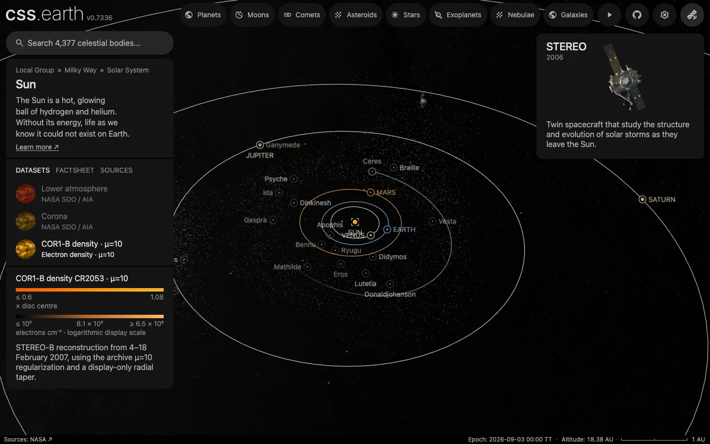

# Asteroids without a map marker

The 13,626 asteroids inside Neptune's orbit that draw no marker of their own, one dot each. They draw while the Sun or a body that orbits it is selected. Three populations come from the catalogue, and the fourth is the asteroids that have a page:

| Population | Dots | Cut |
| --- | --- | --- |
| Main belt, between Mars and Jupiter | 6,049 | absolute magnitude H of 13 or brighter |
| Hildas, in the 3:2 resonance with Jupiter | 2,888 | semi-major axis 3.7 to 4.2 au, H above 13 and up to 16 |
| Jupiter Trojans, ahead of and behind Jupiter on its orbit | 4,553 | H of 14 or brighter |
| Asteroids with a page that are not JPL mission targets | 136 | all |

They are one bank so that they draw as one layer: dots of separate banks add their opacity where they overlap, and each bank is thinned for itself when seen from afar.

## Sources

| Source | Measurement used |
| --- | --- |
| [JPL Small-Body Database](https://ssd.jpl.nasa.gov/tools/sbdb_query.html) | The osculating orbital elements of the three catalogue populations: eccentricity, perihelion distance, inclination, node, argument of perihelion, time of perihelion and the solution's condition code. Heliocentric, ecliptic of J2000. Queried 2026-10-06. |
| [JPL Horizons](https://ssd.jpl.nasa.gov/horizons/) | The position of each asteroid that has a page, as its own package is prepared with it (`properties.worldFrame.originM`). |
| [Minor Planet Center, uncertainty parameter U](https://minorplanetcenter.net/iau/info/UValue.html) | What a condition code means: the drift along the orbit in ten years is under 7,488 arcseconds (2.1°) at code 6. |

[Inputs](source/manifest.json) · [Recipe](source/dots/points.json) · [Query](source/dots/query.json)

## Processing

1. [`paged-asteroid-dot-positions.mts`](../../../site/build/prepare/paged-asteroid-dot-positions.mts) writes the prepared position of every asteroid package that is not a mission target to [`paged-positions.csv.gz`](source/dots/paged-positions.csv.gz). Only mission targets keep a ring and a name on the map; the others are reached through search or the Asteroids list, and each draws its own marker while it is selected or while Asteroids is highlighted.
2. [`positions.mts`](../../../packages/bake/authoring/small-body-dots/positions.mts) asks the database once for each population in `query.json`. It carries each orbit from its perihelion passage to the world's epoch, JD 2461286.5 TT (2026-09-03), as an unperturbed ellipse about the Sun, and turns the result from ecliptic to ICRF axes. It leaves out the 86 catalogue asteroids that have an object package and the 10 whose condition code is above 6 or missing, joins the rows of the paged table, and writes [`positions.csv.gz`](source/dots/positions.csv.gz) in the order of a hash of each name. From far away the app draws only the first rows of a bank; in that order any first part holds every population in proportion.
3. `packages/bake/cli/prepare-body-points.mts` writes the positions as a point bank whose origin is the Sun, in gigametres rounded to 100 km.

The dots are the app's catalogue dots: not clickable and not named.

## Test results

The 86 left-out catalogue asteroids have prepared positions of their own, taken from JPL Horizons. The script reports how far each one's ellipse lands from that position: 0.0003 au at most (Sylvia).

The catalogue dots lie 1.7 to 6.3 au from the Sun. The asteroids with a page reach further: 21 of them, centaurs and distant objects, lie beyond 6.3 au.

## Evidence

A headless capture of this version's Sun page at 18.4 au, 1440 × 900, with no page error. The mission-target asteroids keep a ring and a name and draw no orbit. On 2026-10-06 the pages of 185 asteroids that showed only a light-curve shape were retired ([a light-curve shape alone is not a page](../../../.agents/skills/celestial-skill/references/scientific-faithfulness.md#a-light-curve-shape-alone-is-not-a-page)), and each returned as a dot of its catalogue population, 173 in the main belt and 12 among the Trojans. The bank holds the same 13,626 dots; those 185 moved by 0.0002 au at most, from their page's JPL Horizons position to the catalogue's ellipse, and no other dot moved.

## Known problems

- Only the brighter asteroids of each population are drawn, and the magnitude limits differ: they are display choices that let each population show. The fainter asteroids, the great majority, are left out.
- A Hilda brighter than magnitude 13 comes in with the main belt's query, so the Hilda cut starts there.
- A new asteroid package gets its dot only when both scripts and the bank are run again, and so does an asteroid whose package is removed.
- An asteroid whose page is retired keeps a dot only inside one of the three populations. The 18 light-curve-shape pages outside them (near-Earth and Mars-crossing asteroids, a centaur and fainter main-belt ones) were kept as pages for that reason.
- No color is taken from the database. Every dot is `#9a9a9a`, the one neutral gray the app gives a body without a measured color (`NEUTRAL_CATALOGUE_COLOR`). The 1.5 px dot size and half opacity are display choices.
- The dots do not draw while a moon is selected: a moon's system is the moon and its planet.
- The positions hold for the world's one epoch; the dots do not move.
