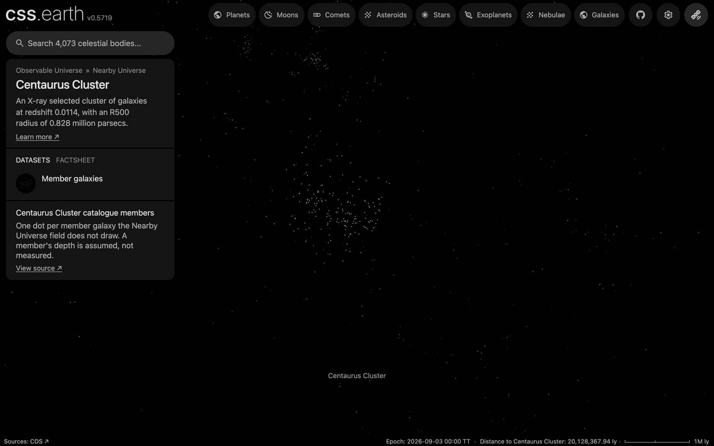

# Centaurus Cluster members

The Centaurus Cluster's member galaxies that the [Nearby Universe](../nearby-universe/README.md) field does not draw, one dot each, drawn while the cluster is selected. With the field's own 49 galaxies of the cluster, about 210 of its galaxies show when you fly there. The cluster's centre, aperture and card come from the [galaxy cluster catalogue](../galaxy-clusters/README.md), whose row links here.

## Sources

| Source | Measurement used |
| --- | --- |
| [Jerjen & Dressler (1997), A&AS 124, 1](https://cdsarc.cds.unistra.fr/viz-bin/cat/J/A+AS/124/1) | [Record](../../sources/jerjen-1997-ccc.json). The Centaurus Cluster Catalogue (table6: 198 members of class 1): J2000 positions and membership, morphological type and total blue magnitude. |
| [Cosmicflows-4, Tully et al. (2023)](https://cdsarc.cds.unistra.fr/viz-bin/cat/J/ApJ/944/94) | The cluster's group distance (table 3, DMzp of group 43296: 33.027 mag, 40.3 Mpc), through the Nearby Universe's tracked table. |
| [Kinney et al. (1996)](https://doi.org/10.1086/177583) | The type templates the Nearby Universe colors its galaxies with. |

## Processing

1. [`members.mts`](../../../packages/bake/authoring/galaxy-clusters/members.mts) keeps the 163 of the 198 catalogue rows that are more than 10 arcsec from every Cosmicflows-4 galaxy; the rest are in the field already. It reads each one's RC3 stage from its type; 7 whose type the catalogue leaves open have none.
2. `packages/bake/cli/prepare-catalogue-points.mts` places every member at the cluster's group distance, spread in depth as widely as the members spread across the sky, and colors it by type and tones it by absolute B magnitude as the field does ([recipe](source/dots/points.json)): 163 dots.

## Evidence

A headless browser capture of this version, on the Centaurus Cluster's page.

## Known problems

- A member's depth is assumed, not measured.
- Membership is morphological: the authors told members from background galaxies by their appearance, and only their class 1 (certain) is drawn.
- The blue magnitudes are not corrected for Galactic extinction; a galaxy without a type is white.
