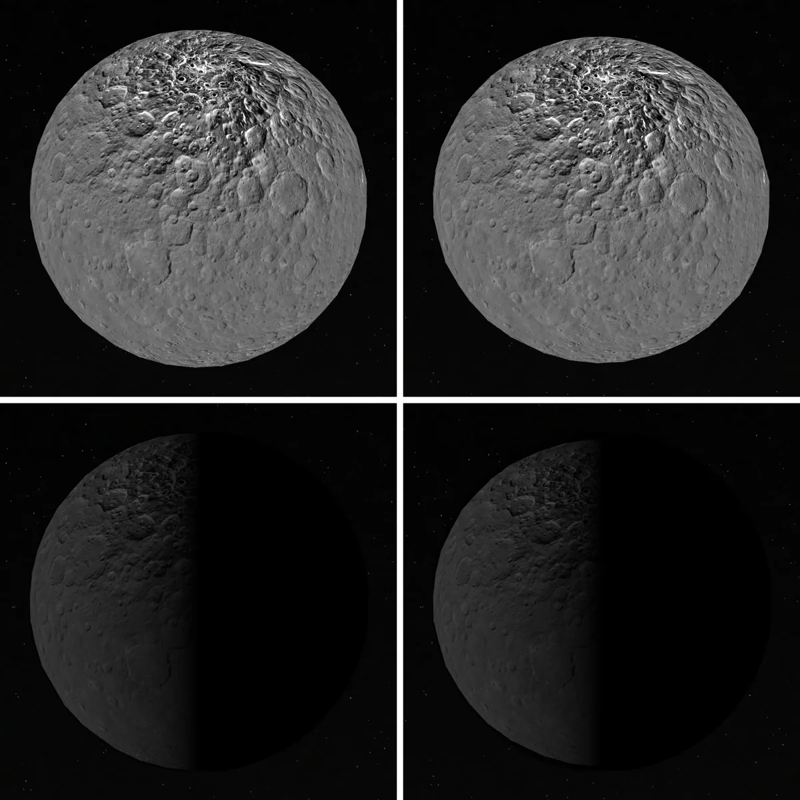

# Ceres

Ceres is shown with Dawn's maps: a visible-light mosaic, enhanced color, elevation, mineral band depths and band centres, gravity and surface elements. The dataset selector groups Clay · 2.7 µm, Ammonium · 3.1 µm under one entry, **Mineral signatures**; see [dataset groups](../../../docs/reader-text.md#dataset-groups).

The navigation marker uses the source map as a stylized identifier, prepared by the [marker recipe](source/preparation/navigation.json). It is not a view at the scene epoch.

## Sources

Source selections, recorded trials and open questions are in the [investigation ledger](investigations.json).

| Input | Source and use |
| --- | --- |
| Monochrome | [USGS Dawn FC global mosaic, 140 m/pixel](https://astrogeology.usgs.gov/search/map/ceres_dawn_fc_global_mosaic_140m), sampled through WMS at 4096 × 2048. Visible-light grayscale, not an unlit albedo map. |
| Enhanced color | [NASA PIA19977](https://science.nasa.gov/resource/hints-at-ceres-composition-from-color/), 3078 × 1537. False color from 920, 750, and 440 nm filters. |
| Elevation | [DLR/USGS Dawn HAMO DTM](https://astrogeology.usgs.gov/search/map/ceres_dawn_fc2_hamo_global_dtm_137m), 21,600 × 10,800 signed 16-bit samples at 60 pixels/degree. |
| Named features | [IAU/USGS Gazetteer of Planetary Nomenclature](https://planetarynames.wr.usgs.gov/Page/CERES/target) Ceres centre-point export, snapshot 2026-09-11, public domain. |
| Feature notes | 31 names carry the lead summary of their English Wikipedia article (CC BY-SA 4.0, retrieved 2026-09-12), recorded with the article link and revision in `source/features/notes.json`. The caption credits Wikipedia. |
| Lighting | The Hapke model of [Li et al. (2019)](https://doi.org/10.1016/j.icarus.2018.12.038), Table 1, recorded in [`source/photometry/li-2019-hapke-749nm.json`](source/photometry/li-2019-hapke-749nm.json). See [Lighting](#lighting-law). |
| Facts | [NASA Ceres facts](https://science.nasa.gov/dwarf-planets/ceres/facts/), summarized in [text.json](text.json). |

- **Clay band:** the Dawn VIR band-depth map `CMT_MOSAIC-BI_DEPTH` (2.7 µm, OH in Mg-rich clays) from [DAWN-A-VIR-5-DDR-CERES-MOSAIC-V1.0](https://sbnarchive.psi.edu/pds3/dawn/vir/DWNCVIR_2/) (De Sanctis, Capria, Ammannito et al., 2018), 11.39 pixels/degree (0.72 km), 60°S to 60°N. The band-centre maps `CMT_MOSAIC-BI_CENTER` and `CMT_MOSAIC-BII_CENTER` come from the same data set.
- **Ammonium band:** our own reduction of Dawn VIR calibrated infrared cubes ([DAWN-A-VIR-3-RDR-IR-CERES-SPECTRA-V1.0](https://sbnarchive.psi.edu/pds3/dawn/vir/DWNCHVIR_I1B/)), following [Frigeri et al. (2019), Icarus 318, 14–21](https://doi.org/10.1016/j.icarus.2018.04.019), Section 3.1.
- **Gravity:** the four maps of JPL's degree-18 gravity model CERES18D in the [Dawn Ceres Gravity Science Derived Data Bundle](https://doi.org/10.17189/c2eg-7x61) 1.0 (Park, Konopliv, Asmar and Buccino 2025): radial gravity, its one-sigma error, the Bouguer anomaly and the geoid, 1° cells.
- **Surface elements:** hydrogen, iron and neutron counts from the [DAWN GRaND Ceres Bundle 1.0](https://doi.org/10.26033/hf9h-pt31) (Prettyman and Yamashita 2021), low mapping orbit, December 2015 to May 2016. Each is a table of 110 pixels 20° across.

[Inputs](source/manifest.json) · [Delivered files](inventory.json) · [Credits](NOTICE.md)

## Processing

The mesh is the Dawn project's oblate spheroid, 482 km at the equator and 446 km at the poles ([dawn_ceres_v05.tpc](https://naif.jpl.nasa.gov/pub/naif/DAWN/kernels/pck/dawn_ceres_v05.tpc)), 7.5% shorter from pole to pole than across, with no resolved relief. The coordinate readout still measures on a sphere of the equatorial radius. With Shadows on, the lighting overlay is still a round body's, so the terminator is drawn as on a sphere. The maps share a global equirectangular grid. Exactly black pixels connected to the southern border are marked with a neutral gray grid; no terrain is inferred. The Dawn FC2 mosaic is orthorectified in the body-fixed frame by its producers ([PDS record](https://pds.nasa.gov/ds-view/pds/viewProfile.jsp?dsid=DAWN-A-FC2-5-CERESMOSAIC-V1.0)); its registration does not depend on a crater match by cssEarth.

The Ammonium band is the 3.1 µm band depth between the reflectance maxima in 2.91–3.01 µm and 3.19–3.24 µm. `packages/bake/authoring/dawn/vir-mosaic.mts` builds each line's camera from the Dawn SPICE kernels, converts radiance to I/F, removes stripes and spikes, brings each cube to 30° phase, sets aside cubes that disagree with all their neighbours, and blends seams as ISIS3's `noseam` does, at 16 pixels/degree (0.5 km). Survey and HAMO set every cell they saw; LAMO, Approach and set-aside cubes fill gaps. The map is 98.7% covered. The [phase fit and rejections](source/science/vir-reduction/photometry.json), [recipe](source/science/vir-reduction/recipe.json) and [receipt](source/science/vir-reduction/receipt.json) are recorded.

Band maps sample each archived pixel as it is. The band-depth scales span each map's own 2nd to 98th percentile: 0.229 to 0.283 at 2.7 µm and 0.106 to 0.151 at 3.1 µm, on the rainbow core of the bars in Frigeri et al. (2019), Figure 7 ([raster recipe](source/preparation/raster.json)). The band-centre ranges, 2.71–2.75 µm and 3.02–3.08 µm, come from [Ammannito et al. (2016), LPSC 3020, Figure 2](https://www.hou.usra.edu/meetings/lpsc2016/pdf/3020.pdf). Gravity and GRaND maps are read unchanged through their producers' PDS3 labels, one color per cell.

Elevation is meters above a 470 km sphere, so its largest signal is the flattening the globe itself now shows, on a fixed −30 to +20 km color scale, with terrain shading from fixed northwest light and no height exaggeration.

## Lighting law

The globe is lit with the Hapke model that [Li et al. (2019)](https://doi.org/10.1016/j.icarus.2018.12.038) fitted to Dawn Framing Camera images in the F3 filter at 749 nm: w 0.139, b 0.364, c 0.048 and roughness 19.2°, with B0 1.6 and h 0.06 held fixed. Each lighting frame is this law relative to the flood-lit disc centre, held at 80° emission toward the limb. See [planet limbs](../../../docs/surface-preparation.md#planet-limbs-from-published-laws). With the Sun behind the viewer the limb is 0.994 of the centre. The clear-filter model of [Schröder et al. (2017)](https://doi.org/10.1016/j.icarus.2017.01.026) gives about twice the geometric albedo at the centre, and its authors say its opposition values are not physical, so it is not used.

## Evidence

**Gravity.** The deepest gravity low (−272 mGal) and the highest Bouguer value (406 mGal) both fall on Urvara. Kerwan reads +348 mGal Bouguer, the mass excess [Bland et al. (2018)](https://doi.org/10.1002/2017GL075526) infer; Yalode reads +180, a basin mascon of [Ermakov et al. (2017)](https://doi.org/10.1002/2017JE005302). Hanami Planum reads −225 mGal, the compensation [Park et al. (2016)](https://doi.org/10.1038/nature18955) report. Ahuna Mons reads +153 mGal free-air; [Ruesch et al. (2019)](https://doi.org/10.1038/s41561-019-0378-7) find about 100 mGal with only degrees 5 to 14.

**Surface elements.** Hydrogen runs from 16.5 wt.% water-equivalent at the equator to 28.6 at the north pole, and iron from 13.2 to 17.4 wt.%. Neutron counts are lowest at the poles, where hydrogen is highest, as in Prettyman et al. ([2017](https://doi.org/10.1126/science.aah6765)), Figure 1.

**Mineral bands.** Frigeri et al.'s Figure 7 was read back into ranks and compared on 2° × 2° cells. At 3.1 µm the archived mosaic scores 0.76 Spearman and our reduction 0.89; at 2.7 µm the archived map scores higher, so the Clay band keeps it. Near Haulani and Cerealia Facula the median 2.7 µm band depth is 0.232 and 0.235, against 0.259 and 0.255 at the mirrored longitudes, which fixes the handedness. Band-centre medians are 2.7320 and 3.0614 µm.

**Monochrome detail.** The original DLR cube, [`Ceres_Dawn_FC_DLR_global_59ppd_Feb2016.cub`](https://planetarymaps.usgs.gov/mosaic/Ceres_Dawn_FC_DLR_global_59ppd_Feb2016.cub), reduced to the same frame, gains no resolution, so the dataset keeps the WMS render. At maximum zoom the finest texel drawn is 77 to 85 m, so the LAMO (35 m) and regional mosaics are not used.

## Known problems

- **Coverage.** Southern-edge-connected exact black is a heuristic for fill, not a surveyed boundary, and a dark edge fringe can remain. The extreme south pole was not illuminated; published shadows and mosaic seams remain visible.
- **Elevation.** The publisher interpolates permanently shadowed polar areas without a mask, so the dataset withholds both caps at |latitude| ≥60°. This is our display boundary, not the source's.
- **Clay band is not the paper's map.** The catalog says artifact removal "was not applied to these data", so scan stripes and checkerboard patterns show, and the median, 0.255, is above the paper's peak near 0.20.
- **Ammonium band values are deeper than the paper's** (median 0.120 against its peak near 0.09): the public calibration lacks the Carrozzo et al. (2016) response correction, which was never released. Faint single-pixel streaks remain along some swaths.
- **Band maps** stop at 60°S and 60°N, and Occator's centre is missing in the Clay band. In the Ammonium band, 11% of cells come from coarser or level-shifted gap-filling data. The archive's labels misname the 3.1 µm depth product and miscount its records. Band centre does not measure abundance.
- **Gravity.** A degree-18 model, accurate globally to degree 14: nothing smaller than about 80 to 100 km is resolved. The error map's 17.6 mGal at the equator is higher than the 10 mGal Ruesch et al. (2019) quote; we do not know why.
- **Surface elements.** About 600 km resolution shows only regional trends. The archive calls the hydrogen map a lower bound.
- **Monochrome detail.** The atlas has 720 m texels, so at maximum zoom it is magnified 5 to 9 times; raising it is open in the [ledger](investigations.json).
- **Lighting.** Neither mode relights the photographed crater shadows. The default view, at 0° phase, lies outside the fitted phases.
- **Named features.** Outlines are not published nomenclature boundaries.
- The last two columns of the PIA19977 map are brighter than their neighbours; a thin light line can show along 0° at close zoom.
