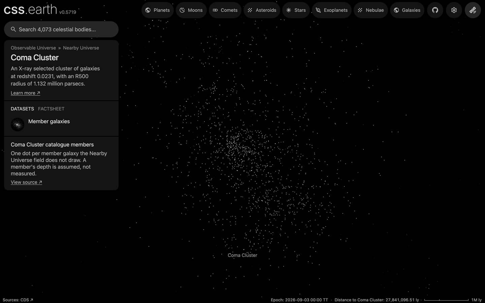

# Coma Cluster members

The Coma Cluster's member galaxies that the [Nearby Universe](../nearby-universe/README.md) field does not draw, one dot each, drawn while the cluster is selected. With the field's own 263 galaxies of the cluster, about 1870 of its galaxies show when you fly there. The cluster's centre, aperture and card come from the [galaxy cluster catalogue](../galaxy-clusters/README.md), whose row links here.

## Sources

| Source | Measurement used |
| --- | --- |
| [Kang et al. (2025), ApJS 278, 51](https://cdsarc.cds.unistra.fr/viz-bin/cat/J/ApJS/278/51) | [Record](../../sources/kang-2025-coma-redshifts.json). Redshifts within 132 arcmin of the Coma cluster centre, with a membership flag (table2: 1,826 rows with Mm = 1): J2000 positions and membership. |
| [SDSS DR16](https://cdsarc.cds.unistra.fr/viz-bin/cat/V/154) | Model g and r magnitudes of each member, by its SDSS objID, for the B magnitude that sets its tone. |
| [Cosmicflows-4, Tully et al. (2023)](https://cdsarc.cds.unistra.fr/viz-bin/cat/J/ApJ/944/94) | The cluster's group distance (table 3, DMzp of group 44715: 34.891 mag, 95.1 Mpc), through the Nearby Universe's tracked table. |

## Processing

1. [`members.mts`](../../../packages/bake/authoring/galaxy-clusters/members.mts) keeps the 1,609 of the 1,826 catalogue rows that are more than 10 arcsec from every Cosmicflows-4 galaxy; the rest are in the field already. It derives a B magnitude from g and r (Jester et al. 2005: B = g + 0.39 (g − r) + 0.21); 0 members have none.
2. `packages/bake/cli/prepare-catalogue-points.mts` places every member at the cluster's group distance, spread in depth as widely as the members spread across the sky, and tones it by absolute B magnitude as the field does ([recipe](source/dots/points.json)): 1,609 dots.

## Evidence

A headless browser capture of this version, on the Coma Cluster's page.

## Known problems

- A member's depth is assumed, not measured.
- No types, so every dot is white.
