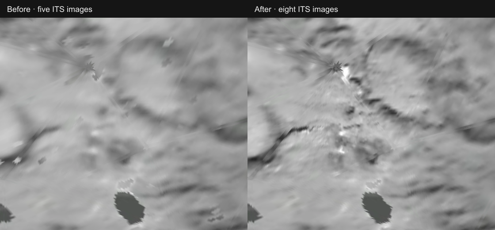

# Tempel 1 close-up photography

The existing Deep Impact dataset now combines eight ITS frames. The added frames improve detail over about 6.6 km²; total accepted photographic coverage stays near 31%. The 1000-triangle terrain file is byte-identical to the baseline. Unsupported areas keep the grid, and Shadows defaults to Off.

[DPR 2 comparison](comparison-dpr-2.webp) · [Absolute RGB difference, DPR 1](difference-dpr-1.webp) · [Absolute RGB difference, DPR 2](difference-dpr-2.webp) · [Whole photographed side](overview.webp) · [Native ITS 9000688 image](its-9000688.webp)

The [browser record](browser.json) pins implementation commit `3b2bc4bedebf5009bf1450cf2b9c9654528b85c4`, baseline `5e9e1a4ade55496357cd4a70bb4ffd0afec34157`, camera state and loaded asset hashes. Installed Google Chrome 152 captured the production build at DPR 1 and 2. Before substitutes the baseline atlas; after uses an independent installation from public R2. Both retain one scene, 1000 triangles, no canvas and Shadows Off. Camera and system transforms are identical. These are visual comparisons, not absolute geographic validation.

The three new cameras have held-out relative RMS residuals of 0.305, 0.299 and 0.532 pixels against earlier registered photographs. Absolute placement still inherits the earlier anchor and source-shape uncertainty. See the [method and reproducible commands](../../source/reference/encounter-photography.md).

Validation at the implementation revision: 18 focused body, FITS decoder, registration and surface tests passed; all typecheck stages passed; camera-record regeneration matched checked-in bytes. Production Astro build and planet assembly passed after restoring unrelated missing or stale runtime cache files. An empty runtime installation downloaded and verified all 40 Tempel 1 files, with no reuse and successful public HEAD responses. An independent empty source installation restored and verified the three new PDS FITS inputs.

At capture time, the complete shared browser conformance run remained unqualified: its desktop case timed out waiting for the default route to become ready. Repository-wide ownership and shell checks were still running. The focused captures above do not replace those checks.
