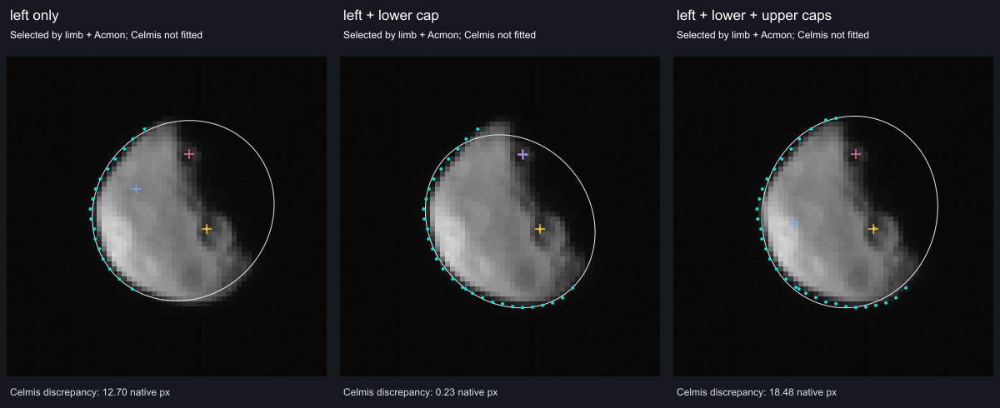
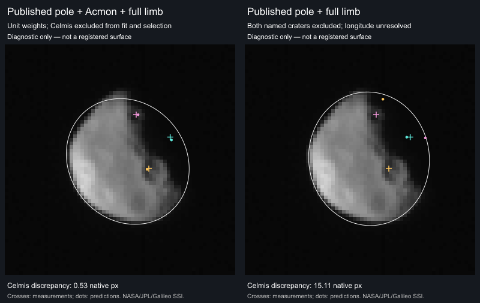

# Dactyl

Shape-only views use the shared neutral gray (#808080 sRGB). This is a display convention, not a measurement of surface color or albedo; gaps within photographic and scientific datasets retain the missing-data grid.

Dactyl, discovered beside Ida in Galileo images, was the first moon found orbiting an asteroid.

## Representation

A smooth ellipsoid at the dimensions measured from Galileo images: 1.6 × 1.4 × 1.2 km. Craters and surface imagery are not represented; the grid marks missing imagery.

Approximate orbital placement. The 1993 encounter did not determine a unique orbit; the present orbital phase is illustrative. A synchronous orientation is assumed, not measured.

The shared missing-imagery grid covers the surface. The body uses the existing generic object adapter, one shared world camera and retained PolyCSS geometry. The selector detail is **Galileo**.

## Sources

[Investigation ledger](investigations.json): recorded source decisions, evidence and conditions for revisiting them.

- [Veverka et al. (1996)](https://doi.org/10.1006/icar.1996.0045): Galileo dimensions, shape and surface observations.
- [Belton et al. (1996)](https://doi.org/10.1006/icar.1996.0044): Discovery and encounter orbit constraints.
- [Petit et al. (1997)](https://doi.org/10.1006/icar.1997.5788): Long-term orbit stability and candidate solutions.

[Measurements and source selection](source/measurements.json) · [Exact source pins](source/manifest.json) · [Reuse terms](NOTICE.md).

The dimensions describe a smooth envelope. Galileo’s resolved craters are evidence for a future surface view; they are not synthesized on this ellipsoid. The generic Celestia rock texture is excluded.

## Orbital placement

[Source parameters](source/orbit/published-parameters.json) separate published constraints from assumptions. The illustration places zero mean anomaly at JD 2461286.5 TT (3 September 2026), rather than extrapolating an uncertain encounter phase. A dashed orbit and circular selected marker distinguish this approximation. No uncertainty region, confidence interval or exact current phase is claimed. The fixed-epoch loader rejects other epochs.

## Evidence

The [native Galileo frame review](evidence/galileo/review.json), prepared on
2026-09-14 against `ef958900c9ecab2632fff75fd629fa4789947f79`, preserves three
800 × 800, 8-bit SSI images, their original PDS labels, the bad-pixel records,
and two mission kernels. [Input identities](evidence/galileo/inputs.json) bind
every original to its download URL, byte count and SHA-256. This is source
inspection, not a rendered surface or a successful registration test.

The complete cratered disk in `i2278` is the best of these three candidates.
[i1578](evidence/galileo/i1578-crop.png) shows a smaller complete disk;
[i2700](evidence/galileo/i2700-crop.png) contains fragments at the detector edge.
These crops retain decoded FITS storage orientation, use nearest-neighbor
enlargement and a declared ×2 display gain, and clip zero pixels. They have no
color reconstruction, calibration, bad-pixel masking or surface projection.
The [review command](../../../tools/objects/source-authoring/galileo-lucy/README.md#dactyl-photographic-source-review)
also writes full-detector PNGs at unchanged DN values.

The complete Veverka paper is now reviewed. Its published south-pole overlay
and Dactyl-specific range improve the [orientation experiment](#published-pole-and-range):
the pole, Acmon and complete sampled bright limb predict Celmis within **0.53
native pixel** with unit residual weights. Celmis is excluded from this fit
and its selection, but was inspected in earlier experiments.

**The photographic surface is still unqualified.** A new [map check](#published-map-check)
recovers Figure 10's labelled grid within 1.38 printed pixels, but the existing
camera disagrees with the mapped terrain across six additional regions.
Figure 9B's separate wireframe still has no numerical line labels. Picking,
paper alignment and model correspondence remain material at approximately
39 m per native pixel.

The combined first-photograph investigation on 14 September rechecked the
supplied paper's Figure 9B and the existing map report. The wireframe remains
unlabelled numerically; its many visible intersections are not additional
geographic controls unless their coordinates are independently established.
The earlier fit and map failures remain tied to their original versions. No
new controlled source was established, and those expensive fits were not rerun.
The public scene retains its missing-imagery grid. Merged
[PR #199](https://github.com/layoutit/css.earth/pull/199) preserves the earlier
investigation; it did not qualify a photographic surface.

The [whole-body label capture](evidence/surface-labels/whole-body-2c24ca749.jpg), taken at
`2c24ca749` on 2026-09-12 in the in-app browser at 1280 × 720, shows Acmon and
Celmis with neither place selected. Both names are visible while the whole moon
fits on screen; rotating hides the far-side names. The catalog's coordinates,
diameters and mesh anchors remain unchanged. All 68 catalog and terrain checks
passed on this revision, including Dactyl's two names.

The [browser conformance report](evidence/dactyl-conformance.json) passed desktop/mobile input, picking, wheel/pinch zoom, lighting, single-scene lifecycle and retained identity at DPR 1/2. Its [DPR 1 video](evidence/dactyl-dpr-1.webm) and [DPR 2 video](evidence/dactyl-dpr-2.webm) retain the input sequences. These were captured at `514f6b497`; body geometry, asset banks and input/lifecycle code remain unchanged in the final renderer at `66448c17d`. The production check below repeats the navigation and presentation affected by later changes.

The [Shadows-on view](evidence/dactyl-shadows-true.png) was also inspected. These production captures use Chrome 152.0.7977.84, 1440 × 1000 at DPR 1, renderer commit `66448c17d` and browser-review commit `437ecb0b2`. Documentation-only moves preserve the original report and image bytes. They show the adopted shape with the missing-imagery grid; they do not establish photographic registration or mission-model parity.

The [production navigation check](../dinkinesh/evidence/galileo-lucy/production-review.json) verifies visible **(approx)** labels, dashed paths, the standard **1 px** circle/orbit stroke, and selection of Ida with one mounted scene. Alternating existing retained segments carry the dashes; approximate circles omit the ordinary selected-body thickening. [Integrated checks and their limits](../dinkinesh/README.md#integrated-validation) cover the combined catalog.

## Camera and orientation experiment

The [retained report](evidence/registration/report.json) records a diagnostic
run on 2026-09-14, based on `6644779ec06eb1e8cb3142d0b1336d94ac52382c`, with the
new diagnostic and its dependencies identified by SHA-256. It does not prepare
a photographic lens. [Pinned inputs](evidence/registration/inputs.json) include
the original mission VICAR image, its label, the mission clock and leap-second
kernels, and the SSI instrument definition already retained beside Ida.

**Detector coordinates.** Comparing the FITS array with the original
`GO_0016/IDA/C020256/2278R.IMG` establishes an exact vertical inversion:
all 640,000 DN values agree after reversing the FITS rows. Without that reversal,
316,986 pixels differ. The fit uses the original detector's zero-based sample
and line coordinates. It applies the native SSI instrument kernel's radial
distortion equation, `R = r + 6.58e-9 r³`, where `R` is actual detector radius
and `r` is ideal radius about the optical center. This coordinate correction is
not radiometric calibration.

**Exposure time and pointing.** The mission
[catalog description](evidence/registration/native/catstat.txt) distinguishes
the label's frame-start clock from shutter-center SCET. For `i2278`, shutter
center is `1993-08-28T16:47:49.956Z`, 1.149546 seconds after frame start. The
shared TypeScript readers evaluate the original CK there with zero tolerance;
their B1950 C-matrix agrees with the independent
[CSPICE N0067 calculation](../../../tests/objects/fixtures/dactyl/galileo-pointing.json)
to a maximum element difference of `5.7e-11`. Neither `i1578` nor `i2700` has
zero-tolerance coverage at its own shutter center in this particular kernel.
No gap is filled or extrapolated.

The native oracle gives a reconstructed boresight of RA 198.275361°, Dec
32.708038° in J2000. This differs from `i2278`'s preliminary label by 0.111075°,
about 191 SSI pixels. The VICAR header identifies a different predicted pointing
kernel. Agreement with CSPICE verifies our reader; it does not establish which
pointing best matches the sky or supply Dactyl's body orientation. The label's
Ida sub-spacecraft coordinates and distance are not Dactyl coordinates.

**Orientation attempt.** The source mesh axes are 0° E along +X, 90° E along
+Y, and north along +Z, before preparation's existing X/Y swap to CSS coordinates.
The fit holds the published 800 × 700 × 600 m semiaxes and the rounded NASA
range of 3,900 km fixed. It uses 17 bright-limb crossings plus Acmon's center;
Celmis is excluded from both the objective and selection of the best fit.
The two feature coordinates are confirmed in Table III of
[Belton et al.'s mission overview](https://doi.org/10.1006/icar.1996.0032),
explicitly in east longitude, and in the current USGS Gazetteer. Pixel picks
against the [USGS annotated photo](https://asc-planetarynames-data.s3.us-west-2.amazonaws.com/dactyl.pdf)
are our measurements, with about one native pixel of picking uncertainty.
They are not published camera controls.

White is the modeled ellipsoid envelope; cyan dots are measured limb samples.
Gold marks Acmon. Pink is the measured Celmis center; blue is its prediction.
Both panels show the same 64 × 64 native crop, enlarged six times with nearest
neighbors and ×2 DN gain; no pixels clip. These are detector diagnostics, not
browser scenes or surface textures.

| Selection | Limb RMS, ideal pixels | Acmon error, native pixels | Celmis error, native pixels |
| --- | ---: | ---: | ---: |
| Lowest limb-and-Acmon objective, from 576 starts | 0.27 | 0.01 | 12.70 |
| Alternative selected after inspecting Celmis | 0.54 | 0.06 | 0.54 |

The second row is promising but cannot reuse Celmis as an independent holdout.
The candidates differ by about 54° in image north azimuth. This is a concrete
registration ambiguity, not evidence that a fit is impossible. The search uses
an ellipsoid envelope; it does not model crater relief, prove a global optimum,
or propagate shape and range uncertainty. It does not change the existing mesh,
renderer, source camera machinery or public preparation recipe.

The [ledger](investigations.json) also records the sampled neighboring frames
and paper leads. A smaller earlier image, preliminary label pointing and an
assumed fixed spin do not provide an independent, controlled surface transfer.
The readable overview's geometry table describes Ida, not Dactyl. Access to the
full Veverka paper was previously incomplete; the user-supplied PDF now resolves
that access gap. The [published-control experiment](#published-pole-and-range)
records the new source facts and what they do—and do not—establish.

**Outline extent check.** The original 17 crossings sample only the left limb.
The [extent experiment](evidence/registration/limb-extent.json) adds 12 lower-cap
crossings, then two upper-cap crossings, keeping the same instrument distortion,
ellipsoid, range, Acmon control and 576 starts. Each case selects solely by its
limb-and-Acmon objective.

| Sampled bright outline | Crossings | Limb RMS, ideal pixels | Celmis error, native pixels |
| --- | ---: | ---: | ---: |
| Left only | 17 | 0.27 | 12.70 |
| Left and lower cap | 29 | 0.44 | 0.23 |
| Left and both caps | 31 | 0.59 | 18.48 |

The lower-cap case is a useful candidate, but the upper cap changes the result
again. A low limb residual does not establish a stable body orientation. These
are analyst-selected threshold crossings, added cumulatively rather than sampled
at equal arc length; Celmis was already inspected during development. This is a
sensitivity check, not a fresh blind validation or proof that the existing
ellipsoid cannot support any registered area. No candidate is promoted to the
public surface.

Two further papers do not resolve the missing frame. The complete
[Veverka spectral paper](https://doi.org/10.1006/icar.1996.0037) presents Dactyl's
disk-averaged spectra; its mapped figures concern Ida. The two-page
[Oberst photogrammetry abstract](https://www.lpi.usra.edu/meetings/lpsc1995/pdf/1535.pdf)
describes an Ida control network and proposed Dactyl ephemeris work, without
Dactyl surface controls. Retrieved-byte pins and the exact inspection scope are
in the [additional-source record](evidence/registration/additional-sources.json).

The [reproduction command](../../../tools/objects/source-authoring/galileo-lucy/README.md#dactyl-camera-and-orientation-diagnostic)
checks native byte identity, clock/CK agreement and the fit in one serial run.
The tools TypeScript check passes, including the extent-check option.
No application build, browser conformance or Pixelmatch was run for these
diagnostic changes: none of the candidates is a qualified surface, and the
displayed scene is unchanged.

## Published pole and range

[Source measurements and PDF identity](evidence/registration/published-controls.json)
bind the complete 12-page publisher PDF to its SHA-256. All pages were read;
Tables I–III and the shape, gridded photograph and cylindrical map in Figures
3, 9 and 10 were examined. The earlier access-blocked ledger entry is reopened.
The PDF and its figures remain local references; the retained diagnostic uses
original NASA/JPL/Galileo pixels.

Table I gives **3,887 km to Dactyl** for exposure 0202562278, replacing the
rounded 3,900 km used by the earlier diagnostic. It also gives 8,664 km for
0202561578 and 2,381 km for 0202562700. Table II reports a maximum limb departure
of 130 m from the ellipsoid and RMS at most 8% of its 700 m mean radius. Those
are shape departures, not camera residual tolerances or Gaussian errors.

Figure 9B identifies the south pole and image east direction. The digitized
meridian convergence is approximately (307.5, 147.5) in its 427 × 396 embedded
JPEG. Its interval-free wireframe does not supply labelled latitude/longitude
controls. Figure 10 supplies an explicitly east-positive cylindrical map of
the same exposure, but no independent second observation or numeric shape file.
The prose's 220° W for Celmis conflicts with the east-positive coordinate in
Belton's Table III and the USGS Gazetteer. We retain the disagreement and use
the latter sources' 220° E; a prose typo is an inference, not an author erratum.

The [reproducible result](evidence/registration/published-control-fit.json)
extracts the exact JPEG streams only after checking the PDF and stream hashes.
It aligns Figure 9B to original VICAR detector coordinates, applies the SSI
instrument distortion, and holds the existing 800 × 700 × 600 m semiaxes fixed.
It includes all 31 earlier bright-limb samples. The unit-weight fit below is
the baseline; Celmis does not select it.

| Fit | Limb RMS, ideal pixels | Acmon error, native pixels | Celmis error, native pixels |
| --- | ---: | ---: | ---: |
| Published pole, Acmon and sampled bright limb | 0.77 | 0.52 | 0.53 |
| Published pole and sampled bright limb; both craters excluded | 0.60 | 19.34 | 15.11 |

The first fit has a maximum outline discrepancy of 2.51 ideal pixels. Dividing
limb residuals by 1.42 or 2 gives Celmis errors of 0.15 and 0.06 pixels,
respectively; these are recorded sensitivity cases, not chosen acceptance
limits. The pole alone does not determine longitude on this simplified shape.

The apparent precision of the best fit exceeds the certainty of its inputs.
Changing the median filter and the fitted paper region moves the inferred pole
by up to **2.52 native pixels**; the heavily gridded right-half fits are weaker
than the full-image and left-half fits. Sixteen combined corner perturbations
of the printed pole (±4 figure pixels) and Acmon (±1 native pixel), locally
refitted from the baseline, give Celmis discrepancies of **0.48–2.02 pixels**.
This is a sensitivity check, not a full uncertainty distribution or a blind
holdout. No numerical grid intervals or dense map correspondences are invented
to close the remaining registration gap.

The [command](../../../tools/objects/source-authoring/galileo-lucy/README.md#dactyl-published-control-diagnostic)
reproduces these results serially from the pinned local paper and native inputs.
The tools TypeScript check passes with this generator. No renderer, mesh,
preparation recipe or public imagery changes; application/browser suites and
Pixelmatch are not evidence for this detector-coordinate investigation.

## Published map check

The [map review](evidence/registration/published-map-review.json), run on
2026-09-14, tests Figure 10 as a separate source route. Its input and generator
hashes bind the result to the exact PDF, original VICAR frame, earlier pose and
unchanged camera implementation. It does not rerun the camera search.

Eight unused printed ticks check the four-corner plot digitization: RMS **0.81**
and maximum **1.38 figure pixels**, roughly one degree along the plot axes.
This establishes how accurately the printed coordinates were recovered; it does
not establish the producer's latitude definition or correspondence to our
ellipsoid. Figure 3 shows a non-ellipsoidal model, whose numerical surface and
binding to Figure 10 remain unresolved. The current PDS Stooke map guide has no
Dactyl entry. The ledger records that limited inspection and the SPUD source-code
lead; neither is treated as proof that no usable map exists elsewhere.

The earlier pole-plus-Acmon camera is also checked against six disjoint map
windows. Their unshifted normalized correlations range from **−0.29 to 0.60**.
Searching local translations suggests shifts of **2.25–4.72 native pixels**;
one optimum reaches the search boundary and some competing matches are nearly
equal. These are diagnostic suggestions, not measured control errors or an
accepted warp. Each window's 81 interpolated samples are not 81 independent
detector observations. The map was examined during earlier development, so this
is additional corroboration rather than a fresh blind holdout.

This disagreement prevents the 0.53-pixel Celmis result from qualifying the whole
surface. The remaining discriminator is a supported map frame and source-model
correspondence, or distributed image controls that survive checking beyond the
two named craters. Another camera optimization using the same inputs does not
supply that missing evidence. No photographic surface has been enabled.

The publisher currently identifies the paper as **CC BY-NC-ND 4.0**; see
[reuse terms](NOTICE.md). The paper figure has not been cleared as a public texture.
Its coordinate measurements and the separately archived NASA pixels remain
distinct inputs. The [reproduction command](../../../tools/objects/source-authoring/galileo-lucy/README.md#dactyl-published-map-review)
checks source bytes and writes a numerical report without redistributing the
figure. A focused strict TypeScript check covers the new tool and its imported
dependencies; no application bake, renderer test or Pixelmatch is relevant to
this source-only change.

## Known problems

Named features: the IAU/USGS Gazetteer of Planetary Nomenclature centre-point shapefile for Dactyl (retrieved 2026-09-11, public domain per its FGDC metadata) is pinned under `source/features/`. Preparation verifies the archive, reads the attribute table and the metadata datum, drops the albedo-feature type code, folds repeated rows, and converts each positive-east centre into the body-fixed frame the radial terrain sampler uses for this mesh (longitude 0 toward the mesh +y axis, 90° E toward +x, north +z), then casts that direction through the prepared hit mesh so every anchor and outline point sits on the shape model rather than on a reference sphere. Craters and faculae trace a rim circle, other types their published extent box. Outlines are not published nomenclature boundaries.

Named features run of 2026-09-12 (this version): the catalogue labels 2 IAU names on the hit mesh (nothing skipped); `tests/objects/unit/surface-features.test.mts` verifies the pinned bytes, the body-frame anchors and the hit-mesh radius band, and a headless Chrome probe (`output/probe-spheres.mts`, ignored scratch) mounted the page, selected every lens and pinned Acmon from the sidebar search with no console errors or failed requests.

The label-discovery update restores the current Gazetteer ZIP and records its
new byte pin. Its prepared names, coordinates, diameters, notes and mesh anchors
match the previous catalogue exactly. Both names become eligible while the
whole moon fits on screen; their projected size and facing still control display.

## Preparation

[Reproduction instructions](../../../tools/objects/source-authoring/galileo-lucy/README.md). The canonical prepared mesh contains 512 triangles, independent of device DPR. Sources, conversion and reduction happen before runtime.
