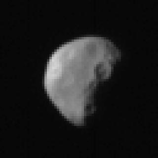
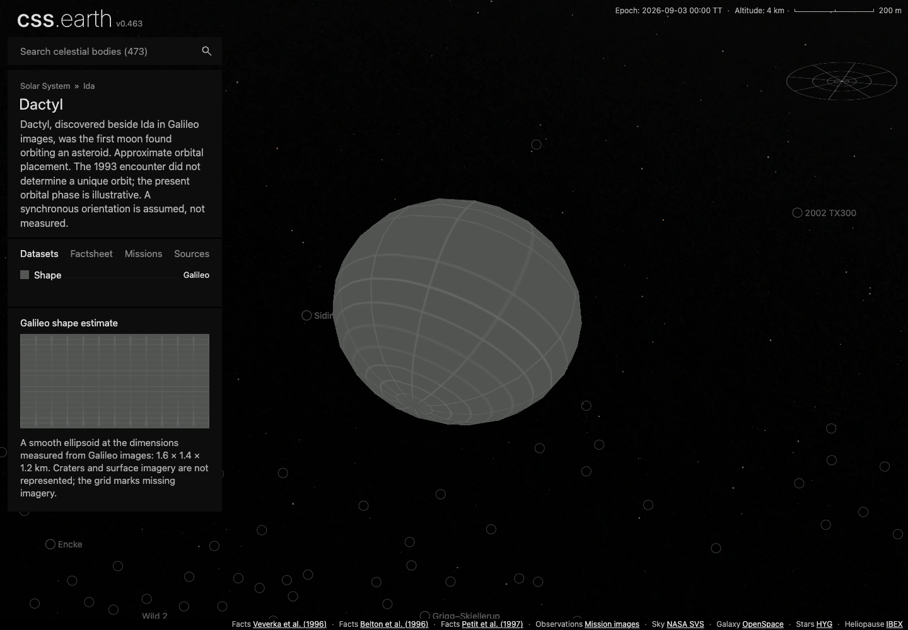
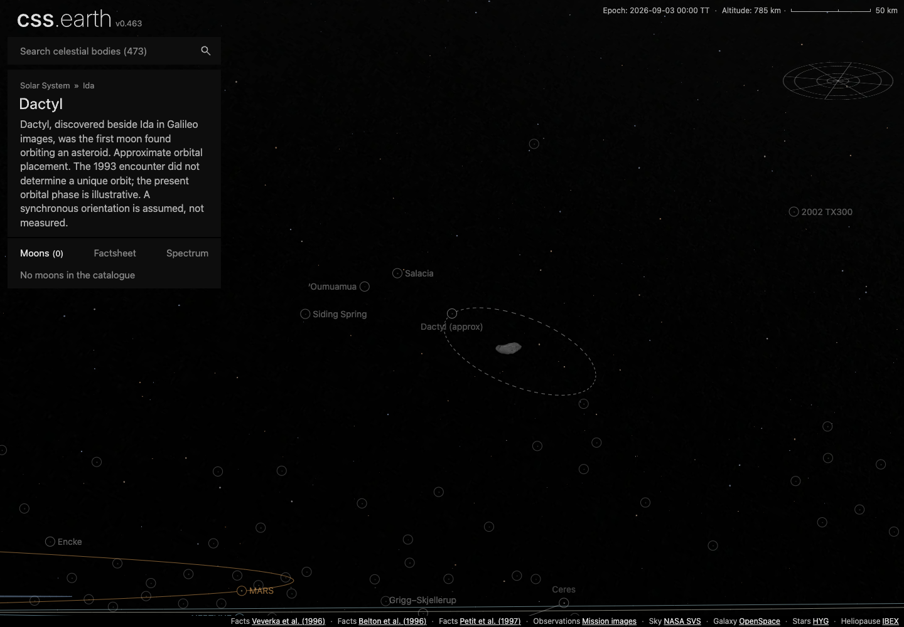
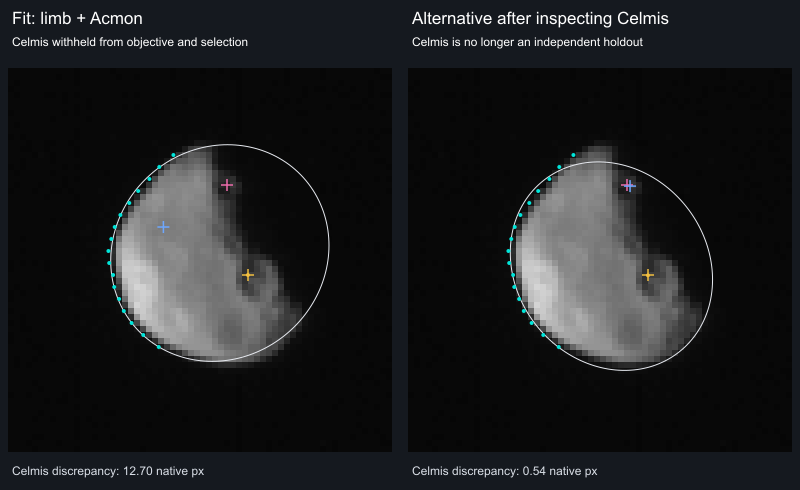

# Dactyl

Dactyl, discovered beside Ida in Galileo images, was the first moon found orbiting an asteroid.

## Representation

A smooth ellipsoid at the dimensions measured from Galileo images: 1.6 × 1.4 × 1.2 km. Craters and surface imagery are not represented; the grid marks missing imagery.

Approximate orbital placement. The 1993 encounter did not determine a unique orbit; the present orbital phase is illustrative. A synchronous orientation is assumed, not measured.

The shared missing-imagery grid covers the surface. The body uses the existing generic object adapter, one shared world camera and retained PolyCSS geometry. The selector detail is **Galileo**.

## Scientific sources

[Investigation ledger](investigations.json): recorded source decisions, evidence and conditions for revisiting them.

- [Veverka et al. (1996)](https://doi.org/10.1006/icar.1996.0045): Galileo dimensions, shape and surface observations.
- [Belton et al. (1996)](https://doi.org/10.1006/icar.1996.0044): Discovery and encounter orbit constraints.
- [Petit et al. (1997)](https://doi.org/10.1006/icar.1997.5788): Long-term orbit stability and candidate solutions.

[Measurements and source selection](source/measurements.json) · [Exact source pins](source/manifest.json) · [Reuse terms](NOTICE.md).

The dimensions describe a smooth envelope. Galileo’s resolved craters are evidence for a future surface view; they are not synthesized on this ellipsoid. The generic Celestia rock texture is excluded.

## Orbital placement

[Source parameters](source/orbit/published-parameters.json) separate published constraints from assumptions. The illustration places zero mean anomaly at JD 2461286.5 TT (3 September 2026), rather than extrapolating an uncertain encounter phase. A dashed orbit and circular selected marker distinguish this approximation. No uncertainty region, confidence interval or exact current phase is claimed. The fixed-epoch loader rejects other epochs.

## Evidence

The [native Galileo frame review](evidence/galileo/review.json), prepared on
2026-09-14 against `ef958900c9ecab2632fff75fd629fa4789947f79`, preserves three
800 × 800, 8-bit SSI images, their original PDS labels, the bad-pixel records,
and two mission kernels. [Input identities](evidence/galileo/inputs.json) bind
every original to its download URL, byte count and SHA-256. This is source
inspection, not a rendered surface or a successful registration test.

The complete cratered disk in `i2278` is the best of these three candidates.
[i1578](evidence/galileo/i1578-crop.png) shows a smaller complete disk;
[i2700](evidence/galileo/i2700-crop.png) contains fragments at the detector edge.
These crops retain decoded FITS storage orientation, use nearest-neighbor
enlargement and a declared ×2 display gain, and clip zero pixels. They have no
color reconstruction, calibration, bad-pixel masking or surface projection.
The [review command](../../../tools/objects/source-authoring/galileo-lucy/README.md#dactyl-photographic-source-review)
also writes full-detector PNGs at unchanged DN values.

That initial review has now been followed by the [camera and orientation
experiment](#camera-and-orientation-experiment). It evaluates the telemetry
pointing and attempts an ellipsoid fit, with a withheld crater check.
**Registration remains unresolved:** fitting the limb and Acmon selects an
orientation that puts Celmis in the wrong place. An alternative agrees with
both named craters but has no independent surface check left. The public scene
still uses its missing-imagery grid.

The [whole-body label capture](evidence/surface-labels/whole-body-2c24ca749.jpg), taken at
`2c24ca749` on 2026-09-12 in the in-app browser at 1280 × 720, shows Acmon and
Celmis with neither place selected. Both names are visible while the whole moon
fits on screen; rotating hides the far-side names. The catalog's coordinates,
diameters and mesh anchors remain unchanged. All 68 catalog and terrain checks
passed on this revision, including Dactyl's two names.

The [browser conformance report](evidence/dactyl-conformance.json) passed desktop/mobile input, picking, wheel/pinch zoom, lighting, single-scene lifecycle and retained identity at DPR 1/2. Its [DPR 1 video](evidence/dactyl-dpr-1.webm) and [DPR 2 video](evidence/dactyl-dpr-2.webm) retain the input sequences. These were captured at `514f6b497`; body geometry, asset banks and input/lifecycle code remain unchanged in the final renderer at `66448c17d`. The production check below repeats the navigation and presentation affected by later changes.

The [Shadows-on view](evidence/dactyl-shadows-true.png) was also inspected. These production captures use Chrome 152.0.7977.84, 1440 × 1000 at DPR 1, renderer commit `66448c17d` and browser-review commit `437ecb0b2`. Documentation-only moves preserve the original report and image bytes. They show the adopted shape with the missing-imagery grid; they do not establish photographic registration or mission-model parity.

The [production navigation check](../dinkinesh/evidence/galileo-lucy/production-review.json) verifies visible **(approx)** labels, dashed paths, the standard **1 px** circle/orbit stroke, and selection of Ida with one mounted scene. Alternating existing retained segments carry the dashes; approximate circles omit the ordinary selected-body thickening. [Integrated checks and their limits](../dinkinesh/README.md#integrated-validation) cover the combined catalog.

## Camera and orientation experiment

The [retained report](evidence/registration/report.json) records a diagnostic
run on 2026-09-14, based on `6644779ec06eb1e8cb3142d0b1336d94ac52382c`, with the
new diagnostic and its dependencies identified by SHA-256. It does not prepare
a photographic lens. [Pinned inputs](evidence/registration/inputs.json) include
the original mission VICAR image, its label, the mission clock and leap-second
kernels, and the SSI instrument definition already retained beside Ida.

**Detector coordinates.** Comparing the FITS array with the original
`GO_0016/IDA/C020256/2278R.IMG` establishes an exact vertical inversion:
all 640,000 DN values agree after reversing the FITS rows. Without that reversal,
316,986 pixels differ. The fit uses the original detector's zero-based sample
and line coordinates. It applies the native SSI instrument kernel's radial
distortion equation, `R = r + 6.58e-9 r³`, where `R` is actual detector radius
and `r` is ideal radius about the optical center. This coordinate correction is
not radiometric calibration.

**Exposure time and pointing.** The mission
[catalog description](evidence/registration/native/catstat.txt) distinguishes
the label's frame-start clock from shutter-center SCET. For `i2278`, shutter
center is `1993-08-28T16:47:49.956Z`, 1.149546 seconds after frame start. The
shared TypeScript readers evaluate the original CK there with zero tolerance;
their B1950 C-matrix agrees with the independent
[CSPICE N0067 calculation](../../../tests/objects/fixtures/dactyl/galileo-pointing.json)
to a maximum element difference of `5.7e-11`. Neither `i1578` nor `i2700` has
zero-tolerance coverage at its own shutter center in this particular kernel.
No gap is filled or extrapolated.

The native oracle gives a reconstructed boresight of RA 198.275361°, Dec
32.708038° in J2000. This differs from `i2278`'s preliminary label by 0.111075°,
about 191 SSI pixels. The VICAR header identifies a different predicted pointing
kernel. Agreement with CSPICE verifies our reader; it does not establish which
pointing best matches the sky or supply Dactyl's body orientation. The label's
Ida sub-spacecraft coordinates and distance are not Dactyl coordinates.

**Orientation attempt.** The source mesh axes are 0° E along +X, 90° E along
+Y, and north along +Z, before preparation's existing X/Y swap to CSS coordinates.
The fit holds the published 800 × 700 × 600 m semiaxes and the rounded NASA
range of 3,900 km fixed. It uses 17 bright-limb crossings plus Acmon's center;
Celmis is excluded from both the objective and selection of the best fit.
The two feature coordinates are confirmed in Table III of
[Belton et al.'s mission overview](https://doi.org/10.1006/icar.1996.0032),
explicitly in east longitude, and in the current USGS Gazetteer. Pixel picks
against the [USGS annotated photo](https://asc-planetarynames-data.s3.us-west-2.amazonaws.com/dactyl.pdf)
are our measurements, with about one native pixel of picking uncertainty.
They are not published camera controls.

White is the modeled ellipsoid envelope; cyan dots are measured limb samples.
Gold marks Acmon. Pink is the measured Celmis center; blue is its prediction.
Both panels show the same 64 × 64 native crop, enlarged six times with nearest
neighbors and ×2 DN gain; no pixels clip. These are detector diagnostics, not
browser scenes or surface textures.

| Selection | Limb RMS, ideal pixels | Acmon error, native pixels | Celmis error, native pixels |
| --- | ---: | ---: | ---: |
| Lowest limb-and-Acmon objective, from 576 starts | 0.27 | 0.01 | 12.70 |
| Alternative selected after inspecting Celmis | 0.54 | 0.06 | 0.54 |

The second row is promising but cannot reuse Celmis as an independent holdout.
The candidates differ by about 54° in image north azimuth. This is a concrete
registration ambiguity, not evidence that a fit is impossible. The search uses
an ellipsoid envelope; it does not model crater relief, prove a global optimum,
or propagate shape and range uncertainty. It does not change the existing mesh,
renderer, source camera machinery or public preparation recipe.

The [ledger](investigations.json) also records the sampled neighboring frames
and paper leads. A smaller earlier image, preliminary label pointing and an
assumed fixed spin do not provide an independent, controlled surface transfer.
The readable overview's geometry table still describes Ida; it cannot supply
Dactyl's camera. The full Veverka shape/surface paper remains unexamined.
The next useful input is a Dactyl frame or distributed surface controls with
disjoint checks, not another copy of the same three images.

The [reproduction command](../../../tools/objects/source-authoring/galileo-lucy/README.md#dactyl-camera-and-orientation-diagnostic)
checks native byte identity, clock/CK agreement and the fit in one serial run.
The tools TypeScript check passes. No application build, browser conformance or
Pixelmatch was run for this evidence-only change: neither candidate is a
qualified surface, and the displayed scene is unchanged.

## Known problems

Named features: the IAU/USGS Gazetteer of Planetary Nomenclature centre-point shapefile for Dactyl (retrieved 2026-09-11, public domain per its FGDC metadata) is pinned under `source/features/`. Preparation verifies the archive, reads the attribute table and the metadata datum, drops the albedo-feature type code, folds repeated rows, and converts each positive-east centre into the body-fixed frame the radial terrain sampler uses for this mesh (longitude 0 toward the mesh +y axis, 90° E toward +x, north +z), then casts that direction through the prepared hit mesh so every anchor and outline point sits on the shape model rather than on a reference sphere. Craters and faculae trace a rim circle, other types their published extent box. Outlines are not published nomenclature boundaries.

Named features run of 2026-09-12 (this version): the catalogue labels 2 IAU names on the hit mesh (nothing skipped); `tests/objects/unit/surface-features.test.mts` verifies the pinned bytes, the body-frame anchors and the hit-mesh radius band, and a headless Chrome probe (`output/probe-spheres.mts`, ignored scratch) mounted the page, selected every lens and pinned Acmon from the sidebar search with no console errors or failed requests.

The label-discovery update restores the current Gazetteer ZIP and records its
new byte pin. Its prepared names, coordinates, diameters, notes and mesh anchors
match the previous catalogue exactly. Both names become eligible while the
whole moon fits on screen; their projected size and facing still control display.

## Preparation

[Reproduction instructions](../../../tools/objects/source-authoring/galileo-lucy/README.md). The canonical prepared mesh contains 512 triangles, independent of device DPR. Sources, conversion and reduction happen before runtime.
