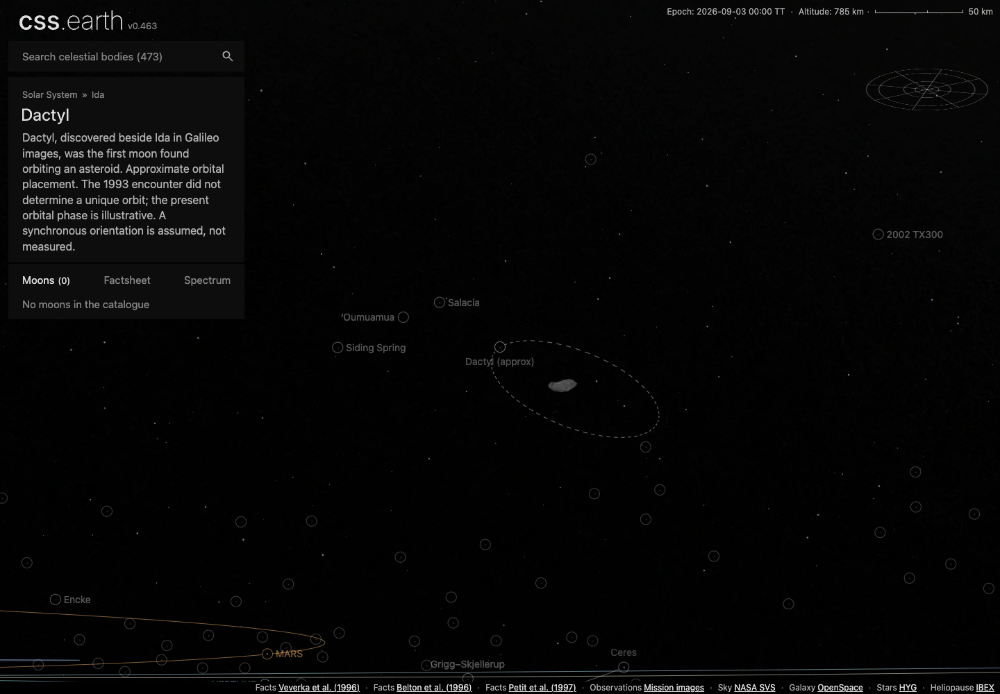
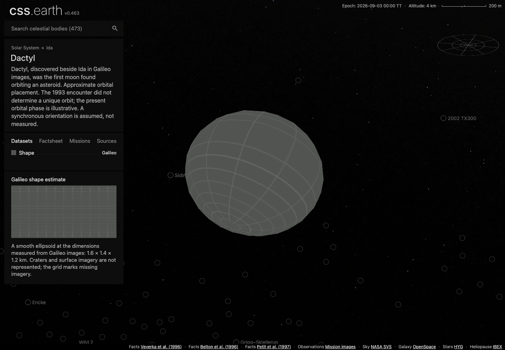
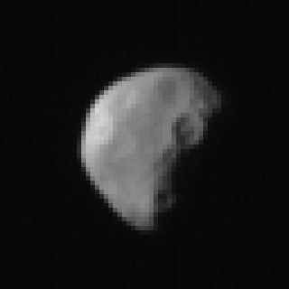
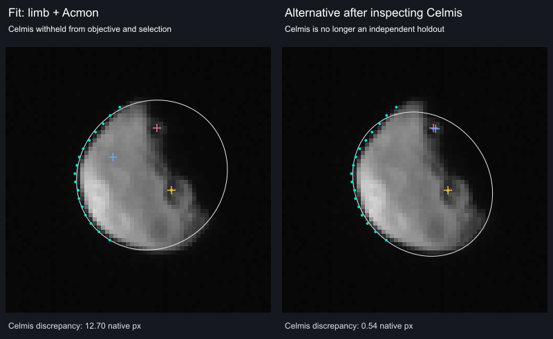
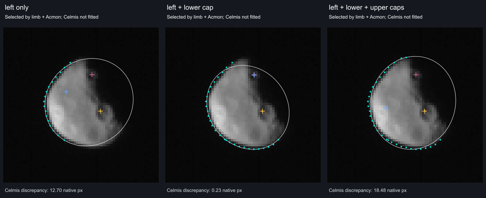
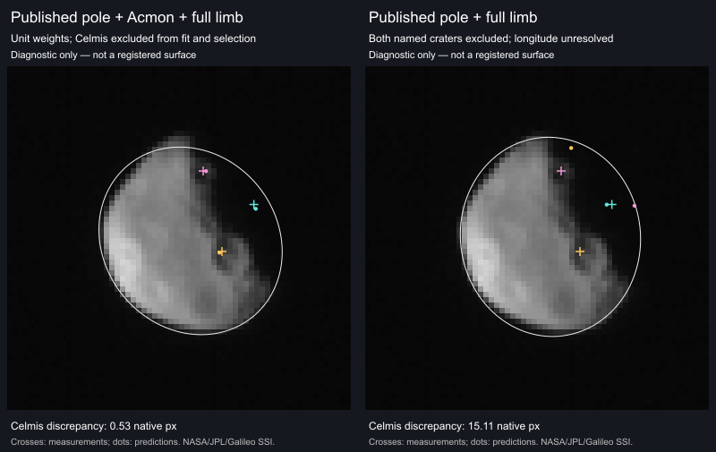

# Dactyl

Dactyl, discovered beside Ida in Galileo images, was the first moon found orbiting an asteroid. It is shown as a smooth ellipsoid at the dimensions measured from Galileo images: 1.6 × 1.4 × 1.2 km. Craters and surface imagery are not represented; the shared missing-imagery grid covers the surface. The selector detail is **Galileo**.

Shape-only views use the shared neutral gray (#808080 sRGB), a display convention, not a measurement of surface color or albedo.

## Sources

[Investigation ledger](investigations.json): recorded source decisions, evidence and conditions for revisiting them.

- [Veverka et al. (1996)](https://doi.org/10.1006/icar.1996.0045): Galileo dimensions, shape and surface observations. The publisher identifies the paper as **CC BY-NC-ND 4.0**; see [reuse terms](NOTICE.md). Its figures have not been cleared as a public texture.
- [Belton et al. (1996)](https://doi.org/10.1006/icar.1996.0044): Discovery and encounter orbit constraints.
- [Petit et al. (1997)](https://doi.org/10.1006/icar.1997.5788): Long-term orbit stability and candidate solutions.
- IAU/USGS Gazetteer of Planetary Nomenclature centre-point shapefile for Dactyl (re-retrieved 2026-09-18, public domain per its FGDC metadata), under `source/features/`: Acmon and Celmis.
- Galileo SSI frames and their original PDS labels, bad-pixel records and mission kernels, bound in [input identities](evidence/galileo/inputs.json).

[Measurements and source selection](source/measurements.json) · [Exact source pins](source/manifest.json) · [Reuse terms](NOTICE.md).

## Orbital placement

The 1993 encounter did not determine a unique orbit. [Source parameters](source/orbit/published-parameters.json) separate published constraints from assumptions. The illustration places zero mean anomaly at JD 2461286.5 TT (3 September 2026), rather than extrapolating an uncertain encounter phase. A synchronous orientation is assumed, not measured. A dashed orbit, an **(approx)** label and a circular selected marker distinguish this approximation. No uncertainty region or exact current phase is claimed.

## Evidence

The view shows the adopted shape with the missing-imagery grid. Both feature names are visible while the whole moon fits on screen; rotating hides the far-side names.

The [native Galileo frame review](evidence/galileo/review.json) preserves three 800 × 800, 8-bit SSI images. The complete cratered disk in `i2278` is the best of them. [i1578](evidence/galileo/i1578-crop.png) shows a smaller complete disk; [i2700](evidence/galileo/i2700-crop.png) contains fragments at the detector edge. The crops have no color reconstruction, calibration or surface projection. The [review command](../../../packages/bake/authoring/galileo-lucy/README.md#dactyl-photographic-source-review) writes full-detector PNGs.

**The photographic surface is still unqualified.** The published pole, Acmon and the sampled bright limb predict Celmis within 0.53 native pixel, but the camera disagrees with the mapped terrain of Figure 10 across six additional regions. Picking, paper alignment and model correspondence remain material at approximately 39 m per native pixel.

## Camera and orientation experiment

The [retained report](evidence/registration/report.json) records a diagnostic run that does not prepare a photographic dataset. [Pinned inputs](evidence/registration/inputs.json) include the original VICAR image, its label, clock and leap-second kernels, and the SSI instrument definition.

- **Detector coordinates.** The FITS array is an exact vertical inversion of the original `GO_0016/IDA/C020256/2278R.IMG`. The fit applies the SSI kernel's radial distortion, `R = r + 6.58e-9 r³`.
- **Pointing.** For `i2278`, shutter center is `1993-08-28T16:47:49.956Z`. The shared TypeScript readers' C-matrix agrees with the independent [CSPICE N0067 calculation](../../../src/objects/dactyl/fixtures/galileo-pointing.json) to `5.7e-11`. The reconstructed boresight differs from the preliminary label by 0.111075°, about 191 SSI pixels.
- **Orientation.** The fit holds the 800 × 700 × 600 m semiaxes fixed and uses bright-limb crossings plus Acmon's center; Celmis is excluded from the objective. The feature coordinates are confirmed in Table III of [Belton et al.'s mission overview](https://doi.org/10.1006/icar.1996.0032) and the Gazetteer. Pixel picks against the [USGS annotated photo](https://asc-planetarynames-data.s3.us-west-2.amazonaws.com/dactyl.pdf) are our measurements.

The lowest limb-and-Acmon fit misses Celmis by 12.70 native pixels; an alternative selected after inspecting Celmis misses by 0.54 but has no independent holdout. The [extent experiment](evidence/registration/limb-extent.json) adds lower-cap and upper-cap crossings: Celmis errors go 12.70, 0.23, then 18.48 pixels. A low limb residual does not establish a stable body orientation.

The [Veverka spectral paper](https://doi.org/10.1006/icar.1996.0037) and the [Oberst photogrammetry abstract](https://www.lpi.usra.edu/meetings/lpsc1995/pdf/1535.pdf) supply no Dactyl surface controls ([additional-source record](evidence/registration/additional-sources.json)). The [reproduction command](../../../packages/bake/authoring/galileo-lucy/README.md#dactyl-camera-and-orientation-diagnostic) reruns the checks.

## Published pole and range

[Source measurements](evidence/registration/published-controls.json) come from the complete Veverka paper. Table I gives 3,887 km to Dactyl for exposure 0202562278. Table II reports a maximum limb departure of 130 m from the ellipsoid. Figure 9B identifies the south pole; its wireframe has no labelled controls. The prose's 220° W for Celmis conflicts with Belton's Table III and the Gazetteer; we use 220° E.

| Fit | Limb RMS, ideal pixels | Acmon error, native pixels | Celmis error, native pixels |
| --- | ---: | ---: | ---: |
| Published pole, Acmon and sampled bright limb | 0.77 | 0.52 | 0.53 |
| Published pole and sampled bright limb; both craters excluded | 0.60 | 19.34 | 15.11 |

The pole alone does not determine longitude on this shape. Perturbing the printed pole and Acmon gives Celmis discrepancies of 0.48–2.02 pixels. The [reproducible result](evidence/registration/published-control-fit.json) and [command](../../../packages/bake/authoring/galileo-lucy/README.md#dactyl-published-control-diagnostic) are retained.

## Published map check

The [map review](evidence/registration/published-map-review.json) tests Figure 10, an east-positive cylindrical map of the same exposure. Eight unused printed ticks recover the plot with RMS 0.81 and maximum 1.38 figure pixels. Against six disjoint map windows, the pole-plus-Acmon camera gives unshifted correlations of −0.29 to 0.60 and suggested shifts of 2.25–4.72 native pixels. This disagreement prevents the 0.53-pixel Celmis result from qualifying the whole surface. The [reproduction command](../../../packages/bake/authoring/galileo-lucy/README.md#dactyl-published-map-review) writes a numerical report without redistributing the figure.

## Known problems

- No photographic surface is enabled. A supported map frame and source-model correspondence, or distributed image controls beyond the two named craters, are still missing.
- The ellipsoid does not model crater relief. Galileo’s resolved craters are not synthesized on it, and the generic Celestia rock texture is excluded.
- The orbital phase is illustrative and the synchronous orientation assumed.
- Named-feature outlines are not published nomenclature boundaries.

## Preparation

[Reproduction instructions](../../../packages/bake/authoring/galileo-lucy/README.md). The canonical prepared mesh contains 484 triangles, independent of device DPR.
