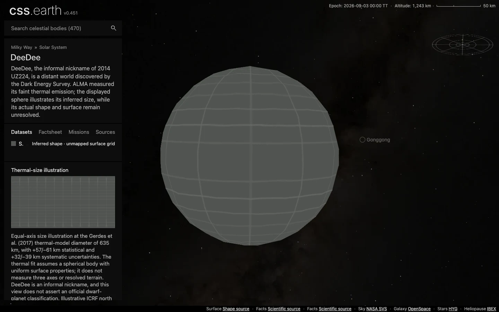

# DeeDee (2014 UZ224)

DeeDee, the informal nickname of 2014 UZ224, is a distant world discovered by the Dark Energy Survey. ALMA measured its faint thermal emission; the displayed sphere illustrates its inferred size, while its actual shape and surface remain unresolved.

Source selections, recorded trials and open questions are in the [investigation ledger](investigations.json).

## Sources

| Source | Display interpretation |
| --- | --- |
| [Gerdes et al. (2017), ApJ Letters 839, L15, Table 1 and §4 (arXiv:1702.00731v2 pp.6,9–10).](https://doi.org/10.3847/2041-8213/aa64d8) | Thermal-size illustration |
| [JPL Horizons elements](source/reference/horizons-elements.txt) and [independent vectors](source/reference/horizons-vectors.txt) | Heliocentric geometric position at the fixed 2026-09-03 epoch. |

Equal-axis size illustration at the Gerdes et al. (2017) thermal-model diameter of 635 km, with +57/−61 km statistical and +32/−39 km systematic uncertainties. The thermal fit assumes a spherical body with uniform surface properties; it does not measure three axes or resolved terrain. DeeDee is an informal nickname, and this view does not assert an official dwarf-planet classification.

Illustrative ICRF north pole (RA 0°, Dec +90°), arbitrary prime meridian and phase. No measured body pole, rotation period or surface attitude is claimed.

The normal grid marks unmapped terrain. Shadows defaults off. The radius used for display scale is the volume-equivalent radius of the adopted model, not a new independent physical measurement. [Measurements](source/measurements.json), [source manifest](source/manifest.json), and [credits](NOTICE.md) retain the numerical extraction, original byte pins and terms.

## Evidence

The [shared browser record](../../../tools/audits/distant-worlds/evidence/outer-worlds/browser-validation.json) checks this body at DPR 1 and 2: one scene, 480 native raster triangles, retained leaves during drag, Shadows and Orbit off by default, and working opt-in controls. The captures use the development server at `fc0c05a80`; [run context and byte pins](../../../tools/audits/distant-worlds/evidence/outer-worlds/run-context.json) identify the served data and omitted production/reproduction checks. Inspect [DPR 2](evidence/default-dpr2.webp) and [Shadows on after rotation](evidence/shadows-on.webp).

[Source and runtime closures](../../../tools/audits/distant-worlds/evidence/outer-worlds/qualification.json) passed, including a fresh installation of all 186 scene files across the six added bodies. The closed, connected mesh has Euler characteristic 2. Its maximum [sampled radial deviation](../../../tools/audits/distant-worlds/evidence/outer-worlds/surface-fit.json) is 3.09% of the adopted model radius; finite samples are neither a Hausdorff bound nor measurement uncertainty. See the [shared checks and limits](../../../tools/audits/distant-worlds/README.md#six-outer-worlds).

## Known problems

The fixed-epoch two-body orbit does not simulate long-term perturbations. A smooth numerical shape with an unmapped grid is not a resolved surface observation.

Source survey and preparation

- Selected: ALMA 1.3 mm thermal flux and Dark Energy Survey optical photometry constrain effective size under the published thermal assumptions; retain statistical and systematic uncertainties separately.
- Excluded as surface maps: discovery images and ALMA detection are unresolved points, not global textures or observed limb geometry.
- Useful follow-up: resolved companion constraints from subsequent Hubble imaging could change system interpretation; no detected satellite or later resolved shape product was verified in this source survey.

[Shared extraction and preparation](../../../tools/objects/source-authoring/distant-worlds/README.md) use the existing 5° ellipsoid radius table, meshoptimizer reduction and native PolyCSS `u` raster triangles. The selected dataset is fixed at mount; no geometry or imagery is generated by the runtime. Prepared provenance (`prepared/provenance.json`) traces source inputs to delivered assets.

