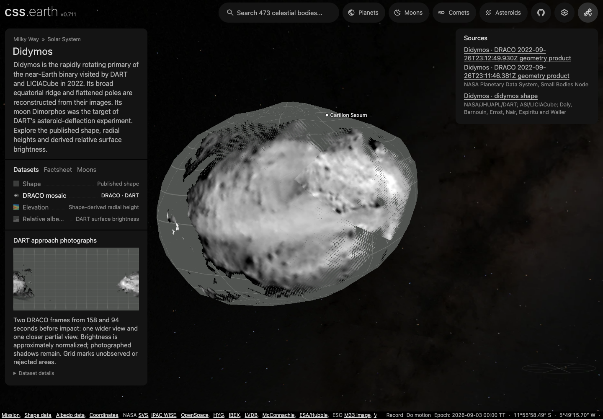

# Didymos

Shape-only views use the shared neutral gray (#808080 sRGB). This is a display convention, not a measurement of surface color or albedo; gaps within photographic and scientific datasets retain the missing-data grid.

## Sources

| View or property | Source and interpretation |
| --- | --- |
| Shape | [DART Didymos v003](https://doi.org/10.26007/bm57-x327), [Daly et al. 2023 bundle](https://doi.org/10.26007/96fn-p578): `didymos_g_9309mm_spc_obj_0000n00000_v003.obj`. The 9.309 m mesh derives from DRACO/LUKE images; source accuracy is approximately 14 m. |
| DRACO mosaic | Two calibrated [DART geometry products](https://pdssbn.astro.umd.edu/holdings/pds4-dart:data_dracoddp-v1.0/), acquired at 23:11:46.381 and 23:12:49.930 UTC on 26 September 2022. The earlier image contains the whole silhouette; the closer image shows only part of Didymos. Qualified photography covers about 14% of the displayed mesh. Unobserved surface retains the grid. |
| Relative albedo | The same SPC facet field: modeled relative brightness, not a photograph or geometric albedo. Positive finite sigma qualifies 58.2072% of source area. Other facets remain gaps; eligible values use a linear 0.75–1.4 display. |
| Elevation | Shape radius minus 365 m, false color over −120 to +90 m; not gravitational height. |

## Evidence

The retained source checks cover closed 800-face geometry, independent facet/centroid decoding and source-surface transfer. Maximum sampled radial simplification error was 7.01284 m; maximum sampled albedo transfer was 7.28123 m within 8 m. The shape and albedo assets remain byte-identical in the DRACO addition.

The [12 September 2026 browser and installation evidence](evidence/draco-mosaic-browser.json) records desktop, DPR 2 and mobile runs: dataset switching, retained drag, close zoom, both lighting states and a click on Carillon Saxum. The check used separately downloaded, hash-verified runtime files. Shadows start off. The [close-up](evidence/draco-mosaic-close.webp) and [mobile view](evidence/draco-mosaic-mobile.webp) expose the partial coverage and coarse source detail; they are product captures, not native mission photographs. Didymos's runtime inventory grows from 8.126 to 8.964 MB, entirely from the DRACO surface, shadow and thumbnail; its 40 previous assets are unchanged. These totals exclude the shared app and scene JSON.

[Source test definitions](../../../tests/objects/unit/didymos/source.test.mts).

The two DRACO cameras are recovered from the selected target's archived XYZ/pixel
pairs. Their maximum disjoint holdout residuals are below 0.00001 source pixels.
The 307 and 104 sampled intercepts transfer to the retained 9.309 m source OBJ
within 5.00 and 1.08 m respectively, inside the existing 8 m limit. These checks
establish internal camera consistency and transfer between the released meshes;
they do not improve the source's scientific accuracy. The [DRACO tests](../../../tests/objects/unit/didymos/draco.test.mts)
also require the unfiltered, mixed-body camera fit to fail.

The preparation trial uses 64 deterministic samples per triangle on the unchanged
800-face mesh: 13.96% area-weighted coverage, with 3.72% of total mesh area supplied
by the closer frame. The remaining photographic area comes from the wider frame.
The [sampling record](evidence/draco-mosaic-sampling.json) retains these results and the recipe hash. An overlap fit raises the wider frame's display brightness by 7.06%, within the
20% authored limit. This follows approximate Lommel–Seeliger disk normalization
at nearly identical phase angles; it is a display adjustment, not recovered albedo.

### Registration

<!-- registration-report:begin -->
Measured by the registration stage when the body was last prepared; the numbers are read from `prepared/surfaces.json`, not typed.

| Lens | Frames | Scored | Limb RMS | Noise floor | Systematic | Reference | Decisive | Median offset | Relief | Refined | Seams | Verdict |
| --- | --- | --- | --- | --- | --- | --- | --- | --- | --- | --- | --- | --- |
| `draco` | 2 | 0 | — | — | — | its other 2 frames | 2 of 2 | — | 2 of 2 | — | ×1.00 | no verdict |
| `luke` | 8 | 0 | — | — | — | its other 8 frames | 0 of 8 | — | 0 of 8 | — | ×1.00, 7 unjoined groups | no verdict |

Limb columns: the position-angle residual between the projected limb and the photographed contour over the frames whose outline is elongated enough to define one, the floor set by exposures minutes apart, and what remains after removing that floor in quadrature. Reference columns: each frame turned about the pole against the named reference, the frames whose peak clears both mirrors (by the strong rule, or by standing four times above them), and their median offset from the stated camera, stated only over three or more decisive frames. Relief: the same sweep against the mesh's own shading with no map and no other frame, decisive frames and their median offset. Refined: the turn a named reference applied to every camera of the lens, or why it declined; the other columns then measure the turned lens. Seams: the largest brightness ratio left between overlapping frames after level matching, and the frame groups no accepted overlap joins, whose relative brightness is unmeasured. Verdict: registered when every measurement that reached one (the outline over three scored frames, the reference or the relief over three decisive frames whose offsets agree with each other to within three degrees) is within three degrees; a sweep whose decisive offsets disagree by more reaches no verdict, because its median is a location rather than a measurement. A conflict ships only when named in the known conflicts of `report-registration.test.mts`, or when the lens ships on its paper’s comparison figure, which its observer-cameras record names.
<!-- registration-report:end -->

## Known problems

Both native geometry cubes contain Didymos and Dimorphos intercepts in their
respective body-centred frames. The recipe selects the native `radius` plane
between 0.2 and 0.5 km before fitting; tests show that this interval encloses
every vertex of the Didymos source mesh and excludes every Dimorphos vertex.
The labels list only the Dimorphos DSK although the FITS `SHAPREF1` card names
the Didymos v003 1.165 m model. That card is pinned, and the selected intercepts
are independently checked against the Didymos OBJ. The label's DSK entry alone
does not identify the primary's surface.

Photographic coverage is limited to two nearby viewing directions. Pixels above
65° incidence or emission, missing interpolation contributors, and failed mesh
or visibility checks remain gaps. Frame t-minus-158s darkens beyond 60° of incidence
(median 0.036 at 40–50°, 0.030 at 50–60°, 0.023 at 60–65° and 0.016 above 75°); shown up to 80°, it drew a black
checkerboard band along the south of the map. At 65° the band and its dark fragments are gone, and area coverage is
10.8% (22.6% at 80°; 14.0% on main, whose former 8 m source-distance limit withheld most of the band).
Display percentiles 1.1–99.9 of the displayed samples reproduce main's displayed range. Boulder shadows stay in the images. The coarse
display mesh cannot reproduce every photographed boulder, and the mosaic is not
a post-impact reconstruction. Shadows default off.

Named features: the IAU/USGS Gazetteer of Planetary Nomenclature centre-point shapefile for Didymos (retrieved 2026-09-12, re-retrieved 2026-09-18, public domain as USGS-produced data; the export ships no FGDC record, so the pin cites the USGS Copyrights and Credits statement) is pinned under `source/features/`. Preparation verifies the archive, reads the attribute table (no projection file or metadata: the authored radius scales outline sizes), drops the albedo-feature type code, folds repeated rows, and converts each positive-east centre into the body-fixed frame the radial terrain sampler uses for this mesh (longitude 0 toward the mesh +y axis, 90° E toward +x, north +z), then casts that direction through the prepared hit mesh so every anchor and outline point sits on the shape model rather than on a reference sphere. Craters and faculae trace a rim circle, other types their published extent box. Outlines are not published nomenclature boundaries.

Named features run of 2026-09-18 (this version, re-pinned from the 2026-09-12 run): the refreshed catalogue still labels 2 IAU names on the hit mesh (nothing skipped); `tests/objects/unit/surface-features.test.mts` verifies the pinned bytes, the body-frame anchors and the hit-mesh radius band against the 2026-09-18 export. The Gazetteer regenerates this export on its own schedule (USGS Astrogeology, observed weekly): the 2026-09-12 snapshot's exact bytes were superseded upstream and were not recoverable from git history, this repository's other checkouts or the R2 source mirror, so the manifest is re-pinned to the 2026-09-18 bytes; `source/manifest.json` and `source/features/manifest.json` record the acquisition. The 2026-09-12 run's headless Chrome probe (`output/probe-spheres.mts`, ignored scratch), which mounted the page, selected every lens and pinned Carillon Saxum from the sidebar search with no console errors or failed requests, has not been re-run against the 2026-09-18 export.

Smooth regions may lack image coverage; zero sigma can mean one or no images. The release reports about 3.3% volume uncertainty. Shape-specific pole/scale are retained despite later PCK15 revisions and errors in the source coordinate document. Display phase is arbitrary. The heliocentric system-barycentre position approximates the primary, omitting about 10 m of wobble; it is not an exact primary-centre ephemeris.

[Investigation ledger](investigations.json) · [Inputs](source/manifest.json) · [Preparation](source/preparation) · Provenance (`prepared/provenance.json`) · [Delivered files](inventory.json) · [Credits](NOTICE.md)

Methods and source notes

**Selected shape**

The checked acquisition plan restores the unmodified `didymos_g_9309mm_spc_obj_0000n00000_v003.obj`: 24,578 vertices, 49,152 triangles, 9.309 m mean spacing. This is the final Didymos model released by DART, derived from DRACO and LICIACube LUKE images using stereophotoclinometry. The archive also releases 4.657, 2.329 and 1.165 m versions. The selected released resolution is finer than the collection's stated approximately 14 m Cartesian accuracy uncertainty and provides adequate detail before the 800-face display simplification; mean spacing is not measurement accuracy. The source volume is 0.2033564365122846 km³ and source XYZ bounds are approximately −387.43…430.81 m, −361.11…440.34 m, and −337.93…266.55 m.

**Coordinates, scale and lighting**

OBJ positions are kilometers in the released body-fixed frame; east-positive longitude, planetocentric latitude, and +Z toward the spin pole. The original coordinates and origin are retained without recentering, axis stretching or radial re-meshing. The mean/reference radius used for physical display scale is 365 m from the shape-coordinate document; it is not the source maximum radius.

**Views and preparation**

Each triangle uses the shared native PolyCSS `u` primitive with 128 px raster sizing. Shared preparation owns normals, per-texel atlas sampling, lighting and navigation context; runtime retains the prepared DOM. Source maps preserve detail independently of mesh reduction. The existing shared orthographic snapshot owner generates the 512 px context image from this geometry and the shared grid at longitude 0°, latitude 35°, with full-phase ambient 0.45 and diffuse 0.55.

**Bounded source survey (updated 2026-09-08)**

See the [investigation ledger](investigations.json) for the recorded sources, decisions and reopening conditions.

**Context brightness**

The small resolved context marker may use the system-wide visible geometric albedo 0.15±0.02 reported by Sunshine et al., LPSC 2023 abstract 1659, [archived at NASA NTRS](https://ntrs.nasa.gov/api/citations/20230000704/downloads/Sunshine_LPSC.pdf). This is a global brightness parameter for shared observer-vantage context presentation. It does not supply surface pixels, imply uniform measured albedo, or turn Shape into a reflectance image. The original abstract is pinned in `source/reference/Sunshine_LPSC.pdf`.

**Dynamical mass and heliocentric centre**

The current DART s547 Horizons primary-body record (`920065803`), updated 2026-06-24 and pinned as `reference/horizons-primary-physical.txt`, supplies GM = 3.51278×10⁻⁸ km³/s² for shared binary-orbit context. This newer dynamical mass is independent of the older encounter-mesh radius and pole. The comparison PCK15 GM is not the adopted dynamical mass.

**Relative-albedo correspondence checks**

Daly, T., Barnouin, O., Ernst, C., Nair, H., Espiritu, R., and Waller, D. (2023), *DART Shapemodel Archive Bundle*, NASA PDS, DOI [10.26007/96fn-p578](https://doi.org/10.26007/96fn-p578). The Didymos v003 collection has DOI [10.26007/bm57-x327](https://doi.org/10.26007/bm57-x327). [Browse the released collection](https://pdssbn.astro.umd.edu/holdings/pds4-dart_shapemodel-v1.0/data_derived_didymos_model_v003/).

- **Shape** uses the shared neutral-gray material over the released terrain. It is a scientific shape model without observed surface imagery, not a photograph or measured surface albedo. Shadows default off; prepared directional lighting remains available through the control.
- **Relative albedo** displays the original v003 SPC facet field as linear grayscale from 0.75 to 1.4. This is modeled relative surface brightness, not absolute geometric albedo or a photograph. Only facets with positive finite sigma are eligible: 25,686 of 49,152 source faces, representing 58.2072% of the source mesh area. Sigma-zero values are withheld even if their nominal albedo is 1; the ordinary grid marks those gaps. Shadows stays off by default.
- **Elevation** is source radius minus a 365 m reference sphere, in meters (−120 to +90 m display scale), with prepared cartographic relief. It includes whole-body flattening and the equatorial ridge; it is not height above a gravitational equipotential.

The existing source-meshoptimizer recipe preserves original connectivity before simplifying with meshoptimizer 1.2.0 `ErrorAbsolute` and `RegularizeLight`, target 800 faces, 8 m allowed library error estimate. Its 800 faces form a closed single genus-zero surface. The estimate is 6.285758 m; this is not an exhaustive physical-error bound. A separate 2,592-direction ray comparison (5° latitude/longitude spacing, half-cell offsets) measures mean 1.64899 m, 95th percentile 3.96109 m and maximum 7.01284 m radial error from the selected source model. The simplified volume is 0.200421741 km³, about 1.44% below the selected source volume. These are display approximation errors, distinct from source uncertainty.

The preparation-only FITS table decoder checks the target, SPC source/version, map version, OBJ filename, binary column layout, units, row order and every source-facet centroid. A separate Python `struct` decoder supplied numerical anchors for the JavaScript tests: facet 35000 has relative albedo 1.0044039487838745 and sigma 0.003365033073350787; facet 49151 has 1.0014300346374512 and 0.017785750329494476; facet 0 has sigma zero and must remain missing. Reordered rows, displaced geometry, truncated records and invalid uncertainties are rejected or withheld before surface sampling.

The unchanged 800 display triangles use the existing source-surface painter. The new atlas contains 5,739,310 interior texels, of which 2,302,000 are withheld. This texel fraction is separate from the area-weighted 58.2072% source-coverage statistic. Maximum sampled source-transfer distance was 7.28123 m, below the existing 8 m bound. Radial companion maps withhold ambiguous source intersections; the displayed triangle atlas resolves the source in 3D. The same palette and validity policy produce the surface, minimap, thumbnail and legend.

The source is closed but not equally observed everywhere. The SIS says smooth areas lack image coverage and sigma zero can mean one or no contributing images. It reports approximately 3.3% volume uncertainty for this collection. We retain these source constraints, not invented craters or an ellipsoid replacement.

The shape-specific coordinate document, `didymos_coordinate_system_description_v1.pdf`, Table 2, gives ICRF pole RA 66.83°, Dec −73.0° and spin 3823°/day (2.26000523 h). That document has copy-editing errors in its title, some Dimorphos labels and its ellipsoid c value; our selection uses the clearly stated Didymos shape ID, its pole and period, and the actual mesh scale. The later mission PCK15 gives a revised pole and 355.15 m volume-equivalent radius from a different orbit/physical solution. It is retained as comparison evidence and is not used to silently rotate or rescale the selected mesh. The pole is source-bound; current prime-meridian phase is not claimed. The authored observed-pole contract selects an explicit arbitrary display phase. Prepared Sun lighting uses that display orientation and the application's fixed heliocentric epoch, not a current surface-phase ephemeris.

The heliocentric element query `65803;` targets the latest ground-based Didymos-system barycentre. The application uses that as a primary-centre approximation and adds the fitted primary-relative Dimorphos trajectory. The omitted primary wobble is approximately 10 m (the secondary-to-total GM ratio times approximately 1.15 km separation); it is small compared with the roughly 131 km sampled ±30-day heliocentric conic residual. It is not an exact primary-centre heliocentric ephemeris.

