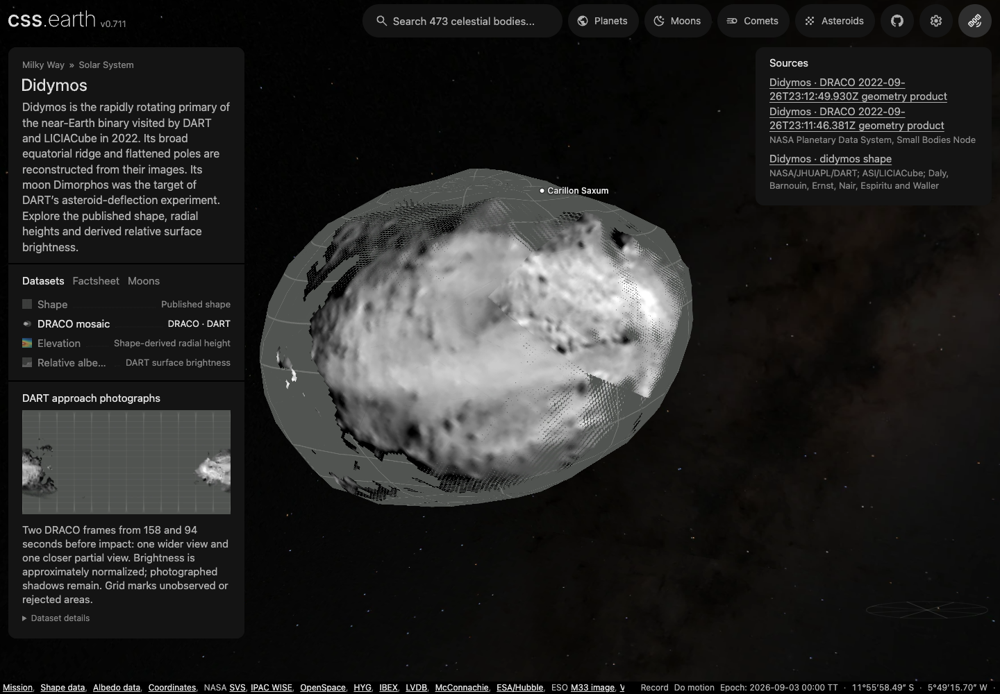

# Didymos

Didymos is shown with DART's final shape model, a relative-albedo map, elevation and a two-image DRACO mosaic. Shape-only views use the shared neutral gray (#808080 sRGB). This is a display convention, not a measurement of surface color or albedo; gaps within photographic and scientific datasets retain the missing-data grid.

## Sources

| View or property | Source and interpretation |
| --- | --- |
| Shape | [DART Didymos v003](https://doi.org/10.26007/bm57-x327), [Daly et al. 2023 bundle](https://doi.org/10.26007/96fn-p578): `didymos_g_9309mm_spc_obj_0000n00000_v003.obj`. The 9.309 m mesh derives from DRACO/LUKE images; source accuracy is approximately 14 m. |
| DRACO mosaic | Two calibrated [DART geometry products](https://pdssbn.astro.umd.edu/holdings/pds4-dart:data_dracoddp-v1.0/), acquired at 23:11:46.381 and 23:12:49.930 UTC on 26 September 2022. The earlier image contains the whole silhouette; the closer image shows only part of Didymos. Unobserved surface retains the grid. |
| Relative albedo | The same SPC facet field: modeled relative brightness, not a photograph or geometric albedo. Positive finite sigma qualifies 58.2072% of source area. Other facets remain gaps; eligible values use a linear 0.75–1.4 display. |
| Elevation | Shape radius minus 365 m, false color over −120 to +90 m; not gravitational height. |
| Named features | IAU/USGS Gazetteer of Planetary Nomenclature centre-point shapefile, retrieved 2026-09-18, public domain as USGS-produced data |

The shape bundle is Daly, T., Barnouin, O., Ernst, C., Nair, H., Espiritu, R., and Waller, D. (2023), *DART Shapemodel Archive Bundle*, NASA PDS. [Browse the released collection](https://pdssbn.astro.umd.edu/holdings/pds4-dart_shapemodel-v1.0/data_derived_didymos_model_v003/). The small context marker uses the system-wide visible geometric albedo 0.15±0.02 of Sunshine et al., LPSC 2023 abstract 1659, [archived at NASA NTRS](https://ntrs.nasa.gov/api/citations/20230000704/downloads/Sunshine_LPSC.pdf). The DART s547 Horizons primary-body record (`920065803`) supplies GM = 3.51278×10⁻⁸ km³/s² for the binary orbit.

## Processing

The shape has 24,578 vertices and 49,152 triangles in the released body-fixed frame, kept without recentering or stretching. Meshoptimizer 1.2.0 simplifies it to one closed 800-face surface with an 8 m error allowance. The display scale uses the 365 m mean radius from the shape-coordinate document, whose pole (RA 66.83°, Dec −73.0°) and 2.26000523 h period are used. The prime-meridian phase is an arbitrary display choice.

Relative albedo shows the v003 SPC facet field for the 25,686 faces with positive finite sigma. Sigma-zero values are withheld even when their nominal albedo is 1. Elevation includes whole-body flattening and the equatorial ridge.

The two DRACO cameras are recovered from the archived XYZ/pixel pairs of the selected target. The recipe keeps only intercepts with a radius between 0.2 and 0.5 km, which encloses every Didymos vertex and excludes every Dimorphos vertex. Pixels above 65° incidence or emission, missing interpolation contributors and failed visibility checks remain gaps. An overlap fit raises the wider frame's display brightness by 7.06%, within the 20% limit; this is a display adjustment, not recovered albedo.

## Evidence

- The simplified shape's radial error from the source is mean 1.64899 m, 95th percentile 3.96109 m and maximum 7.01284 m. Its volume is about 1.44% below the source.
- Albedo transfer stays within 7.28123 m of the source, inside the 8 m limit.
- The DRACO cameras' maximum holdout residuals are below 0.00001 source pixels, and their intercepts transfer to the source mesh within 5.00 and 1.08 m. This shows internal consistency, not better scientific accuracy.
- At the 65° limit the photographs cover 10.8% of the mesh area.

### Registration

<!-- registration-report:begin -->
Measured by the registration stage when the body was last prepared; the numbers are read from `prepared/surfaces.json`, not typed.

| Dataset | Frames | Scored | Limb RMS | Noise floor | Systematic | Reference | Decisive | Median offset | Relief | Refined | Seams | Verdict |
| --- | --- | --- | --- | --- | --- | --- | --- | --- | --- | --- | --- | --- |
| `draco` | 2 | 0 | — | — | — | its other 2 frames | 2 of 2 | — | 2 of 2 | — | ×1.00 | no verdict |
| `luke` | 8 | 0 | — | — | — | its other 8 frames | 0 of 8 | — | 0 of 8 | — | ×1.00, 7 unjoined groups | no verdict |

Limb columns: the position-angle residual between the projected limb and the photographed contour over the frames whose outline is elongated enough to define one, the floor set by exposures minutes apart, and what remains after removing that floor in quadrature. Reference columns: each frame turned about the pole against the named reference, the frames whose peak clears both mirrors (by the strong rule, or by standing four times above them), and their median offset from the stated camera, stated only over three or more decisive frames. Relief: the same sweep against the mesh's own shading with no map and no other frame, decisive frames and their median offset. Refined: the turn a named reference applied to every camera of the dataset, or why it declined; the other columns then measure the turned dataset. Seams: the largest brightness ratio left between overlapping frames after level matching, and the frame groups no accepted overlap joins, whose relative brightness is unmeasured. Verdict: registered when every measurement that reached one (the outline over three scored frames, the reference or the relief over three decisive frames whose offsets agree with each other to within three degrees) is within three degrees; a sweep whose decisive offsets disagree by more reaches no verdict, because its median is a location rather than a measurement. A conflict ships only when named in the known conflicts of `report-registration.test.mts`, or when the dataset ships on its paper’s comparison figure, which its observer-cameras record names.
<!-- registration-report:end -->

## Known problems

- The DRACO labels list only the Dimorphos DSK, although the FITS `SHAPREF1` card names the Didymos v003 model. The selected intercepts are checked against the Didymos OBJ instead.
- Photographs come from two nearby viewing directions. Boulder shadows stay in the images, the display mesh cannot reproduce every boulder, and the mosaic is not a post-impact reconstruction. Shadows default off.
- Smooth regions may lack image coverage, and zero sigma can mean one or no images. The release reports about 3.3% volume uncertainty.
- The shape-specific pole and scale are kept although the later PCK15 revises them, and the coordinate document has copy-editing errors.
- The heliocentric position is the system barycentre, omitting about 10 m of primary wobble.
- Named features are cast onto the shape model; rim circles and extent boxes are not published boundaries. The browser probe was not re-run against the 2026-09-18 Gazetteer export.

[Investigation ledger](investigations.json) · [Inputs](source/manifest.json) · [Preparation](source/preparation) · [Delivered files](inventory.json) · [Credits](NOTICE.md)
