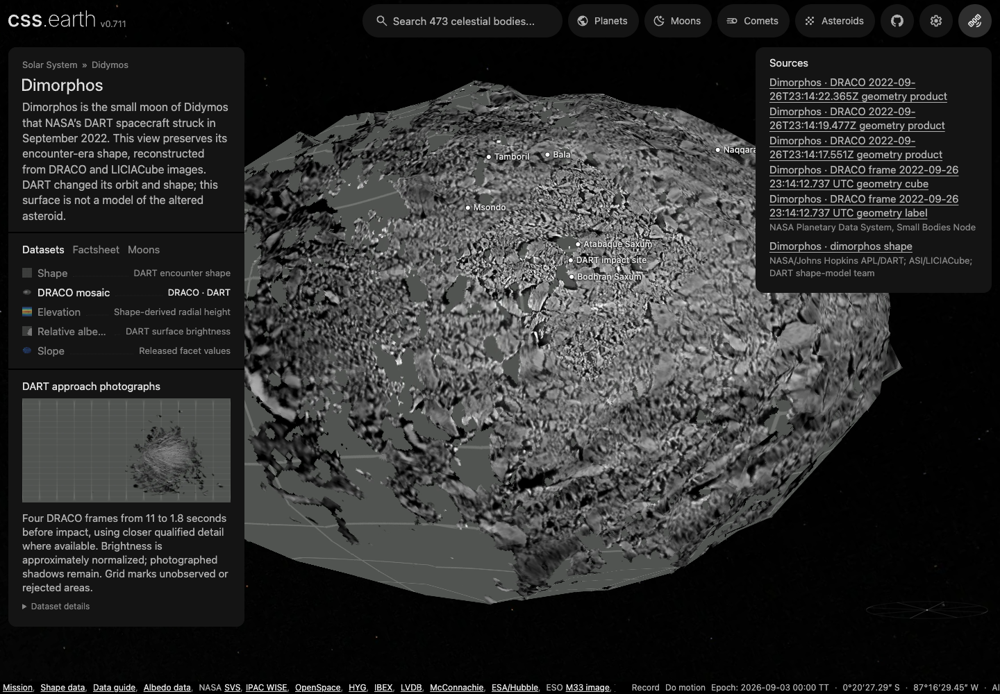

# Dimorphos

Shape-only views use the shared neutral gray (#808080 sRGB). This is a display convention, not a measurement of surface color or albedo; gaps within photographic and scientific datasets retain the missing-data grid.

## Sources

- Source: [NASA PDS DART shape model v004](https://pds.nasa.gov/ds-view/pds/viewCollection.jsp?identifier=urn:nasa:pds:dart_shapemodel:data_derived_dimorphos_model_v004), Daly/Ernst and the DART shape-model team.

- The surface is the released DART global SPC v004 encounter model, not a reconstruction of terrain after the impact.

- The v004 972 mm gravity-relative Slope FITS table is selected as its own scientific view, including modeled regions under the source gravity assumptions.

- Elevation uses source radius minus 75 m in meters, with cartographic relief; it is not measured impact displacement or height above an equipotential.

- **Relative albedo:** The original v004 relative-albedo FITS table and its [PDS4 label](source/science/dimorphos_g_0972mm_spc_alb_0000n00000_v004.xml) are pinned in [source/science/](source/science/).

- **DRACO mosaic:** four calibrated frames with native geometric backplanes from the [DART calibrated images with geometric backplanes collection](https://pds.nasa.gov/api/search/1/products/urn%3Anasa%3Apds%3Adart%3Adata_dracoddp) (Ernst, Daly, Barnouin, Espiritu and Waller 2023, DOI 10.26007/QAAN-F992). They span approximately 11 to 1.8 seconds before impact, including the last complete image. Native I/F and pixel-centre intercepts on the 0.243 m v004 DSK are pinned with their [labels](source/observations/). The phase is about 60.5° throughout. Shadows in the photographs remain after approximate disk normalization.
- **DART SPICE kernels:** fifteen kernels from the [DART SPICE kernel collection v4.0](https://naif.jpl.nasa.gov/pub/naif/pds/pds4/dart/dart_spice/spice_kernels/) (Nair, Costa Sitja and Bailey 2025, `urn:nasa:pds:dart.spice:spice_kernels::4.0`) are pinned in [source/spice/](source/spice/): leap seconds, the IAU 2009 and Didymos-system constants, the DART and Didymos-system frames, the DRACO instrument kernel, the spacecraft clock, DE430, the Didymos barycenter and system ephemerides, the DART structures and reconstructed trajectories, and the terminal-approach pointing. The seven text kernels are checked in; the eight binary SPK and CK files (182 MB) are restored by `acquisition.json`. They serve the kernel cross-check below; no lens reads them.

## Evidence

The [12 September 2026 browser and installation evidence](evidence/draco-mosaic-browser.json) records desktop, DPR 2 and mobile runs: dataset switching, retained drag, close zoom, both lighting states and a click on a named feature. All 12 existing names/sites are enabled on DRACO. Shadows start off. The [overview](evidence/draco-mosaic-overview.webp) and [mobile view](evidence/draco-mosaic-mobile.webp) show the same photographic interpretation. The check served separately downloaded, hash-verified runtime files. Dimorphos's inventory grows from 13.592 to 14.064 MB; only the DRACO surface, shadow and thumbnail change, with the other 44 assets unchanged. These totals exclude the shared app and scene JSON.

The [mosaic sampling record](evidence/draco-mosaic-sampling.json) retains camera, overlap and area results with the recipe hash. The single-frame camera/oracle evidence below still describes the retained 11-second frame. The latest SPICE cross-check reports 128,424 modeled pixels and 359 accepted samples after the shared frame update in PR #166; its acceptance bounds still pass. The earlier kernel counts below describe the previous run.

The [historical single-frame capture](evidence/draco-lens-dpr1.webp) was inspected alongside the close-up. It uses different framing and is not a matched comparison. The previous DRACO asset URLs on main returned HTTP 404, so no matched pixel diff or quantified sharpness gain is claimed. The new runtime assets have been published and all 90 assets across the two DART bodies downloaded with no reuse.

- **DRACO camera:** a pinhole camera fitted to 716 archived pixel-to-surface pairs (every 179th on-body pixel) projects the other 127,575 on-body pixels with a maximum residual of 0.00015 px and an RMS of 0.00003 px. Its recovered range, 70.39 km, agrees with the header's 70.41 km. This proves the archive's geometry is projective and that the decoder reads it in the archive's pixel convention; it does not add absolute accuracy beyond the DART SPICE solution.

- **DRACO model transfer:** the archived intercepts lie on the 0.243 m DSK; the package renders the 0.972 m OBJ. For 2,419 sampled on-body pixels the closest OBJ point is 0.057 m away on average and 0.41 m at most, within the recipe's 2 m bound. Adjacent intercepts at the nadir pixel are 0.348 m apart, the header range times its 4.95 µrad IFOV.

- **DRACO mosaic coverage:** the preparation trial accepts 18.08% of the unchanged 800-face mesh area, using 64 deterministic samples per triangle weighted by area. The 1.8, 4.7, 6.6 and 11 s frames supply 1.14%, 7.36%, 7.57% and 2.00% of total mesh area respectively. The closer frames primarily improve detail; they do not reveal the far side. The former single-frame estimate used 24 samples per triangle, so its 17.2% is not a matched before/after coverage measurement.

- **Closer-frame registration:** maximum camera holdout residuals are 0.00024, 0.00028 and 0.00020 px for the 6.6, 4.7 and 1.8 s frames. Their 4,603, 4,946 and 4,946 sampled intercepts all transfer within 0.45 m of the retained 0.972 m source OBJ, inside the unchanged 2 m policy. The last complete image's native footprint is about 0.056 m per pixel, compared with 0.348 m in the 11 s frame. These are source footprints, not a claim that every displayed texel resolves that scale.

- **Mosaic selection and levels:** the closest qualified frame takes precedence. Moderate-angle overlaps at identical surface locations fit gains of 1.000, 1.063, 1.110 and 1.203 from closest to widest, after the existing approximate Lommel–Seeliger normalization. The authored gain limit is 1.25; overlap pairs with log-MAD above 0.15 are rejected. The direct closest/widest pair is rejected, while the intermediate frames connect the fit. This is relative display brightness, not albedo or a correction for cast shadows.

- **DRACO pixel-scale planes:** the archived horizontal and vertical pixel-scale planes read 19.94 m where the intercepts are 0.348 m apart, a ratio of 57.3, which is 180/π. The decoder reports and never uses them.
- **DRACO kernel cross-check:** the same frame decoded through the `spice-camera` format, with the camera derived from the pinned kernels instead of fitted to the archived intercepts. The spacecraft clock string `0401930040:07327` gives the header's ephemeris time to 0.4 µs and the recipe's UTC start time exactly. Projecting 18,331 archived intercepts (every 7th on-body pixel) through the kernel camera lands them 0.509 px RMS from their pixels: a constant offset of (−0.41, +0.30) px with 0.005 px of scatter about it, and the kernel camera stands 34.9 m from the intercept-fitted camera, 13 m further from the target than the header range. The offset and separation are the difference between the archived v04 pointing and s542 system ephemeris and the spc_v03 and s527 solutions the cube label cites, which the collection no longer holds. Stellar aberration at 44.2 µrad (nine pixels) is required to reach the instrument kernel's detector centre. The kernel Sun direction agrees with a JPL Horizons vector for DART at the same instant to 10⁻⁶°. On the retained OBJ the kernel camera yields 128,423 on-body pixels against the archive's 128,291; 358 sampled archived intercepts qualify with a mean separation of 0.48 m and a maximum of 1.40 m, within the 2 m bound.
- **DRACO limb refinement:** the same frame through `spice-camera` with `refinement: mesh-limb`, fitting one rotation of the kernel camera to the lit limb of the 0.972 m OBJ. Of 1,500 sub-pixel edges, 996 are terminator, shadow or unmatched and never enter; the fit uses the rest in fit and holdout halves. The unrefined kernel camera projects the archived intercepts at 0.51 px RMS and the refined one at 0.59 px, a 1.0 px boresight shift inside the limb's own 1.5 px holdout residual on 229 edges, which is the OBJ's three-pixel facets and the boulders it lacks. Pushed 30 px off the archive, the camera returns to 0.24 px; pushed 150 px with 0.17° of roll, to 0.55 px, with holdout residuals of 1.9 and 2.1 px against a 2.5 px budget. Range, focal length and Sun direction are never changed.
- **SPICE oracle:** `tools/oracles/spice/dart-draco.py` runs SpiceyPy 8.2.0 (CSPICE N0067) over the same fifteen pinned kernels and `tools/oracles/spice/dart-draco.oracle.test.mts` compares: leap seconds, TDB and the spacecraft clock agree to a microsecond over nine epochs; 202 states (geometric, `LT`, `LT+S`, `CN`, `CN+S`, in J2000 and in the body frame) agree to a millimetre, with velocities to 6 × 10⁻⁸ km/s inside the terminal type 13 segment and 10⁻¹⁰ km/s elsewhere; 21 frame rotations across every kernel frame class agree to a nanoradian; and 33 archived intercepts, read from the cube with pds4_tools rather than the pipeline's decoder and placed by CSPICE through `DART_DRACO` with `LT+S`, land within 0.03 px of where the kernel camera puts them, because the camera folds one aberration rotation at the target and CSPICE aberrates each point.
- **PDS4 oracle:** `tools/oracles/pds/dart-draco-cube.py` reads every label-defined plane of the cube with NASA's pds4_tools 1.4; 48 sampled values per plane and 8 flagged ones match the decoder exactly for I/F and the X/Y/Z intercepts, to 10⁻⁴° for the converted angles, and the 128,291 on-body pixel count agrees.
- **Archived illumination angles:** the archived phase plane sits 0.866° ± 0.001° above the phase angle from the kernel geometry, constant across the frame, and incidence angles from OBJ facet normals with the kernel Sun sit 0.7° below the archived incidence plane in the median. The kernel Sun direction is confirmed by Horizons, so the offset is in the archive's illumination angles, not in its intercepts.

- **DRACO checks:** `tools/objects/terrestrial-layers/pds4-geometry-cube.test.mts` (synthetic cube and label), `tests/objects/unit/dimorphos/draco.test.mts` (the pinned cube, camera fit and OBJ transfer), `tests/objects/unit/dimorphos/prepared.test.mts` (package with the new lens) and the profile validator cases in `tools/objects/terrestrial-layers/profile.test.mts` passed at the revision that prepared this package. The kernel cross-check is `tests/objects/unit/dimorphos/draco-spice.test.mts`, with the kernel subset's own tests in `packages/spice/src/*.test.ts` and the camera assembly in `packages/spice/src/camera.test.ts`; the limb refinement is `tests/objects/unit/dimorphos/draco-refinement.test.mts` with its synthetic ellipsoid cases in `tools/objects/terrestrial-layers/limb-refinement.test.mts`; the oracle comparisons are `tools/oracles/spice/dart-draco.oracle.test.mts` and `tools/objects/terrestrial-layers/pds4-geometry-cube.oracle.test.mts` over the fixtures in `tests/oracles/`; the prepared package is unchanged by any of them. The lens was inspected in Chrome at `/dimorphos/#dataset=draco`; [the capture](evidence/draco-lens-dpr1.webp) is Chrome 152 at 1280 × 800, DPR 1, Shadows off, with the view centred at 8.2° S, 274.6° E beside the sub-spacecraft point; no console errors or failed requests.

- **Slope registration:** A verified centroid bijection reconciles 131,072 exporter-order differences; all rows match uniquely within 0.001 m (maximum observed residual 0.00002393 m). That residual measures source registration, not scientific accuracy.

- Qualification artifacts are under `output/asteroids-dart-radar/` in the implementation checkout.

### Registration

<!-- registration-report:begin -->
Measured by the registration stage when the body was last prepared; the numbers are read from `prepared/surfaces.json`, not typed.

| Lens | Frames | Scored | Limb RMS | Noise floor | Systematic | Reference | Decisive | Median offset | Relief | Refined | Seams | Verdict |
| --- | --- | --- | --- | --- | --- | --- | --- | --- | --- | --- | --- | --- |
| `draco` | 4 | 0 | — | — | — | its other 4 frames | 0 of 4 | — | 4 of 4, 0.00° | — | ×1.01 | registered |

Limb columns: the position-angle residual between the projected limb and the photographed contour over the frames whose outline is elongated enough to define one, the floor set by exposures minutes apart, and what remains after removing that floor in quadrature. Reference columns: each frame turned about the pole against the named reference, the frames whose peak clears both mirrors (by the strong rule, or by standing four times above them), and their median offset from the stated camera, stated only over three or more decisive frames. Relief: the same sweep against the mesh's own shading with no map and no other frame, decisive frames and their median offset. Refined: the turn a named reference applied to every camera of the lens, or why it declined; the other columns then measure the turned lens. Seams: the largest brightness ratio left between overlapping frames after level matching, and the frame groups no accepted overlap joins, whose relative brightness is unmeasured. Verdict: registered when every measurement that reached one (the outline over three scored frames, the reference or the relief over three decisive frames whose offsets agree with each other to within three degrees) is within three degrees; a sweep whose decisive offsets disagree by more reaches no verdict, because its median is a location rather than a measurement. A conflict ships only when named in the known conflicts of `report-registration.test.mts`, or when the lens ships on its paper’s comparison figure, which its observer-cameras record names.
<!-- registration-report:end -->

## Known problems

Named features: the IAU/USGS Gazetteer of Planetary Nomenclature centre-point shapefile for Dimorphos (retrieved 2026-09-12, re-retrieved 2026-09-18, public domain as USGS-produced data; the export ships no FGDC record, so the pin cites the USGS Copyrights and Credits statement) is pinned under `source/features/`. Preparation verifies the archive, reads the attribute table (no projection file or metadata: the authored radius scales outline sizes), drops the albedo-feature type code, folds repeated rows, and converts each positive-east centre into the body-fixed frame the radial terrain sampler uses for this mesh (longitude 0 toward the mesh +y axis, 90° E toward +x, north +z), then casts that direction through the prepared hit mesh so every anchor and outline point sits on the shape model rather than on a reference sphere. Craters and faculae trace a rim circle, other types their published extent box. Outlines are not published nomenclature boundaries.

Landing sites: 1 spacecraft landing, touchdown or impact sites are labelled beside the IAU names (`source/features/sites.json`). Each coordinate quotes the NASA NSSDCA, PDS, LROC, agency or paper page it was read from, with the stated latitude kind and longitude convention; sites are unsized points ranked like a 20 km feature and the caption shows the quoted source sentence with its publisher.

Named features run of 2026-09-18 (this version, re-pinned from the 2026-09-12 run): the refreshed catalogue labels 12 IAU names on the hit mesh (nothing skipped); `tests/objects/unit/surface-features.test.mts` verifies the pinned bytes, the body-frame anchors and the hit-mesh radius band against the 2026-09-18 export. The Gazetteer regenerates this export on its own schedule (USGS Astrogeology, observed weekly): the 2026-09-12 snapshot’s exact bytes were superseded upstream and were not recoverable from git history, this repository’s other checkouts or the R2 source mirror, so the manifest is re-pinned to the 2026-09-18 bytes; `source/manifest.json` and `source/features/manifest.json` record the acquisition. The 2026-09-12 run’s headless Chrome probe (`output/probe-spheres.mts`, ignored scratch), which mounted the page, selected every lens and pinned Bala from the sidebar search with no console errors or failed requests, has not been re-run against the 2026-09-18 export.

- **Archived illumination angles:** the cube's phase and incidence planes carry a constant 0.87° offset from the kernel geometry (see the evidence above). The DRACO lens normalizes brightness with the archived incidence and emission angles as published; at the frame's typical 60° incidence the offset moves the Lommel-Seeliger gain by about 1%, more near the terminator. The cause is not identified in the archive documentation.
- **DRACO mosaic:** four closely spaced approach views. The far side and the terminator region beyond 80° incidence keep the grid; high-emission views stretch surface detail, and boulder shadows remain dark because brightness is not a quality mask. Display brightness uses the closest frame's 1st–99th percentiles after disk normalization and overlap matching. It is not albedo. The source mesh and 800-face display mesh cannot reproduce every photographed boulder.

- Model precision varies with DRACO/LICIACube coverage and SPC constraints. A closed model does not mean every facet was photographed with the same precision.

- **Relative albedo:** This is the encounter-facing SPC model's relative brightness field, not a photograph, absolute/geometric albedo, or a measurement of the post-impact surface. `SIGMA > 0` requires multiple contributing images in the archive; zero-sigma nominal values remain unavailable.

- **Albedo support:** The accepted triangles cover 31.2138% of the original mesh's summed area; this is an exact fraction of those model triangles, not a precision claim about the real surface. Unqualified facets and transfer gaps use the common neutral gray.

- **Orientation and orbit:** The displayed mesh uses the observed pre-impact pole (ICRF RA 69.70029°, declination −72.69527°) and an explicitly arbitrary display phase. The pre-impact 11.92177 h period is source metadata, not a post-impact attitude prediction. The shared solar context uses the post-impact DART s547 Dimorphos trajectory relative to the Didymos primary, fitted to the existing precessing Kepler model over JD 2461256.5–2461316.5. This is a compact display fit, not a long-term binary dynamics solution.

[Inputs](source/manifest.json) · Provenance (`prepared/provenance.json`) · [Delivered files](inventory.json) · [Credits](NOTICE.md)

## Methods and source notes

Detailed source survey, assumptions and preparation

The 0.972 m OBJ release preserves 98,306 Cartesian vertices and 196,608 triangular plates in kilometers, with original origin, winding and connectivity. The archive reports a closed surface with volume 0.001759765951701106 km³ and dimensions approximately 178.44 × 169.25 × 114.60 m. The 75 m reference sphere rounds this model's volume-equivalent radius; it is not a gravitational datum.

Exact URL, byte size and SHA-256 are in `source/manifest.json`; original label and Software Interface Specification are retained in `source/reference/`.

## Survey and disposition

The [investigation ledger](investigations.json) records the selected DRACO mosaic, shape and scientific fields, along with deferred local models and other imagery.

## Relative albedo

The FITS header names the selected OBJ, but its rows use a different facet order: 131,072 of 196,608 rows are permuted. Preparation resolves a complete bijection from recorded centroids to the exact original triangles within 1 mm. An independent Astropy/scipy cKDTree check gives a maximum correspondence residual of 0.024 mm, with every second-nearest candidate at least 0.289 m away. Duplicate, ambiguous or displaced centroids fail. The index-ordered Didymos path retains its original strict behavior.

There are 60,464 accepted facets and 136,144 withheld facets. Display transfer uses the existing closest-source-point sampler and 2 m acceptance bound. Values span 0.451341–1.290672 and use a linear grayscale display range of 0.45–1.30. No facet is filled from its neighbours.

## DRACO photograph

The cube `dart_0401930040_12262_01_geo.fits` is one FITS primary data unit with sixteen 1024 × 1024 big-endian float planes. Its PDS4 label is the authority for plane identity, byte offsets, units and special constants. The recipe's `cube` block names the label planes for I/F, the X/Y/Z intercepts and the angles, the collection, target, observing system and DSK, and the FITS header values that must agree (mission, instrument, target, calibration flags, special values, acquisition time, plane descriptions and shape reference); the shared `pds4-geometry-cube` decoder checks every one of them and converts units. Valid pixels need finite intercepts, angles and I/F; the 512 × 512 readout window leaves 128,291 on-body pixels, none saturated.

The camera is recovered from the archived intercepts by the shared projective fit used for 67P (`tools/objects/surface-observations/cameras.mts`), then every displayed sample is re-derived on the retained OBJ: closest source point within 2 m, every bilinear contributor within 2 m of that point, visibility from the recovered camera against the full mesh within 0.5 m, emission below 80°, and Lommel-Seeliger disk normalization with incidence below 80° and gain at most 3. No phase correction is applied; the frame has a single phase angle. The equirectangular preview and the 640 × 320 minimap are derived from the same samples.

## SPICE kernel cross-check

`tests/objects/unit/dimorphos/draco-spice.test.mts` decodes the same cube through `format: "spice-camera"` (`tools/objects/terrestrial-layers/spice-camera.mts`), reading only the I/F plane and the header's spacecraft clock card. The kernel subset in `@cssearth/spice` (`packages/spice`) loads the pinned set in metakernel order: the leap-second and clock kernels turn `ACQTMSOC` into ephemeris time; DE430, the Didymos barycenter and system ephemerides and the DART trajectories chain the spacecraft and Dimorphos to the solar-system barycenter (SPK types 1, 2, 5, 8 and 13); the CK type 3 pointing, the `DART_DRACO` switch frame, the terminal fixed-offset quaternion and the parameterized `DIMORPHOS_FIXED` Euler frame orient the detector in the body frame; light time and stellar aberration follow SPICE's LT+S. The DRACO instrument kernel supplies the focal length, pixel pitch, detector centre and boresight; the recipe states that stored columns follow −X and rows −Y of the instrument frame. Per-pixel geometry is then derived on the retained OBJ exactly as for the OSIRIS and L'LORRI camera routes. Every number in the evidence list comes from that test and from `packages/spice/src/camera.test.ts`.

## Limb refinement

`tests/objects/unit/dimorphos/draco-refinement.test.mts` adds `limbRefinement: { method: "mesh-limb" }` to the kernel recipe. `tools/objects/terrestrial-layers/limb-refinement.mts` thresholds the I/F plane just above the space background (the median and median absolute deviation of the class below Otsu's split), keeps body pixels whose background neighbour connects to space and whose surface two pixels inward is still bright, places each edge at the pixel's fractional coverage, and searches along the edge normal for the limb the OBJ predicts through the camera; a match whose limb faces away from the Sun is a terminator edge and is dropped. The match window doubles until the matched count plateaus, a damped least-squares fit with a Huber cost recovers the rotation, a robust cut removes outliers, and the holdout half of the edges is re-matched within a tight window. The correction, the residuals before and after, the matched fraction and the thresholds are reported; the recipe's budget refuses the frame when the correction or the holdout residual exceeds it. The numbers in the evidence list come from that test at the revision that prepared this package; the prepared package is unchanged.

## Geometry and lighting

The existing `source-meshoptimizer` path simplifies original indexed geometry with Meshoptimizer 1.2.0, ErrorAbsolute and RegularizeLight. Target: 800 faces, 2 m simplifier error limit, native PolyCSS `u` raster triangles, 128 px tiles. The resulting mesh is closed, connected and genus zero. On 8,192 equal-area directions, source-to-prepared radial differences average 0.500 m, p95 1.090 m, maximum 2.788 m; the simplifier estimate is 1.668 m. The estimator is not a maximum scientific error guarantee. No boulders or unobserved terrain are synthesized.

The fixed sunlight is illustrative in that display frame. Shadows default off; all lighting texels are prepared and runtime DOM remains retained.

The numeric application epoch is JD 2461286.5 (2026-09-03 TT). The source Horizons values are TDB, approximated as TT within 2 ms. Six independent vectors measure 54.003 m maximum positional residual and 3.135% radial residual. Didymos's heliocentric center uses its pinned small-body elements; Dimorphos remains its satellite.

## Notices and qualification

Source/context/title/sky notices are retained beside the package.

## Gravity-relative slope and B2 terrain

Every one of the 196,608 slope-table rows is registered to its source triangle. Display colors use the closest point on the full-source mesh within the authored 2 m distance limit; they are not interpolated across facets. Original table row IDs are retained in the slope preparation atlas index.

The exact v004 972 mm PDS slope table is used, in degrees and including modeled regions. Its label defines gravity using uniform density, rotation and Didymos. This gravity-relative field remains distinct from radius-based elevation and from the separately qualified, positive-sigma relative-albedo coverage.

The slope facet-science flat preview is explicitly 640 × 320, with nearest, lossless packing for its minimap and temporary projective textures. It makes 204,800 unique-ray queries; ambiguous radial intersections remain missing. This is a display-preview resolution, not a new scientific grid. The complete 196,608-row slope table, native triangle atlas dimensions and original-row atlas indices are unchanged. Native slope material colors still query the full source surface directly and never sample this reduced flat preview. This preview contract is specific to the B2 slope lens; relative albedo retains its own source-facet path.

