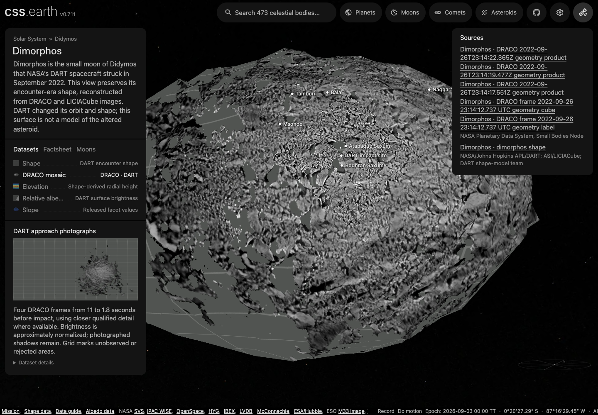

# Dimorphos

Dimorphos is shown on the released DART global SPC v004 encounter model, not a
reconstruction of terrain after the impact. Datasets are a four-frame DRACO
photograph mosaic, relative albedo, gravity-relative slope and elevation.
Shape-only views use the shared neutral gray (#808080 sRGB). This is a display
convention, not a measurement of surface color or albedo; gaps within
photographic and scientific datasets retain the missing-data grid.

## Sources

- **Shape:** [NASA PDS DART shape model v004](https://pds.nasa.gov/ds-view/pds/viewCollection.jsp?identifier=urn:nasa:pds:dart_shapemodel:data_derived_dimorphos_model_v004), Daly/Ernst and the DART shape-model team.
- **Slope and elevation:** the v004 972 mm gravity-relative Slope FITS table, including modeled regions under the source gravity assumptions. Elevation uses source radius minus 75 m, with cartographic relief; it is not measured impact displacement or height above an equipotential.
- **Relative albedo:** the original v004 relative-albedo FITS table and its [PDS4 label](source/science/dimorphos_g_0972mm_spc_alb_0000n00000_v004.xml), pinned in [source/science/](source/science/).
- **DRACO mosaic:** four calibrated frames with native geometric backplanes from the [DART calibrated images with geometric backplanes collection](https://pds.nasa.gov/api/search/1/products/urn%3Anasa%3Apds%3Adart%3Adata_dracoddp) (Ernst, Daly, Barnouin, Espiritu and Waller 2023, DOI 10.26007/QAAN-F992). They span approximately 11 to 1.8 seconds before impact, including the last complete image. Native I/F and pixel-centre intercepts on the 0.243 m v004 DSK are pinned with their [labels](source/observations/).
- **DART SPICE kernels:** fifteen kernels from the [DART SPICE kernel collection v4.0](https://naif.jpl.nasa.gov/pub/naif/pds/pds4/dart/dart_spice/spice_kernels/) (Nair, Costa Sitja and Bailey 2025, `urn:nasa:pds:dart.spice:spice_kernels::4.0`), pinned in `source/spice/`. The seven text kernels are checked in; the eight binary SPK and CK files (182 MB) are restored by `acquisition.json`. They serve the kernel cross-check below; no dataset reads them.
- **Named features:** the IAU/USGS Gazetteer of Planetary Nomenclature centre-point shapefile for Dimorphos (public domain as USGS-produced data; the export ships no FGDC record, so the pin cites the USGS Copyrights and Credits statement), pinned under `source/features/`.
- **Landing sites:** 1 impact site in `source/features/sites.json`, quoting the page it was read from.

[Inputs](source/manifest.json) · [Delivered files](inventory.json) · [Credits](NOTICE.md)

## Processing

The 0.972 m OBJ release has 98,306 vertices and 196,608 triangular plates. It is
simplified with Meshoptimizer 1.2.0 to 800 faces within a 2 m error limit. On
8,192 equal-area directions, source-to-prepared radial differences average
0.500 m, p95 1.090 m, maximum 2.788 m. No boulders or unobserved terrain are
synthesized.

The DRACO camera is recovered from the archived intercepts by the shared
projective fit, then every displayed sample is re-derived on the retained OBJ:
closest source point within 2 m, visibility from the camera, emission below 80°,
and Lommel-Seeliger disk normalization with incidence below 80° and gain at most
3. The closest qualified frame takes precedence, and overlaps fit gains of 1.000,
1.063, 1.110 and 1.203 from closest to widest.

The relative-albedo rows use a different facet order from the OBJ, so
preparation resolves a complete bijection from recorded centroids to the exact
original triangles within 1 mm. Values span 0.451341–1.290672 on a linear
grayscale range of 0.45–1.30. No facet is filled from its neighbours. Every one
of the 196,608 slope rows is registered to its source triangle, and colors are
not interpolated across facets.

Named features are cast through the prepared hit mesh so every anchor and
outline point sits on the shape model. Craters and faculae trace a rim circle,
other types their published extent box.

The [investigation ledger](investigations.json) records the selected DRACO
mosaic, shape and scientific fields, and the deferred local models and imagery.

## Evidence

- **DRACO camera:** a pinhole camera fitted to 716 archived pixel-to-surface pairs projects the other 127,575 on-body pixels with an RMS of 0.00003 px. Its range, 70.39 km, agrees with the header's 70.41 km.
- **Model transfer:** for 2,419 sampled on-body pixels the closest OBJ point is 0.057 m away on average and 0.41 m at most, within the 2 m bound.
- **Mosaic coverage:** the mosaic covers 18.08% of the 800-face mesh area. The closer frames mainly improve detail; they do not reveal the far side. The last complete image's native footprint is about 0.056 m per pixel, against 0.348 m in the 11 s frame.
- **Kernel cross-check:** the same frame with a camera derived from the pinned kernels lands the archived intercepts 0.509 px RMS from their pixels, a constant offset of (−0.41, +0.30) px. The kernel Sun direction agrees with JPL Horizons to 10⁻⁶°.
- **Oracles:** SpiceyPy 8.2.0 over the same kernels agrees on states to a millimetre and places archived intercepts within 0.03 px of the kernel camera. NASA's pds4_tools 1.4 reads every cube plane and matches the decoder exactly for I/F and intercepts.
- **Slope registration:** all rows match uniquely within 0.001 m. That residual measures source registration, not scientific accuracy.
- **Named features:** 12 IAU names are labelled on the hit mesh, nothing skipped.

### Registration

<!-- registration-report:begin -->
Measured by the registration stage when the body was last prepared; the numbers are read from `prepared/surfaces.json`, not typed.

| Dataset | Frames | Scored | Limb RMS | Noise floor | Systematic | Reference | Decisive | Median offset | Relief | Refined | Seams | Verdict |
| --- | --- | --- | --- | --- | --- | --- | --- | --- | --- | --- | --- | --- |
| `draco` | 4 | 0 | — | — | — | its other 4 frames | 0 of 4 | — | 4 of 4, 0.00° | — | ×1.01 | registered |

Limb columns: the position-angle residual between the projected limb and the photographed contour over the frames whose outline is elongated enough to define one, the floor set by exposures minutes apart, and what remains after removing that floor in quadrature. Reference columns: each frame turned about the pole against the named reference, the frames whose peak clears both mirrors (by the strong rule, or by standing four times above them), and their median offset from the stated camera, stated only over three or more decisive frames. Relief: the same sweep against the mesh's own shading with no map and no other frame, decisive frames and their median offset. Refined: the turn a named reference applied to every camera of the dataset, or why it declined; the other columns then measure the turned dataset. Seams: the largest brightness ratio left between overlapping frames after level matching, and the frame groups no accepted overlap joins, whose relative brightness is unmeasured. Verdict: registered when every measurement that reached one (the outline over three scored frames, the reference or the relief over three decisive frames whose offsets agree with each other to within three degrees) is within three degrees; a sweep whose decisive offsets disagree by more reaches no verdict, because its median is a location rather than a measurement. A conflict ships only when named in the known conflicts of `report-registration.test.mts`, or when the dataset ships on its paper’s comparison figure, which its observer-cameras record names.
<!-- registration-report:end -->

## Known problems

- **Archived illumination angles:** the cube's phase and incidence planes carry a constant 0.87° offset from the kernel geometry. The DRACO dataset normalizes brightness with the archived angles as published; at the frame's typical 60° incidence the offset moves the Lommel-Seeliger gain by about 1%, more near the terminator. The cause is not identified in the archive documentation.
- **DRACO mosaic:** four closely spaced approach views. The far side and the terminator region beyond 80° incidence keep the grid, high-emission views stretch surface detail, and boulder shadows remain dark. Display brightness is not albedo. The 800-face display mesh cannot reproduce every photographed boulder.
- Model precision varies with DRACO/LICIACube coverage and SPC constraints. A closed model does not mean every facet was photographed with the same precision.
- **Relative albedo:** this is the SPC model's relative brightness field, not a photograph, absolute albedo, or a measurement of the post-impact surface. The accepted triangles cover 31.2138% of the mesh area; unqualified facets use the common neutral gray.
- **Named features:** outlines are not published nomenclature boundaries.
- Until 5 October 2026 the faces were drawn from both sides; they now hide the far side, as on every other shape-model body, and the bake builds 7 depth groups. A drag on an iPad then had no frame over 33 ms of 390, the longest 30 ms; it was not timed before.
- **Orientation and orbit:** the mesh uses the observed pre-impact pole (ICRF RA 69.70029°, declination −72.69527°) and an explicitly arbitrary display phase. The pre-impact 11.92177 h period is not a post-impact attitude prediction. The orbit is a compact display fit to the post-impact DART s547 trajectory, not a long-term binary dynamics solution.
