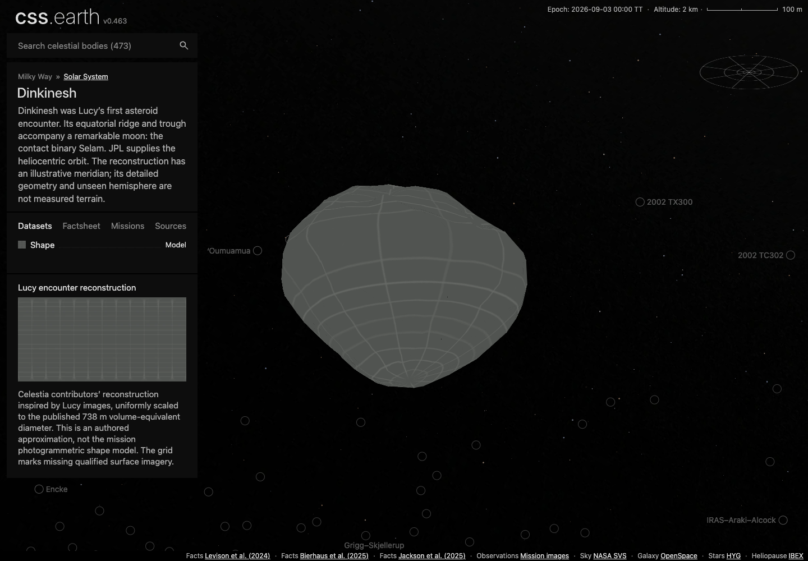
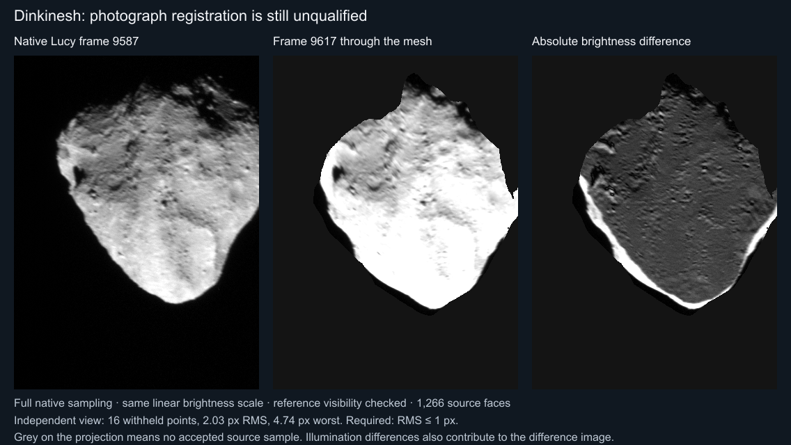

# Dinkinesh

Shape-only views use the shared neutral gray (#808080 sRGB). This is a display convention, not a measurement of surface color or albedo; gaps within photographic and scientific datasets retain the missing-data grid.

Dinkinesh was Lucy’s first asteroid encounter. Its equatorial ridge and trough accompany a remarkable moon: the contact binary Selam.

## Representation

The default **TEMPEST shape** dataset shows the recovered numerical model in
its original metre coordinates: 635 vertices, 1,266 faces and a 737.508 m
volume-equivalent diameter. The **Celestia model** dataset retains the earlier
authored reconstruction for comparison. Both use the ordinary missing-imagery
grid, one shared camera and the existing PolyCSS raster-triangle renderer.
Only the selected model is displayed and pickable.

The recovered file is associated with the published Lucy stereo-derived thermal
model. Its exact upstream mission-model version, prime meridian and observed/fill
mask remain unknown. The grid means photography is unavailable; it does not
classify terrain as measured. Existing Gazetteer places remain restricted to the
Celestia dataset because their placement has not been qualified in the recovered
frame. Shadows default to off.

## Sources

- [TEMPEST Dinkinesh mesh, Git 7df4c88](https://github.com/duncanLyster/TEMPEST/blob/7df4c88063ebe811cbdd25b97c19f85559607459/data/shape_models/dinkinesh.stl): preserved numerical shape; original coordinates and connectivity retained.
- [Lyster, Howett & Penn (2025)](https://doi.org/10.5194/epsc-dps2025-546): thermal-model methods, the 1,266-facet derivative and its source association.

- [Levison et al. (2024)](https://doi.org/10.1038/s41586-024-07378-0): Lucy discovery, ridge and contact-binary satellite.
- [Bierhaus et al. (2025)](https://doi.org/10.3847/PSJ/ae1968): Revised shape, geology and 738 m equivalent diameter.
- [Jackson et al. (2025)](https://doi.org/10.3847/PSJ/ade23c): Rotation pole and thermal constraints.

[Measurements and source selection](source/measurements.json) · [Exact source pins](source/manifest.json) · [Reuse terms](NOTICE.md) · [Investigation ledger](investigations.json).

The original Celestia reconstruction is CC BY 4.0, credited to ItzImcool and domi9. It is centered, rotated from Y-up to Z-up and uniformly scaled to 738 m volume-equivalent diameter. Its resulting extents are 846.2 × 846.3 × 708.5 m, which differ from the later mission model’s published 910 × 870 × 716 m extents. Detailed relief and the unseen hemisphere remain authored approximations. The conversion omits 136 exactly zero-area source triangles; their indices are recorded in [the conversion receipt](source/shape/model.json). All other source triangles retain winding and UVs before the shared source-mesh simplifier reduces them. The contributed texture has no qualified observed/fill mask and is excluded.

The JPL heliocentric state is retained in [elements](source/reference/horizons-elements.txt) and [independent vectors](source/reference/horizons-vectors.txt). The 2023 WISE geometric-albedo estimate in [photometry](source/preparation/photometry.json) affects only context-point brightness, not surface color.

## Evidence

The current source test verifies both mesh identities, 1,266/1,200 prepared
triangles, the dataset selection ranges, native PolyCSS `u` raster leaves,
separate provenance, the restriction on legacy places and Shadows off. The
preparation and focused test TypeScript checks pass. Source preparation resolves
all dataset bindings; the changed shape fact cites its pinned mesh. The daily
Gazetteer archive was refreshed to 13 September: all prepared names and positions
remain unchanged, with only the archive hash and snapshot date changing.

The [focused renderer check](evidence/tempest-renderer.json) uses headless
Chrome 153.0.8010.12 at 1280 × 720, DPR 1. The actual packaged renderer displayed
1,266 TEMPEST or 1,200 Celestia triangles, retained all 2,466 DOM leaves across
switching and dragging, preserved the camera across a dataset round trip and
kept Shadows off. [Initial TEMPEST view](evidence/dinkinesh-tempest-browser.png),
[Celestia comparison](evidence/dinkinesh-celestia-browser.png) and
[rotated TEMPEST view](evidence/dinkinesh-tempest-dragged-browser.png) were inspected.
The report pins the uncommitted package tested above `fe4a37496`.

That diagnostic page omitted the persistent universe and full shell. The
subsequent [full-application check](evidence/tempest-full-app.json) rebuilt the
missing Helix, M42 and M2–9 banks from their saved recipes and tested the ordinary
`/dinkinesh/` page above `0b53ca718`, with the test revisions pinned in the report.
Desktop interaction, the mobile layout and wheel policy, switching and dragging
both models at DPR 1/2, dataset races, reload, rejection recovery and teardown
passed. The actual-browser label gate confirms that legacy coordinates are
enabled only on the Celestia dataset. The
[desktop capture](evidence/dinkinesh-tempest-full-app.png) and
[phone viewport after wheel zoom](evidence/dinkinesh-tempest-mobile.png) show the
recovered model in the shared application with Shadows off.

Complete conformance remains unqualified: the shared wheel-distance check does
not include main's new inertia, the generic feature test assumes labels on the
default dataset, and a separate two-finger trial did not zoom. The browser-profile
unit file passes six tests but its all-object inventory fails on unchanged Ryugu
lens coverage. These limits and the exact observed results are retained in the
report. The older browser evidence below covers the Celestia dataset only.

The [browser conformance report](evidence/dinkinesh-conformance.json) passed desktop/mobile input, picking, wheel/pinch zoom, lighting, single-scene lifecycle and retained identity at DPR 1/2. Its [DPR 1 video](evidence/dinkinesh-dpr-1.webm) and [DPR 2 video](evidence/dinkinesh-dpr-2.webm) retain the input sequences. These were captured at `514f6b497`; body geometry, asset banks and input/lifecycle code remain unchanged in the final renderer at `66448c17d`. The production check below repeats the navigation and presentation affected by later changes.

The [Shadows-on view](evidence/dinkinesh-shadows-true.png) was also inspected. These production captures use Chrome 152.0.7977.84, 1440 × 1000 at DPR 1, renderer commit `66448c17d` and browser-review commit `437ecb0b2`. Documentation-only moves preserve the original report and image bytes. They show the adopted shape with the missing-imagery grid; they do not establish photographic registration or mission-model parity.

## Known problems

### Lucy photographs remain unqualified

The numerical TEMPEST shape is already included. Its original mission-model
version, prime meridian and observed/fill boundary remain unknown. Native Lucy
photographs are available and the shared L’LORRI reader now decodes all six
examined Dinkinesh frames with their sigma and quality companions. That import
success does not establish their correspondence with the recovered mesh.

The [registration study](evidence/lucy-registration/study.json) preserves the
input pins, tested processing identities, numerical trials and limitations.
The existing Lucy overlap matcher, with native pixels and source visibility,
produced **2.03 px RMS and 4.74 px maximum over 16 withheld controls** in an
additional viewing direction. It fails the existing one-pixel RMS requirement.
A regional fit also failed its additional-view check. Earlier results that
cropped pixels before convolution are superseded by the retained native-image
region check. No photographic surface or regional lens has been accepted.

Stereo depth estimates from the two surrounding views differ from the coarse
mesh by a median absolute 6.47 m while their paired depths disagree by a median
1.43 m. This supports investigating the source mesh’s lost detail; the cameras
are still inferred, so these numbers are not an absolute mesh-accuracy result.
Brightness differences in the figure include changing illumination. The study
is exploratory evidence, not a clean-checkout reproduction or product check.

The [investigation ledger](investigations.json) records the examined sources,
failed routes and the new evidence needed to reopen them. The
[earlier investigation](https://github.com/layoutit/css.earth/blob/e70004dbc235b55e2d76af63d28fd35e61e96a8d/src/objects/dinkinesh/README.md#known-problems)
preserves the historical archive and limb-fit results at the version examined.
The corrected trajectory’s comparison with CSPICE validates the trajectory
calculation; it does not establish the mesh orientation.

Named features: the IAU/USGS Gazetteer of Planetary Nomenclature centre-point shapefile for Dinkinesh (snapshot refreshed 2026-09-13 after the missing prior archive had changed upstream, public domain as USGS-produced data; the export ships no FGDC record, so the pin cites the USGS Copyrights and Credits statement) is pinned under `source/features/`. Preparation verifies the archive, reads the attribute table (no projection file or metadata: the authored radius scales outline sizes), drops the albedo-feature type code, folds repeated rows, and converts each positive-east centre into the body-fixed frame the radial terrain sampler uses for this mesh (longitude 0 toward the mesh +y axis, 90° E toward +x, north +z), then casts that direction through the prepared hit mesh so every anchor and outline point sits on the shape model rather than on a reference sphere. Craters and faculae trace a rim circle, other types their published extent box. Outlines are not published nomenclature boundaries. Names the Gazetteer has not positioned (centre 0°, 0° with an empty extent) are not placed and are tallied in the prepared descriptor.

Earlier named features run of 2026-09-12 (Celestia model): the catalogue labels 4 IAU names on the hit mesh (1 DO without a published centre); `tests/objects/unit/surface-features.test.mts` verifies the pinned bytes, the body-frame anchors and the hit-mesh radius band, and a headless Chrome probe (`output/probe-spheres.mts`, ignored scratch) mounted the page, selected every lens and pinned Bella Dorsum from the sidebar search with no console errors or failed requests.

## Integrated validation

After main’s independent-body registration change at `f596d99c9`, each addition owns its catalogue metadata in `object.json`, its physical/orbit/fixture record in `packages/astronomy/data/bodies/`, and its 16/32 px navigation marker images. The [migration comparison](evidence/galileo-lucy/isolation-migration.json) preserves the previous physical values, retained orbit states and independent vector samples exactly. Only the three new runtime transports receive stable body marker URLs; existing bodies’ descriptors and runtime/page transports match main. The source-state `provenance.placement` supplies the **(approx)** cues when the shared Sun context is generated. Earlier atlas-refresh reports below describe the pre-migration implementation. The [post-migration checks](evidence/galileo-lucy/isolation-checks.json) pass all 533 universe-preparation tests, all 440 renderer tests, the astronomy suite, three-body source and delivery closure, body-registration checks and every strict type/ownership check. [Local transport restoration](evidence/galileo-lucy/isolation-restored-transports.json) reproduces all 473 pinned JSON payloads from the checked-in runtime definitions. These reports are committed with the source changes they tested.

The [final checks](evidence/galileo-lucy/checks.json) cover Dactyl, Dinkinesh and Selam after incorporating main’s six distant worlds at `16774548b`: 684 astronomy tests, 532 universe-preparation tests, 559 selected shared shell/router/navigation checks, focused source/closure checks, strict typechecks, the complete 948-page static site build and runtime asset assembly for the three additions, Ida and the Sun. Other bodies’ remote runtime imagery was not downloaded or assembled locally.

The [earlier checks](evidence/galileo-lucy/checks-before-main-update.json) include 440 shared renderer tests and remaining ownership/preparation/browser-owner checks. The relevant renderer code was preserved through that catalog merge. All 88 world-context tests passed after the **(approx)** wording change; the [label build](evidence/galileo-lucy/label-build.json) and [stroke build](evidence/galileo-lucy/stroke-build.json) repeat the renderer/static-site build and scoped asset assembly. The final [production browser receipt](evidence/galileo-lucy/production-review.json) verifies both lighting states, actual wheel input, visible approximate labels, transparent orbit gaps, standard 1 px strokes and Dactyl → Ida / Selam → Dinkinesh navigation. The the shared browser conformance harness uses production readiness rather than developer diagnostic globals.

[Transport refresh](evidence/galileo-lucy/transports.json) proved at that version that all 473 packages shared the combined marker atlas while preserving every non-marker runtime field. [Navigation pixels](evidence/galileo-lucy/navigation.json) preserves existing visible marker pixels at both densities against main; only the three new marker recipes are rendered. [Orbit preservation](evidence/galileo-lucy/merge-orbit-preservation.json) retains all 327 pre-existing asteroid element records and independent vector fixtures.

The [delivery receipt](evidence/galileo-lucy/delivery.json) records 93 published runtime assets, 21,219,882 bytes. A fresh download of every file passed byte-count and SHA-256 verification. The [independent Horizons comparison](evidence/galileo-lucy/orbit-errors.json) agrees with Dinkinesh’s display conic within 0.001 km at its fitted epoch; the ±30-day endpoint errors are about 991.49 and 902.83 km. This display orbit is not a long-term ephemeris.

The [earlier production run](evidence/galileo-lucy/production-before-main-update.json) and [earlier navigation review](evidence/galileo-lucy/visual-navigation.json) retain the pre-merge evidence for comparison; the final production receipt above supersedes them for the current orbit cues. [Dactyl](../dactyl/README.md#evidence) and [Selam](../selam/README.md#evidence) own their conformance videos and inspected views. The six videos total about 13 MB.

Main’s Arrokoth default-surface change at `6cf08ae06` was incorporated afterward. The [merge comparison](evidence/galileo-lucy/merge-arrokoth.json) verifies all 147 tracked files in the three moon packages were unchanged at that merge and retains every non-marker Arrokoth runtime field from main; its three conflicted transport files were refreshed with the existing serializer. The [transport/minimap checks](evidence/galileo-lucy/arrokoth-transport-check.txt) pass. An [attempt to repeat Arrokoth’s source tests](evidence/galileo-lucy/arrokoth-integration-check.txt) could not run its two scientific cases because that unrelated body’s OBJ and FITS inputs are not installed locally; the original Arrokoth evidence remains in its own README. The [documentation check](evidence/galileo-lucy/documentation-tracked-check.json) passes for the tracked tree; unrelated untracked Cassini source files were excluded from that local check only.

## Preparation

[Reproduction instructions](../../../tools/objects/source-authoring/galileo-lucy/README.md). The canonical prepared mesh contains 1200 triangles, independent of device DPR. Sources, conversion and reduction happen before runtime.
