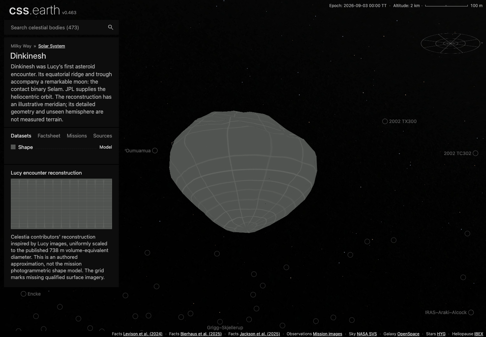
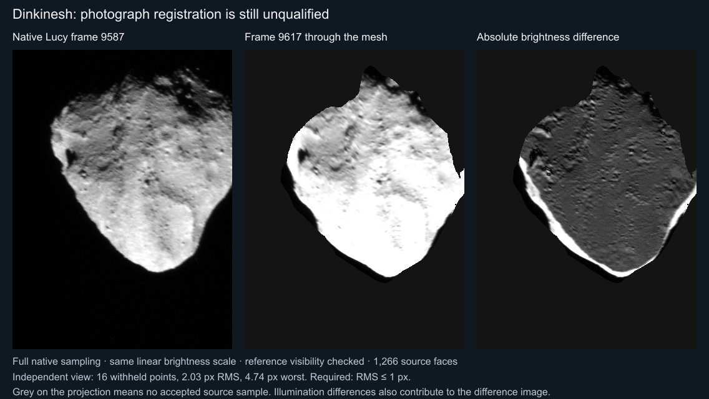

# Dinkinesh

Dinkinesh was Lucy’s first asteroid encounter. Its equatorial ridge and trough
accompany a moon, the contact binary Selam.

The default **TEMPEST shape** dataset shows the recovered numerical model in its
original metre coordinates: 635 vertices, 1,266 faces and a 737.508 m
volume-equivalent diameter. The **Celestia model** dataset keeps an authored
reconstruction for comparison. Only the selected model is displayed and
pickable. Shape-only views use the shared neutral gray (#808080 sRGB), a display
convention, not a measurement of surface color or albedo; the missing-imagery
grid means photography is unavailable. Shadows default to off.

## Sources

- [TEMPEST Dinkinesh mesh, Git 7df4c88](https://github.com/duncanLyster/TEMPEST/blob/7df4c88063ebe811cbdd25b97c19f85559607459/data/shape_models/dinkinesh.stl): preserved numerical shape; original coordinates and connectivity retained.
- [Lyster, Howett & Penn (2025)](https://doi.org/10.5194/epsc-dps2025-546): thermal-model methods, the 1,266-facet derivative and its source association.
- [Levison et al. (2024)](https://doi.org/10.1038/s41586-024-07378-0): Lucy discovery, ridge and contact-binary satellite.
- [Bierhaus et al. (2025)](https://doi.org/10.3847/PSJ/ae1968): revised shape, geology and 738 m equivalent diameter.
- [Jackson et al. (2025)](https://doi.org/10.3847/PSJ/ade23c): rotation pole and thermal constraints.
- The Celestia reconstruction is CC BY 4.0, credited to ItzImcool and domi9.
- The JPL heliocentric state is kept in [elements](source/reference/horizons-elements.txt) and [independent vectors](source/reference/horizons-vectors.txt). The 2023 WISE geometric-albedo estimate in [photometry](source/preparation/photometry.json) affects only context-point brightness, not surface color.
- **Named features:** the IAU/USGS Gazetteer of Planetary Nomenclature centre-point shapefile for Dinkinesh (public domain as USGS-produced data; the export ships no FGDC record, so the pin cites the USGS Copyrights and Credits statement), pinned under `source/features/`.

[Measurements and source selection](source/measurements.json) · [Exact source pins](source/manifest.json) · [Reuse terms](NOTICE.md) · [Investigation ledger](investigations.json)

## Processing

The Celestia reconstruction is centered, rotated from Y-up to Z-up and
uniformly scaled to 738 m volume-equivalent diameter. The conversion omits 136
exactly zero-area source triangles, recorded in
[the conversion receipt](source/shape/model.json). The shared source-mesh
simplifier then reduces it to 1,200 triangles. Its contributed texture has no
qualified observed/fill mask and is excluded.

Named features are cast through the prepared hit mesh so every anchor sits on
the shape model. Names the Gazetteer has not positioned are not placed. The
places are restricted to the Celestia dataset because their placement has not
been qualified in the recovered frame.

[Reproduction instructions](../../../packages/bake/authoring/galileo-lucy/README.md).

## Evidence

The view shows the adopted shape with the missing-imagery grid; it does not
establish photographic registration or mission-model parity. The Celestia
dataset labels 4 IAU names on the hit mesh. The Horizons comparison agrees with
Dinkinesh’s display conic within 0.001 km at its fitted epoch; the ±30-day
endpoint errors are about 991.49 and 902.83 km.

## Known problems

### Lucy photographs remain unqualified

The TEMPEST shape's original mission-model version, prime meridian and
observed/fill boundary remain unknown. The shared L’LORRI reader decodes all six
examined Dinkinesh frames with their sigma and quality companions, but that does
not establish their correspondence with the recovered mesh.

The Lucy overlap matcher produced **2.03 px RMS and 4.74 px maximum over 16
withheld controls** in an additional viewing direction. It fails the one-pixel
RMS requirement, and a regional fit also failed its additional-view check. No
photographic surface or regional dataset has been accepted.

Stereo depth estimates from the two surrounding views differ from the coarse
mesh by a median absolute 6.47 m, while their paired depths disagree by a median
1.43 m. The cameras are still inferred, so these numbers are not an absolute
mesh-accuracy result. Brightness differences in the figure include changing
illumination. The [investigation ledger](investigations.json) records the failed
routes and the evidence needed to reopen them.

### Other limits

- The Celestia model's extents, 846.2 × 846.3 × 708.5 m, differ from the mission model’s published 910 × 870 × 716 m. Its detailed relief and unseen hemisphere are authored approximations.
- Named feature outlines are not published nomenclature boundaries.
- The display orbit is not a long-term ephemeris.
