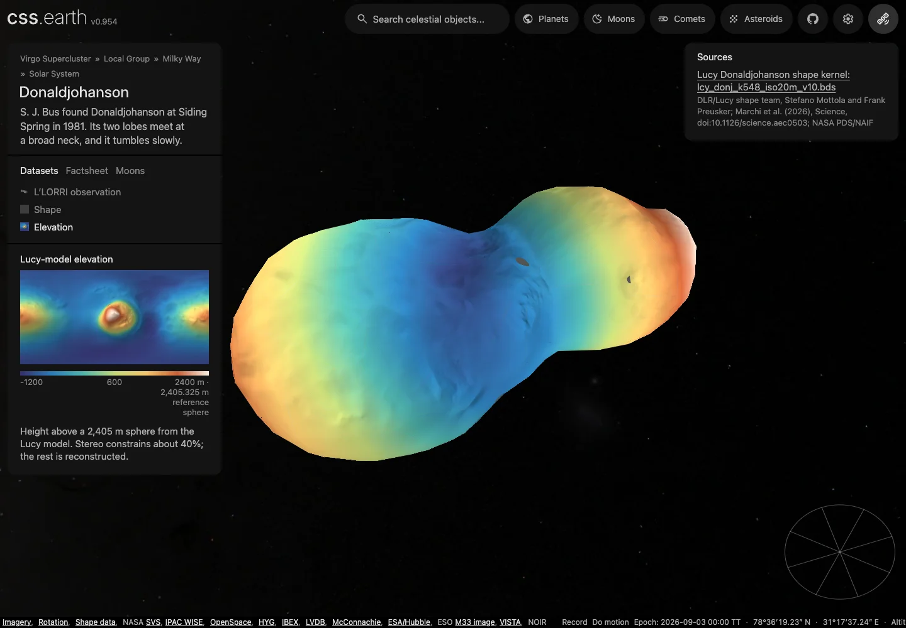

# Donaldjohanson

Shape-only views use the shared neutral gray (#808080 sRGB). This is a display convention, not a measurement of surface color or albedo; gaps within photographic and scientific datasets retain the missing-data grid.

## Sources

| View or property | Source and interpretation |
| --- | --- |
| L’LORRI mosaic | `lor_0798443290_04598_00035_1x1_sci_03.fit` and `lor_0798443242_04596_00001_1x1_sci_03.fit`, 20 April 2025 at 17:50:14.018 and 17:49:26.021 UTC (0.008 and 0.005 s exposures). Relative DN/s with acquisition illumination: the source applied bias/smear/flat corrections but omitted absolute calibration. |
| Shape | [Lucy/DLR DSK](https://naif.jpl.nasa.gov/pub/naif/pds/pds4/lucy/lucy_spice/spice_kernels/dsk/lcy_donj_k548_iso20m_v10.bds), `lcy_donj_k548_iso20m_v10.bds`. Original OBJ built 4 June 2025; DSK generated 24 June. [Coordinate description](https://pds-smallbodies.astro.umd.edu/holdings/pds4-lucy.mission:document-v2.0/Donaldjohanson_Coordinate_System_Description_v1.pdf) and [Marchi et al. 2026](https://www2.boulder.swri.edu/~bottke/Reprints/Marchi_2026_Science.aec0503._DJ_Asteroid.pdf) define its interpretation. |
| Elevation | Radius of that same source model minus a **2,405.325 m reference sphere**. Colors include the broad contact shape and the source authors’ reconstruction of unseen terrain; they are not gravitational height or new measurements. The palette spans −1,200 to 2,400 m, with cartographic relief from the source normals. |

## Evidence

The 14 September 2026 qualification at `22530863b602e90684fe778b16136de3d890fe2d` passed both body source/package checks, three focused source-surface regressions, the independent full-source verifier and strict TypeScript. [Headless browser conformance](evidence/source-surface/conformance.json) passed mobile and dataset interactions at DPR 1 and 2. [Additional views](evidence/source-surface/browser.json) cover both sides, a close-up, an extreme angle and Shadows on/off. [Close-up](evidence/source-surface/close.webp): fine triangle boundaries remain visible at close zoom; small gray patches mark withheld transfers. These are focused checks, not a full-suite pass.

The 56 m transfer limit withholds 13,810 of 5,778,049 triangle-interior texels (0.239%); those texels retain the ordinary grid. These are atlas sample counts, not measured surface-area coverage. The [preparation comparison](evidence/source-surface/preparation.json) verifies unchanged geometry, camera, retained leaves and every pre-existing image hash. Elevation adds 587,310 image bytes. The [fresh-install record](evidence/source-surface/delivery.json) verifies published asset hashes in an empty destination.

Elevation uses the existing closest-source-point sampler on the full 547,996-facet mesh. Its 56 m transfer limit matches the authored simplification allowance; it is not a source measurement uncertainty or an exhaustive geometric bound. Display points farther from the source stay a grid. At source facet 487421, the correct height is **942.724 m** above the reference sphere; selecting the first ray intersection would understate it by **400.124 m**. The [independent full-source check](evidence/source-surface/independent.json) verifies the two overlapping patches and an offset point against every original triangle, using separate projection code. The [regression fixtures](../../../tools/objects/terrestrial-layers/fixtures/source-surface-cases.json) retain those coordinates. The existing L’LORRI mosaic remains the default, and Shadows starts off.

[Finished view](evidence/photographic-expansion/hero.webp) · [Before](evidence/photographic-expansion/before.webp) · [After](evidence/photographic-expansion/after.webp) · [Pixelmatch and browser evidence](evidence/photographic-expansion/evidence.json).

The 13 September photographic qualification covers four poses, DPR 1/2, mobile, dragging and lighting. Shadows starts off; dragging and lighting preserve the retained triangles. Those paired captures keep camera and geometry fixed. That photographic evidence remains applicable: this preparation reproduces all existing photographs byte-for-byte and leaves geometry and camera unchanged. Source pins verify, including a fresh download of the new FITS and XML; all changed runtime assets were downloaded after publication and matched their inventory hashes. The shared and body checks are focused checks, not a full repository-suite result.

The 13 September 2026 expansion adds the approach photograph using the existing registered-image overlap method. The [camera closure](source/observations/llorri-approach-camera.json) contains 52 fit controls and 43 withheld controls; the withheld RMS is **0.5165 px**, maximum **1.6163 px**, against 1 px RMS and 3 px maximum limits. The fit RMS is 0.7089 px and its maximum is 3.0955 px; all matched controls remain recorded. Detector translation is the only fitted camera parameter. The shared SPICE/header implementation reproduces the original independent Astropy anchors to 5.1 × 10⁻¹⁰ px. This relative registration inherits the landmark reference and source-shape uncertainty.

The same 64 stratified samples per retained triangle, weighted by triangle area, measure **25.42% → 31.06%** accepted coverage on the unchanged 800-face display mesh. The closer image retains its coverage and priority; the approach image adds 5.64 percentage points. This estimates support on the display mesh, not the exact observed area of the asteroid. A bounded display gain of 0.6721 for the approach image is supported by 4,148 overlap samples (log-MAD 0.0317); photographed illumination remains, and the mosaic is not an albedo map.

The full-body candidate `lor_0798443161_04591_00001_1x1_sci_03.fit` was withheld: its relative registration reached 1.2434 px RMS on 10 holdouts, above the 1 px acceptance limit. `lor_0798443191_04593_00015_1x1_sci_03.fit` declares no target in the field of view and is outside this reader's accepted source identity. An archive index is not qualification of every listed image.

Reproduce the new camera with `node tools/objects/terrestrial-layers/prepare-llorri-overlap.mts` (use `--write` to regenerate its pinned record). Refresh the existing lens with `node tools/objects/refresh-surface-observations.mts donaldjohanson llorri`. Both use the [pinned overlap recipe](source/preparation/llorri-overlap.json) and existing surface-observation pipeline; they do not introduce another renderer or change the mesh. [The shared guide](../../../docs/surface-preparation.md) explains observation-only refreshes.

The [camera record](source/observations/llorri-camera.json) retains the pointing fit and withheld landmark: 1.31 px maximum coordinate residual, below the 3 px limit. Sixteen independent Astropy projection anchors agreed within 0.0000001 px; that tests encoding, not pointing accuracy. The original image, camera, mesh and projection anchors are unchanged in the two-image expansion.

- **Reader oracle, 2026-09-12:** `tools/oracles/fits/llorri.py` reads the pinned product with astropy. `tools/objects/terrestrial-layers/llorri-geo.oracle.test.mts` requires DN per second and the quality decisions to match the three HDUs, the bound SIP coefficients to equal the header's, and the TAN-SIP distortion to agree with `astropy.wcs` within 10⁻⁹ px at 65 pixels, with the inverse returning each pixel.

### Registration

<!-- registration-report:begin -->
Measured by the registration stage when the body was last prepared; the numbers are read from `prepared/surfaces.json`, not typed.

| Lens | Frames | Scored | Limb RMS | Noise floor | Systematic | Reference | Decisive | Median offset | Relief | Refined | Seams | Verdict |
| --- | --- | --- | --- | --- | --- | --- | --- | --- | --- | --- | --- | --- |
| `llorri` | 2 | 0 | — | — | — | its other 2 frames | 1 of 2 | — | 2 of 2 | — | ×1.00 | no verdict |

Limb columns: the position-angle residual between the projected limb and the photographed contour over the frames whose outline is elongated enough to define one, the floor set by exposures minutes apart, and what remains after removing that floor in quadrature. Reference columns: each frame turned about the pole against the named reference, the frames whose peak clears both mirrors (by the strong rule, or by standing four times above them), and their median offset from the stated camera, stated only over three or more decisive frames. Relief: the same sweep against the mesh's own shading with no map and no other frame, decisive frames and their median offset. Refined: the turn a named reference applied to every camera of the lens, or why it declined; the other columns then measure the turned lens. Seams: the largest brightness ratio left between overlapping frames after level matching, and the frame groups no accepted overlap joins, whose relative brightness is unmeasured. Verdict: registered when every measurement that reached one (the outline over three scored frames, the reference or the relief over three decisive frames whose offsets agree with each other to within three degrees) is within three degrees; a sweep whose decisive offsets disagree by more reaches no verdict, because its median is a location rather than a measurement. A conflict ships only when named in the known conflicts of `report-registration.test.mts`, or when the lens ships on its paper’s comparison figure, which its observer-cameras record names.
<!-- registration-report:end -->

## Known problems

Named features: the IAU/USGS Gazetteer of Planetary Nomenclature centre-point shapefile for Donaldjohanson (retrieved 2026-09-12, re-retrieved 2026-09-18, public domain as USGS-produced data; the export ships no FGDC record, so the pin cites the USGS Copyrights and Credits statement) is pinned under `source/features/`. Preparation verifies the archive, reads the attribute table (no projection file or metadata: the authored radius scales outline sizes), drops the albedo-feature type code, folds repeated rows, and converts each positive-east centre into the body-fixed frame the radial terrain sampler uses for this mesh (longitude 0 toward the mesh +y axis, 90° E toward +x, north +z), then casts that direction through the prepared hit mesh so every anchor and outline point sits on the shape model rather than on a reference sphere. Craters and faculae trace a rim circle, other types their published extent box. Outlines are not published nomenclature boundaries. Names the Gazetteer has not positioned (centre 0°, 0° with an empty extent) are not placed and are tallied in the prepared descriptor.

Named features run of 2026-09-18 (this version, re-pinned from the 2026-09-12 run): the refreshed catalogue still labels 9 IAU names on the hit mesh (2 LO without a published centre; 1 of them without a published diameter); `tests/objects/unit/surface-features.test.mts` verifies the pinned bytes, the body-frame anchors and the hit-mesh radius band against the 2026-09-18 export. The Gazetteer regenerates this export on its own schedule (USGS Astrogeology, observed weekly): the 2026-09-12 snapshot’s exact bytes were superseded upstream and were not recoverable from git history, this repository’s other checkouts or the R2 source mirror, so the manifest is re-pinned to the 2026-09-18 bytes; `source/manifest.json` and `source/features/manifest.json` record the acquisition. The 2026-09-12 run’s headless Chrome probe (`output/probe-spheres.mts`, ignored scratch), which mounted the page, selected every lens and pinned Narmada from the sidebar search with no console errors or failed requests, has not been re-run against the 2026-09-18 export.

Stereo constrains about 40% of the body; the unseen side uses the source authors’ ellipsoid/symmetry reconstruction. Both photographs cover only part of the encounter-facing surface; unseen or rejected areas remain a grid. Elevation shows the complete released model, including its reconstructed terrain. Attitude is encounter-only, with free precession unmodeled. Flat elevation previews withhold ambiguous radial intersections; the three-dimensional atlas keeps the distinct surface patches.

Source restoration was not fully unattended: Node rejected the SWRI article certificate chain. Curl with normal certificate validation restored the exact pinned bytes on the qualification host; the workaround is retained below.

[Investigation ledger](investigations.json) · [Inputs](source/manifest.json) · [Preparation](source/preparation) · Provenance (`prepared/provenance.json`) · [Delivered files](inventory.json) · [Credits](NOTICE.md)

Methods and source notes

**Selection and coverage**

Lucy stereo imaging constrains about 40% of the surface. The source authors completed the unseen side with a two-ellipsoid contact fit and symmetry, then refined it against observed contours. This reconstruction is preserved as released; it does not imply measured terrain on the unseen hemisphere. The model spans 8.821632 by 4.411234 by 3.096368 km and encloses 58.292109 cubic km, consistent with the paper's approximate 8.8 by 4.4 by 3.1 km and 58 cubic km. The 2.405325 km reference radius is computed from the released volume and does not rescale source coordinates.

**Existing preparation path**

CSPICE exports the original vertices and plate connectivity without resampling. The existing source-meshoptimizer path with RegularizeLight produces one closed outward-wound 800-face component, Euler characteristic 2, with no opposite-face cancellation. The selected 56 m simplifier tolerance yields a 55.827515 m estimate. Independent 8192-sample nearest-triangle comparisons in both directions have maxima 77.123801 m and 74.843535 m; these are sampled distances, not an exhaustive geometric bound or observational uncertainty. The reduced volume is 57.212292 cubic km. Original/reduced front, back and polar renders are retained for visual inspection.

The scene uses 800 native PolyCSS u raster leaves, 128 px cells and baked directional/flood lighting. Meshes, grids, atlases and lighting are prepared offline; runtime consumes retained prepared data.

**Reproduction**

The checked gzip OBJ is reproduced by `tools/objects/acquisition/export-dsk.py` from `source/shape/lcy_donj_k548_iso20m_v10.bds`, using `spiceypy==7.0.0`. CSPICE preserves the released vertex and plate data.

**Controlled L’LORRI observation (2026-09-08)**

Every nonzero quality bit is rejected: bad bias, bad flat, permanent CCD defect, hot pixel, saturation or missing pixel. All four interpolation contributors must have finite image/sigma, nonnegative sigma, accepted quality and source geometry within 30 m of one surface patch. Source correspondence keeps the existing 56 m display allowance; full-source visibility uses 0.5 m tolerance. Incidence and emission are limited to 70°. Valid zero/negative calibrated brightness is not removed by the display stretch.

**Reproduction and source closure**

`source/preparation/camera.json` selects the exact image, original kernels and control evidence. `source/observations/llorri-camera.json` is a checked-in preparation input bound by image, mesh and provenance hashes. Reproduce it with `python tools/objects/terrestrial-layers/prepare-archived-camera.py src/objects/donaldjohanson/source` (NumPy, SciPy, Astropy and SpiceyPy), then run the existing authored preparation command. No camera fitting, source mesh queries, photometric correction or atlas construction runs in the application. All atlases, coverage, thumbnails and surface minimaps consume the same qualified sampler. The camera/source tests use original-file samples, rejected quality cases and independent geometric anchors; the PR records separate browser and source-restoration results.

The unchanged Lucy/DLR DSK lcy_donj_k548_iso20m_v10.bds contains 274000 vertices and 547996 triangular plates in kilometers. Mottola and Preusker built the source OBJ on 2025-06-04; the archived DSK was generated on 2025-06-24. Its PDS label, DSK comments, coordinate-system description and Marchi et al. (2026) paper are pinned beside the package.

- Original release: https://naif.jpl.nasa.gov/pub/naif/pds/pds4/lucy/lucy_spice/spice_kernels/dsk/lcy_donj_k548_iso20m_v10.bds
- Coordinate system: https://pds-smallbodies.astro.umd.edu/holdings/pds4-lucy.mission:document-v2.0/Donaldjohanson_Coordinate_System_Description_v1.pdf
- Research: https://www2.boulder.swri.edu/~bottke/Reprints/Marchi_2026_Science.aec0503._DJ_Asteroid.pdf
- Mission data survey: https://pds-smallbodies.astro.umd.edu/data_sb/missions/lucy/index.shtml

The original single-image **L’LORRI observation** used `lor_0798443290_04598_00035_1x1_sci_03.fit` and its PDS4 XML from the actual Donaldjohanson encounter collection. The observation starts at 2025-04-20T17:50:14.018 UTC with 0.008 s exposure and includes the target in its FOV. The original FITS contains 1024×1024 DN, sigma and a 16-bit quality mask. Bias, smear and flat corrections were performed; absolute calibration was omitted by the source pipeline. The view therefore displays relative DN/s and **retains acquisition illumination**, not measured albedo or disk-normalized I/F. Shape remains selectable; application Shadows defaults off.

The source coordinate description explicitly limits its preliminary linear attitude model to the Lucy encounter at 2025-04-20T17:51:16 UTC because free precession is unmodeled. Marchi et al. (2026) report lightcurve periods of 252.6 ± 0.4 and 455.2 ± 0.9 hours. They are informational facts, not a propagated attitude. The package reuses the fixed illustrative display-orientation recipe used by Toutatis; directional lighting is illustrative. Horizons supplies the heliocentric orbital context at the shared epoch.

On the qualification host, Node fetch rejects the SWRI article certificate chain. The original DSK and other source inputs restore through the recorded plan. The article restored with curl using normal HTTPS certificate validation, and its bytes matched the manifest SHA-256. If affected, restore source/reference/donaldjohanson-2026.pdf using curl -fL with the recorded paper URL before acquisition. This is an external reference-download limitation, not a claim that the entire plan restores unattended.

The original close-up is cropped through one lobe. The current mosaic adds an earlier approach view, while still covering only part of the encounter-facing surface. Unseen, cropped and rejected areas retain the ordinary grid. The underlying closed source model itself is constrained by stereo over about 40% of the body; the rest contains its authors’ ellipsoid/symmetry reconstruction. This does not establish texture coverage for that reconstruction. The source orientation remains encounter-only; no current free-precession state is invented. The existing 800 native raster triangles remain unchanged.

The original mesh has 729 face centroids whose radius differs from the nearest surface on their ray, by up to 400.124075 m. A separate 8192-direction scan found no second intersections, showing why that sparse scan alone cannot establish a single-valued radial field. This failed radial approach is preserved in the investigation ledger. Elevation now samples individual source surface points, with rejected transfers marked by the ordinary grid.

Preparation uses the original RA/Dec TAN-SIP WCS, including its third-order distortion, and the source mesh’s Donaldjohanson v12 PCK at the encounter midpoint. The image header’s earlier v11 body orientation is not substituted for the v12 mesh frame. Astropy supplies 16 independent projection anchors: the JavaScript TAN-SIP projection agrees within 0.0000001 pixels. This checks the encoding, not pointing accuracy.

The coordinate-system publication identifies Boxgrove Saxon, Mungo and Narmada in this exact image and gives body coordinates and 1-based bottom-left image pixels. Two landmarks constrain a single image translation; Narmada is withheld. Its maximum coordinate residual is 1.31 pixels and radial image residual below 2 pixels, within the authored 3 px limit (roughly 19 m at this range). The camera record retains uncorrected, fit and holdout coordinates. No distortion coefficient, mesh vertex or body rotation was adjusted to improve this fit.

