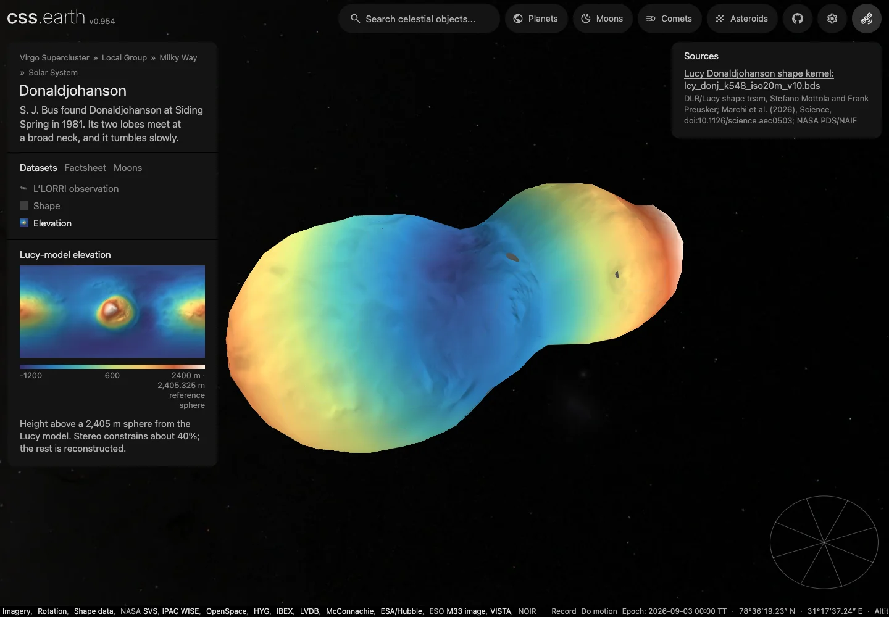

# Donaldjohanson

Donaldjohanson is shown with the Lucy/DLR shape model, an elevation view and a two-image L’LORRI mosaic from the Lucy flyby. Shape-only views use the shared neutral gray (#808080 sRGB). This is a display convention, not a measurement of surface color or albedo; gaps within photographic and scientific datasets retain the missing-data grid.

## Sources

| View or property | Source and interpretation |
| --- | --- |
| L’LORRI mosaic | `lor_0798443290_04598_00035_1x1_sci_03.fit` and `lor_0798443242_04596_00001_1x1_sci_03.fit`, 20 April 2025 at 17:50:14.018 and 17:49:26.021 UTC (0.008 and 0.005 s exposures). Relative DN/s with acquisition illumination: the source applied bias/smear/flat corrections but omitted absolute calibration. |
| Shape | [Lucy/DLR DSK](https://naif.jpl.nasa.gov/pub/naif/pds/pds4/lucy/lucy_spice/spice_kernels/dsk/lcy_donj_k548_iso20m_v10.bds), `lcy_donj_k548_iso20m_v10.bds`, built by Mottola and Preusker. Original OBJ built 4 June 2025; DSK generated 24 June. [Coordinate description](https://pds-smallbodies.astro.umd.edu/holdings/pds4-lucy.mission:document-v2.0/Donaldjohanson_Coordinate_System_Description_v1.pdf) and [Marchi et al. 2026](https://www2.boulder.swri.edu/~bottke/Reprints/Marchi_2026_Science.aec0503._DJ_Asteroid.pdf) define its interpretation. |
| Elevation | Radius of that same source model minus a **2,405.325 m reference sphere**. Colors include the broad contact shape and the source authors’ reconstruction of unseen terrain; they are not gravitational height or new measurements. The palette spans −1,200 to 2,400 m, with cartographic relief from the source normals. |
| Named features | IAU/USGS Gazetteer of Planetary Nomenclature centre-point shapefile, retrieved 2026-09-18, public domain as USGS-produced data |

The [Lucy mission data survey](https://pds-smallbodies.astro.umd.edu/data_sb/missions/lucy/index.shtml) lists the encounter products.

## Processing

The DSK holds 274000 vertices and 547996 triangular plates. CSPICE exports them without resampling (`packages/bake/src/objects/acquisition/export-dsk.py`, `spiceypy==7.0.0`), and meshoptimizer reduces them to one closed 734-face component with a 56 m tolerance. The model spans 8.821632 by 4.411234 by 3.096368 km, consistent with the paper's approximate 8.8 by 4.4 by 3.1 km.

Elevation samples the closest source point on the full mesh. Display points farther than 56 m from the source stay a grid. At source facet 487421 the correct height is **942.724 m**; taking the first ray intersection would understate it by **400.124 m**. The [regression fixtures](../../../packages/bake/src/objects/geometry/fixtures/source-surface-cases.json) keep those coordinates.

The L’LORRI images are projected through their original TAN-SIP WCS and the mesh's v12 PCK at the encounter midpoint. Every nonzero quality bit is rejected, and incidence and emission are limited to 70°. The close-up camera was fitted to two landmarks from the coordinate description, with Narmada withheld ([camera record](source/observations/llorri-camera.json)). The approach image was added with the registered-image overlap method ([camera closure](source/observations/llorri-approach-camera.json)). Only detector translation is fitted; no distortion, mesh or rotation was adjusted.

The attitude is the source's preliminary linear model for the encounter; free precession is unmodeled. Marchi et al. (2026) report lightcurve periods of 252.6 ± 0.4 and 455.2 ± 0.9 hours, shown as facts only.

Reproduce the approach camera with `node packages/bake/cli/prepare-llorri-overlap.mts` (use `--write` to regenerate its record) and refresh the dataset with `node packages/bake/cli/refresh-surface-observations.mts donaldjohanson llorri`. Both use the [overlap recipe](source/preparation/llorri-overlap.json). Restore the close-up camera's kernels with `node packages/bake/cli/restore-source-inputs.mts --object=donaldjohanson` and reproduce it with `python packages/bake/cli/prepare-archived-camera.py src/objects/donaldjohanson/source` (NumPy, SciPy, Astropy and SpiceyPy). [The shared guide](../../../docs/surface-preparation.md) explains observation-only refreshes.

## Evidence

- The close-up camera's maximum coordinate residual is 1.31 px, below the 3 px limit (roughly 19 m at this range).
- The approach camera's withheld controls give **0.5165 px** RMS and **1.6163 px** maximum, against 1 px and 3 px limits.
- Accepted coverage on the 734-face display mesh rises from **25.42% to 31.06%** with the approach image. This estimates support on the display mesh, not the observed area of the asteroid.
- The 56 m transfer limit withholds 0.239% of triangle-interior texels.
- The full-body candidate `lor_0798443161_04591_00001_1x1_sci_03.fit` was withheld at 1.2434 px RMS, above the 1 px limit.
- The L’LORRI reader is checked against astropy by [`llorri-geo.oracle.test.mts`](../../../packages/bake/src/objects/layers/terrestrial/missions/llorri-geo.oracle.test.mts), using [`llorri.py`](../../../packages/bake/src/objects/layers/terrestrial/missions/llorri.py).

### Registration

<!-- registration-report:begin -->
Measured by the registration stage when the body was last prepared; the numbers are read from `prepared/surfaces.json`, not typed.

| Dataset | Frames | Scored | Limb RMS | Noise floor | Systematic | Reference | Decisive | Median offset | Relief | Refined | Seams | Verdict |
| --- | --- | --- | --- | --- | --- | --- | --- | --- | --- | --- | --- | --- |
| `llorri` | 2 | 0 | — | — | — | its other 2 frames | 1 of 2 | — | 2 of 2 | — | ×1.00 | no verdict |

Limb columns: the position-angle residual between the projected limb and the photographed contour over the frames whose outline is elongated enough to define one, the floor set by exposures minutes apart, and what remains after removing that floor in quadrature. Reference columns: each frame turned about the pole against the named reference, the frames whose peak clears both mirrors (by the strong rule, or by standing four times above them), and their median offset from the stated camera, stated only over three or more decisive frames. Relief: the same sweep against the mesh's own shading with no map and no other frame, decisive frames and their median offset. Refined: the turn a named reference applied to every camera of the dataset, or why it declined; the other columns then measure the turned dataset. Seams: the largest brightness ratio left between overlapping frames after level matching, and the frame groups no accepted overlap joins, whose relative brightness is unmeasured. Verdict: registered when every measurement that reached one (the outline over three scored frames, the reference or the relief over three decisive frames whose offsets agree with each other to within three degrees) is within three degrees; a sweep whose decisive offsets disagree by more reaches no verdict, because its median is a location rather than a measurement. A conflict ships only when named in the known conflicts of `report-registration.test.mts`, or when the dataset ships on its paper’s comparison figure, which its observer-cameras record names.
<!-- registration-report:end -->

## Known problems

- Stereo constrains about 40% of the body; the unseen side is the source authors’ ellipsoid/symmetry reconstruction. Elevation shows the whole released model, including that reconstruction.
- Both photographs cover only part of the encounter-facing surface; unseen or rejected areas remain a grid. The mosaic keeps photographed illumination and is not an albedo map.
- Fine triangle boundaries stay visible at close zoom, and small gray patches mark withheld transfers.
- Attitude is encounter-only, with free precession unmodeled.
- Named features are cast onto the shape model; rim circles and extent boxes are not published boundaries. Two names have no published centre and are not placed. The browser probe was not re-run against the 2026-09-18 Gazetteer export.
- Node rejects the SWRI article's certificate chain. If affected, restore `source/reference/donaldjohanson-2026.pdf` with `curl -fL` from the recorded paper URL before acquisition.

[Investigation ledger](investigations.json) · [Inputs](source/manifest.json) · [Preparation](source/preparation) · [Delivered files](inventory.json) · [Credits](NOTICE.md)
