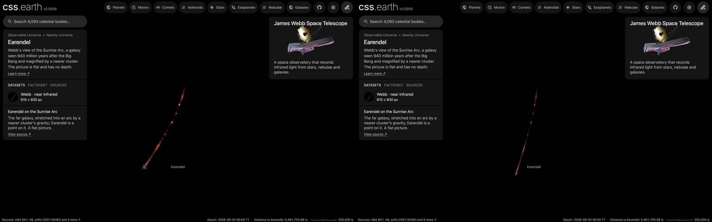

# Earendel picture

A published picture of Earendel stands at its place and distance as one flat image facing the Sun. It is a picture
of the sky: nothing in it has depth, and seen from the side it is a line.

## Sources

| Selected source | Input and meaning |
| --- | --- |
| [ESA/Webb sunrisearc1](https://esawebb.org/images/sunrisearc1/) | [Record](../../sources/esawebb-sunrisearc1.json). Webb NIRCam, 0.9 to 4.4 µm, the shortest wavelengths blue and the longest red. A window of the publisher's Large JPEG (6507 × 6612 px), written at 610 × 830 px (`source/source.jpg`, made by [`picture-source.mts`](../../../packages/bake/authoring/far-destinations/picture-source.mts); not tracked). [CC BY 4.0](https://esawebb.org/copyright/), credit: NASA, ESA, CSA, D. Coe (AURA/STScI for ESA), Z. Levay. A display composite, not calibrated photometry. |
| [Welch et al. (2022), A highly magnified star at redshift 6.2, Nature 603, 815](https://arxiv.org/abs/2209.14866) | [Record](../../sources/publication-welch-2022-earendel.json). Position 24.3468°, -8.4645°: text: a highly magnified star sitting atop the lensing critical curve at RA, Dec = 01:37:23.232, -8:27:52.20 (J2000), designated WHL0137-LS. |
| [Pascale et al. (2025), Is Earendel a Star Cluster?: Metal Poor Globular Cluster Progenitors at z ~ 6, arXiv:2507.05483](https://arxiv.org/abs/2507.05483) | [Record](../../sources/publication-pascale-2025-earendel.json). Redshift 5.926 ± 0.013: abstract: a spectroscopic redshift of the Sunrise galaxy, z = 5.926 ± 0.013, from NIRSpec PRISM spectroscopy. |
| [Planck Collaboration (2020)](https://arxiv.org/abs/1807.06209) | [Record](../../sources/planck-2018-cosmology.json). The cosmology that turns the redshift into a distance: comoving distance 8,393 Mpc, light travel time 12.84 billion years, age of the universe then 944 million years (Astropy 8.0.1, `Planck18`). |

## The picture

- **Placement:** The file's embedded tags give 0.02003 arcsec per pixel and north 17.2° left of vertical, and place the paper's position at pixel 4914, 4194, on the arc. The same publisher's tags placed another galaxy 1.5 arcsec off (JADES-GS-z14-0), so that place is good to about an arcsec. The window holds the whole arc; only a band along it is kept, 0.44 arcsec to each side of a path traced by eye over the arc and fading out over a further 0.28 arcsec, so the nearer cluster's galaxies around it are not drawn.
- **Plane:** the picture's own tangent plane, facing the Sun. The picture's centre is 4.96″ from the object's position. The recipe's small inclination is not a measurement: the bake needs a plane with some depth along the sight line. This is where a sky picture lies, not a measured orientation of the object.
- **Size:** 12.22 arcsec across, 497.2 kpc × 676.5 kpc at the object's comoving distance (the angle times the distance). The page frames 248.6 kpc, half the picture's short side.
- **Sky:** light below 26 of 255 is taken as sky and left transparent, so the universe's own dots show through it. The floor is a presentation value set just above the frame's own background (its 75th percentile), so the frame does not show as a grey square; faint light below it is lost.
- **Edges:** the outer 4% of the frame fades out, so the picture has no hard rectangular edge.
- **Bytes:** one image at 610 px on its long side (WebP quality 70, alpha quality 80), as the Milky Way's backing image is.

## Evidence

The Earendel page in headless Chromium at 1440 × 900, device pixel ratio 2, on this branch on 2026-10-02: the default
arrival and the camera turned part of the way round.

## Measured, chosen and inferred

| Value | Kind |
| --- | --- |
| Position 24.3468°, -8.4645° and redshift 5.926 ± 0.013 | Measured: the papers above |
| Distance 8,393 Mpc | Derived: the redshift's comoving distance in the Planck 2018 cosmology |
| Field, scale and rotation of the picture | The publisher's or the service's own geometry, as the Placement note says |
| Flat plane facing the Sun | The geometry of a sky picture; no depth is measured or drawn |
| Window, sky floor, edge fade, 1,024 px, framing radius, 0.001° inclination | Presentation |

## Known problems

- The picture is flat: seen from the side it is a line, and from behind it is mirrored.
- Everything in the frame stands on the object's plane, whatever its own distance. A band along the arc inside a 610 × 830 px window of the publisher's Large JPEG, not resampled; the lensing cluster's galaxies, far nearer than the arc, are left out. The band is traced by eye, so faint parts of the arc outside it are lost and any foreground light inside it stays. The arc's length is the lens's magnification, not the galaxy's size.
- The size is a comoving size: the angle times the comoving distance. The object's proper size at its redshift is smaller by 1 + z.
- The page opens with ecliptic north up, as every page does, so the picture arrives turned from the publisher's orientation.
- A flight from another page keeps the travelling camera's angle, so it can arrive seeing the picture from an oblique angle or
  nearly from the side. Opening the page directly faces the picture.
