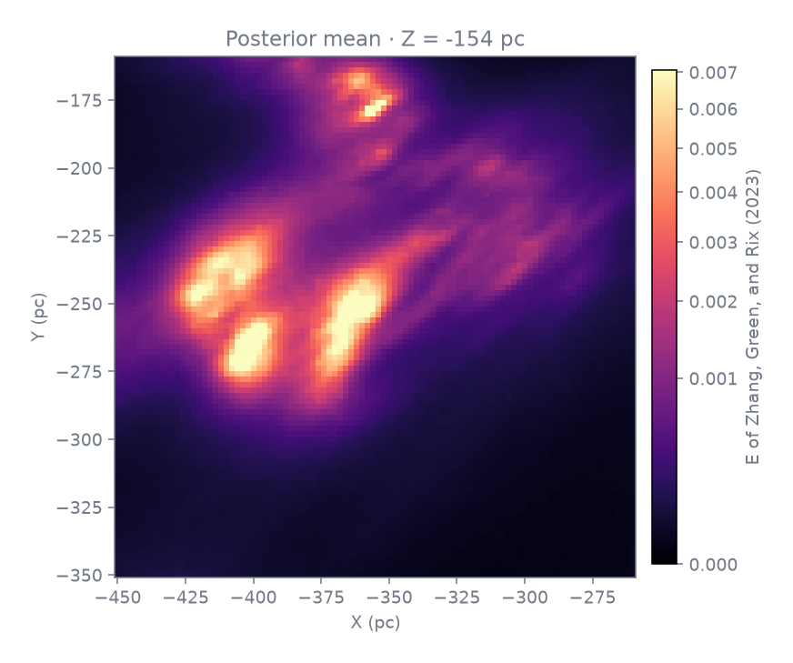
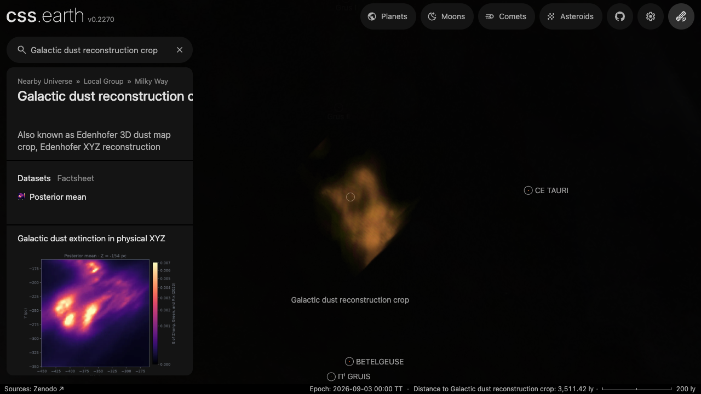
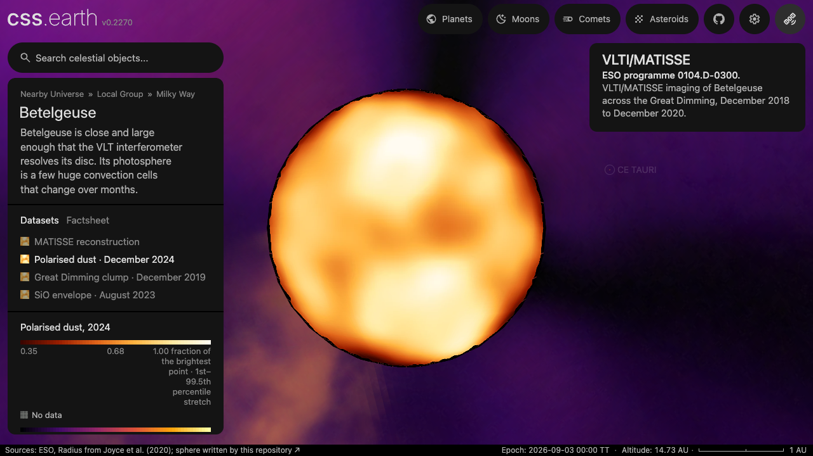

# Galactic dust reconstruction crop

This package is the first app example produced from the Telescope API's physical Cartesian FITS profile. It renders a bounded part of the posterior-mean Galactic dust-extinction reconstruction published by Edenhofer et al. The source already supplies physical depth: a heliocentric Galactic XYZ grid at 2 pc spacing. The API does not infer depth from a sky image or spectral axis.

## Scientific source

The parent product is `mean_and_std_xyz.fits` from dataset v1.0.2, DOI [`10.5281/zenodo.10658339`](https://doi.org/10.5281/zenodo.10658339). The published file is 15,662,543,040 bytes with MD5 `13ddd81b5e35e01582b74e0ec8db0fe5` and is licensed CC-BY-4.0. The repository's bounded range restorer retrieves only the rows needed for this crop and checks the reconstructed crop's exact byte length and SHA-256. Because it does not retrieve the complete parent file, the published whole-file MD5 remains an upstream identity rather than an independently recomputed checksum.

The retained crop is `X[400:496), Y[450:546), Z[500:596)` in the parent FITS pixel order. Its voxel centres cover X = -450..-260 pc, Y = -350..-160 pc, and Z = -250..-60 pc. The crop centre is (-355, -255, -155) pc in the source's heliocentric Galactic Cartesian frame. The app transforms that centre and basis into its Sun-centred ICRF frame; its catalogue location is RA 86.476006°, Dec -11.114122°, distance 463.761792 pc. The display epoch is the app's static placement convention, not an observation or reconstruction epoch.

The crop's two 96³ arrays are the posterior mean and posterior standard deviation. The values are reconstructed dust extinction in the authors' source-specific units. They are not luminosity, photographic brightness, or direct mass density. All samples in this crop are finite; the profile still preserves the distinction between invalid samples and valid zero for other inputs.

## Native and display products

The native crop and orthogonal slice outputs remain floating-point FITS with their physical coordinate mapping, scalar unit, uncertainty, and fixed slice coordinate. The prepared KTX2 is a display approximation of the posterior mean. Its pinned transfer range, encoding, colour, opacity, and clipping policy are retained beside the output. Colour and emission make the structure visible; they do not claim measured dust colour, luminosity, or radiative transfer.

The existing density-volume preparer, slab renderer, camera, navigation, and volume-lens-bank loader own the app result. The Telescope API adds the qualified FITS-to-volume boundary and a one-lens delivery adapter; this package does not add another renderer.

### Qualified slices

These are the three central planes exported by `telescope family-run` from the
same pinned FITS crop. Each figure labels its two physical axes and fixed third
coordinate.

| X = -354 pc | Y = -254 pc | Z = -154 pc |
| --- | --- | --- |
|  |  |  |

### Existing app renderer

The prepared result is loaded by css.earth's standard retained volume lane. A
real browser camera drag changed the persisted view pose and exposed the field
in world context; no separate Telescope API renderer is involved.

The same volume-lens-bank loader already supports a field attached to a body.
The checked Betelgeuse case below keeps the star sphere and its selected 2024
polarised-dust volume in one interactive scene. The current renderer still
orders whole lenses; this proves attachment and navigation, not per-sample
volume/body interleaving.

## Limits

- The published Cartesian file is itself an interpolation of the posterior reconstruction. The authors recommend re-interpolating the underlying HEALPix reconstruction at higher resolution for individual regions.
- The displayed crop is one bounded sample of the full 1.25 kpc map and is not identified with a named molecular cloud.
- The KTX2 and compiled volume leaves are visual products. Use the native FITS output for numerical work and uncertainty.
- Volume/body front/back interleaving retains the existing renderer's whole-lens limitation. This independent field does not use a body attachment.

The acquisition and public CLI commands are in [`tools/objects/telescopes/examples/edenhofer-xyz/README.md`](../../../tools/objects/telescopes/examples/edenhofer-xyz/README.md). The slice figures and browser capture above document the qualified data and app result.
