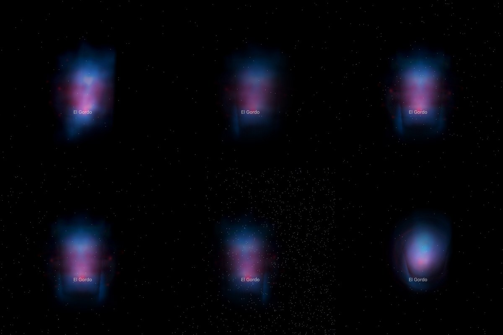

# El Gordo: gas and mass

NASA's 2014 Hubble release of El Gordo, in its layers. The Hubble picture, with its stars removed, stands at the cluster's
place and distance as one flat image facing the Sun. The hot gas (red) and the mass (blue) are each spread along the sight
line through a body turned about a published line. **No depth is measured**: the bodies are a symmetry the papers assume,
drawn from the pictures themselves. The page's other dataset is [Webb's picture](../el-gordo-layers/README.md), flat.

## Sources

| Selected source | Input and meaning |
| --- | --- |
| [NASA/STScI release 2014-22](https://science.nasa.gov/missions/hubble/hubble-finds-that-monster-el-gordo-galaxy-cluster-is-bigger-than-thought) | [Record](../../sources/nasa-2014-el-gordo-layers.json). Five pictures on one frame of 6184 × 3748 px. Used: Hubble ACS/WFC alone (`hubble.tif`, from which the bank's photograph is made), the lensing mass map alone (`mass.tif`), the Chandra X-ray gas alone (`xray.tif`), and a 1280 px rendition of the three together (`composite.jpg`, the dataset's preview). Restored from their origin; not tracked. [May be used as in the public domain](https://www.stsci.edu/copyright), credit requested: NASA, ESA, and J. Jee (University of California, Davis). Display pictures, not calibrated maps. |
| [Menanteau et al. (2012)](https://arxiv.org/abs/1109.0953) | [Record](../../sources/publication-menanteau-2012-el-gordo.json). The gas's line: they take the X-ray gas apart as round about an axis through 01:02:54.9, -49:15:52.5 at position angle 136°. |
| [Jee et al. (2014)](https://arxiv.org/abs/1309.5097) | [Record](../../sources/publication-jee-2014-el-gordo-weak-lensing.json). The mass's line: the two weak-lensing peaks, 01:02:50.601, -49:15:04.48 and 01:02:56.312, -49:16:23.15, fitted with two round halos. |
| [Ng et al. (2015)](https://arxiv.org/abs/1412.1826) | [Record](../../sources/publication-ng-2015-el-gordo-return.json). The tilt: 21° (+9, -11) from the plane of the sky, with the subclusters preferred returning. Not drawn: see the tilt below. |
| [NED, ACT-CL J0102-4915](https://ned.ipac.caltech.edu/byname?objname=ACT-CL%20J0102-4915) | [Record](../../sources/ned-el-gordo.json). Position 15.7188°, -49.2494° and redshift 0.87008 ± 0.0001. |
| [Planck Collaboration (2020)](https://arxiv.org/abs/1807.06209) | [Record](../../sources/planck-2018-cosmology.json). The redshift's comoving distance, 3,060 Mpc. |
| [Gaia DR3](https://doi.org/10.1051/0004-6361/202243940) | [Record](../../sources/gaia-2023-dr3.json). The 16 sources in the frame (CDS `I/355/gaiadr3`), used only to measure where the frame lies on the sky. |

## The photograph

- **Registration:** the files carry no sky tags. Every pair of Gaia stars was laid on every pair of the Hubble layer's
  compact sources that one scale could join; the placement with the most stars on sources, refitted by least squares, puts
  16 of the 16 Gaia DR3 sources in the frame on a source, 0.17″ rms (worst 0.35″). It gives 0.05000″ per pixel, north
  50.62° right of vertical, centre 15.730627°, -49.255382°, a field of 5.15 × 3.12 arcmin. Read back through the bake's
  own projection, 16 of 16 stars lie within 0.3″ of a bright source.
- **Stars:** removed with NOX (`node labs/nebula/run.mts remove-stars src/objects/el-gordo-hubble-layers --from=hubble.tif --coarse=4`),
  which writes `source/starless.jpg`; the second pass, over a copy a quarter of the size, replaced 4.52% of the picture.
  NOX takes compact light whatever it is, the cluster's galaxies with the Milky Way's stars.
- **Sky:** the Hubble layer's sky stands at 11 of 255 (the median of its brightest channel), above the usual floor of 8, where
  81% of the star-free picture would draw as a grey sheet. What NOX leaves of the stars and galaxies is no brighter than 64. Light below 48
  of 255 is taken as sky, which leaves 0.03% of the picture.
- **Plane:** the picture's own tangent plane through the cluster's place, so it faces the Sun.
- **Size:** 4.59 × 2.78 Mpc at the cluster's comoving distance.

## The gas and the mass

`geometry.collision` in the recipe; the bake is `packages/bake/src/image-layers/collision.ts`.

- **Lines:** the gas's is Menanteau et al.'s axis; the mass's runs from the north-western peak to the south-eastern.
- **Tilt:** none drawn. Ng et al. estimate 21° (+9, -11), but which end is the farther is not settled: the south-eastern
  component recedes at 586 km/s relative to the north-western, which puts it behind if the two are still moving apart and
  in front if they are returning, and the papers differ on which.
- **Point sources:** 20 compact sources in the X-ray picture, narrower than 3″, were taken down to the gas around
  them. They are active galaxies and stars, not gas, and a body of revolution would turn each into a ring.
- **Body:** at each station along its line, the two sides' mean light by distance from the line is taken apart ring by
  ring from the outside in, in steps of 1.20″. Each pixel keeps its own light; the body only says where along the
  sight line it lies.
- **How well the symmetry holds:** for the gas, 23.4% of the light differs between the two sides of its line and
  0.74% asked for less than no gas and was set to none (the gas has a dark wake along its axis). For the mass,
  24.5% differs and 1.36% was set to none.
- **Reach:** 114″ (gas) and 114″ (mass) either side of the plane along the sight line, 1,643 kpc at the comoving distance.
- **Leaves:** one grid of 256 × 155 cells. Face-on, 32 slabs parallel to the photograph; from the sides, 39 and 39
  curtains of 155 × 190 and 256 × 190 texels. From straight beside, the curtains add up as a
  screen does: each texel is as much whiter than its own light as all the light on its sight line through the curtains is.
- **Bytes:** 111 images, 0.85 MB: the photograph 0.00 MB, slabs 0.25 MB, curtains 0.60 MB.

## Evidence

The El Gordo page with this dataset in headless Chromium at 1440 × 900, device pixel ratio 2, on this branch on
2026-10-06: the dataset's arrival and the camera turned in steps toward the side.

## Measured, chosen and inferred

| Value | Kind |
| --- | --- |
| Position 15.7188°, -49.2494° and redshift 0.87008 | Measured: NED's preferred values |
| Distance 3,060 Mpc | Derived: the redshift's comoving distance in the Planck 2018 cosmology |
| Field, scale and rotation of the frame | Measured: fitted to Gaia DR3 positions |
| The gas's axis and the two mass peaks | Published: Menanteau et al. (2012), Jee et al. (2014) |
| Round about its line | Assumed, as the papers assume it; how far the pictures depart from it is measured above |
| No tilt | Chosen: the published angle has no settled sense |
| Depth of any pixel | Inferred from the symmetry. Nothing measures it |
| Sky floor, edge fade, grid and slab counts | Presentation |

## Known problems

- The depth is a symmetry, not a measurement. A body of revolution draws every patch as far in front of its line as
  behind it; one picture cannot tell the two apart.
- The pictures are the publisher's display renderings: brightness is not calibrated X-ray emission or mass.
- The published tilt of about 21° is not drawn, so seen from the side the two subclusters stand at one depth.
- The cluster's galaxies are gone with the stars: NOX cannot tell one from the other. They are in the page's other dataset.
- A slab can only hide what is behind it, so where bright gas and mass share a sight line the slabs in front carry some
  of the light of those behind. From the Sun the sum is right; seen from an angle that light is a little out of place.
- The size is a comoving size. The cluster is bound; its proper size at its redshift is smaller by 1 + z.
