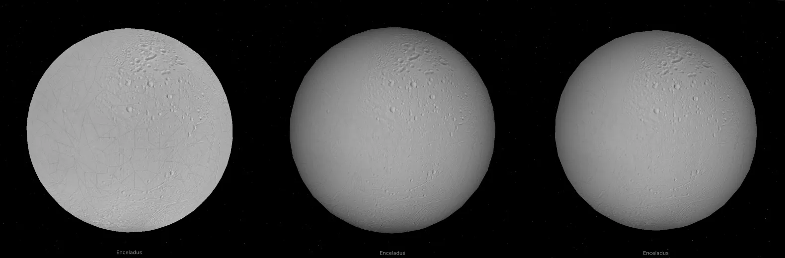

# Enceladus

Enceladus (NAIF 602) is a moon of Saturn. It shows a controlled Cassini camera mosaic, a terrain model, a published infrared color mosaic, a geologic map and two VIMS spectral views, on the IAU triaxial ellipsoid.

## Sources

- Monochrome: [controlled Cassini mosaic](https://astrogeology.usgs.gov/search/map/enceladus-cassini-global-mosaic-100m-schenk), and Elevation: [terrain model](https://astrogeology.usgs.gov/search/map/enceladus-cassini-global-dem-200m-schenk), both Schenk and McKinnon (2024), USGS/PDS, 2024-08-12 ([paper](https://doi.org/10.1016/j.icarus.2023.115827)). Credit NASA/JPL-Caltech/Space Science Institute, Paul M. Schenk, William B. McKinnon, LPI/USRA. Use constraint: please cite authors.
- Infrared color: [NASA PIA24027](https://science.nasa.gov/photojournal/enceladus-in-the-infrared-map-view/), the [Robidel et al. (2020)](https://doi.org/10.1016/j.icarus.2020.113848) infrared and [Bland et al. (2018)](https://doi.org/10.1029/2018EA000399) camera composite.
- Geology: [Crow-Willard and Pappalardo (2015)](https://doi.org/10.1002/2015JE004818), served by [NASA Solar System Treks](https://trek.nasa.gov/enceladus/) as the layer [Cassini ISS Geologic Map Units, Global](https://trek.nasa.gov/enceladus/trekarcgis/rest/services/enceladus/Cassini_ISS_GeologicMapUnits_Global/MapServer).
- Ice absorption and Infrared ratio: six calibrated VIMS observations with matched navigation backplanes. The [source interpretation](source/vims-chemistry/INTERPRETATION.md) defines every channel, mask and limit.
- Shape: the IAU 2015 triaxial radii, 256.6 × 251.4 × 248.3 km ([Archinal et al. 2018](https://doi.org/10.1007/s10569-017-9805-5)), as distributed in NAIF's generic kernel [pck00011](https://naif.jpl.nasa.gov/pub/naif/generic_kernels/pck/pck00011.tpc).
- Radius and facts: the [JPL satellite table](https://ssd.jpl.nasa.gov/sats/phys_par/sep.html) mean radius of 252.10 km and [NASA facts](https://science.nasa.gov/saturn/moons/enceladus/).
- Named features: the IAU/USGS Gazetteer of Planetary Nomenclature centre-point shapefile (retrieved 2026-09-11, public domain), pinned under `source/features/`. 43 names carry the lead summary of their English Wikipedia article (CC BY-SA 4.0, retrieved 2026-09-12), in `source/features/notes.json`.

The [investigation ledger](investigations.json) records source choices, trials and open questions, including why Photojournal figures PIA06432 and PIA10360 did not qualify as map views.

## Processing

**Monochrome and elevation.** The mosaic (16098 × 8049, 100 m grid, more than 500 Cassini ISS clear-filter images) is stretched linearly from DN 0–16500 to 0–255. The terrain model (8049 × 4025, 200 m grid) uses a blue–neutral–warm palette over −1 to +1 km with northwest hillshade and no exaggeration. Both are resampled to 8192 × 4096, and missing observations get the shared gray grid. Photographic maps use `textureScale: 0.25`.

**Infrared color.** NASA's original 8192 × 4096 TIFF is used unchanged. The red channel is the 3.1/1.65 µm ratio, green 2.0 µm and blue 1.8 µm reflectance, combined with ISS camera detail. The published grid puts 0° at the image centre, so the reader rolls it into the 0–360° frame. We used the distributed grid, not the mislabeled longitudes in the paper's Figures 9 and 11 ([corrigendum](https://doi.org/10.1016/j.icarus.2020.113954)).

**Geology.** Trek's file download answered "Access denied", so `source/geology/` keeps the layer's public ArcGIS query response: 13 polygons, one per unit, with the unit colors. Each polygon is rasterized at pixel centres into a 2048 × 1024 grid in the layer's own 252.1 km frame. Where units overlap, the smallest covering unit wins (`nestedUnits: "inner"` in `source/geology/prepare-grid.json`). Unit colors mark map units, not surface color. Reproduce from the repository root:

    python packages/bake/src/objects/acquisition/geology-grid.py src/objects/enceladus/source/geology/prepare-grid.json

**Shape.** The globe is that ellipsoid, drawn as 16 latitude bands of 32 leaves and two polar caps (452 leaves). The long axis points toward Saturn at 0° longitude and takes the display radius; the other axes keep their ratios. Terrain relief is not modelled on the globe; the Elevation dataset shows it. Until 2026-09-30 the globe was a 2,000-triangle reduction of the corrected v2 DSK (Park et al., doi:10.1029/2023JE008054); the [investigation ledger](investigations.json) records why it was replaced.

## Evidence

- Infrared placement: nine geographic samples, including all four corners, match direct RGB reads from the original TIFF. This checks texture addressing, not spacecraft pointing.
- Geology registration: the central LH unit is centred near 271° E, the leading-hemisphere apex. Every named tiger stripe falls in central south polar material, and over the Schenk mosaic unit edges follow the contacts with no visible shift. This is a visual check, not a measured offset. Gray covers 0.072% of the sphere.
- Shape: at equal mean size, the vertices of the former 2,000-triangle v2 mesh lie 0.31% of the radius from the ellipsoid (RMS), 0.97% at most; a sphere gave 0.84% and 2.11%. All 8,279 label anchor and outline points lie on the drawn surface within 0.01%.

- iPad, stress journey on 2026-09-30, measured with the same 452 leaves as a sphere: frames over 33 ms fell from 71 to 39, the longest from 144 to 102 ms, and composited layers from 213 to 155.

## Known problems

- Monochrome is photographed brightness, not calibrated albedo. Source shadows and mosaic brightness differences remain.
- Elevation values are kilometres above the reference ellipsoid with semi-axes 256.2 × 251.4 × 248.6 km, not heights above the 256.2 km cartographic sphere. They must not be added to the drawn IAU ellipsoid, whose axes differ slightly.
- Infrared color is a seam-free display composite with no validity mask or numeric channels. Its red tint is not a heat, ice-abundance or crystallinity scale, and camera texture is finer than the infrared data.
- VIMS views keep partial coverage and archive filtering; illumination is not photometrically corrected. [Filacchione et al. (2022)](https://doi.org/10.1016/j.icarus.2021.114803) would be a stronger basis, but its numeric maps have not been retrieved.
- Geology: equatorial and heavily cratered plains share one color (`#d7c29e`), so their boundary is invisible. The heavily cratered plains polygon has no holes where two other units sit, so the smallest-unit rule decides them. The line layer (ridges, troughs, scarps, contacts) is not shown. No browser check has been made yet.
- Map-to-limb registration on the ellipsoid has not been checked against Cassini images.
- The Schenk archive's prose swaps the image and DEM descriptions, and its catalogue dates precede Cassini's Saturn arrival; we do not reuse them.
- Feature outlines are not published nomenclature boundaries.

[Inputs](source/manifest.json) · [Delivered files](inventory.json) · [Credits](NOTICE.md)
