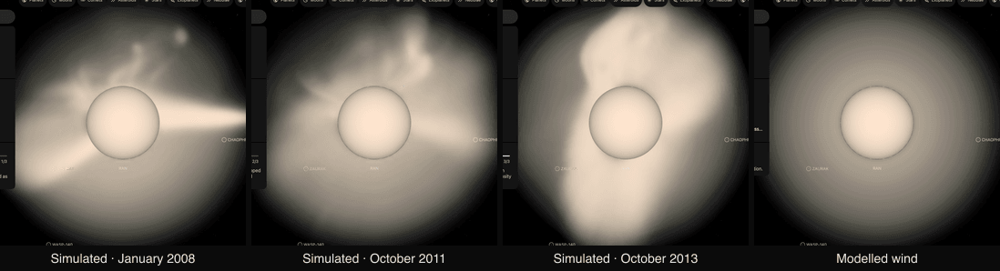

# ε Eridani corona

This package draws the corona of [ε Eridani](../eps-eridani/README.md) as prepared volumes attached to the star, the way its [dust ring](../eps-eridani-disc/README.md) and the [Sun's STEREO density](../sun-cor1-density/README.md) are. Nobody has imaged this corona. The star lists two datasets from it: "Simulated corona", a published simulation with one step for each of three observed magnetic maps, and "Modelled wind", a model from two published measurements.

## Sources

- **Simulation:** Ó Fionnagáin, Kavanagh, Vidotto et al. (2022, ApJ 924, 115; [arXiv:2111.02284](https://arxiv.org/abs/2111.02284)) ran magnetohydrodynamic simulations of this star's corona and wind with BATS-R-US/AWSoM. Each is driven by a map of the star's surface magnetic field that Jeffers et al. (2014, A&A 569, A79) made from spectropolarimetry: January 2008, October 2011 and October 2013. Their data are on Zenodo ([doi:10.5281/zenodo.5575241](https://doi.org/10.5281/zenodo.5575241), CC BY 4.0): one archive of 6.36 GB holding nine solution files, 0.9 to 1.1 GB each, about 10 million nodes on a block-adaptive grid of ±50 stellar radii.
- **Wind:** the mass loss Wood et al. (2002, ApJ 574, 412, Table 1) measure from the Lyman-alpha absorption of the star's astrosphere, 30 times the Sun's. The temperature Bennedik et al. (2026, [arXiv:2607.27832](https://arxiv.org/abs/2607.27832), Table 5) measure from its X-ray spectrum, 0.35 keV (4.06 million kelvin). The star's mass and radius are the ones [its own package](../eps-eridani/README.md) cites.
- **Recipe:** [`author.mts`](../../../packages/bake/authoring/eps-eridani-corona/author.mts) writes everything in `source/` from those inputs; `--check` reproduces it byte for byte when the nine files are under `.local/eps-eridani-corona`. [`tecplot-binary.mts`](../../../packages/bake/authoring/eps-eridani-corona/tecplot-binary.mts) reads the Tecplot binary files and [`simulation.mts`](../../../packages/bake/authoring/eps-eridani-corona/simulation.mts) resamples one onto a 128³ cube of ±4 stellar radii: each simulation cell paints the voxels inside it with the mean of its corners.

**Every grid is a density in three dimensions.** Each voxel takes the density at its own place about the star. Nothing is a sky image given depth.

**Which run is drawn.** The deposit does not hold the steady corona. It holds each map's simulation ten minutes after an eruption the authors set off near the equator, the north pole or the south pole. The three runs of a map share their steady state, so where one run's density is more than 1.25 times from the median of the three, that is its eruption ([`eruption-share.mts`](../../../packages/bake/authoring/eps-eridani-corona/eruption-share.mts)). The run drawn for each map is the one whose eruption disturbs the least of the drawn volume, which is the equator run every time:

| Map | Equator run | North pole run | South pole run |
| --- | --- | --- | --- |
| January 2008 | 5.6% | 7.1% | 11.5% |
| October 2011 | 9.4% | 10.4% | 14.8% |
| October 2013 | 3.7% | 4.4% | 6.4% |

The disturbed voxels lie at mean latitude −1°, +10° and +19° in the equator runs, +42° to +56° in the north runs and −41° to −45° in the south runs, which matches the file names. In 0.6% to 1.3% of the volume two runs depart at once.

**Orientation.** The simulation's z axis is the rotation axis, drawn 46° from the line of sight, the inclination the magnetic maps were fitted with (Jeffers et al. 2017, MNRAS 471, L96: 46 ± 2°). The papers used here give neither the direction of that axis on the sky nor the star's rotation phase today. The axis is drawn tilted toward north and the map's zero longitude toward Earth. Both are conventions.

**Brightness.** The simulated grids are shown through the radial filter coronagraph pictures use. At each distance from the star brightness is proportional to density, as scattered light is. A place 10 times denser than is typical of its distance is fully bright. Only the fall-off with distance is compressed: the typical density of each radius sits on the logarithmic scale of the [Sun's STEREO dataset](../sun-cor1-density/README.md), with its ceiling raised from 6.5 × 10⁶ to 10⁹ electrons per cm³. The typical density is one profile for all three maps: the median over the sphere at each radius, averaged over the three drawn runs. The wind grid has one density at each distance, so it sits on that scale directly. The color is the star's own, because light scattered by free electrons keeps the color of the light.

One volume unit is one stellar radius (0.74 solar radii). The cube is ±4 radii and is anchored on the star's scene origin.

## Evidence

- **In the app.** The image is the star's page on 5 October 2026 with each dataset selected, in headless Chromium at 1440 × 900, after the page reported ready with no console error.
- **Structure.** At 2 radii the densest twentieth of directions is 10, 9 and 15 times denser than the thinnest twentieth, for the three maps in order. The median field strength at 1.1 radii is 6.8, 5.8 and 14.0 gauss.
- **The wind model against the simulation.** [`control.mts`](../../../packages/bake/authoring/eps-eridani-corona/control.mts) prints both. The wind model is within 15% of the simulation's typical density from 3 to 3.9 radii and half of it at 2 radii. At 1.1 radii it is 8 times too thin: close to the star the gas is held by the magnetic field, which the wind model does not have.

  | Radius | Simulation, typical | Wind model | Wind ÷ simulation |
  | --- | --- | --- | --- |
  | 1.1 | 3.6 × 10⁸ | 4.3 × 10⁷ | 0.12 |
  | 1.5 | 4.6 × 10⁷ | 1.4 × 10⁷ | 0.31 |
  | 2 | 1.2 × 10⁷ | 5.8 × 10⁶ | 0.50 |
  | 3 | 2.2 × 10⁶ | 1.9 × 10⁶ | 0.86 |
  | 3.9 | 8.9 × 10⁵ | 9.5 × 10⁵ | 1.07 |

- **Previews.** The author's view of each grid from Earth: [January 2008](source/previews/simulation-2008-01.png), [October 2011](source/previews/simulation-2011-10.png), [October 2013](source/previews/simulation-2013-10.png) and [the wind](source/previews/wind.png).
- **Tests.** [`simulation.test.mts`](../../../packages/bake/authoring/eps-eridani-corona/simulation.test.mts) reads a small Tecplot file written by the test, refuses a truncated one, checks the resampling and the eruption share. [`corona-models.test.mts`](../../../packages/bake/authoring/eps-eridani-corona/corona-models.test.mts) checks that the wind carries the same mass through every sphere and that the radial filter leaves a place of typical density as bright as the plain scale.

## Known problems

- **No telescope has imaged this corona.** The simulated dataset is a published model driven by measured magnetic maps. The wind dataset is a model from two measured numbers.
- **Each simulated step is an instant ten minutes after a modelled eruption**, which disturbs 4% to 9% of the drawn volume. The steady state was not released; the authors offer the full set on request.
- **The maps are from 2008, 2011 and 2013.** The star's field changes within months, so none is the corona today.
- **The maps resolve only the large-scale field.** Active regions, which shape the Sun's corona near the surface, are not in them. The paper notes the southern hemisphere is the less constrained one.
- **The axis direction on the sky and the rotation phase are conventions.**
- **The wind model fails the Sun.** With the Sun's mass loss and its X-ray temperature at solar minimum (Johnstone & Güdel 2015, Table 1), it is 20 times the density STEREO measured at 1.5 solar radii and 0.65 times at 4. With the temperature at maximum it is 0.13 to 0.48 times. The result swings with the one temperature the model takes, so the model is drawn here only because this star's wind is measured and the simulation agrees with it beyond 2 radii.
- **A model of gas at rest was tried and left out.** With the star's X-ray luminosity it is within 1.3 times of the simulation at 1.1 radii, then 8 times too dense at 2 radii and 44 times at 3.9. [`control.mts`](../../../packages/bake/authoring/eps-eridani-corona/control.mts) prints it.
- The radial filter, the logarithmic scale, the fades at the star's edge and at the cube's edge, and the exposure are display choices.

[Investigation ledger](investigations.json) · [Inputs](source/manifest.json) · [Provenance](source/provenance.json)
