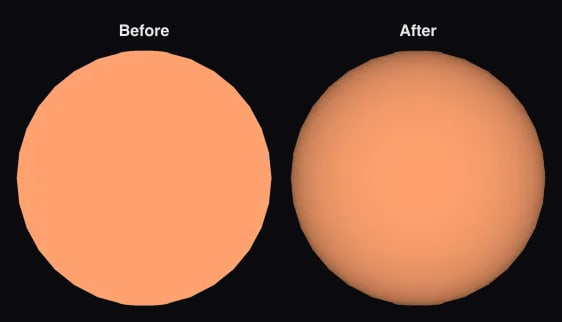

# Epsilon Indi Ab

Epsilon Indi Ab is a cold giant planet about 16 au from its star. JWST first imaged it in 2023, and has since taken the longest-wavelength image of any exoplanet. Its star is [Epsilon Indi A](../eps-indi-a/README.md).

## Sources

**Orbit.** Sanghi et al. ([2026](https://arxiv.org/abs/2603.08787), AJ) fit three decades of radial velocities of the star, with a Gaussian-process model of its magnetic activity, together with its Hipparcos-Gaia acceleration and the planet's JWST/MIRI, JWST/NIRCam and VLT/VISIR positions, using Octofitter. They publish the posterior of every model on Zenodo ([doi:10.5281/zenodo.19931118](https://doi.org/10.5281/zenodo.19931118), CC BY 4.0). No refit is needed: [`posterior-pick.py`](../../../packages/telescope-cli/src/new-object/hosted-orbits/posterior-pick.py) keeps one of the 32,768 samples of their fiducial model ([pick.json](source/orbits/pick.json)), the one with the highest log-posterior; the highest likelihood alone sits at a star mass of 0.84 solar masses, which their asteroseismic prior of 0.782 ± 0.023 rules out. PlanetOrbits.jl, which Octofitter orbits are computed with, writes the sky offsets with the same formulas as orbitize!, so the elements carry over unchanged. The orbit passes the JWST/MIRI position of 2023 July 3 within 1.9 of its errors and the JWST/NIRCam position of 2025 August 28 within 0.9 ([orbit.json](source/orbits/orbit.json)). The recorded orbit: a = 15.8 au, e = 0.21, i = 100.7°, period about 70 years, next periastron in 2043. Matthews et al. ([2026](https://arxiv.org/abs/2603.08780)) fit a similar orbit with orvara and a third JWST position (2025 May 10) that this fit did not use; the orbit drawn misses that one by 0.3 degrees in position angle, nine of its errors. The path drawn is this orbit. Every element and its derivation is in [`eps-indi-ab.json`](../../../packages/astronomy/data/bodies/eps-indi-ab.json).

**Radius, temperature and mass.** Radius 1.05 ± 0.01 Jupiter radii and 275 ± 5 K from evolutionary models at the planet's dynamical mass, its age and its luminosity measured by integrating its 4 to 25 micron energy distribution (Sanghi et al. [2026](https://arxiv.org/abs/2603.08787), section 5). Model values: the planet is unresolved. Mass 6.5 Jupiter masses, measured dynamically. A sphere: no oblateness is measured.

**Its own light.** It is drawn self-luminous, as the other imaged companions are: its glow is its own heat.

**Infrared color dataset.** The default dataset paints the sphere one false color from its measured flux in three infrared bands: red F1550C 15.51 µm (525 ± 16 µJy), green F1065C 10.55 µm (188 ± 6 µJy), blue F430M 4.278 µm (84 ± 4 µJy) (Sanghi et al. (2026), arXiv:2603.08787, with the MIRI fluxes of Matthews et al. (2024), Nature 633, 789; [record](source/photometry/band-color.json)). Display range: this planet alone, from zero to its brightest band (F1550C), so the color shows its band ratios; brightness is not compared across planets at different distances. Not a natural color; nobody has resolved its disc.

**Limb.** The disc is dimmed toward the limb by the quadratic law fitted to the JWST/MIRI F1065C intensity PICASO 4.1 (Batalha et al. 2019, ApJ 878, 70) computes from Sonora Elf Owl cloud-free (Mukherjee et al. 2024, ApJ 963, 73; [M/H] +0.7, C/O 2.5 times solar, log Kzz 4) model atmospheres at 300 K and log g 4.25, read between the models spectra_logzz_4.0_teff_275.0_grav_100.0_mh_0.7_co_2.5, spectra_logzz_4.0_teff_275.0_grav_178.0_mh_0.7_co_2.5, spectra_logzz_4.0_teff_300.0_grav_100.0_mh_0.7_co_2.5, spectra_logzz_4.0_teff_300.0_grav_178.0_mh_0.7_co_2.5 (u1 0.497, u2 0.367; the law fits each model's eight angles within 0.38% of the centre): a cloud-free model, the one Sanghi et al. (2026), arXiv:2603.08787 fit to this planet, because no table reaches a planet this cold and nobody has resolved its disc ([nodes](source/photometry/picaso-elf-owl-f1065c-quadratic.tsv)). The temperature and gravity are that fit's (Table 5, Sonora Elf Owl, the lowest reduced chi-squared among the fits whose mass agrees with the dynamical mass: Teff 300 K, g 178 m/s2 (log g 4.25), [M/H] +0.7, log Kzz 4, C/O 2.5 times solar, radius 0.925, reduced chi-squared 2.62; [record](source/photometry/atmosphere-fit.json)), not the 275 K of its measurements record.

**Rotation.** No rotation period or spin axis of Epsilon Indi Ab is measured; the papers cited in the README were checked. The display axis is the orbit normal ([rotation.json](source/preparation/rotation.json)).

## Evidence

Run of 2026-09-23:

- [`hostedOrbits.test.ts`](../../../packages/astronomy/src/hostedOrbits.test.ts) places the planet, at its star's Gaia distance, against the measured positions (see the test for each miss).

Run of 2026-10-04, when the color and the limb law were added. The orbit test above still applies: the orbit record did not change.

- The app's arrival picture of the planet in its color, before and after the limb law:

- [`imaged-limb.test.mts`](../../../packages/telescope-cli/src/new-object/imaged/imaged-limb.test.mts) checks that each node of [the law's file](source/photometry/picaso-elf-owl-f1065c-quadratic.tsv) records a band flux within 5% of the spectrum the Elf Owl release itself carries (1.04 at all four).

## Known problems

- The orbit drawn is one sample of a posterior whose semi-major axis spans 14.4 to 17.5 au and eccentricity 0.16 to 0.34 (16th to 84th percentiles): two years of imaging cover a small arc of a 70-year orbit.
- It misses the 2025 May JWST position of Matthews et al. (2026), which the fit did not use, by 0.3 degrees.
- The radius is a model value; the planet is a point in every image.
- **Model limb.** The limb darkening is computed from the cloud-free model a paper fitted to the planet, in the middle band of its color, not a measurement of this planet; another model grid would give another law. Among the 4 models it is read between, the disc near its edge (the lowest of the eight angles) is 30% to 35% as bright as the centre. PICASO finds 104% of the band flux the release states for those models.

[Investigation ledger](investigations.json) · [Inputs](source/manifest.json) · [Preparation](source/preparation) · [Delivered files](inventory.json) · [Credits](NOTICE.md)
