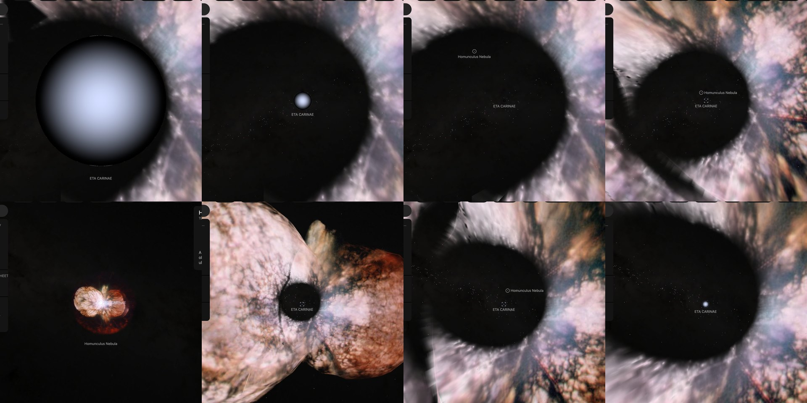

# Eta Carinae

## Sources

Eta Carinae (HD 93308, HR 4210) is 2350.0 parsecs away. It is the star inside the [Homunculus Nebula](../homunculus-nebula/README.md), the cloud of dust around it: a luminous blue variable (SIMBAD's class for it) so wrapped in its own wind that no surface is seen. It is an object of its own, inside the nebula, so the star can be opened from the nebula's page, where the nebula's surface stays drawn around it. What is drawn is the wind, as the VLTI measured its near-infrared light (Weigelt et al. 2007, Table 2): a sphere out to where that light is a tenth as bright as at the centre, dimmed toward its edge so that it is half as bright at the measured half-brightness size, in the color of a black body at the temperature where the wind turns opaque (Groh et al. 2012, Table 2).

**Star.** Placement: Gaia DR3 source 5350358584482202880, distance 2,350 pc from Smith (2006), ApJ 644, 1151: 2350 ± 50 pc from the Homunculus's shape and expansion, the distance its nebula's page stands at; Gaia DR3 gives it no parallax. Radius 1301 solar radii from Weigelt et al. (2007), arXiv:astro-ph/0609715, Table 2: the wind's K-band continuum light (2.174 µm, VLTI/AMBER) falls to a tenth of its central brightness at a diameter of 5.15 mas (±4%); half of that at 2,350 pc is 6.05 AU, 1,301 solar radii (https://arxiv.org/abs/astro-ph/0609715). No mass is measured, so GM is 0, the records' unpublished value. Temperature 9,400 K from Groh et al. (2012), arXiv:1204.1963, Table 2: the primary's effective temperature where its wind turns opaque (Rosseland optical depth 2/3). No surface gravity of this star is published.

**Color.** A Planck spectrum at 9,400 K, because no archive holds a spectrum of this star (stis-ngsl: HD 93308 is not in the library; gaia-xp: Gaia DR3 published no sampled BP/RP spectrum of it; pulkovo: HR 4210 is not in the catalogue; kiehling: HR 4210 is not among its 60 stars; kharitonov: HR 4210 is not in the catalogue; burnashev: BS 4210 is not in part2), through the CIE 1931 2° observer: #d2ddff. Routes tried in order: stis-ngsl: HD 93308 is not in the library; gaia-xp: Gaia DR3 published no sampled BP/RP spectrum of it; pulkovo: HR 4210 is not in the catalogue; kiehling: HR 4210 is not among its 60 stars; kharitonov: HR 4210 is not in the catalogue; burnashev: BS 4210 is not in part2; planck: used.

**Limb.** The disc is dimmed toward the limb by the power law I(mu) = mu^6.05 whose brightness is half the centre's at the diameter Weigelt et al. (2007), arXiv:astro-ph/0609715 measured for it, 2.33 mas, on a disc that ends at their tenth-brightness diameter, 5.15 mas (VLTI/AMBER K-band continuum at 2.174 um; not a visible band).

## Evidence

Generated 2026-10-05 by [new-object-cli.mts](../../../packages/telescope-cli/src/new-object/new-object-cli.mts) from Gaia DR3, SIMBAD and the archives named above; each choice was read with the dataset's own reader.

Headless Chromium at 1440 × 900, device pixel ratio 2, on 2026-10-05, no page errors. Top row: the star's own page as it opens, 32 AU from the star, its disc dimmed toward the edge; then 4, 8 and 12 wheel steps out, at 263, 1,890 and 11,877 AU, with the nebula's surface ([Homunculus Nebula image layers](../homunculus-nebula-layers/README.md)) drawn around it without the sheet through the star. Bottom row: the nebula's page, then a zoom in with the wheel alone, no click: 4 steps in, the view has handed over to the star, 42,973 AU from it; 8 and 13 steps in, 6,079 and 522 AU.

## Known problems

- **Assumptions of the frame.** The axis's position angle and the rotation phase are conventions.
- **Not shown.** What is drawn is the star's wind, not its surface. The star under the wind is modelled at 60 solar radii and 35,200 K, and models from 60 to 480 solar radii fit its spectrum equally (Groh et al. 2012, Table 2 and Sect. 3, https://arxiv.org/abs/1204.1963).
- **Not shown.** The near-infrared light is not round: VLTI measurements find it elongated, which fast rotation or the companion's cavity in the wind both explain (Groh et al. 2010, https://arxiv.org/abs/1006.4816). It is drawn as a sphere.
- **Not shown.** Half of the wind's near-infrared light comes from outside a diameter of 4.23 mas, in a faint halo that reaches past the sphere drawn (Weigelt et al. 2007, Table 2, https://arxiv.org/abs/astro-ph/0609715). The halo is not drawn.
- **The limb is a fit to two sizes.** The paper prints no exponent: the power law is the one that is half as bright at the printed half-brightness diameter on a disc ending at the printed tenth-brightness diameter. It is dark at the edge, where the measured light is a tenth of the centre's, and reaches a tenth at 0.73 of the radius.
- **Not shown.** It is a binary with a period of 5.54 years. The companion is not seen directly, and the orbit's tilt and direction come from models of the colliding winds (Madura et al. 2012, as adopted by Groh et al. 2012, Table 2: inclination 138 degrees, longitude of periastron 260 degrees). The companion is not drawn.
- **Not shown.** The star's mass is not measured.
- **A model color.** The color is a black body at 9,400 K. No spectrum of the star alone is used: its light reaches us through its own dust, and the Homunculus reflects most of it.
- **Measured limb, other band.** The law was measured or fixed outside the visible band the color is drawn in; the visible limb is not measured.

[Investigation ledger](investigations.json) · [Inputs](source/manifest.json) · [Preparation](source/preparation) · [Delivered files](inventory.json) · [Credits](NOTICE.md)
