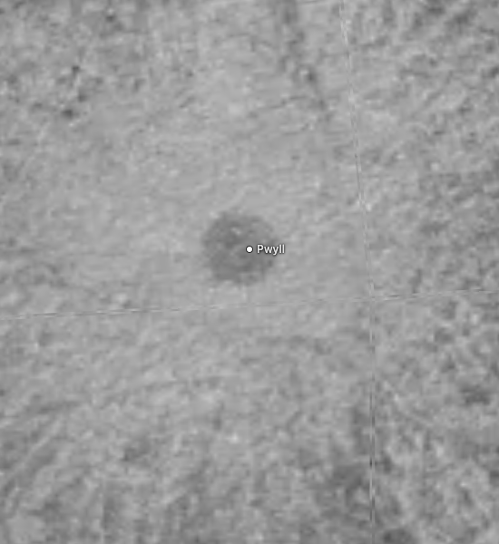

# Europa

The navigation marker uses its existing source map as a stylized identifier. The [marker recipe](source/preparation/navigation.json) crops and resizes it, then prepares a circular alpha edge and the shared full-phase curvature shading (35% ambient, 65% diffuse). It is not an observer projection or a view at the scene epoch.

## Sources

- The [USGS Voyager/Galileo global mosaic](https://astrogeology.usgs.gov/search/map/europa_voyager_galileo_ssi_global_mosaic_500m) is a 19,631 × 9,816 monochrome GeoTIFF on a nominal 500 m grid.

- **Monochrome photographic inserts** use 332 CLEAR-filter photographs from the [USGS controlled individual-image release](https://stac.astrogeology.usgs.gov/docs/data/jupiter/europa/galileo_individual_images/), described by [Bland et al. (2021)](https://doi.org/10.1029/2021EA001935). These calibrated observations use the published control network and replace regional pixels within the existing global Monochrome view. The global mosaic remains underneath.

- The **False color** lens uses the [USGS controlled Galileo observations](https://stac.astrogeology.usgs.gov/docs/data/jupiter/europa/galileo_individual_images/) (CC0), by Bland, Weller and colleagues. The three sequences are G1ESGLOBAL01 (1996-06-28), 12ESGLOCOL01 (1997-12-16), and 14ESGLOCOL01 (1998-03-29).

- The Elevation view adds the released [USGS controlled Agenor DTM](https://stac.astrogeology.usgs.gov/docs/data/jupiter/europa/europa_controlled_usgs_dtms/).

- The geology view preserves the ten source map units and no-data regions from [Leonard, Patthoff and Senske (2024), SIM 3513](https://pubs.usgs.gov/publication/sim3513), scale 1:15 million.

- The infrared view uses [the registered Galileo NIMS archive](https://doi.org/10.17189/4sz4-5024), observations 17ENGLOBAL01A and 17ENGLOBAL02A, Minnaert-corrected CIOF products.

- The VLT/SPHERE composition release of [King, Fletcher and Ligier (2022)](https://doi.org/10.3847/PSJ/ac596d) is pinned as [Zenodo 6034904](https://doi.org/10.5281/zenodo.6034904). [reflectance-conversion.json](source/composition/reflectance-conversion.json) and [model-conversion.json](source/composition/model-conversion.json) bind the exact source bytes and converted fields. Its **Ice signature**, **Fine ice** and **Coarse ice** views are withheld from publication until reuse terms for the numerical data are explicit (see Known problems).

Source selections, recorded trials and open questions are in the [investigation ledger](investigations.json).

## Evidence

The 14 September 2026 **Monochrome** update inserts 301 equirectangular products and 31 products whose inspected STAC records list only polar GeoTIFFs. The shipped 8,192 × 4,096 geographic preparation, the one image density, receives controlled photographs over **15.224% of the sphere**, with 330 contributing images (asset record (`prepared/assets.json`)). Outside those footprints, the published global mosaic stays visible. The update did not change the other datasets.

[Before and after in the running app](evidence/galileo/browser.json) · [Surface and delivery checks](evidence/galileo/delivery.json) · [Two-product fresh restoration](evidence/galileo/restoration.json). All 332 original GeoTIFFs contribute to the source lineage; the asset record retains the selected area and fitted display gain for each image at each level.

[Regional before](evidence/galileo/regional-before.png) · [Regional after](evidence/galileo/regional.png) · [Southern before](evidence/galileo/southern-before.png) · [Southern after](evidence/galileo/southern-regions.png). These matched views show where photographic inserts change the surface, including remaining brightness boundaries. [Focused validation](evidence/galileo/checks.json) separates the passing checks from four existing shared failures reproduced on main. Strict preparation/tool TypeScript passes. Five replacement images are published and verified against their immutable URLs; the other 130 Europa image files retain their bytes. Renderer, geometry, runtime definition, atlas dimensions and the seven independent views are unchanged. Full application/conformance checks were not run.

The 14 September 2026 composition preparation added **Ice signature**, **Fine ice**, and **Coarse ice** as a local preview. They are now withheld from publication until reuse terms are explicit; the evidence below records that preview. [Reflectance evidence](evidence/composition/reflectance-values.json) and [model evidence](evidence/composition/model-values.json) compare all 64,800 geographic nodes in each of five converted grids, including the two retained uncertainty products, with the original release. Values agree exactly after float32 rounding; missing samples and the periodic seam retain their source meaning. [Fresh restoration](evidence/composition/restoration.json) downloads both original archives into an empty source root and reproduces all eleven composition manifest entries.

[Ice signature](evidence/composition/ice-signature.png) · [Fine ice](evidence/composition/fine-ice.png) · [Coarse ice](evidence/composition/coarse-ice.png) · [DPR 2](evidence/composition/ice-signature-dpr2.png) · [Mobile](evidence/composition/coarse-ice-mobile.png). The [browser receipt](evidence/composition/browser.json) pins the tested files above `f8fbdaa0b`, viewport, camera, selected textures and inspected captures. Dataset switching retains 450 surface leaves; minimap rotation and keyboard zoom work. [Delivery evidence](evidence/composition/delivery.json) verifies the unchanged scene and prior assets; fifteen added image files total 222,678 bytes.

Focused checks pass: numeric conversion/acquisition (15), body behavior and content (14 across both moons), source/provenance (30), source-usage conservation (1), and strict preparation/tool TypeScript. Eight shared startup-fixture/import-closure failures across the two bodies were reproduced on base `a15706943`; these remain outside this surface change. Full application checks and public asset installation are not qualified. The local preview omits six unavailable unrelated nebula context banks. Mobile keeps the texture without horizontal overflow, but shared orbit/label clutter and the open information sheet limit visual review. The texture bake receipt retains its original source hashes; later content and provenance refreshes do not claim another full bake.

The 2026-09-13 [color-encoding capture](evidence/color-encoding/capture.json) checks the revised surface at DPR 1 and 2, dragging, Shadows, and the mobile selector. Its source/asset hashes identify the tested uncommitted changes above `8cc1a2fae`; retained geometry is identical to that baseline. [Image delivery](evidence/color-encoding/delivery.json) verifies the current immutable URLs by byte count and SHA-256. The [shared color method](../../../docs/color-preparation.md) explains the scientific display and its limits.

[Displayed surface](evidence/color-encoding/color-dpr1.png) · [DPR 2](evidence/color-encoding/color-dpr2.png) · [Shadows](evidence/color-encoding/oblique-shadows-dpr1.png) · [Mobile](evidence/color-encoding/mobile.png). The capture faces the measured color region (control pitch 20°, yaw 180°); the application’s initial viewpoint is unchanged. Its polar assets are byte-identical because this color footprint does not reach the caps.

Polar sprites now sample the pinned original photographs directly, preserving the declared coordinates and source gaps. Existing monochrome fallback is retained where a color view already uses it. Each sprite is 1024 × 512 pixels, the one prepared density; the 8K latitude-band images from #151, geometry and lighting are retained. [The shared preparation guide](../../../docs/surface-preparation.md#preserve-photographic-detail-through-preparation) describes the method and its limits.

| View | Both prepared levels, before → current |
| --- | --- |
| normal | 175.2 → 178.0 kB |

These download sizes refer only to the polar sprites. Decoded dimensions are unchanged. The scene matches [the previous main version](https://github.com/layoutit/css.earth/tree/c13f3643b53171523dbf59dc92fc7ce49e9c0e24/src/planets/europa/prepared); [the raster recipe](source/preparation/raster.json) and [asset inventory](inventory.json) bind the current preparation. Existing source-resolution and registration limits still apply.

Photographic refresh, 12 September 2026, on base `3efdf2c9`: these matched
Chrome crops show Pwyll at 1280 × 720, DPR 1. The before atlas was reproduced
with the exact `53b262bd` delivery hash. The fractures gain detail without moving
the crater or filling missing observations.

| Before | Current |
| --- | --- |
|  |  |

[The controlled-color view](evidence/photographic-detail/controlled-color.png)
shows the retained three-band footprints near Falga Regio. Both photographic
views were inspected with Shadows on/off and at DPR 1 and 2. Preparation
build/type checks, source-record generation and unchanged scene/geometry checks
pass. The ten photographic files total 18.95 MB, previously 6.95 MB; the largest
decoded atlas is 195 MiB. Three unrelated scientific thumbnails were unavailable
locally, and the cross-body search preview covered only these three moons;
this is not aggregate browser or scientific-lens qualification.

Earlier shared-lane migration (base `53b262bd`) qualified the sphere, lighting,
source interpretation and feature placement. This photographic refresh retains
those source files, coordinate transforms, masks, geometry and scene structure.
Its new evidence concerns finer sampling of the photographs; it does not repeat
the scientific-lens review.

Earlier run at base `53b262bd` (12 September 2026): `node tools/objects/dist/prepare-authored.js europa --write` prepared the package through the shared raster lane and `tools/objects/observation/interpret.mts`; `node --test tests/objects/unit/europa/*.test.mts` passes except the shared runtime-package and import-closure tests that fail identically on `main` (recorded once in the pull request).

A headless Chrome probe (`output/probe-spheres.mts`, ignored scratch) mounted the page on the dev server, selected every lens (normal, enhanced, elevation, geology, infrared) with no console errors or failed requests, and pinned a Gazetteer feature from the sidebar search on the standard mesh (feature id 4878).

Gazetteer rims drawn over the prepared equirectangular minimap at both candidate map edges (`output/edge-markers.mjs`) agree with the declared `mapLeftEdgeLongitudeDeg` in `source/preparation/features.json`.

- Original files, STAC metadata, source processing, seven independently Pillow-decoded value anchors, and the exclusion evidence are retained under [source/science/controlled-dtms/](source/science/controlled-dtms/).

- Focused checks run from the shared runners in [tests/objects/unit](../../../tests/objects/unit/runtime-package.test.mts) (runtime package and feature catalogue, scoped with `CSSEARTH_TEST_OBJECTS=europa`) and the shared browser conformance harness.

Composition conversion: **Ice signature** is the observed, photometrically corrected `1.30000 / 1.50263 µm` reflectance ratio. The numerator and denominator are exact released samples; “1.51 µm” is only the paper's rounded label. It has 19,644 valid native nodes. **Fine ice** and **Coarse ice** are separate posterior-median model components for crystalline 0.1–0.3 mm and 0.3–1 mm ice, each with 19,616 valid nodes. The pinned source hashes, output hashes, ranges and interval-width uncertainty fields are in the two conversion records; preparation only reorders coordinates, reverses latitude and repeats the periodic seam.

## Known problems

- **Monochrome inserts:** Original illumination and brightness joins remain. One display gain per photograph matches co-located valid global-mosaic pixels near its selected boundaries, capped against the brightest valid native sample. This does not correct illumination or recover albedo. The controlled release uses a sphere rather than a global terrain model; published relative control uncertainties are about 247 m in latitude and 307 m in longitude, with less secure absolute placement away from Cilix. The older global mosaic has different registration errors. The delivered geographic grid is about 1.20 km at the equator, so finer native information remains beyond this fixed texture budget. Native grid spacing is not a claim of independent resolved detail.

- **Monochrome delivery:** The detailed packed image remains 8,320 × 6,144 pixels, exactly the previous dimensions: 195 MiB decoded as RGBA. Its download is 6.98 MB, down from 7.18 MB. All five replacement images total 9.53 MB, down from 9.99 MB. Polar sprites retain their existing 1024 × 512 detailed dimensions. Browser interaction was inspected, but physical-phone memory/performance was not profiled.

The existing atlas seams can remain visible at extreme close zoom. This change
retains the geometry and its packing layout.

Named features: the IAU/USGS Gazetteer of Planetary Nomenclature centre-point shapefile for Europa (retrieved 2026-09-11, public domain per its FGDC metadata) is pinned under `source/features/`. Preparation verifies the archive, reads the attribute table and datum, drops the albedo-feature type code, folds repeated rows, converts each positive-east centre through `presentation/surface-map.json` with the map’s left edge at 0° E, and anchors it on the mesh; craters and faculae trace a rim circle, other types their published extent box. Outlines are not published nomenclature boundaries, and the readout longitude counts from the map’s left edge, which here coincides with the Gazetteer origin. The map edge was fixed by cropping the source raster at a landmark’s Gazetteer centre under both hypotheses (see the pull request that added the feature).

Feature notes: 12 of the labelled names carry a caption note, the lead summary of their English Wikipedia article (CC BY-SA 4.0, retrieved 2026-09-12), joined through Wikidata's Gazetteer id property and pinned with the article link and revision in `source/features/notes.json`; the caption credits Wikipedia beside the IAU naming year.

- **False color:** It combines 756 nm infrared, 559 nm green, and 404 nm violet as display red, green, and blue. This is not natural color. After geometric normalization and the angle limits below, about 14.3% of the sphere has usable three-band coverage.

- **Photographic coverage:** Observed monochrome forms the base elsewhere; grayscale does not imply measured neutral color. The gray cartographic grid appears only where both sources lack imagery.

- **Elevation:** It retains the original relative stereo heights in meters, with no vertical offset, no conversion to a global reference level, and no globe displacement.

- **Illumination:** This is an approximate disk correction, not calibrated unlit albedo: there is no phase-angle normalization, fitted Europa scattering model, terrain model, or removal of cast shadows.

- **Infrared:** The blue channels differ slightly (0.732919 and 0.740634 µm); this is a spectral color display, not a uniform quantitative abundance map.

- **Composition lenses:** Native coordinates are latitude north-positive and longitude east-positive; source-paper labels in west longitude must therefore be converted before comparison with this body. The 1° release grid is resampling, not independent detail: SPHERE sampling is about 25 km/px but diffraction limits resolved features to about 150 km. Ice signature is a reflectance-ratio proxy, not an abundance. Fine and coarse ice are MCMC component estimates with 16th/84th-percentile bounds; they are not a total-ice posterior, so no component medians or percentile bounds are summed. Individual salt fits remain degenerate.

- **Reuse:** The Zenodo record is open/`other-open`, but neither the tagged source nor the located record metadata provides explicit terms for reusing the numerical release. Article or preprint licensing does not settle those data rights. The three composition views are therefore withheld: they have no lens, surface recipe or dataset text, and no composition asset is published. The pinned sources, conversion records and evidence stay so the views can return once explicit reuse terms exist.

[Inputs](source/manifest.json) · Provenance (`prepared/provenance.json`) · [Delivered files](inventory.json) · [Credits](NOTICE.md)

## Methods and source notes

Galileo regional photographic preparation

The selected products are radiometrically calibrated Float32 I/F images from the Galileo SSI CLEAR filter (0.611 µm). The published USGS workflow corrected pointing through photogrammetric bundle adjustment, reassembled interrupted image fragments, and projected them on a 1,560,800 m sphere with planetocentric latitude and east-positive longitude. It did **not** photometrically normalize these products. Original GeoTIFFs, coordinates, capture identities, byte counts and hashes are pinned in [the source manifest](source/manifest.json); each has a download operation and a canonical source record. Native files total 1.55 GB and are restored rather than committed.

Selection takes the released CLEAR-filter equirectangular products below 800 m projected grid spacing, plus the 31 CLEAR products whose inspected STAC records list only polar GeoTIFFs. This selects 332 of the release's 481 Galileo observations. The matching equatorial versions are used where an image also has a polar projection, avoiding duplicate ingestion. The other observations are not declared absent or unusable; they are outside this regional selection.

The [controlled-map decoder](../../../tools/objects/observation/controlled-map-mosaic.mts) verifies the actual GeoTIFF projection, sphere, affine grid, band, dimensions and no-data value before sampling. Bounds come from the raster rectangle, not a cropped catalogue footprint. Equirectangular downsampling integrates native pixel squares. Polar resampling uses a geographic subgrid at source-pixel spacing; this numerically approximates the curved footprint. At magnification, sampling is bilinear. Missing contributors, zero no-data and ISIS special values stay missing; valid black pixels are supported when zero is not the declared no-data value.

Within the selected regions, one valid controlled photograph supplies each output pixel. Smaller projected pixel grids take precedence, with source ID breaking ties deterministically. Missing photographic pixels use the published global mosaic; only gaps in both sources receive the gray grid. Calibrated I/F stays floating point through display matching. A four-pixel strip inside each selected image boundary supplies co-located valid samples from the global mosaic. Their median linear-display brightness ratio determines one gain per image, capped so its brightest valid native sample cannot exceed the display range. At detailed density all 330 contributors have overlap samples; fitted gains span 0.306–11.534, with 110 limited by native highlights. The original I/F 0–2 display interval is scaled by that gain, then encoded once using the [shared IEC sRGB transfer](../../../docs/color-preparation.md). This is relative display matching to a contrast-adjusted mosaic, not physical calibration. It changes neither coordinates nor local source contrast ratios, blends no images, and invents no missing terrain. The independent false-color view continues to use its original global base and original preparation.

The existing raster packer produces 4K/8K geographic levels in the unchanged latitude-band layout. Polar sprites sample the original controlled maps through the same projection and fitted display gains, falling back to the original global photograph. The existing 640 × 320 Monochrome minimap is refreshed from the composite. The default camera, geometry, materials, lighting banks and all original variants are retained.

A trial replacement of the entire global mosaic was rejected because its brightness joins were worse. Global application of terrain-specific photometric parameters was not qualified. The delivered Monochrome update instead retains the global mosaic and inserts controlled regional photographs with the bounded display matching described above. No rejected photometric model supplies its pixels.

Detailed source survey, assumptions and preparation

Europa uses the shared object runtime, camera, shell, lighting placement, and orbital view. Its package owns the imagery and prepared scene. It never mounts inside Jupiter's scene.

The scene is fixed at its preparation epoch and does not offer a rotation-speed control. Camera motion and Shadows use the shared controls.

Individual observations range from about 200 m to 20 km per pixel. Differences in source resolution, seams, and observed illumination remain visible. No color, elevation, ocean, or thermal map is inferred from this image.

The GeoTIFF's cylindrical coordinates increase eastward, with a central longitude of 180°. The actual outer left edge is −0.011003118° and the map spans 360.003667706°, with rows running north to south. Native bilinear preparation back-projects each canonical output pixel centre through the GeoTIFF's actual origin and resolution; it does not stretch those bounds to exactly 0–360°. Its projection uses a 1,562,089.9658 m sphere; the rendered mean-radius sphere uses the astronomy catalogue's 1,560.8 km physical radius. It is not a resolved shape model.

The explicit no-data value is zero. Preparation now samples the photographs to 8192 × 4096 only where every nonzero-weight native bilinear contributor is valid, retaining dark nonzero observations and withholding incomplete or masked footprints. The corrected registration changes prepared monochrome pixels and their co-located color fallback; the original mosaic and controlled I/F source values are unchanged. The shared gray cartographic grid marks missing data. It is not invented terrain. Band textures are reprojected for the shared projective surface geometry; polar textures use the same map and hemisphere-specific longitude mapping.

The source already contains shadows. The Shadows setting adds approximate spherical illumination; with Shadows off, a fixed curvature overlay gives depth. Neither mode recovers unlit albedo or physically relights photographed features. Europa's tenuous oxygen atmosphere does not justify a visible halo.

[NASA's Europa facts](https://science.nasa.gov/jupiter/jupiter-moons/europa/europa-facts/) support the introduction, oxygen atmosphere, and approximate 671,000 km distance from Jupiter. Magnetic evidence strongly suggests a subsurface salty ocean; the ocean is not directly mapped by this globe. Radius, parent, orbital period, and orientation use the checked-in astronomy package. Rotation is presented as synchronous with Europa's approximately 3.55-day orbit. The 5.2 AU badge denotes Jupiter's approximate mean distance from the Sun, not Europa's distance from Jupiter.

At the pinned preparation epoch, the orbital view uses Europa's parent-relative state and Jupiter's gravitational parameter to prepare an ellipse focused on Jupiter. The Sun retains its separate heliocentric position. The shared solar view approximates planet centres using VSOP87 system barycentres; satellites use the package's JPL mean Kepler elements, not a live high-precision ephemeris. The photographed surface uses IAU body orientation without a manual rotation.

Source hashes, origins, and licenses are pinned in `source/manifest.json`; runtime files are listed in `inventory.json`.

Original imagery remains unchanged and is excluded from Git. Preparation does not require another body's scene.

Exact image dates, band identities, coordinates, source URLs and hashes are pinned beside the source inputs.

These are calibrated 32-bit I/F images with corrected camera pointing, on an east-positive cylindrical grid centred at 180°, radius 1,560,800 m. They have not been photometrically corrected by USGS. Native grids range from 1.375 to 1.570 km per pixel. Higher-density observations take priority. Color appears only where all three bands from the same sequence have valid interpolation footprints; zero no-data, ISIS special pixels, and incomplete boundaries are withheld. Preparation records its surface percentage per observation. Values stay linear floating-point I/F through interpolation, photometric correction and level matching. One common range, I/F 0 to 1, then maps each band to a linear display channel, and the [shared IEC sRGB transfer](../../../docs/color-preparation.md) and 8-bit rounding are applied once, at output (`tools/objects/color-transfer.mts`). Bright corrected values are not clipped before matching; each observation's gain is capped so its brightest value stays within the range. No monochrome detail is transferred into color. The newer controlled dataset and the older monochrome mosaic have different positional accuracy.

The 28ESGLOCOL01 sequence (2000-05-22) was removed from this lens: its 13.832 km-per-pixel imagery covered sharper monochrome with a visibly blurred insert. The lens now uses the monochrome base there, with no invented color. Preparation applies one spherical [Lunar–Lambert disk normalization](https://isis.astrogeology.usgs.gov/9.0.0/Application/presentation/Tabbed/photomet/photomet.html) to every color image, with weights selected by observation:

| Observation | Disk weight L |
| --- | --- |
| 14ESGLOCOL01, March 1998 | 1 (accepted Lommel–Seeliger correction) |
| 12ESGLOCOL01, December 1997 | 0.5 |
| G1ESGLOBAL01, June 1996 | 0.5 |

For each band's surface point, `mu0` and `mu` are the cosines of incidence and emission. The disk function is `D = (1-L)*mu0 + 2*L*mu0/(mu0+mu)`. Linear I/F is multiplied by `D(reference)/D(observation)`, with reference incidence 30° and emission 0°, before the [shared IEC sRGB display transfer](../../../docs/color-preparation.md). The previous gamma-2.2 approximation is replaced by this standard transfer, applied once after composition and brightness matching. The two mixed weights reduce the remaining gradients without the stronger brightening of pure Lambert in the compared patches. They are visual presentation choices, not fitted physical scattering parameters. The [USGS Europa photometry study](https://www.hou.usra.edu/meetings/lpsc2022/pdf/1691.pdf) motivated comparing Lambert; we do not apply its per-band albedo normalization.

All three bands must have incidence and emission at most 75°; otherwise the observed monochrome base is used. This removes about 43% of the previously displayed December color pixels and 25% of the June color pixels on the prepared map. Those difficult edges are withheld, not recovered. There is no inferred color or recovery of unobserved terrain.

`source/photometry/` binds all 20 controlled ISIS labels, including each exact capture ET and body-orientation coefficients, to pinned [JPL Horizons](https://ssd-api.jpl.nasa.gov/doc/horizons.html) geometric Sun and Galileo vectors relative to Europa (ICRF, km, JDTDB). The raw API responses and request URLs are checked in; labels are restored by the existing source acquisition command. Preparation transforms the vectors using the label's adjusted prime meridian (W0 = 36.054°) and [NAIF PCK orientation equations](https://naif.jpl.nasa.gov/pub/naif/toolkit_docs/C/req/pck.html), including nutation/precession. It does not use the older PDS label's west longitudes. Horizons uses its archived Galileo trajectory and current planetary ephemerides, rather than reproducing the original USGS SPICE kernel set exactly. Preparation is offline and reproducible from these pinned inputs.

Both lenses retain the shared Shadows control and prepared globe lighting. Residual photographed shadows and seams can remain; added globe lighting is approximate.

To soften brightness steps against monochrome, preparation fits one display brightness multiplier per color sequence. The fit is the median ratio of monochrome to composite display luminance (weights 0.2126, 0.7152, 0.0722), after decoding the existing monochrome display bytes into linear display values, using co-located valid pixels within a four-texel strip inside each color footprint. It applies the same multiplier to all three floating channels before encoding, capped by the brightest channel in the entire sequence so highlights cannot clip. This preserves ratios in the chosen linear display channels before final 8-bit rounding; those channels are assigned spectral bands, not measured human-visible primaries. No monochrome detail is transferred, no missing data enters the fit, and no feathering or blending is used. This is presentation matching against the contrast-adjusted monochrome mosaic, not additional physical calibration; source I/F files are unchanged. Remaining differences in color, lighting, resolution and positional accuracy can still reveal the boundaries.

The NASA Trek/Jónsson 2015 color mosaic was rejected: its [author documents fictional polar terrain and cloned gaps](https://www.planetary.org/articles/0218-mapping-europa), and its [publication license restricts derivatives](https://www.planetary.org/space-images/color-global-map-of-europa). None of its pixels enter the prepared package.

## Preparation ownership

This package contains authored JSON recipes, source provenance, and generated JSON. Reusable observation masking, projection, lighting, celestial, and retained-scene operations live in `tools/objects/terrestrial-layers/`; no package-local executable preparer or runtime is required.

Delivery keeps the prepared HD texture dimensions. Surface and polar atlases use WebP quality 90 with full-quality alpha; source maps remain lossless. Lighting stays lossless.

## Agenor relative stereo terrain

The regional independent relative solution is not combined with other sites. The view's −700…+300 m scale spans the actual −641.9267578125…+218.51205444335938 m source range. Fixed northwest cartographic relief shows slopes; it does not change the numeric legend or imply physical illumination.

The exact Float32 COG is 642×133, with 39,032 finite non-special samples. Its planetocentric equirectangular CRS is centered on 180°E on a 1,560,800 m sphere, with origin (−1236786.1079616144, −1146374.9999678) m and pixel increments (+614.0078951699215, −614.0078951699215) m. This actual reprojected pixel spacing differs from the nominal 450 m DTM post spacing; effective resolved detail is about 3 km. Source documentation gives nominal 52 m vertical precision and an approximately 100 m empirical estimate, not a pointwise accuracy guarantee. The controlled frame differs from the old 2010 mosaic's registration.

The genuine height no-data value and complete bilinear footprints control coverage. The released `FOM` and `ClrConf` files are byte-identical: the retained processing log translates the FOM VRT into both outputs and cubic-resamples the categorical FOM codes. Neither is used as a confidence or quality mask. Exact ignored source TIFFs have acquisition recipes; the CC0 release and source authors retain attribution.

The body-owned lens focus is 142°E, 43.7°S at supported zoom 4. The False color lens covers about a tenth of the map, so it opens on that coverage: 143.5°E, 2.3°N at zoom 1.1, the centre of the pixels that carry colour in its prepared minimap. The same measurement on the elevation minimap lands on the authored 142°E, 43.7°S strip. Shared preparation converts it through the actual solid mesh axes and system matrix to existing camera navigation. The X/Y swap in solid PolyCSS leaf coordinates is included; no source interpretation occurs in runtime. The Yelland trial and its broken quality products are retained only for the intake audit. Useful regional framing, source-versus-display visuals, and Chrome conformance remain separate B2 gates.

## B6 mapped science

Colors use the released ArcGIS CMYK symbols converted to RGB; sub-pixel vector detail is not invented. Slight source extent overshoot is clipped to the globe; `nd` remains missing.

Following the archive guide, RGB selects same-parity bands near 1.50, 1.35 and 0.74 µm; exact wavelengths and band numbers are pinned in `source/nims/prepare-composite.json`. Fixed I/F ranges are R 0–0.6, G 0–1.2, B 0–1.5. Endpoint clipping retains calibrated noise and outliers. The first observation has priority in overlap. The USGS 2010 registration grid matches this body's global visible mosaic; it is not the newer 2021 control grid.

Exact bytes, coordinates and validity rules are in the intake plans and receipts. Reproduction: `tools/objects/acquisition/MAPPED-SCIENCE.md`.

The official USGS archive browser maps Individual Investigations to its working CloudFront endpoint in [main.js](https://pdsimage2.wr.usgs.gov/index-style/js/main.js). The original guides prescribe registered GeoTIFF geometry rather than COC backplanes. Unobserved cells remain the shared gray grid; no gap fill is used.

Shape, rotation and camera on the shared raster lane

The recipe declares a sphere of 1560.8 km. The retained mesh keeps its spin origin at 0°; the world frame, pole and prime meridian at the shared epoch come from `src/platform/solar-geometry.mts` as for every prepared body. The scene records a 3.5255-day prograde rotation (synchronous: the astronomy package's orbital mean motion) and 0° tilt to its orbit for the 84-second visual rotation; neither drives the physical frame. The camera is the shared solar-system camera (zoom 1.1, 40.00° initial pitch, 0.00° yaw, taken from the retired lane's camera).

