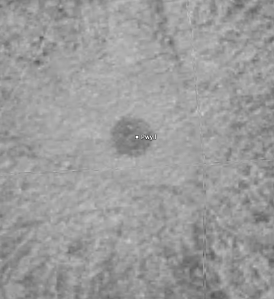

# Europa

Europa's Monochrome globe is the USGS Voyager/Galileo global mosaic with controlled Galileo photographs inserted. Other views show False color, Elevation, geology, infrared, carbon dioxide, peroxide and salt signatures, and JunoCam images. Magnetic evidence strongly suggests a subsurface salty ocean; the ocean is not directly mapped by this globe.

The navigation marker uses the source map as a stylized identifier. The [marker recipe](source/preparation/navigation.json) crops and resizes it, then prepares a circular alpha edge and the shared full-phase curvature shading (35% ambient, 65% diffuse). It is not a view at the scene epoch.

## Sources

- The [USGS Voyager/Galileo global mosaic](https://astrogeology.usgs.gov/search/map/europa_voyager_galileo_ssi_global_mosaic_500m) is a 19,631 × 9,816 monochrome GeoTIFF on a nominal 500 m grid.
- Monochrome photographic inserts use 332 CLEAR-filter photographs from the [USGS controlled individual-image release](https://stac.astrogeology.usgs.gov/docs/data/jupiter/europa/galileo_individual_images/), described by [Bland et al. (2021)](https://doi.org/10.1029/2021EA001935).
- The False color dataset uses the [USGS controlled Galileo observations](https://stac.astrogeology.usgs.gov/docs/data/jupiter/europa/galileo_individual_images/) (CC0), by Bland, Weller and colleagues: sequences G1ESGLOBAL01 (1996-06-28), 12ESGLOCOL01 (1997-12-16) and 14ESGLOCOL01 (1998-03-29).
- The Elevation view uses the [USGS controlled Agenor DTM](https://stac.astrogeology.usgs.gov/docs/data/jupiter/europa/europa_controlled_usgs_dtms/). The CC0 release and source authors retain attribution.
- The geology view keeps the ten map units and no-data regions of [Leonard, Patthoff and Senske (2024), SIM 3513](https://pubs.usgs.gov/publication/sim3513), scale 1:15 million.
- The infrared view uses [the registered Galileo NIMS archive](https://doi.org/10.17189/4sz4-5024), observations 17ENGLOBAL01A and 17ENGLOBAL02A, Minnaert-corrected CIOF products.
- The VLT/SPHERE composition release of [King, Fletcher and Ligier (2022)](https://doi.org/10.3847/PSJ/ac596d) is [Zenodo 6034904](https://doi.org/10.5281/zenodo.6034904). Its Ice signature, Fine ice and Coarse ice views are withheld (see Known problems).
- Named features come from the IAU/USGS Gazetteer of Planetary Nomenclature centre-point shapefile (retrieved 2026-09-11, public domain per its FGDC metadata). Twelve names carry a caption note from the lead of their English Wikipedia article (CC BY-SA 4.0, retrieved 2026-09-12), credited in the caption beside the IAU naming year.
- [NASA's Europa facts](https://science.nasa.gov/jupiter/jupiter-moons/europa/europa-facts/) support the introduction, oxygen atmosphere, and approximate 671,000 km distance from Jupiter.

Four observation views were prepared with the current tools:

| View | Source and meaning |
| --- | --- |
| Carbon dioxide | Eight public JWST/NIRSpec cubes from programs 1250, 4023 and 9230, November 2022–February 2025; [Trumbo and Brown (2023)](https://doi.org/10.1126/science.adg4155) motivates the 4.26 µm feature. This is continuum-relative band depth, not abundance. |
| Peroxide signature | The same cubes, a 3.50 µm continuum-relative feature motivated by [Wu et al. (2024)](https://doi.org/10.3847/PSJ/ad7468). [Yoffe and Shahaf (2026), Appendix A.4](https://arxiv.org/html/2603.10520v1) dispute a peroxide interpretation because of possible instrumental structure; the caption states this. Our straight-line continuum is not their band-area method. |
| Salt signature | Sixty public HST/STIS frames from the [Trumbo et al. (2019) observations](https://doi.org/10.1126/sciadv.aaw7123): 450 nm absorption equivalent width in Å. Irradiated NaCl is an interpretation of the signature; it does not establish an ocean origin. |
| JunoCam | Four RGB-strip observations from Juno's 29 September 2022 flyby, registered with the released Juno SPICE kernels. The images keep their observed illumination and uncovered regions. Their shared display range preserves band ratios, not natural color. |

Source selections, trials and open questions are in the [investigation ledger](investigations.json).

[Inputs](source/manifest.json) · [Delivered files](inventory.json) · [Credits](NOTICE.md)

## Processing

**Monochrome.** The inserts are calibrated I/F CLEAR-filter (0.611 µm) images that USGS did not photometrically normalize. Selection takes 332 of the release's 481 Galileo observations, those below 800 m grid spacing. The [controlled-map decoder](../../../packages/bake/src/objects/layers/observation/controlled-map-mosaic.ts) checks each GeoTIFF's projection, grid and no-data value. One photograph supplies each output pixel, finer grids first; the global mosaic fills the rest. One display gain per image, matched against the global mosaic near its boundary, is capped so highlights stay in range. Values are encoded once with the [shared IEC sRGB transfer](../../../docs/color-preparation.md). This is display matching, not physical calibration, and blends no images.

**False color.** Values stay linear floating-point I/F. Each image gets one spherical [Lunar–Lambert disk normalization](https://isis.astrogeology.usgs.gov/9.0.0/Application/presentation/Tabbed/photomet/photomet.html), `D = (1-L)*mu0 + 2*L*mu0/(mu0+mu)`, scaled to incidence 30° and emission 0°:

| Observation | Disk weight L |
| --- | --- |
| 14ESGLOCOL01, March 1998 | 1 (accepted Lommel–Seeliger correction) |
| 12ESGLOCOL01, December 1997 | 0.5 |
| G1ESGLOBAL01, June 1996 | 0.5 |

These weights are visual choices, not fitted scattering parameters; the [USGS Europa photometry study](https://www.hou.usra.edu/meetings/lpsc2022/pdf/1691.pdf) motivated comparing Lambert. Color appears only where all three bands are valid with incidence and emission at most 75°. Geometry comes from 20 controlled ISIS labels and [JPL Horizons](https://ssd-api.jpl.nasa.gov/doc/horizons.html) vectors in `source/photometry/`, oriented with [NAIF PCK equations](https://naif.jpl.nasa.gov/pub/naif/toolkit_docs/C/req/pck.html). One brightness multiplier per sequence softens steps against monochrome.

**Elevation.** The Agenor relative stereo heights stay in meters, with no globe displacement. The −700…+300 m scale spans the −641.9267578125…+218.51205444335938 m source range. Fixed northwest relief shading shows slopes.

**Geology and infrared.** Geology colors use the released ArcGIS CMYK symbols converted to RGB. Infrared RGB takes bands near 1.50, 1.35 and 0.74 µm, pinned in `source/nims/prepare-composite.json`, with fixed I/F ranges R 0–0.6, G 0–1.2, B 0–1.5.

**Observation views.** The [JWST recipe](source/preparation/jwst-band-maps.json) is run by `packages/telescope-cli/authoring/jwst/cubes/author-body-maps.mts`. The STIS map comes from `packages/telescope-cli/authoring/hst/slit-scan-map.mts europa-salt-map`. JunoCam uses the [raster recipe](source/preparation/raster.json).

**Globe.** The rendered sphere uses a 1,560.8 km radius; it is not a resolved shape model. Rotation is synchronous, 3.5255 days. Named features are placed with the map's left edge at 0° E.

## Evidence

The controlled photographs cover **15.224% of the sphere** with 330 contributing images. Their fitted gains span 0.306–11.534, with 110 limited by native highlights. These matched crops of Pwyll show the fractures gaining detail without moving the crater or filling missing observations:

| Before | Current |
| --- | --- |
|  |  |

The [JWST reduction report](evidence/jwst-band-maps.json) records all eight cube fits. Each final map covers 88.83% of the sphere; the 1° grid does not imply 1° resolving power. The STIS map uses all 60 frames, covers 82.3%, and places the strongest absorption at 94.5° W, 16.5° N beside Tara Regio, with a 193.6 Å peak and 84.5 Å median.

The withheld composition grids match the original release exactly after float32 rounding across all 64,800 nodes.

## Known problems

- **Monochrome inserts:** Original illumination and brightness joins remain. Relative control uncertainties are about 247 m in latitude and 307 m in longitude; the older global mosaic has different registration errors. The delivered grid is about 1.20 km at the equator, so finer native detail is not shown. Atlas seams can show at extreme close zoom.
- **False color:** 756 nm, 559 nm and 404 nm are shown as red, green and blue. This is not natural color. About 14.3% of the sphere has usable three-band coverage.
- **Elevation:** Heights are relative, not tied to a global reference level. Effective resolved detail is about 3 km; source documentation gives nominal 52 m vertical precision.
- **Illumination:** The disk correction is approximate: no phase-angle normalization, fitted scattering model, or removal of cast shadows.
- **Infrared:** This is a spectral color display, not an abundance map. Its 2010 registration grid is not the 2021 control grid.
- **Feature outlines:** Craters and faculae trace a rim circle and other types their extent box; these are not published nomenclature boundaries.
- **Composition reuse:** The Zenodo record is `other-open`, but gives no explicit terms for reusing the numerical release. The three composition views are withheld until such terms exist. SPHERE diffraction limits resolved features to about 150 km.
- **Thermal:** The ALMA thermal view is deferred; its numeric product was not recoverable. No thermal map is inferred from an old display image.
