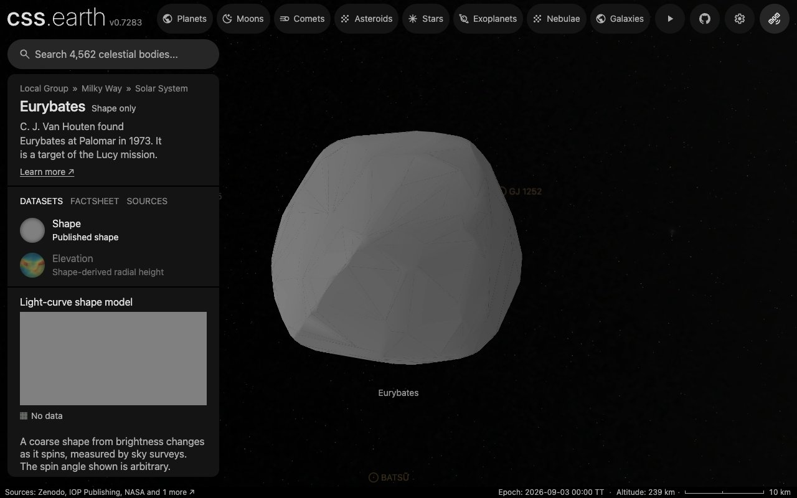

# (3548) Eurybates

Eurybates is a Jupiter Trojan and the largest remnant of a collisional family.

Shape-only views use the shared neutral gray (#808080 sRGB). This is a display convention, not a measurement of surface color or albedo; gaps within photographic and scientific datasets retain the missing-data grid.

## Sources

| Input | Selected source |
| --- | --- |
| Shape and spin | [Ďurech & Hanuš (2026), model 2 of (3548) Eurybates](https://doi.org/10.5281/zenodo.22812438) |
| Physical scale | [Mottola et al. (2023), The Planetary Science Journal 4, 18, Table 3](https://doi.org/10.3847/PSJ/acaf79) ([record](source/reference/calibration.json)) |

The shape is `shape_models/model_3548_2.tri` from `shape_models.tar.gz` of the [Zenodo deposit](https://doi.org/10.5281/zenodo.22812438) (version 2026-09-17, CC BY 4.0) of [Ďurech & Hanuš (2026)](https://arxiv.org/abs/2610.06082). It is a convex mesh fitted to sparse brightness measurements from sky surveys (Catalina, Mt. Lemmon, Pan-STARRS, ZTF, USNO, ATLAS, ASAS-SN, TESS and Gaia). The original 574 vertices and 1144 triangular faces are the source input. Its large-scale shape is inferred from how the asteroid's total brightness changes as it spins; concavities, craters, surface texture and the current rotation phase are not resolved.

The deposit's spin table gives the J2000 ecliptic pole λ = 321.7°, β = -62.2° and the sidereal period 8.702737 h. The table also lists solution 1 with pole λ = 140°, β = -45.9° and the same period. Survey photometry does not tell the two poles apart. Solution 2 is selected because its pole lies beside the pole of Mottola et al. (2023), ecliptic (320°, −60°), which the 2021 October 20 occultation told apart from its mirror.

Adopted diameter: **68.3 ± 1.4 km**, meaning volume-equivalent diameter of the occultation-scaled convex model, from [Mottola et al. (2023), The Planetary Science Journal 4, 18, Table 3](https://doi.org/10.3847/PSJ/acaf79). The reference-sphere radius is 34.15 km. Table 3 gives the convex shape volume 1.67 × 10^5 km³ of the model its authors scaled to the 2021 October 20 occultation chords; a sphere of that volume is 68.3 km across. The quoted error is that of the table's surface-equivalent diameter, 69.3 ± 1.4 km. That model's mesh is not archived, so its volume is given to the Ďurech & Hanuš (2026) mesh, whose proportions differ: at this scale the mesh measures 81.7 × 79.9 × 63.1 km (longest extent across the spin axis, the extent at right angles to it, the extent along it) where the table lists 77.5 × 71.3 × 61.8 km.

[Model fields, mesh measurements and comparison](source/reference/survey-model.json).

## Evidence

Checked 2026-10-06 against the deposit's files.

- Mesh: positive signed volume (1.000000000 source units cubed), every edge used once in each direction, Euler characteristic 2.
- Pole: solution 2 is 2.3° from the pole of Mottola et al. (2023), (320°, −60°), which an occultation told apart from its mirror; solution 1 is 74.1° away. Solution 2 is shown.
- Period: 8.702737 h against their 8.7027283 ± 0.0000029 h.
- Dimensions: at the adopted volume the mesh measures 81.7 × 79.9 × 63.1 km where their Table 3 lists 77.5 × 71.3 × 61.8 km for their own model: 5%, 12% and 2% larger.
- Display shape: 800 faces from the source's 1144, with an estimated error of 118.9 m inside the 683 m allowance (2% of the radius).
- Browser: the default view below, in headless Chrome 1280 × 800 from the local site after the bake, with every image loaded and no page error.

## Known problems

- The model of Mottola et al. (2023) rests on dense light curves and an occultation, and its 1454-facet mesh is not archived. The mesh shown comes from sparse survey photometry and differs from that model's dimensions by up to 12%.
- The paper's 69.3 km surface-equivalent diameter is not a volume-equivalent diameter; the scale uses the table's convex volume instead.
- Queta is outside this standalone asteroid package.
- No registered surface imagery exists for this shape; it shows the shared neutral gray. Convex inversion leaves concavities and fine relief unresolved.
- Elevation is false color for model radius minus a reference sphere, not gravitational height or independent terrain.
- The displayed rotation phase is arbitrary and not propagated from the model epoch. Orbit context is fixed at 2026-09-03 TT.

[Investigation ledger](investigations.json) · [Inputs](source/manifest.json) · [Preparation](source/preparation) · [Delivered files](inventory.json) · [Credits](NOTICE.md)

## Methods and source notes

Physical scale

The source's signed tetrahedral volume integral gives a volume-equivalent diameter of 1.24070098167 source units. The preparation conversion is:

`metersPerUnit = D_km × 1000 / (2 × cbrt(3 × V_source / (4 × pi)))`

For this input, `metersPerUnit = 55049.5252354414`. The raw mesh coordinates and connectivity are unchanged.

Orientation and time

Converted with obliquity 23.439291111°, the equatorial pole is α = 13.32°, δ = -67.91°. Model longitude zero is an inversion convention, not an observed landmark. JPL Horizons command "3548;" supplies the osculating elements and vector fixtures at 2026-09-03 TT; this is a fixed-date context, not a real-time trajectory or surface attitude.

