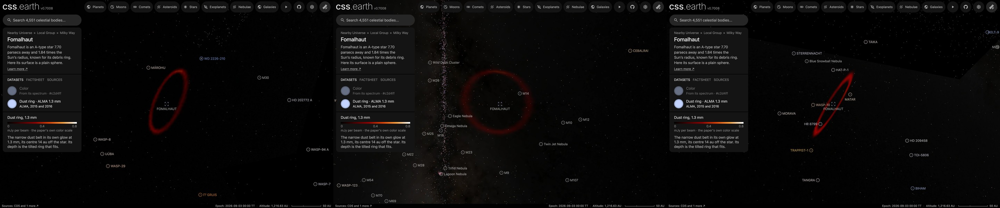

# Fomalhaut dust ring

This package draws the narrow belt of dust around [Fomalhaut](../fomalhaut/README.md) as a prepared volume attached to the star, the way the [ε Eridani ring](../eps-eridani-disc/README.md) is. It shares the star's frame and is the dataset the star's page opens on, "Dust ring · ALMA 1.3 mm", so the page arrives with the whole ring in view. The belt is eccentric: its centre does not lie on the star.

## Sources

- **Image:** the band 6 continuum image of ALMA project 2015.1.00966.S (PI P. Kalas), member OUS `uid://A001/X2d8/X7c`, made by the ARI-L project (Massardi et al. 2021, PASP 133, 085001) for the public archive. The 12-m array observed seven times, on 29 and 30 December 2015 and 14 January 2016, in seven pointings around the star. The image has 0.19″ pixels and a 1.284″ × 0.940″ beam, and is corrected for the primary beam. MacGregor et al. (2017, ApJ 842, 8; [arXiv:1705.05867](https://arxiv.org/abs/1705.05867)) published these observations but deposited no image. Theirs uses a 1.56″ × 1.15″ beam and reaches 14 µJy per beam of noise.
- **Processing:** two point sources are removed as the image's own beam, with the fluxes MacGregor et al. fit: the star (0.75 mJy) and a background galaxy south-east of it (0.150 mJy). The image is then smoothed to their beam. At that resolution its noise is 12.6 µJy per beam, measured 2″ to 4.5″ from the star, where the level is −18.3 µJy per beam; that level is taken off. Sky fainter than twice the noise fades out. This is a display choice, as on the [β Pictoris disc](../beta-pictoris-disc/README.md).
- **Color:** the color bar of their Figure 1 (left panel), decoded from the figure's PDF: black to white through red and orange, linear from 0.0 to 0.8 mJy per beam ([macgregor-2017-figure-1-colormap.json](source/macgregor-2017-figure-1-colormap.json)).
- **Recipe:** [`source/circumstellar.json`](source/circumstellar.json) names the image, the point sources, the beam, the color map and the published geometry. [`author.mts`](../../../packages/telescope-cli/authoring/circumstellar/author.mts) writes everything else in `source/` from it; `--check` reproduces it byte for byte.

**The ring is measured on this image.** Its ridge stands 14 to 38 times above the noise in every direction. The ellipse through it has a long half-axis of 136.2 au, is tilted 66.6° and has its nodes at position angle 336.6°. MacGregor et al. fit 136.3 au for the inner edge, 65.6° and 337.9° (Table 2). The ellipse's centre lies 14.4 au from the star, almost due north. Along the long axis the ridge is 122 au from the star to the south-east and 150 au to the north-west. A disc of that geometry leaves a residual of 31 µJy per beam, against 74 for a spherical shell and 76 for constant depth.

**The ring's plane passes through the star.** The star is the focus of the dust's orbits, so it lies in their plane. With the centre off the star, that puts the centre 11.7 au nearer than the star. The recipe asks for this (`planeThroughStar`); without it the tool draws the centre in the star's sky plane, which is right only for a centred ring.

**The image is cut by distance in the ring's plane.** At this tilt, sky more than about 100 au from the centre along the short axis crosses the ring's plane outside the 230 au cube. That sky holds only noise, and the tool would stack it on the cube's front and back faces: 32% of each drawn column's depth weight on average. With the cut stated in the plane (`taperInPlane`) that share is zero.

**Thickness: a cited model value, not a measurement.** MacGregor et al. model the belt as flat and cite Boley et al. (2012, ApJL 750, L21) for an opening angle of about 1° from the mid-plane. The drawn height is tan 1° = 0.0175 of the radius.

**Near side: east.** Kalas et al. (2013, ApJ 775, 56; [arXiv:1305.2222](https://arxiv.org/abs/1305.2222)) find the eastern half of the belt brighter in scattered starlight and take it as the side nearer the observer. They note that Le Bouquin et al. (2009), from the star's spin, tentatively put the western side nearer.

One volume unit is one astronomical unit at the star's distance (7.70 pc). The cube (±230 au) is anchored on the star's scene origin. The star is placed at its catalogue position moved by its proper motion to the observing date.

## Evidence

- The page in the application on 2026-10-06 (image above, headless Chrome, no page errors): as it opens, turned until the ring is face-on, where the star sits off its centre, and turned near edge-on, where the ring's plane passes through the star.
- The author's preview of the image as drawn, north up ([previews/dust.png](source/previews/dust.png)), to compare with MacGregor et al.'s [Figure 1](https://arxiv.org/abs/1705.05867).
- **Brightness against the paper.** At the paper's beam the ring peaks at 483 µJy per beam to the north-west, 381 to the south-east, and 226 and 222 on the short axis. The cuts in the paper's Figure 5, read from its PDF and multiplied by the beam's 2.033 square arcseconds, peak at 456, 414, 238 and 232. The ring's total is 25.6 mJy with the level inside the ring taken off (21.5 without); the paper fits 24.7.
- [`disc-envelope.test.mts`](../../../packages/telescope-cli/authoring/circumstellar/disc-envelope.test.mts) checks point-source removal, beam smoothing and the centre depth that puts the star in the ring's plane.

## Known problems

- **Darker than the printed figure.** The colors follow the labels of the paper's color bar. The printed panel is brighter than that scale gives: read on its own bar, its ring is about 1.5 times the paper's Figure 5 cuts.
- **An archive image, not the paper's own.** ARI-L images are meant to show what the data hold, not as final science images.
- **The offset is this image's ridge, not the paper's orbit fit.** The centre lies 14.4 au from the star; the paper's eccentricity of 0.12 on its 136.3 au gives 16.4 au. The ridge is drawn as an ellipse about its centre, not as orbits about the star.
- **The thickness is a cited model value** and the near side is disputed.
- **The inner belts are not shown.** JWST's images of them (programme 1193) are a separate dataset, not built.
- The colors are a color map for brightness at one wavelength, not colors an eye would see.

[Investigation ledger](investigations.json) · [Inputs](source/manifest.json) · [Recipe](source/circumstellar.json) · [Provenance](source/provenance.json)
