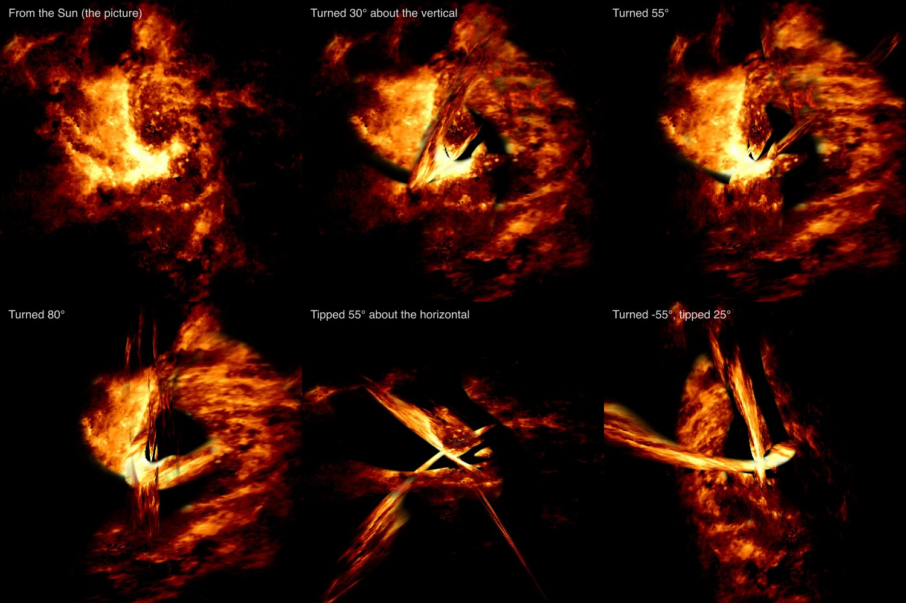
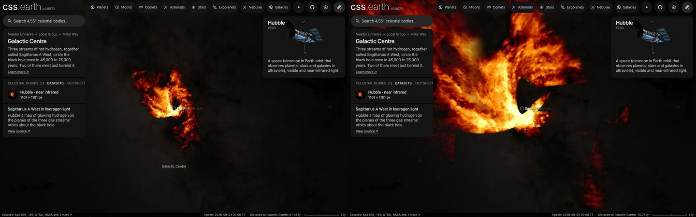

# Galactic Centre: Sagittarius A West

The [Galactic Centre](../galactic-centre/README.md) page's dataset: Hubble's map of glowing hydrogen about the Milky Way's central black hole, laid on the planes of the orbits of its three streams of gas. **Each stream's plane is the one Zhao et al. (2009) fit to its measured motion. A stream is drawn flat in that plane, and 18% of the picture's light, which no published model places, lies on the plane of the sky.**

## Sources

| Selected source | Input and meaning |
| --- | --- |
| [HST/NICMOS Paschen-α Survey of the Galactic Centre](https://archive.stsci.edu/prepds/hpsgc/) | [Record](../../sources/mast-hlsp-hpsgc-paschen-alpha.json). The survey's Paschen-α line map, `hlsp_hpsgc_hst_nicmos-nic3_gc_palpha_v1_img.fits`: the 1.87 µm line with the 1.90 µm continuum subtracted, 0.2″ sharp, in µJy a pixel, 23,400 × 9,000 px (programme GO 11120, 2008). [Wang et al. (2010)](../../sources/publication-wang-2010-paschen-alpha-survey.json) describe the survey and [Dong et al. (2011)](../../sources/publication-dong-2011-paschen-alpha-products.json) its products. `source/paschen-alpha.png` is a display picture cut from it, restored from the source cache. Credit: NASA, ESA, Q. D. Wang (University of Massachusetts, Amherst) and the survey, from MAST. |
| [Zhao, Morris, Goss & An (2009)](https://arxiv.org/abs/0904.3133) | [Record](../../sources/publication-zhao-2009-sgr-a-west-streams.json). ApJ 699, 186. The motion of the gas from Very Large Array images over years and from the H92α line; Table 5, one Keplerian orbit about Sgr A* for each of the three streams; Table 3, 17 measured places with their radial velocities on each stream. The orbits are in `source/recipe.json`, transcribed. |
| [Paumard, Maillard & Morris (2004)](https://arxiv.org/abs/astro-ph/0405197) | [Record](../../sources/publication-paumard-2004-minispiral.json), and [its files at the CDS](../../sources/cds-j-a-a-426-81.json). A&A 426, 81. A model of the Northern Arm fitted to Brackett-γ radial velocities; `source/paumard-2004/fig7b.fit` is its line-of-sight distance at each 0.353″ cell, `fig7berr.fit` that distance's error. |
| [SIMBAD, Sgr A*](https://simbad.cds.unistra.fr/simbad/sim-id?Ident=Sgr+A*) and [GRAVITY Collaboration (2022)](https://arxiv.org/abs/2112.07478) | [Place](../../sources/simbad-sgr-a-star.json) and [distance](../../sources/arxiv-2112-07478.json), 8,277 ± 9 pc: [Sagittarius A*](../sgr-a-star/README.md)'s, the focus of the orbits. |

## The picture

- **Cut:** the mosaic is 842 MB; [paschen-alpha.mts](../../../packages/bake/authoring/galactic-centre/paschen-alpha.mts) reads two byte ranges of it, the header and the 1,086 rows that lie 55″ either side of Sgr A* (101.6 MB), and resamples them from the mosaic's Galactic grid onto a north-up square about Sgr A*, 1,101 px of 0.1″.
- **Registration:** the mosaic's own coordinates. The bank stands where the world places Sgr A* at its epoch, 0.171″ from the catalogued place by the black hole's proper motion over 26.7 years, which the gas shares: with the bank at the catalogued place the black hole stood 1,416 AU off the focus of the orbits. Check: the mean light at the 51 places Zhao et al. measured along the streams is greatest with the picture where those coordinates put it, to the 0.25″ of the search's step.
- **Display:** black at 4 µJy a pixel (the field's median is 2.9), an inverse hyperbolic sine about 6, full at 220 (0.1% of pixels are above 154), through matplotlib's `afmhot` ramp, the one the [Sgr A*](../sgr-a-star/README.md) page's EHT image is drawn in. False color: the line is in the infrared.
- **The stars:** the survey subtracted the stars' continuum, so no star removal is run. Stars that shine in Paschen-α themselves stay as points; the brightest stars left dark spots.
- **The streams:** Table 5 of Zhao et al. (2009), at their 8 kpc and 4.2 million solar masses:

  | | Northern Arm | Eastern Arm | Western Arc |
  | --- | --- | --- | --- |
  | Semi-major axis | 205 kau, 25.625″ | 289 kau, 36.125″ | 236 kau, 29.5″ |
  | Eccentricity | 0.83 ± 0.10 | 0.82 ± 0.05 | 0.20 ± 0.15 |
  | Longitude of ascending node | 64° ± 28° | −42° ± 11° | 71° ± 6° |
  | Argument of perifocus | 132° ± 40° | −280° ± 8° | 22° ± 48° |
  | Inclination | 139° ± 10° | 122° ± 5° | 117° ± 3° |
  | True anomaly of the gas | 192° to 460° | 195° to 430° | 130° to 302° |
  | Period | 45,000 years | 76,000 years | 54,000 years |

  The node is counted from east to where the gas crosses the plane of the sky going away from the Earth; the inclination is between the sight line going away and the orbit's angular momentum. Each semi-major axis is the table's thousands of astronomical units as an angle at its 8 kpc.
- **Two readings of the table:**
  - The Western Arc's printed 1.11 pc does not match its printed 236 kau (1.144 pc). The paper's own 17 places on that stream lie 0.35″ from the orbit with 236 kau and 0.77″ with 1.11 pc, root mean square. The kau value is used.
  - The paper calculates the Western Arc to a true anomaly of 420°, through the Northern Arm. Its last measured place is at 301°, so the stream ends at 302° here.
- **The planes:** the Northern Arm's and the Western Arc's are 23° apart; the Eastern Arm's is 76° and 93° from them. The Eastern Arm's outer end is 1.9 pc in front of Sgr A*; where the two arms meet south-west of it, both are behind it, as the paper finds.
- **A stream's width:** the paper draws each stream as a bundle of orbits, the semi-major axis spread by ±25% ("to roughly match the width"). A sight line that meets a stream's plane inside that bundle is the stream's ([streams.ts](../../../packages/bake/src/image-layers/streams.ts)); the claim falls to none at twice the spread. A presentation choice: the paper prints the spread, not an edge.
- **The Northern Arm east of its rim:** with the bundles alone, 32.3% of the picture's light was claimed by no stream, most of it the bright wedge east of the Northern Arm's rim. Paumard et al. (2004) found the arm to be a faint triangular surface whose western rim is bright, and published its model. [northern-arm-surface.mts](../../../packages/bake/authoring/galactic-centre/northern-arm-surface.mts) keeps the continuous sheet of their map that holds the wedge, 2,959 cells, 369 square arcseconds (`source/northern-arm-surface.png`); the model's orbits cross the field a second time and those cells are left out. The arm holds the sight lines inside that sheet too, on the same plane.
- **Shared light:** where two streams claim a sight line they share it by their claims, more to the one whose middle orbit is nearer.
- **Light outside the streams:** it has no published depth and lies on the plane of the sky through Sgr A*. A presentation choice.
- **Where the light is:** 44.2% on the Northern Arm's plane, 22.1% on the Eastern Arm's, 15.5% on the Western Arc's and 18.2% on the plane of the sky.
- **Drawing:** four leaves, one a plane, the same from every side. From the Sun they add up to the picture.
- **Size:** 1.83 × 1.83 arcmin, 4.42 pc wide at 8,277 pc. The orbits are angles on the sky, so every length in parsecs is 3.5% larger than at the paper's 8 kpc.
- **Rim:** the picture fades out between 45″ and 50″ from Sgr A*.

## Evidence

The prepared bank's four leaves composited offline on 2026-10-05, without perspective: not the app's drawing. From the Sun they give the picture; turned, the streams part on their planes.

The page in headless Chromium at 1440 × 900 on 2026-10-05, as it opens (41.5 light-years out) and one zoom step in (15.8). No page errors. Captured from the bake before the last one, which changed only whether the bank is drawn around the black hole; the page has not been captured since.

- `pnpm test:run packages/bake/src/image-layers/streams.test.ts`, 4 of 4 passing on 2026-10-05: the orbits as transcribed pass the paper's 51 measured places within 0.19″, 0.61″ and 0.35″ (Northern Arm, Eastern Arm, Western Arc; root mean square) and give its measured radial velocities within 36, 40 and 21 km/s, where the lines are 35 to 214 km/s wide. The same test bakes a bank and checks that its planes, seen from the Sun, add up to the picture.
- Paumard et al.'s own depths over the sheet differ from the Northern Arm's plane by 3.3″ at the median (90% under 12.8″, 7.0″ root mean square). Their map's own error over the sheet is 4.0″, root mean square.

## Known problems

- **The Northern Arm is not flat.** Paumard et al.'s map is a warped surface: its depths over the sheet run from −13.9″ to +10.5″, and at the sheet's north-east corner it is in front of Sgr A* (−5.4″ at 18″ east, 15″ north) where the plane is behind it (+8.3″). The bank draws planes. No single plane through Sgr A* does better: the sheet's own best one misses it by 4.4″, root mean square.
- **18.2% of the light has no depth:** the Bar's southern side, the gas inside the streams' curve and filaments to the north-east. Paumard et al. name other moving patches there without a depth.
- **The gas is not drawn around the black hole.** A zoom in stops at this page's nearest view, and [Sagittarius A*](../sgr-a-star/README.md)'s page shows none of it. Every stream's plane passes through the black hole, and the renderer leaves out the sheets through a body it draws a bank around. Measured in headless Chromium at 1440 × 900 on 2026-10-05: drawn around the black hole, all of the gas was gone two zoom steps in, 10.5 light-years out; with the sheets kept, they changed 76.5% of the black hole's page between 600 AU and 3 light-years, where one texel of the map is 827 AU.
- **A stream is as thick as a sheet.** No paper gives a thickness across the orbit's plane, so a stream seen along its plane thins to a line.
- The two papers' models were fitted at 8 kpc with different masses (4.2 and 3 million Suns); the page stands at 8,277 pc.
- Tsuboi et al. (2017) and Nitschai et al. (2020) refit the streams' orbits; neither is compared here.
- The ring of molecular gas around the streams does not shine in this line and is not drawn.
