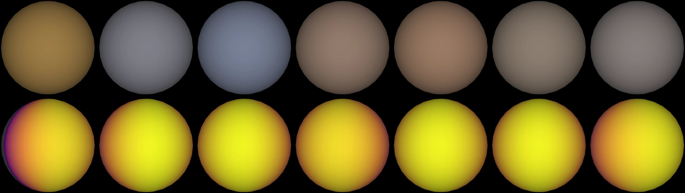

# GJ 1214 b

## Sources

It is the only planet known around Orkaria. Its orbit and size follow Mahajan et al. 2024's fit, the archive's default. The introduction is generated from Mahajan et al. 2024's published values; the sections below are the data's own.

**Size and mass.** Radius 0.24382235 Jupiter radii from Mahajan et al. 2024 (2024ApJ...963L..37M), via the NASA Exoplanet Archive (https://ui.adsabs.harvard.edu/abs/2024ApJ...963L..37M/abstract): 17,431.3 km at 71,492 km per Jupiter radius. GM from the mass 0.02646082 Jupiter masses (Mahajan et al. 2024, the mass the NASA Exoplanet Archive's composite table adopts (2024ApJ...963L..37M), via the NASA Exoplanet Archive, https://ui.adsabs.harvard.edu/abs/2024ApJ...963L..37M/abstract) times JPL's Jupiter GM. A sphere: no oblateness is measured.

**Orbit.** Mahajan et al. 2024 (2024ApJ...963L..37M), via the NASA Exoplanet Archive ps table (pl_refname MAHAJAN_ET_AL__2024): P 1.580404531 d Mahajan et al. 2024 (2024ApJ...963L..37M), via the NASA Exoplanet Archive ps table (pl_refname MAHAJAN_ET_AL__2024): a/R* 14.97; Mahajan et al. 2024 (2024ApJ...963L..37M), via the NASA Exoplanet Archive ps table (pl_refname MAHAJAN_ET_AL__2024): inclination 88.98 degrees Mahajan et al. 2024 (2024ApJ...963L..37M), via the NASA Exoplanet Archive ps table (pl_refname MAHAJAN_ET_AL__2024): e 0.0062 Mahajan et al. 2024 (2024ApJ...963L..37M), via the NASA Exoplanet Archive ps table (pl_refname MAHAJAN_ET_AL__2024): omega 77 degrees Mahajan et al. 2024 (2024ApJ...963L..37M), via the NASA Exoplanet Archive ps table (pl_refname MAHAJAN_ET_AL__2024): transit mid-time 2459639.7812619 BJD, taken as BJD_TDB; with its period, the row that predicts 2026-01-01 best (1 sigma 1 min) Display convention: transit photometry does not measure the orbit's position angle on the sky, so the ascending node is set at position angle 0 (celestial north).

**Color.** No image or measured color exists. The neutral gray is lit by gj-1214's measured color (#ffca76, the color dataset of gj-1214 (src/objects/gj-1214/source/photometry/stellar-color.json)) at the gray's own brightness.

**Heat map.** The page opens on a brightness-temperature map at 5–12 µm from Kempton et al. (2023, Nature 620, 67, [arXiv:2305.06240](https://arxiv.org/abs/2305.06240)): their fit to a JWST MIRI 5–12 µm phase curve of 20–22 July 2022. The [record](source/science/kempton-2023/phase-curve.json) holds the paper's row cell by cell: the eclipse depth 379 +12/-13 ppm, the radius ratio RpRs = 0.1161, and a second-order Fourier series in the star's flux, C1 127 +/- 4 ppm, D1 -139 +/- 7 ppm, C2 46 +/- 4 ppm and D2 -15 +/- 4 ppm. Nothing is refitted. The series becomes a map of longitude through the Cowan & Agol (2008) inversion ([published fits](../../../docs/eclipse-mapping.md#a-published-fit-drawn-as-the-paper-made-it)), so it has no north-south information and every latitude is drawn alike. Temperatures use the star's brightness temperature that the paper's own day side, 553 +/- 9 K, implies with its eclipse depth and radius ratio (2,620 K). The false color runs from 150 to 650 K.

**Charts.** The orbits of Orkaria's planets from above, from their hosted-orbit records, and its transmission spectrum, 22 bins from Kreidberg et al. 2014 in the archive's transitspec table; its dayside emission, 14 bins from Kempton et al. 2023 in the archive's emissionspec table. Upper limits and rows without an error are left out.

## Evidence

The pages open facing the day side, so the cooler night side shows only at the limb; on GJ 1214 b the gray sliver is the longitudes where the fit has no emission. WASP-19 b, the eighth planet of this run, opened on one thermal color before and is not in the strip.

- Run of 2026-10-04: [`new-object --phase-curve`](../../../packages/telescope-cli/src/new-object/phase-curve-dataset.mts) wrote the dataset from the record. The paper's night side was not an input: the map gives 421 K at mid-transit against the printed 437 +/- 19 K, and its maximum falls 28.6° before eclipse. [`published-phase-curve-map.test.mts`](../../../packages/bake/src/objects/raster/eclipse-map/published-phase-curve-map.test.mts) holds this paper's terms to its own equation 7 map and deposited night side.

Generated 2026-10-03 by [new-object-cli.mts](../../../packages/telescope-cli/src/new-object/new-object-cli.mts); the orbit is the one recorded in [its astronomy record](../../../packages/astronomy/data/bodies/gj-1214b.json).

## Known problems

- **The map is a fit, not an image.** One Fourier series in orbital phase fixes one number per longitude; nothing is known north to south.
- **Part of the map has no emission.** The paper's second-order fit goes negative over 69° of longitude, which its own Figure 2 shows in black; they are left blank here.
- **One temperature for a broad band.** The white light spans 5–12 µm, so the Planck radiance is integrated across the band; any single wavelength inside it would move the map by 12 to 26 K.
- **Orbit convention.** omega 77 degrees is taken as Mahajan et al. 2024 gives it through the archive (pl_orblper); papers differ on whether that is the star's or the planet's argument of periastron. The epoch is the transit, so a swapped convention would only mirror the ellipse (e 0.0062) about the line of sight.
- **Quoted text.** The introduction quotes sentences of the Wikipedia article "GJ 1214 b" (revision 1374248506) verbatim, CC BY-SA 4.0.

[Investigation ledger](investigations.json) · [Inputs](source/manifest.json) · [Preparation](source/preparation) · [Delivered files](inventory.json) · [Credits](NOTICE.md)
