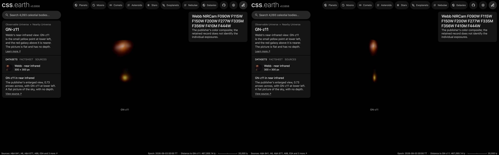

# GN-z11 picture

A published picture of GN-z11 stands at its place and distance as one flat image facing the Sun. It is a picture
of the sky: nothing in it has depth, and seen from the side it is a line.

## Sources

| Selected source | Input and meaning |
| --- | --- |
| [ESA/Webb weic2406a](https://esawebb.org/images/weic2406a/) | [Record](../../sources/esawebb-weic2406a.json). Webb NIRCam: 0.9 to 1.5 µm blue, 2.0 to 3.4 µm green, 3.6 to 4.4 µm red. A window of the publisher's Large JPEG (4049 × 1961 px), written at 300 × 300 px (`source/source.jpg`, made by [`picture-source.mts`](../../../packages/bake/authoring/far-destinations/picture-source.mts); not tracked). [CC BY 4.0](https://esawebb.org/copyright/), credit: NASA, ESA, CSA, B. Robertson (UC Santa Cruz), B. Johnson (CfA), S. Tacchella (Cambridge), M. Rieke (University of Arizona), D. Eisenstein (CfA). A display composite, not calibrated photometry. |
| [Oesch et al. (2016), A Remarkably Luminous Galaxy at z = 11.1 Measured with Hubble Space Telescope Grism Spectroscopy, ApJ 819, 129](https://arxiv.org/abs/1603.00461) | [Record](../../sources/publication-oesch-2016-gn-z11.json). Position 189.1061°, 62.2421°: text: GN-z11 lies at (RA, DEC) = (12:36:25.46, +62:14:31.4). |
| [Bunker et al. (2023), JADES NIRSpec Spectroscopy of GN-z11, A&A 677, A88](https://arxiv.org/abs/2302.07256) | [Record](../../sources/publication-bunker-2023-gn-z11.json). Redshift 10.603: abstract: we derive a redshift of z = 10.603. |
| [Planck Collaboration (2020)](https://arxiv.org/abs/1807.06209) | [Record](../../sources/planck-2018-cosmology.json). The cosmology that turns the redshift into a distance: comoving distance 9,762 Mpc, light travel time 13.35 billion years, age of the universe then 435 million years (Astropy 8.0.1, `Planck18`). |

## The picture

- **Placement:** The publisher's file carries no sky tags. Its compass version (ESA/Webb weic2406c) draws a 60 arcsec bar 1,200 px long at 4,000 px width, which is 0.0494 arcsec per pixel at this file's 4,049 px, and compass arrows that put north about 61° right of vertical (read from the arrows, to a degree or two). The small square the publisher draws on the field is 37 px inside (1.83 arcsec) and the enlarged view 747 px inside, so one pixel of the enlarged view is 0.00245 arcsec, to about 3%. The window is 300 px of the enlarged view, placed to keep the publisher's label and pointer line out; GN-z11 is 94 px left of and 100 px below the window's centre, so the centre is 0.34 arcsec from the paper's position.
- **Plane:** the picture's own tangent plane, facing the Sun. The picture's centre is 0.34″ from the object's position. The recipe's small inclination is not a measurement: the bake needs a plane with some depth along the sight line. This is where a sky picture lies, not a measured orientation of the object.
- **Size:** 0.73 arcsec across, 34.7 kpc × 34.7 kpc at the object's comoving distance (the angle times the distance). The page frames 17.4 kpc, half the picture's short side.
- **Sky:** light below 34 of 255 is taken as sky and left transparent, so the universe's own dots show through it. The floor is a presentation value set just above the frame's own background (its 75th percentile), so the frame does not show as a grey square; faint light below it is lost.
- **Edges:** the outer 4% of the frame fades out, so the picture has no hard rectangular edge.
- **Bytes:** one image at 300 px on its long side (WebP quality 70, alpha quality 80), as the Milky Way's backing image is.

## Evidence

The GN-z11 page in headless Chromium at 1440 × 900, device pixel ratio 2, on this branch on 2026-10-02: the default
arrival and the camera turned part of the way round.

## Measured, chosen and inferred

| Value | Kind |
| --- | --- |
| Position 189.1061°, 62.2421° and redshift 10.603 | Measured: the papers above |
| Distance 9,762 Mpc | Derived: the redshift's comoving distance in the Planck 2018 cosmology |
| Field, scale and rotation of the picture | The publisher's or the service's own geometry, as the Placement note says |
| Flat plane facing the Sun | The geometry of a sky picture; no depth is measured or drawn |
| Window, sky floor, edge fade, 1,024 px, framing radius, 0.001° inclination | Presentation |

## Known problems

- The picture is flat: seen from the side it is a line, and from behind it is mirrored.
- Everything in the frame stands on the object's plane, whatever its own distance. A 300 px window of the publisher's enlarged view. GN-z11 is the yellow point at lower left; the red galaxy above it is a nearer galaxy. The publisher's label and pointer line lie outside the window.
- The size is a comoving size: the angle times the comoving distance. The object's proper size at its redshift is smaller by 1 + z.
- The page opens with ecliptic north up, as every page does, so the picture arrives turned from the publisher's orientation.
- A flight from another page keeps the travelling camera's angle, so it can arrive seeing the picture from an oblique angle or
  nearly from the side. Opening the page directly faces the picture.
